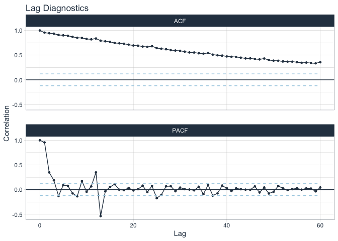
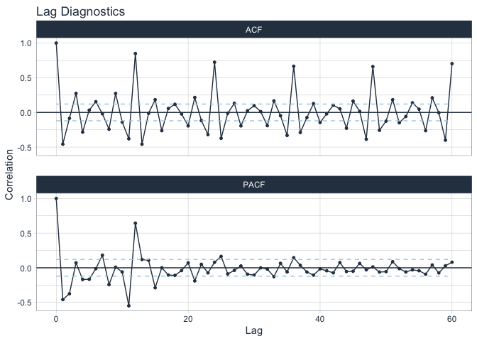
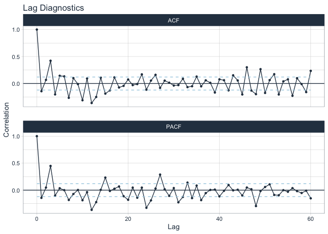

Retail\_sales\_prediction
================
Chung-Hao Lee
8/22/2021

<!-- README.md is generated from Titanic_competition.Rmd. Please edit that file --> 

``` r
### Setting up environment
library("tidyverse") # for ggplot2
```

    ## ── Attaching packages ─────────────────────────────────────── tidyverse 1.3.1 ──

    ## ✓ ggplot2 3.3.5     ✓ purrr   0.3.4
    ## ✓ tibble  3.1.6     ✓ dplyr   1.0.7
    ## ✓ tidyr   1.1.4     ✓ stringr 1.4.0
    ## ✓ readr   1.4.0     ✓ forcats 0.5.1

    ## ── Conflicts ────────────────────────────────────────── tidyverse_conflicts() ──
    ## x dplyr::filter() masks stats::filter()
    ## x dplyr::lag()    masks stats::lag()

``` r
library("timetk") # for time series visualization
```

    ## Registered S3 method overwritten by 'tune':
    ##   method                   from   
    ##   required_pkgs.model_spec parsnip

``` r
library("modeltime") # for arima model building
library("cowplot") # for combining multiple plots
library("parsnip") # for arima model building
```

``` r
knitr::opts_chunk$set(
  collapse = TRUE, 
  comment = "#>",
  fig.path = "fig/figures/README-",
  out.width = "100%",
  message=FALSE, 
  warning=FALSE
)
```

``` r
### Loading dataset

####Total Business Sales, Not Seasonally Adjusted
df_sales <- 
  read_csv("/Users/yginger/Desktop/Data Analytics/Time Series/Retail sales prediction/Inventory and sales dataset/TOTBUSSMNSA.csv") %>% 
  select(-c(realtime_start, realtime_end)) %>% 
  rename(sales = value) %>% 
  mutate(trend = row_number(),
         quarter = as.factor(lubridate::quarter(date)),
         month = as.factor(lubridate::month(date)))

df_inv <- 
  read_csv("/Users/yginger/Desktop/Data Analytics/Time Series/Retail sales prediction/Inventory and sales dataset/TOTBUSIMNSA.csv") %>% 
  select(-c(realtime_start, realtime_end))%>% 
  rename(inv = value) %>% 
  mutate(trend = row_number(),
         quarter = as.factor(lubridate::quarter(date)),
         month = as.factor(lubridate::month(date)))

str(df_sales)
#> tibble [333 × 5] (S3: tbl_df/tbl/data.frame)
#>  $ sales  : num [1:333] 478951 496844 542833 533768 537400 ...
#>  $ date   : Date[1:333], format: "1992-01-01" "1992-02-01" ...
#>  $ trend  : int [1:333] 1 2 3 4 5 6 7 8 9 10 ...
#>  $ quarter: Factor w/ 4 levels "1","2","3","4": 1 1 1 2 2 2 3 3 3 4 ...
#>  $ month  : Factor w/ 12 levels "1","2","3","4",..: 1 2 3 4 5 6 7 8 9 10 ...
str(df_inv)
#> tibble [333 × 5] (S3: tbl_df/tbl/data.frame)
#>  $ inv    : num [1:333] 802948 809329 813301 819247 815688 ...
#>  $ date   : Date[1:333], format: "1992-01-01" "1992-02-01" ...
#>  $ trend  : int [1:333] 1 2 3 4 5 6 7 8 9 10 ...
#>  $ quarter: Factor w/ 4 levels "1","2","3","4": 1 1 1 2 2 2 3 3 3 4 ...
#>  $ month  : Factor w/ 12 levels "1","2","3","4",..: 1 2 3 4 5 6 7 8 9 10 ...
```

# EDA

``` r
### Plot sales and inv
df_sales %>% 
  plot_time_series(date, sales, .smooth=FALSE, .interactive = FALSE,.title = "Sales")
```


``` r
df_inv %>% 
  plot_time_series(date, inv, .smooth=FALSE, .interactive = FALSE, .title = "Inventory")
```


-   We can see that both sales and inventory have similar patterns and
    have hung drops in 2008, due to financial crisis.

``` r
###Seasonal plot for US retail sales from 2000
df_sales %>% 
  filter(date >= '2000-01-01') %>% 
  group_by(lubridate::year(date)) %>% 
  mutate(sales = scale(sales) - scale(sales)[1]) %>% 
  ungroup() %>% 
  plot_time_series(month, sales, 
                   .smooth= FALSE, 
                   .color_var = lubridate::year(date), 
                   .interactive = FALSE, 
                   .color_lab = "Year", 
                   .title='Seasonal plot for US retail sales from 2000',
                   .y_lab='Sales', 
                   .x_lab='Month')
```


-   Excpt 2008, every years sales have upward trends in a year
    since 2000.

``` r
# Create a seasonal subseries plot for the subset data starting from 2000

df_sales %>%
  filter(date >= '2000-01-01') %>%
  plot_time_series(
        .date = date,
        .value = sales,
        .facet_vars = month,
        .facet_ncol = 12, 
        .facet_scales = "fixed",
        .interactive = FALSE,
        .legend_show = FALSE,
        .title = "Seasonal subseries plot for US retail sales from 2000",
        .x_lab = "Year",
        .y_lab = "Sales ($ million)")  + 
        theme(axis.text.x=element_text(angle=60, hjust=1)
    )
```


-   We can see that in every months, sales increases since 2000.

``` r
# Create a STL decomposition plot for the full data
df_sales %>%
  plot_stl_diagnostics(
    date, sales,
    # Set features to return, desired frequency and trend
    .feature_set = c("observed", "season", "trend", "remainder"), 
    .interactive = FALSE)
```


-   We use seasonal decomposition of time series by Loess (STL) to
    decompose the time series to season, trend and reminder. We can see
    in STL plot, sales has clear seasonal pattern and upward trend.

-   In order to predict, let’s split the data first. We will explore
    training data and build up models then we will use our models to
    predict testing data.

# ARIMA Model building

``` r
# Split the data
# We intended include 2008, because in 2008, there is rare financial crisis occurs, we want to train ARIMA model with rare event. Leave 5 years for testing. 
df_sales_train <- df_sales %>% filter(date < '2015-01-01')
df_sales_test<- df_sales %>% filter(date >= '2015-01-01')
```

``` r
# Unit root test: ADF test

df_sales_train %>%
  select(sales) %>% 
  ts(start = c(1992, 1), end = c(2014, 12), frequency = 12) %>% 
  tseries::adf.test()
#> 
#>  Augmented Dickey-Fuller Test
#> 
#> data:  .
#> Dickey-Fuller = -3.0418, Lag order = 6, p-value = 0.1371
#> alternative hypothesis: stationary
```

-   From ADF test, p-value &gt; 0.05. We can say it’s not stationary. We
    will further exam its stationary status by ACF and PACF.

``` r
### ACF and PACF
df_sales_train%>%
  plot_acf_diagnostics(date, sales, 
                       .lags = 60,
                       .show_white_noise_bars =TRUE,
                       .interactive = FALSE)
```



-   ACF plot shows that sales are self-related and has seasonal pattern
    every 12 lags. PACF plot also show there is a spike exceed threshold
    at lag = 12. From this perspective, we can do differencing to make
    time series become stationary.

``` r
# ACF and PACT after 1st order ordinary differencing

df_sales_train%>%
  plot_acf_diagnostics(date, diff_vec(df_sales_train$sales, difference = 1), 
                       .lags = 60,
                       .show_white_noise_bars =TRUE,
                       .interactive = FALSE)
```



-   In ACF plot, even 12, 24, 36, 48 have peaks over threshold, this may
    cause by seasonal effect. It is closer to stationary compared to the
    plot before first order differencing. In PACF plot, lag = 12 also
    exist a peak over threshold, this may match the result we observe
    from ACF plot that this may cause by seasonal effect. So we will do
    seasonal differencing afterward.

``` r
# After 1st order ordinary differencing and 1st order seasonal differencing

df_sales_train%>%
  mutate(difford1 = diff_vec(sales, difference = 1), difford1seas1 = diff_vec(difford1, lag = 12, difference = 1)) %>% 
  plot_acf_diagnostics(date, difford1seas1, 
                       .lags = 60,
                       .show_white_noise_bars =TRUE,
                       .interactive = FALSE)
```


``` r
# After 1st order ordinary differencing and 2nd order seasonal differencing

df_sales_train%>%
  mutate(difford1 = diff_vec(sales, difference = 1), difford1seas2 = diff_vec(difford1, lag = 12, difference = 2)) %>% 
  plot_acf_diagnostics(date, difford1seas2, 
                       .lags = 60,
                       .show_white_noise_bars =TRUE,
                       .interactive = FALSE)
```



-   In 1st order ordinary differencing and 1st order seasonal
    differencing, we see that the effect is not quite good, so I add one
    more on seasonal differencing and do 1st order ordinary differencing
    and 2nd order seasonal differencing. This time, we have a better
    result and more lags are fall inside threshold.

``` r
# Run ADF test again after 1st order ordinary differencing and 2nd order seasonal differencing

df_sales_train %>%
  mutate(difford1 = diff_vec(sales, difference = 1), difford1seas2 = diff_vec(difford1, lag = 12, difference = 2)) %>% 
  select(difford1seas2) %>% 
  drop_na() %>% 
  ts(start = c(1992, 1), end = c(2011, 12), frequency = 12) %>% 
  tseries::adf.test()
#> 
#>  Augmented Dickey-Fuller Test
#> 
#> data:  .
#> Dickey-Fuller = -5.5893, Lag order = 6, p-value = 0.01
#> alternative hypothesis: stationary
```

-   We can see that after 1st order ordinary differencing and 2nd order
    seasonal differencing, ADF test shows that p-value is way smaller
    than 0.01 compared to p-value of original time series 0.04. We can
    say after 1st order ordinary differencing and 2nd order seasonal
    differencing, the time series becomes stationary.

-   Next we will start to build ARIMA model. ARIMA is abbreviation of
    AutoRegression (AR) + Integrated (I) + Moving Average (MA). It has 3
    parameters p, d, q in ARIMA model. ‘p’ is the order of the ‘Auto
    Regressive’ (AR) term. It refers to the number of lags of Y to be
    used as predictors. And ‘q’ is the order of the ‘Moving Average’
    (MA) term. It refers to the number of lagged forecast errors that
    should go into the ARIMA Model. The value of d is the minimum number
    of differencing needed to make the series stationary. And if the
    time series is already stationary, then d = 0.

-   Because right now we only deal with ARIMA not yet including seasonal
    effect, we will only look at ACF/PACF plots after 1st order
    differencing. From the previous differencing, we know that after 1st
    order differencing, the time series becomes stationary. So our d
    = 1. Next, we are going to find p and q.

-   To find out p, we can look at PACF, because it’s clearly that within
    2 lags the AR is significant (out of threshold), This means we can
    use p = 2.

-   Just like how we looked at the PACF plot for the number of AR terms
    (p), we can look at the ACF plot for the number of MA terms (q).
    From ACF plot, we can see that within 1 lags the MA is significant.
    This means we can use q = 1.

-   So far we find out all p, q, d at p = 2, q = 1, d = 1. Then we can
    start to build ARIMA model of these 3 parameters.

``` r
# Build an ARIMA model based on p = 2, q = 1, d = 1
arima_manu <- 
  arima_reg(mode = "regression",
  seasonal_period = 12,
  non_seasonal_ar = 2,
  non_seasonal_differences = 1,
  non_seasonal_ma = 1) %>% 
  set_engine("arima") %>%
  generics::fit(sales ~ date, data = df_sales_train)

arima_manu
#> parsnip model object
#> 
#> Fit time:  64ms 
#> Series: outcome 
#> ARIMA(2,1,1) 
#> 
#> Coefficients:
#>           ar1      ar2     ma1
#>       -0.9214  -0.4989  0.3523
#> s.e.   0.1363   0.0674  0.1578
#> 
#> sigma^2 estimated as 2.576e+09:  log likelihood=-3368.52
#> AIC=6745.04   AICc=6745.19   BIC=6759.51
```

``` r
# Plot the residuals for ARIMA (2,1,1) model
arima_residuals <- arima_manu %>% 
  modeltime_table() %>% 
  modeltime_calibrate(new_data = df_sales_train) %>%
  modeltime_residuals() %>%
  plot_modeltime_residuals(.type = ("timeplot"),
                           .legend_show = FALSE, 
                           .interactive = FALSE)

# Plot the residuals distribution density for ARIMA (2,1,1) model
arima_density <- arima_manu %>% 
  modeltime_table() %>% 
  modeltime_calibrate(new_data = df_sales_train) %>%
  modeltime_residuals() %>% 
  ggplot()+
  geom_density(aes(x=.residuals))+
  labs(title = "Density Plot", x = "residuals")

plot_grid(arima_residuals, arima_density, nrow = 2, align = "v")
```


-   As we can see from residuals plots that there is only slight
    patterns in residuals plot. From density plot, mean is near but not
    at zero. This may cause by seasonal effect, because at this stage,
    we haven’t include seasonal ARIMA yet.

-   Next we will start to build seasonal ARIMA

-   Same rule applying to find P, D, Q in seasonal ARIMA. From previous
    differencing we know that it requires 2nd order seasonal
    differencing to make most of ACF within threshold. Therefore, we
    know D = 2.

-   With the similar procedure finding p and q in ARIMA, we find P = 1
    and Q = 1 in seasonal ARIMA.

``` r
# Build a seasonal ARIMA model based on P = 1, D = 2, Q = 1
sarima_manu <- 
  arima_reg(mode = "regression",
  seasonal_period = 12,
  non_seasonal_ar = 2,
  non_seasonal_differences = 1,
  non_seasonal_ma = 1,
  seasonal_ar = 1,
  seasonal_differences = 2,
  seasonal_ma = 1) %>% 
  set_engine("arima") %>%
  generics::fit(sales ~ date, data = df_sales_train)

sarima_manu
#> parsnip model object
#> 
#> Fit time:  760ms 
#> Series: outcome 
#> ARIMA(2,1,1)(1,2,1)[12] 
#> 
#> Coefficients:
#>          ar1      ar2     ma1     sar1     sma1
#>       -1.100  -0.5009  0.7982  -0.2148  -0.9992
#> s.e.   0.078   0.0586  0.0798   0.0668   0.0391
#> 
#> sigma^2 estimated as 684580190:  log likelihood=-2932.02
#> AIC=5876.04   AICc=5876.39   BIC=5897.19
```

-   After building seasonal ARIMA(2,1,1)(1,2,1), we can see AIC of
    seasonal ARIMA is 5876 is smaller than AIC of ARIMA 6745, which is
    great. This means our model improves.

``` r
# Plot the residuals for sARIMA (2,1,1)(1,2,1) model
sarima_residuals <- sarima_manu %>% 
  modeltime_table() %>% 
  modeltime_calibrate(new_data = df_sales_train) %>%
  modeltime_residuals() %>%
  plot_modeltime_residuals(.type = ("timeplot"),
                           .legend_show = FALSE, 
                           .interactive = FALSE)

# Plot the residuals distribution density for sARIMA (2,1,1)(1,2,1) model
sarima_density <- sarima_manu %>% 
  modeltime_table() %>% 
  modeltime_calibrate(new_data = df_sales_train) %>%
  modeltime_residuals() %>% 
  ggplot()+
  geom_density(aes(x=.residuals))+
  labs(title = "Density Plot", x = "residuals")

plot_grid(sarima_residuals, sarima_density, nrow = 2, align = "v")
```


-   Voila! Compared to ARIMA model, seasonal ARIMA model has no pattern
    in residual plot and has mean at 0 and uniform variance. This means
    our seasonal ARIMA model has explained almost all time series data.

-   In fact, there is a function called auto arima, which can
    automatically build ARIMA (including seasonal, if needed). So next,
    we will use this function to build an auto ARIMA.

``` r
# Build an auto ARIMA model

arima_auto <- 
  arima_reg() %>% 
  set_engine("auto_arima") %>%
  fit(sales ~ date, data = df_sales_train)

arima_auto
#> parsnip model object
#> 
#> Fit time:  1.8s 
#> Series: outcome 
#> ARIMA(1,0,3)(2,1,2)[12] with drift 
#> 
#> Coefficients:
#>          ar1      ma1     ma2     ma3    sar1     sar2     sma1    sma2
#>       0.8851  -0.0830  0.0543  0.4117  0.8871  -0.6774  -1.3628  0.6665
#> s.e.  0.0352   0.0667  0.0651  0.0670  0.0795   0.0598   0.1021  0.0825
#>           drift
#>       2909.7256
#> s.e.   460.7638
#> 
#> sigma^2 estimated as 387677584:  log likelihood=-2991.26
#> AIC=6002.53   AICc=6003.4   BIC=6038.29
```

-   Auto ARIMA picks p = 1, d = 0, q = 3, P = 2, D = 1, Q = 2. This is
    different from our own seasonal ARIMA model. The AIC of auto ARIMA
    is 6002, which is slightly larger than our seasonal ARIMA’s
    AIC 5876. This means our seasonal ARIMA is better than auto ARIMA.
    But because the difference is so small, we will keep both models to
    do further prediction.

``` r
# Plot the residuals for  auto ARIMA (1,0,3)(2,1,2) model
arima_auto_residuals <- arima_auto %>% 
  modeltime_table() %>% 
  modeltime_calibrate(new_data = df_sales_train) %>%
  modeltime_residuals() %>%
  plot_modeltime_residuals(.type = ("timeplot"),
                           .legend_show = FALSE, 
                           .interactive = FALSE)

# Plot the residuals distribution density for sARIMA (2,1,1)(1,2,1) model
arima_auto_density <- arima_auto %>% 
  modeltime_table() %>% 
  modeltime_calibrate(new_data = df_sales_train) %>%
  modeltime_residuals() %>% 
  ggplot()+
  geom_density(aes(x=.residuals))+
  labs(title = "Density Plot", x = "residuals")

plot_grid(arima_auto_residuals, arima_auto_density, nrow = 2, align = "v")
```


-   The residuals and density plots of auto ARIMA are good but not good
    enough. In density plot of auto ARIMA, mean is near 0 but not at 0.
    This also match finding that AIC of auto ARIMA is larger than our
    seasonal ARIMA model.

# Prediction

``` r
# Model table and calibration

models_tbl <- modeltime_table(sarima_manu,
                              arima_auto)

calibration_tbl <- models_tbl %>%
    modeltime_calibrate(new_data = df_sales_test)

calibration_tbl %>%
  modeltime_accuracy()%>%
  table_modeltime_accuracy(.sortable = FALSE,
                           .searchable = FALSE,
                           .filterable = FALSE,
                           .expand_groups = FALSE,
                           .interactive = FALSE)
```

<style>html {
  font-family: -apple-system, BlinkMacSystemFont, 'Segoe UI', Roboto, Oxygen, Ubuntu, Cantarell, 'Helvetica Neue', 'Fira Sans', 'Droid Sans', Arial, sans-serif;
}

#vdqmjwzhhu .gt_table {
  display: table;
  border-collapse: collapse;
  margin-left: auto;
  margin-right: auto;
  color: #333333;
  font-size: 16px;
  font-weight: normal;
  font-style: normal;
  background-color: #FFFFFF;
  width: auto;
  border-top-style: solid;
  border-top-width: 2px;
  border-top-color: #A8A8A8;
  border-right-style: none;
  border-right-width: 2px;
  border-right-color: #D3D3D3;
  border-bottom-style: solid;
  border-bottom-width: 2px;
  border-bottom-color: #A8A8A8;
  border-left-style: none;
  border-left-width: 2px;
  border-left-color: #D3D3D3;
}

#vdqmjwzhhu .gt_heading {
  background-color: #FFFFFF;
  text-align: center;
  border-bottom-color: #FFFFFF;
  border-left-style: none;
  border-left-width: 1px;
  border-left-color: #D3D3D3;
  border-right-style: none;
  border-right-width: 1px;
  border-right-color: #D3D3D3;
}

#vdqmjwzhhu .gt_title {
  color: #333333;
  font-size: 125%;
  font-weight: initial;
  padding-top: 4px;
  padding-bottom: 4px;
  border-bottom-color: #FFFFFF;
  border-bottom-width: 0;
}

#vdqmjwzhhu .gt_subtitle {
  color: #333333;
  font-size: 85%;
  font-weight: initial;
  padding-top: 0;
  padding-bottom: 4px;
  border-top-color: #FFFFFF;
  border-top-width: 0;
}

#vdqmjwzhhu .gt_bottom_border {
  border-bottom-style: solid;
  border-bottom-width: 2px;
  border-bottom-color: #D3D3D3;
}

#vdqmjwzhhu .gt_col_headings {
  border-top-style: solid;
  border-top-width: 2px;
  border-top-color: #D3D3D3;
  border-bottom-style: solid;
  border-bottom-width: 2px;
  border-bottom-color: #D3D3D3;
  border-left-style: none;
  border-left-width: 1px;
  border-left-color: #D3D3D3;
  border-right-style: none;
  border-right-width: 1px;
  border-right-color: #D3D3D3;
}

#vdqmjwzhhu .gt_col_heading {
  color: #333333;
  background-color: #FFFFFF;
  font-size: 100%;
  font-weight: normal;
  text-transform: inherit;
  border-left-style: none;
  border-left-width: 1px;
  border-left-color: #D3D3D3;
  border-right-style: none;
  border-right-width: 1px;
  border-right-color: #D3D3D3;
  vertical-align: bottom;
  padding-top: 5px;
  padding-bottom: 6px;
  padding-left: 5px;
  padding-right: 5px;
  overflow-x: hidden;
}

#vdqmjwzhhu .gt_column_spanner_outer {
  color: #333333;
  background-color: #FFFFFF;
  font-size: 100%;
  font-weight: normal;
  text-transform: inherit;
  padding-top: 0;
  padding-bottom: 0;
  padding-left: 4px;
  padding-right: 4px;
}

#vdqmjwzhhu .gt_column_spanner_outer:first-child {
  padding-left: 0;
}

#vdqmjwzhhu .gt_column_spanner_outer:last-child {
  padding-right: 0;
}

#vdqmjwzhhu .gt_column_spanner {
  border-bottom-style: solid;
  border-bottom-width: 2px;
  border-bottom-color: #D3D3D3;
  vertical-align: bottom;
  padding-top: 5px;
  padding-bottom: 6px;
  overflow-x: hidden;
  display: inline-block;
  width: 100%;
}

#vdqmjwzhhu .gt_group_heading {
  padding: 8px;
  color: #333333;
  background-color: #FFFFFF;
  font-size: 100%;
  font-weight: initial;
  text-transform: inherit;
  border-top-style: solid;
  border-top-width: 2px;
  border-top-color: #D3D3D3;
  border-bottom-style: solid;
  border-bottom-width: 2px;
  border-bottom-color: #D3D3D3;
  border-left-style: none;
  border-left-width: 1px;
  border-left-color: #D3D3D3;
  border-right-style: none;
  border-right-width: 1px;
  border-right-color: #D3D3D3;
  vertical-align: middle;
}

#vdqmjwzhhu .gt_empty_group_heading {
  padding: 0.5px;
  color: #333333;
  background-color: #FFFFFF;
  font-size: 100%;
  font-weight: initial;
  border-top-style: solid;
  border-top-width: 2px;
  border-top-color: #D3D3D3;
  border-bottom-style: solid;
  border-bottom-width: 2px;
  border-bottom-color: #D3D3D3;
  vertical-align: middle;
}

#vdqmjwzhhu .gt_from_md > :first-child {
  margin-top: 0;
}

#vdqmjwzhhu .gt_from_md > :last-child {
  margin-bottom: 0;
}

#vdqmjwzhhu .gt_row {
  padding-top: 8px;
  padding-bottom: 8px;
  padding-left: 5px;
  padding-right: 5px;
  margin: 10px;
  border-top-style: solid;
  border-top-width: 1px;
  border-top-color: #D3D3D3;
  border-left-style: none;
  border-left-width: 1px;
  border-left-color: #D3D3D3;
  border-right-style: none;
  border-right-width: 1px;
  border-right-color: #D3D3D3;
  vertical-align: middle;
  overflow-x: hidden;
}

#vdqmjwzhhu .gt_stub {
  color: #333333;
  background-color: #FFFFFF;
  font-size: 100%;
  font-weight: initial;
  text-transform: inherit;
  border-right-style: solid;
  border-right-width: 2px;
  border-right-color: #D3D3D3;
  padding-left: 12px;
}

#vdqmjwzhhu .gt_summary_row {
  color: #333333;
  background-color: #FFFFFF;
  text-transform: inherit;
  padding-top: 8px;
  padding-bottom: 8px;
  padding-left: 5px;
  padding-right: 5px;
}

#vdqmjwzhhu .gt_first_summary_row {
  padding-top: 8px;
  padding-bottom: 8px;
  padding-left: 5px;
  padding-right: 5px;
  border-top-style: solid;
  border-top-width: 2px;
  border-top-color: #D3D3D3;
}

#vdqmjwzhhu .gt_grand_summary_row {
  color: #333333;
  background-color: #FFFFFF;
  text-transform: inherit;
  padding-top: 8px;
  padding-bottom: 8px;
  padding-left: 5px;
  padding-right: 5px;
}

#vdqmjwzhhu .gt_first_grand_summary_row {
  padding-top: 8px;
  padding-bottom: 8px;
  padding-left: 5px;
  padding-right: 5px;
  border-top-style: double;
  border-top-width: 6px;
  border-top-color: #D3D3D3;
}

#vdqmjwzhhu .gt_striped {
  background-color: rgba(128, 128, 128, 0.05);
}

#vdqmjwzhhu .gt_table_body {
  border-top-style: solid;
  border-top-width: 2px;
  border-top-color: #D3D3D3;
  border-bottom-style: solid;
  border-bottom-width: 2px;
  border-bottom-color: #D3D3D3;
}

#vdqmjwzhhu .gt_footnotes {
  color: #333333;
  background-color: #FFFFFF;
  border-bottom-style: none;
  border-bottom-width: 2px;
  border-bottom-color: #D3D3D3;
  border-left-style: none;
  border-left-width: 2px;
  border-left-color: #D3D3D3;
  border-right-style: none;
  border-right-width: 2px;
  border-right-color: #D3D3D3;
}

#vdqmjwzhhu .gt_footnote {
  margin: 0px;
  font-size: 90%;
  padding: 4px;
}

#vdqmjwzhhu .gt_sourcenotes {
  color: #333333;
  background-color: #FFFFFF;
  border-bottom-style: none;
  border-bottom-width: 2px;
  border-bottom-color: #D3D3D3;
  border-left-style: none;
  border-left-width: 2px;
  border-left-color: #D3D3D3;
  border-right-style: none;
  border-right-width: 2px;
  border-right-color: #D3D3D3;
}

#vdqmjwzhhu .gt_sourcenote {
  font-size: 90%;
  padding: 4px;
}

#vdqmjwzhhu .gt_left {
  text-align: left;
}

#vdqmjwzhhu .gt_center {
  text-align: center;
}

#vdqmjwzhhu .gt_right {
  text-align: right;
  font-variant-numeric: tabular-nums;
}

#vdqmjwzhhu .gt_font_normal {
  font-weight: normal;
}

#vdqmjwzhhu .gt_font_bold {
  font-weight: bold;
}

#vdqmjwzhhu .gt_font_italic {
  font-style: italic;
}

#vdqmjwzhhu .gt_super {
  font-size: 65%;
}

#vdqmjwzhhu .gt_footnote_marks {
  font-style: italic;
  font-size: 65%;
}
</style>
<div id="vdqmjwzhhu" style="overflow-x:auto;overflow-y:auto;width:auto;height:auto;"><table class="gt_table">
  <thead class="gt_header">
    <tr>
      <th colspan="9" class="gt_heading gt_title gt_font_normal" style>Accuracy Table</th>
    </tr>
    <tr>
      <th colspan="9" class="gt_heading gt_subtitle gt_font_normal gt_bottom_border" style></th>
    </tr>
  </thead>
  <thead class="gt_col_headings">
    <tr>
      <th class="gt_col_heading gt_columns_bottom_border gt_center" rowspan="1" colspan="1">.model_id</th>
      <th class="gt_col_heading gt_columns_bottom_border gt_left" rowspan="1" colspan="1">.model_desc</th>
      <th class="gt_col_heading gt_columns_bottom_border gt_left" rowspan="1" colspan="1">.type</th>
      <th class="gt_col_heading gt_columns_bottom_border gt_right" rowspan="1" colspan="1">mae</th>
      <th class="gt_col_heading gt_columns_bottom_border gt_right" rowspan="1" colspan="1">mape</th>
      <th class="gt_col_heading gt_columns_bottom_border gt_right" rowspan="1" colspan="1">mase</th>
      <th class="gt_col_heading gt_columns_bottom_border gt_right" rowspan="1" colspan="1">smape</th>
      <th class="gt_col_heading gt_columns_bottom_border gt_right" rowspan="1" colspan="1">rmse</th>
      <th class="gt_col_heading gt_columns_bottom_border gt_right" rowspan="1" colspan="1">rsq</th>
    </tr>
  </thead>
  <tbody class="gt_table_body">
    <tr>
      <td class="gt_row gt_center">1</td>
      <td class="gt_row gt_left">ARIMA(2,1,1)(1,2,1)[12]</td>
      <td class="gt_row gt_left">Test</td>
      <td class="gt_row gt_right">54623.67</td>
      <td class="gt_row gt_right">4.17</td>
      <td class="gt_row gt_right">0.77</td>
      <td class="gt_row gt_right">4.04</td>
      <td class="gt_row gt_right">68191.97</td>
      <td class="gt_row gt_right">0.73</td>
    </tr>
    <tr>
      <td class="gt_row gt_center">2</td>
      <td class="gt_row gt_left">ARIMA(1,0,3)(2,1,2)[12] WITH DRIFT</td>
      <td class="gt_row gt_left">Test</td>
      <td class="gt_row gt_right">46962.40</td>
      <td class="gt_row gt_right">3.56</td>
      <td class="gt_row gt_right">0.66</td>
      <td class="gt_row gt_right">3.48</td>
      <td class="gt_row gt_right">53249.81</td>
      <td class="gt_row gt_right">0.93</td>
    </tr>
  </tbody>
  
  
</table></div>

``` r
### Check and plot forecast with actual data
calibration_tbl %>%
    modeltime_forecast(
        new_data    = df_sales_test,
        actual_data = df_sales
    ) %>%
    plot_modeltime_forecast(
      .legend_max_width = 25,
      .interactive      = FALSE
    )
```


-   Well, apparently, both models perform well and almost follow the
    trend of actual data. Our seasonal ARIMA has 0.73 r squared, which
    means it can explain 73% of data. Auto ARIMA has 0.93 r squared.

Next, I’d like to add another variable to see if they can improve
prediction model.

``` r
# importing another dataset
df_econ <- 
  read_csv("/Users/yginger/Desktop/Data Analytics/Time Series/Retail sales prediction/Inventory and sales dataset/us-econ.csv") %>% 
  mutate(date = lubridate::mdy(date),
  trend = row_number()) %>% 
  filter(date >= '1992-01-01', date <= '2019-09-01') 

skimr::skim(df_econ)
```

|                                                  |          |
|:-------------------------------------------------|:---------|
| Name                                             | df\_econ |
| Number of rows                                   | 333      |
| Number of columns                                | 13       |
| \_\_\_\_\_\_\_\_\_\_\_\_\_\_\_\_\_\_\_\_\_\_\_   |          |
| Column type frequency:                           |          |
| Date                                             | 1        |
| numeric                                          | 12       |
| \_\_\_\_\_\_\_\_\_\_\_\_\_\_\_\_\_\_\_\_\_\_\_\_ |          |
| Group variables                                  | None     |

Data summary

**Variable type: Date**

| skim\_variable | n\_missing | complete\_rate | min        | max        | median     | n\_unique |
|:---------------|-----------:|---------------:|:-----------|:-----------|:-----------|----------:|
| date           |          0 |              1 | 1992-01-01 | 2019-09-01 | 2005-11-01 |       333 |

**Variable type: numeric**

| skim\_variable | n\_missing | complete\_rate |      mean |       sd |        p0 |       p25 |       p50 |       p75 |      p100 | hist  |
|:---------------|-----------:|---------------:|----------:|---------:|----------:|----------:|----------:|----------:|----------:|:------|
| income         |          0 |              1 |  11067.87 |  3798.60 |   5264.20 |   7793.50 |  10890.40 |  13996.60 |  18645.10 | ▇▆▆▅▃ |
| saving         |          0 |              1 |      6.32 |     1.60 |      2.20 |      5.30 |      6.60 |      7.30 |     12.00 | ▂▅▇▁▁ |
| unemployment   |          0 |              1 |      5.83 |     1.63 |      3.50 |      4.60 |      5.50 |      6.70 |     10.00 | ▇▇▂▂▂ |
| labor          |          0 |              1 |     65.35 |     1.62 |     62.40 |     63.70 |     66.10 |     66.60 |     67.30 | ▅▂▁▆▇ |
| tenYearTeasury |          0 |              1 |      1.20 |     0.89 |     -0.41 |      0.36 |      1.22 |      1.98 |      2.83 | ▆▇▆▇▆ |
| CPI            |          0 |              1 |    197.31 |    35.13 |    138.10 |    164.00 |    198.30 |    230.28 |    256.76 | ▇▇▅▇▇ |
| inflation      |          0 |              1 |      2.28 |     1.11 |     -2.10 |      1.70 |      2.30 |      3.00 |      5.60 | ▁▁▇▇▁ |
| veichleSales   |          0 |              1 |     15.87 |     2.10 |      9.22 |     14.83 |     16.44 |     17.41 |     22.06 | ▁▂▇▇▁ |
| houseSales     |          0 |              1 |    707.40 |   265.22 |    270.00 |    502.00 |    665.00 |    882.00 |   1389.00 | ▆▇▇▃▂ |
| HPI            |          0 |              1 |    136.53 |    41.20 |     75.66 |     92.45 |    143.12 |    171.87 |    211.99 | ▇▃▆▇▂ |
| population     |          0 |              1 | 295735.00 | 21624.65 | 255331.00 | 277658.00 | 297089.00 | 314905.00 | 328897.00 | ▅▅▆▆▇ |
| trend          |          0 |              1 |    167.00 |    96.27 |      1.00 |     84.00 |    167.00 |    250.00 |    333.00 | ▇▇▇▇▇ |

``` r
# merge all tables
df_merge <- 
  df_sales %>% 
  bind_cols(df_inv)

df_merge <- 
  inner_join(df_merge, df_econ, by = c("trend...3" = "trend")) %>% 
  select(sales, date...2, trend...3, quarter...4, month...5, inv, income, saving, unemployment, CPI, inflation, population, HPI) %>% 
  rename(date = date...2, trend = trend...3, quarter = quarter...4, month = month...5)
```

``` r
# Split the data
# We intended include 2008, because in 2008, there is rare financial crisis occurs, we want to train ARIMA model with rare event. Leave 5 years for testing. 
df_merge_train <- df_merge %>% filter(date < '2015-01-01')
df_merge_test<- df_merge %>% filter(date >= '2015-01-01')
```

``` r
# Build up a linear model for prediction
linear_model <-
  linear_reg() %>%
  set_engine("lm") %>%
  fit(sales ~ date + CPI + income + saving + HPI + population + inflation + inv, data = df_merge_train)

summary(linear_model$fit)
#> 
#> Call:
#> stats::lm(formula = sales ~ date + CPI + income + saving + HPI + 
#>     population + inflation + inv, data = data)
#> 
#> Residuals:
#>     Min      1Q  Median      3Q     Max 
#> -164575  -23089    4849   32060   85154 
#> 
#> Coefficients:
#>               Estimate Std. Error t value Pr(>|t|)    
#> (Intercept)  1.497e+06  1.020e+06   1.468  0.14335    
#> date         3.435e+01  4.764e+01   0.721  0.47155    
#> CPI          2.475e+03  1.614e+03   1.533  0.12635    
#> income       5.363e+01  2.548e+01   2.105  0.03621 *  
#> saving      -6.531e+03  4.276e+03  -1.527  0.12784    
#> HPI         -3.092e+01  2.925e+02  -0.106  0.91591    
#> population  -8.134e+00  4.902e+00  -1.660  0.09818 .  
#> inflation    1.603e+04  3.535e+03   4.535 8.71e-06 ***
#> inv          3.003e-01  9.076e-02   3.308  0.00107 ** 
#> ---
#> Signif. codes:  0 '***' 0.001 '**' 0.01 '*' 0.05 '.' 0.1 ' ' 1
#> 
#> Residual standard error: 46720 on 267 degrees of freedom
#> Multiple R-squared:  0.9643, Adjusted R-squared:  0.9632 
#> F-statistic: 901.6 on 8 and 267 DF,  p-value: < 2.2e-16
```

-   From the linear regression, we can see that income, inflation, inv
    all have p-value lower than 0.05, which means they are statistic
    significant. Adjusted R-squared is 0.96, which means the linear
    model can explain 96% of data.

``` r
# Build a seasonal ARIMA model with another variables

# All variable
sarima_manu_var <- 
  arima_reg(mode = "regression",
  seasonal_period = 12,
  non_seasonal_ar = 2,
  non_seasonal_differences = 1,
  non_seasonal_ma = 1,
  seasonal_ar = 1,
  seasonal_differences = 2,
  seasonal_ma = 1) %>% 
  set_engine("arima") %>%
  fit(sales ~ date + CPI + income + saving + HPI + population + inflation + inv, data = df_merge_train)

# Variable that p-vaule < 0.05 in linear regression 
sarima_manu_var_imp <- 
  arima_reg(mode = "regression",
  seasonal_period = 12,
  non_seasonal_ar = 2,
  non_seasonal_differences = 1,
  non_seasonal_ma = 1,
  seasonal_ar = 1,
  seasonal_differences = 2,
  seasonal_ma = 1) %>% 
  set_engine("arima") %>%
  fit(sales ~ date + income + inflation + inv , data = df_merge_train)

# Variable that p-vaule < 0.05  and has the largest coefficient in linear regression
sarima_manu_var_imp_2 <- 
  arima_reg(mode = "regression",
  seasonal_period = 12,
  non_seasonal_ar = 2,
  non_seasonal_differences = 1,
  non_seasonal_ma = 1,
  seasonal_ar = 1,
  seasonal_differences = 2,
  seasonal_ma = 1) %>% 
  set_engine("arima") %>%
  fit(sales ~ date + income, data = df_merge_train)

sarima_manu
#> parsnip model object
#> 
#> Fit time:  760ms 
#> Series: outcome 
#> ARIMA(2,1,1)(1,2,1)[12] 
#> 
#> Coefficients:
#>          ar1      ar2     ma1     sar1     sma1
#>       -1.100  -0.5009  0.7982  -0.2148  -0.9992
#> s.e.   0.078   0.0586  0.0798   0.0668   0.0391
#> 
#> sigma^2 estimated as 684580190:  log likelihood=-2932.02
#> AIC=5876.04   AICc=5876.39   BIC=5897.19
sarima_manu_var
#> parsnip model object
#> 
#> Fit time:  3s 
#> Series: outcome 
#> Regression with ARIMA(2,1,1)(1,2,1)[12] errors 
#> 
#> Coefficients:
#>           ar1      ar2     ma1     sar1     sma1       cpi   income     saving
#>       -1.0731  -0.7029  0.3718  -0.1610  -0.9992  8015.981  82.7395  -8252.086
#> s.e.   0.0647   0.0480  0.0869   0.0722   0.0406  1933.999  13.9758   1604.437
#>             hpi  population  inflation     inv
#>       2054.3684     -0.3614   3241.935  0.1805
#> s.e.   847.9021     16.7395   2229.879  0.0775
#> 
#> sigma^2 estimated as 368404399:  log likelihood=-2850.3
#> AIC=5726.61   AICc=5728.14   BIC=5772.44
sarima_manu_var_imp
#> parsnip model object
#> 
#> Fit time:  1.7s 
#> Series: outcome 
#> Regression with ARIMA(2,1,1)(1,2,1)[12] errors 
#> 
#> Coefficients:
#>           ar1      ar2     ma1     sar1     sma1   income  inflation     inv
#>       -1.0941  -0.6609  0.4938  -0.1993  -0.9992  31.5660   13588.84  0.3407
#> s.e.   0.0720   0.0500  0.0916   0.0682   0.0395  11.3003    1524.57  0.0926
#> 
#> sigma^2 estimated as 447832690:  log likelihood=-2877.26
#> AIC=5772.52   AICc=5773.26   BIC=5804.25
sarima_manu_var_imp_2
#> parsnip model object
#> 
#> Fit time:  1.2s 
#> Series: outcome 
#> Regression with ARIMA(2,1,1)(1,2,1)[12] errors 
#> 
#> Coefficients:
#>           ar1      ar2     ma1     sar1     sma1   income
#>       -1.0821  -0.5751  0.6656  -0.2518  -0.9992  53.3643
#> s.e.   0.0805   0.0553  0.0984   0.0671   0.0394  15.0532
#> 
#> sigma^2 estimated as 653884600:  log likelihood=-2926.24
#> AIC=5866.47   AICc=5866.94   BIC=5891.15
```

-   We can see that all seasonal ARIMA model with adding variables have
    smaller AIC than original seasonal ARIMA model. That means adding
    variables can improve our model.

``` r
# Plot the residuals for seasonal ARIMA models

sarima_models_tbl_var <- modeltime_table(
  sarima_manu,
  sarima_manu_var,
  sarima_manu_var_imp,
  sarima_manu_var_imp_2)

sarima_models_tbl_var %>%
    modeltime_calibrate(new_data = df_merge_train) %>%
    modeltime_residuals() %>%
    plot_modeltime_residuals(.interactive = FALSE)
```


-   All models has similar patterns in residual plots.

``` r
# Build an auto ARIMA model with another variables

# All variable
arima_auto_var <- 
  arima_reg() %>% 
  set_engine("auto_arima") %>%
  fit(sales ~ date + CPI + income + saving + HPI + population + inflation + inv, data = df_merge_train)

# Variable that p-vaule < 0.05 in linear regression 
arima_auto_var_imp <- 
  arima_reg() %>% 
  set_engine("auto_arima") %>%
  fit(sales ~ date + income + inflation + inv , data = df_merge_train)

# Variable that p-vaule < 0.05  and has the largest coefficient in linear regression
arima_auto_var_imp_2 <- 
  arima_reg() %>% 
  set_engine("auto_arima") %>%
  fit(sales ~ date + income, data = df_merge_train)

arima_auto
#> parsnip model object
#> 
#> Fit time:  1.8s 
#> Series: outcome 
#> ARIMA(1,0,3)(2,1,2)[12] with drift 
#> 
#> Coefficients:
#>          ar1      ma1     ma2     ma3    sar1     sar2     sma1    sma2
#>       0.8851  -0.0830  0.0543  0.4117  0.8871  -0.6774  -1.3628  0.6665
#> s.e.  0.0352   0.0667  0.0651  0.0670  0.0795   0.0598   0.1021  0.0825
#>           drift
#>       2909.7256
#> s.e.   460.7638
#> 
#> sigma^2 estimated as 387677584:  log likelihood=-2991.26
#> AIC=6002.53   AICc=6003.4   BIC=6038.29
arima_auto_var
#> parsnip model object
#> 
#> Fit time:  7.2s 
#> Series: outcome 
#> Regression with ARIMA(2,0,3)(2,1,2)[12] errors 
#> 
#> Coefficients:
#>          ar1     ar2     ma1      ma2     ma3    sar1     sar2     sma1    sma2
#>       0.4351  0.4434  0.0424  -0.2235  0.3625  0.8805  -0.7342  -1.2897  0.6516
#> s.e.  0.1369  0.1243  0.1402   0.0798  0.0611  0.0702   0.0628   0.0998  0.0758
#>           drift       cpi   income     saving       hpi  population  inflation
#>       -1666.109  7698.822  68.8019  -8266.483  383.1431     -6.2098   3102.846
#> s.e.   2775.916  2509.881  14.3680   1584.638  524.6834     10.5957   2668.021
#>          inv
#>       0.2049
#> s.e.  0.0963
#> 
#> sigma^2 estimated as 242541199:  log likelihood=-2924.79
#> AIC=5885.58   AICc=5888.37   BIC=5949.95
arima_auto_var_imp
#> parsnip model object
#> 
#> Fit time:  2.9s 
#> Series: outcome 
#> Regression with ARIMA(4,0,2)(0,1,2)[12] errors 
#> 
#> Coefficients:
#>          ar1     ar2     ar3      ar4      ma1      ma2     sma1     sma2
#>       0.7645  0.3840  0.2952  -0.5801  -0.3771  -0.1868  -0.3003  -0.3355
#> s.e.  0.0938  0.1151  0.0778   0.0545   0.1118   0.1010   0.0656   0.0600
#>        income  inflation     inv
#>       34.7336   9855.855  0.5036
#> s.e.   6.8624   1436.772  0.0712
#> 
#> sigma^2 estimated as 318760523:  log likelihood=-2957.69
#> AIC=5939.39   AICc=5940.63   BIC=5982.3
arima_auto_var_imp_2
#> parsnip model object
#> 
#> Fit time:  2.3s 
#> Series: outcome 
#> Regression with ARIMA(1,0,3)(2,1,2)[12] errors 
#> 
#> Coefficients:
#>          ar1      ma1     ma2     ma3    sar1     sar2     sma1    sma2
#>       0.8837  -0.0913  0.0546  0.4066  0.8862  -0.6758  -1.3626  0.6645
#> s.e.  0.0357   0.0718  0.0656  0.0691  0.0801   0.0602   0.1027  0.0831
#>           drift   income
#>       2743.8951   4.5520
#> s.e.   669.4907  13.5377
#> 
#> sigma^2 estimated as 389150017:  log likelihood=-2991.21
#> AIC=6004.41   AICc=6005.46   BIC=6043.75
```

-   Interesting in auto ARIMA models with adding variables. All models
    have different p, d, q and P, D, Q. Also if we only add income to
    models, it has slightly higher AIC than original auto ARIMA model.
    This means only income adding cannot improve the model.

``` r
# Plot the residuals for auto ARIMA models

auto_arima_models_tbl_var <- modeltime_table(
  arima_auto,
  arima_auto_var,
  arima_auto_var_imp,
  arima_auto_var_imp_2
)

auto_arima_models_tbl_var %>%
    modeltime_calibrate(new_data = df_merge_train) %>%
    modeltime_residuals() %>%
    plot_modeltime_residuals(.interactive = FALSE)
```


-   All models has similar patterns in residual plots.

# Prediction with variables

``` r
# Model table and calibration

models_tbl_var_all <- modeltime_table(
  linear_model,
  sarima_manu,
  sarima_manu_var,
  sarima_manu_var_imp,
  sarima_manu_var_imp_2,
  arima_auto,
  arima_auto_var,
  arima_auto_var_imp,
  arima_auto_var_imp_2)

calibration_tbl_var_all <- models_tbl_var_all %>%
    modeltime_calibrate(new_data = df_merge_test)

calibration_tbl_var_all %>%
  modeltime_accuracy()%>%
  table_modeltime_accuracy(.interactive = FALSE)
```

<style>html {
  font-family: -apple-system, BlinkMacSystemFont, 'Segoe UI', Roboto, Oxygen, Ubuntu, Cantarell, 'Helvetica Neue', 'Fira Sans', 'Droid Sans', Arial, sans-serif;
}

#llexmbzmwl .gt_table {
  display: table;
  border-collapse: collapse;
  margin-left: auto;
  margin-right: auto;
  color: #333333;
  font-size: 16px;
  font-weight: normal;
  font-style: normal;
  background-color: #FFFFFF;
  width: auto;
  border-top-style: solid;
  border-top-width: 2px;
  border-top-color: #A8A8A8;
  border-right-style: none;
  border-right-width: 2px;
  border-right-color: #D3D3D3;
  border-bottom-style: solid;
  border-bottom-width: 2px;
  border-bottom-color: #A8A8A8;
  border-left-style: none;
  border-left-width: 2px;
  border-left-color: #D3D3D3;
}

#llexmbzmwl .gt_heading {
  background-color: #FFFFFF;
  text-align: center;
  border-bottom-color: #FFFFFF;
  border-left-style: none;
  border-left-width: 1px;
  border-left-color: #D3D3D3;
  border-right-style: none;
  border-right-width: 1px;
  border-right-color: #D3D3D3;
}

#llexmbzmwl .gt_title {
  color: #333333;
  font-size: 125%;
  font-weight: initial;
  padding-top: 4px;
  padding-bottom: 4px;
  border-bottom-color: #FFFFFF;
  border-bottom-width: 0;
}

#llexmbzmwl .gt_subtitle {
  color: #333333;
  font-size: 85%;
  font-weight: initial;
  padding-top: 0;
  padding-bottom: 4px;
  border-top-color: #FFFFFF;
  border-top-width: 0;
}

#llexmbzmwl .gt_bottom_border {
  border-bottom-style: solid;
  border-bottom-width: 2px;
  border-bottom-color: #D3D3D3;
}

#llexmbzmwl .gt_col_headings {
  border-top-style: solid;
  border-top-width: 2px;
  border-top-color: #D3D3D3;
  border-bottom-style: solid;
  border-bottom-width: 2px;
  border-bottom-color: #D3D3D3;
  border-left-style: none;
  border-left-width: 1px;
  border-left-color: #D3D3D3;
  border-right-style: none;
  border-right-width: 1px;
  border-right-color: #D3D3D3;
}

#llexmbzmwl .gt_col_heading {
  color: #333333;
  background-color: #FFFFFF;
  font-size: 100%;
  font-weight: normal;
  text-transform: inherit;
  border-left-style: none;
  border-left-width: 1px;
  border-left-color: #D3D3D3;
  border-right-style: none;
  border-right-width: 1px;
  border-right-color: #D3D3D3;
  vertical-align: bottom;
  padding-top: 5px;
  padding-bottom: 6px;
  padding-left: 5px;
  padding-right: 5px;
  overflow-x: hidden;
}

#llexmbzmwl .gt_column_spanner_outer {
  color: #333333;
  background-color: #FFFFFF;
  font-size: 100%;
  font-weight: normal;
  text-transform: inherit;
  padding-top: 0;
  padding-bottom: 0;
  padding-left: 4px;
  padding-right: 4px;
}

#llexmbzmwl .gt_column_spanner_outer:first-child {
  padding-left: 0;
}

#llexmbzmwl .gt_column_spanner_outer:last-child {
  padding-right: 0;
}

#llexmbzmwl .gt_column_spanner {
  border-bottom-style: solid;
  border-bottom-width: 2px;
  border-bottom-color: #D3D3D3;
  vertical-align: bottom;
  padding-top: 5px;
  padding-bottom: 6px;
  overflow-x: hidden;
  display: inline-block;
  width: 100%;
}

#llexmbzmwl .gt_group_heading {
  padding: 8px;
  color: #333333;
  background-color: #FFFFFF;
  font-size: 100%;
  font-weight: initial;
  text-transform: inherit;
  border-top-style: solid;
  border-top-width: 2px;
  border-top-color: #D3D3D3;
  border-bottom-style: solid;
  border-bottom-width: 2px;
  border-bottom-color: #D3D3D3;
  border-left-style: none;
  border-left-width: 1px;
  border-left-color: #D3D3D3;
  border-right-style: none;
  border-right-width: 1px;
  border-right-color: #D3D3D3;
  vertical-align: middle;
}

#llexmbzmwl .gt_empty_group_heading {
  padding: 0.5px;
  color: #333333;
  background-color: #FFFFFF;
  font-size: 100%;
  font-weight: initial;
  border-top-style: solid;
  border-top-width: 2px;
  border-top-color: #D3D3D3;
  border-bottom-style: solid;
  border-bottom-width: 2px;
  border-bottom-color: #D3D3D3;
  vertical-align: middle;
}

#llexmbzmwl .gt_from_md > :first-child {
  margin-top: 0;
}

#llexmbzmwl .gt_from_md > :last-child {
  margin-bottom: 0;
}

#llexmbzmwl .gt_row {
  padding-top: 8px;
  padding-bottom: 8px;
  padding-left: 5px;
  padding-right: 5px;
  margin: 10px;
  border-top-style: solid;
  border-top-width: 1px;
  border-top-color: #D3D3D3;
  border-left-style: none;
  border-left-width: 1px;
  border-left-color: #D3D3D3;
  border-right-style: none;
  border-right-width: 1px;
  border-right-color: #D3D3D3;
  vertical-align: middle;
  overflow-x: hidden;
}

#llexmbzmwl .gt_stub {
  color: #333333;
  background-color: #FFFFFF;
  font-size: 100%;
  font-weight: initial;
  text-transform: inherit;
  border-right-style: solid;
  border-right-width: 2px;
  border-right-color: #D3D3D3;
  padding-left: 12px;
}

#llexmbzmwl .gt_summary_row {
  color: #333333;
  background-color: #FFFFFF;
  text-transform: inherit;
  padding-top: 8px;
  padding-bottom: 8px;
  padding-left: 5px;
  padding-right: 5px;
}

#llexmbzmwl .gt_first_summary_row {
  padding-top: 8px;
  padding-bottom: 8px;
  padding-left: 5px;
  padding-right: 5px;
  border-top-style: solid;
  border-top-width: 2px;
  border-top-color: #D3D3D3;
}

#llexmbzmwl .gt_grand_summary_row {
  color: #333333;
  background-color: #FFFFFF;
  text-transform: inherit;
  padding-top: 8px;
  padding-bottom: 8px;
  padding-left: 5px;
  padding-right: 5px;
}

#llexmbzmwl .gt_first_grand_summary_row {
  padding-top: 8px;
  padding-bottom: 8px;
  padding-left: 5px;
  padding-right: 5px;
  border-top-style: double;
  border-top-width: 6px;
  border-top-color: #D3D3D3;
}

#llexmbzmwl .gt_striped {
  background-color: rgba(128, 128, 128, 0.05);
}

#llexmbzmwl .gt_table_body {
  border-top-style: solid;
  border-top-width: 2px;
  border-top-color: #D3D3D3;
  border-bottom-style: solid;
  border-bottom-width: 2px;
  border-bottom-color: #D3D3D3;
}

#llexmbzmwl .gt_footnotes {
  color: #333333;
  background-color: #FFFFFF;
  border-bottom-style: none;
  border-bottom-width: 2px;
  border-bottom-color: #D3D3D3;
  border-left-style: none;
  border-left-width: 2px;
  border-left-color: #D3D3D3;
  border-right-style: none;
  border-right-width: 2px;
  border-right-color: #D3D3D3;
}

#llexmbzmwl .gt_footnote {
  margin: 0px;
  font-size: 90%;
  padding: 4px;
}

#llexmbzmwl .gt_sourcenotes {
  color: #333333;
  background-color: #FFFFFF;
  border-bottom-style: none;
  border-bottom-width: 2px;
  border-bottom-color: #D3D3D3;
  border-left-style: none;
  border-left-width: 2px;
  border-left-color: #D3D3D3;
  border-right-style: none;
  border-right-width: 2px;
  border-right-color: #D3D3D3;
}

#llexmbzmwl .gt_sourcenote {
  font-size: 90%;
  padding: 4px;
}

#llexmbzmwl .gt_left {
  text-align: left;
}

#llexmbzmwl .gt_center {
  text-align: center;
}

#llexmbzmwl .gt_right {
  text-align: right;
  font-variant-numeric: tabular-nums;
}

#llexmbzmwl .gt_font_normal {
  font-weight: normal;
}

#llexmbzmwl .gt_font_bold {
  font-weight: bold;
}

#llexmbzmwl .gt_font_italic {
  font-style: italic;
}

#llexmbzmwl .gt_super {
  font-size: 65%;
}

#llexmbzmwl .gt_footnote_marks {
  font-style: italic;
  font-size: 65%;
}
</style>
<div id="llexmbzmwl" style="overflow-x:auto;overflow-y:auto;width:auto;height:auto;"><table class="gt_table">
  <thead class="gt_header">
    <tr>
      <th colspan="9" class="gt_heading gt_title gt_font_normal" style>Accuracy Table</th>
    </tr>
    <tr>
      <th colspan="9" class="gt_heading gt_subtitle gt_font_normal gt_bottom_border" style></th>
    </tr>
  </thead>
  <thead class="gt_col_headings">
    <tr>
      <th class="gt_col_heading gt_columns_bottom_border gt_center" rowspan="1" colspan="1">.model_id</th>
      <th class="gt_col_heading gt_columns_bottom_border gt_left" rowspan="1" colspan="1">.model_desc</th>
      <th class="gt_col_heading gt_columns_bottom_border gt_left" rowspan="1" colspan="1">.type</th>
      <th class="gt_col_heading gt_columns_bottom_border gt_right" rowspan="1" colspan="1">mae</th>
      <th class="gt_col_heading gt_columns_bottom_border gt_right" rowspan="1" colspan="1">mape</th>
      <th class="gt_col_heading gt_columns_bottom_border gt_right" rowspan="1" colspan="1">mase</th>
      <th class="gt_col_heading gt_columns_bottom_border gt_right" rowspan="1" colspan="1">smape</th>
      <th class="gt_col_heading gt_columns_bottom_border gt_right" rowspan="1" colspan="1">rmse</th>
      <th class="gt_col_heading gt_columns_bottom_border gt_right" rowspan="1" colspan="1">rsq</th>
    </tr>
  </thead>
  <tbody class="gt_table_body">
    <tr>
      <td class="gt_row gt_center">1</td>
      <td class="gt_row gt_left">LM</td>
      <td class="gt_row gt_left">Test</td>
      <td class="gt_row gt_right">143303.08</td>
      <td class="gt_row gt_right">10.75</td>
      <td class="gt_row gt_right">2.02</td>
      <td class="gt_row gt_right">10.06</td>
      <td class="gt_row gt_right">160456.07</td>
      <td class="gt_row gt_right">0.54</td>
    </tr>
    <tr>
      <td class="gt_row gt_center">2</td>
      <td class="gt_row gt_left">ARIMA(2,1,1)(1,2,1)[12]</td>
      <td class="gt_row gt_left">Test</td>
      <td class="gt_row gt_right">54623.67</td>
      <td class="gt_row gt_right">4.17</td>
      <td class="gt_row gt_right">0.77</td>
      <td class="gt_row gt_right">4.04</td>
      <td class="gt_row gt_right">68191.97</td>
      <td class="gt_row gt_right">0.73</td>
    </tr>
    <tr>
      <td class="gt_row gt_center">3</td>
      <td class="gt_row gt_left">REGRESSION WITH ARIMA(2,1,1)(1,2,1)[12] ERRORS</td>
      <td class="gt_row gt_left">Test</td>
      <td class="gt_row gt_right">29803.90</td>
      <td class="gt_row gt_right">2.21</td>
      <td class="gt_row gt_right">0.42</td>
      <td class="gt_row gt_right">2.20</td>
      <td class="gt_row gt_right">37184.00</td>
      <td class="gt_row gt_right">0.87</td>
    </tr>
    <tr>
      <td class="gt_row gt_center">4</td>
      <td class="gt_row gt_left">REGRESSION WITH ARIMA(2,1,1)(1,2,1)[12] ERRORS</td>
      <td class="gt_row gt_left">Test</td>
      <td class="gt_row gt_right">39672.32</td>
      <td class="gt_row gt_right">2.96</td>
      <td class="gt_row gt_right">0.56</td>
      <td class="gt_row gt_right">2.94</td>
      <td class="gt_row gt_right">47947.08</td>
      <td class="gt_row gt_right">0.78</td>
    </tr>
    <tr>
      <td class="gt_row gt_center">5</td>
      <td class="gt_row gt_left">REGRESSION WITH ARIMA(2,1,1)(1,2,1)[12] ERRORS</td>
      <td class="gt_row gt_left">Test</td>
      <td class="gt_row gt_right">49724.97</td>
      <td class="gt_row gt_right">3.76</td>
      <td class="gt_row gt_right">0.70</td>
      <td class="gt_row gt_right">3.69</td>
      <td class="gt_row gt_right">59992.25</td>
      <td class="gt_row gt_right">0.70</td>
    </tr>
    <tr>
      <td class="gt_row gt_center">6</td>
      <td class="gt_row gt_left">ARIMA(1,0,3)(2,1,2)[12] WITH DRIFT</td>
      <td class="gt_row gt_left">Test</td>
      <td class="gt_row gt_right">46962.40</td>
      <td class="gt_row gt_right">3.56</td>
      <td class="gt_row gt_right">0.66</td>
      <td class="gt_row gt_right">3.48</td>
      <td class="gt_row gt_right">53249.81</td>
      <td class="gt_row gt_right">0.93</td>
    </tr>
    <tr>
      <td class="gt_row gt_center">7</td>
      <td class="gt_row gt_left">REGRESSION WITH ARIMA(2,0,3)(2,1,2)[12] ERRORS</td>
      <td class="gt_row gt_left">Test</td>
      <td class="gt_row gt_right">137446.54</td>
      <td class="gt_row gt_right">10.05</td>
      <td class="gt_row gt_right">1.94</td>
      <td class="gt_row gt_right">9.51</td>
      <td class="gt_row gt_right">147983.97</td>
      <td class="gt_row gt_right">0.86</td>
    </tr>
    <tr>
      <td class="gt_row gt_center">8</td>
      <td class="gt_row gt_left">REGRESSION WITH ARIMA(4,0,2)(0,1,2)[12] ERRORS</td>
      <td class="gt_row gt_left">Test</td>
      <td class="gt_row gt_right">121871.60</td>
      <td class="gt_row gt_right">9.02</td>
      <td class="gt_row gt_right">1.72</td>
      <td class="gt_row gt_right">8.59</td>
      <td class="gt_row gt_right">127768.74</td>
      <td class="gt_row gt_right">0.87</td>
    </tr>
    <tr>
      <td class="gt_row gt_center">9</td>
      <td class="gt_row gt_left">REGRESSION WITH ARIMA(1,0,3)(2,1,2)[12] ERRORS</td>
      <td class="gt_row gt_left">Test</td>
      <td class="gt_row gt_right">49851.15</td>
      <td class="gt_row gt_right">3.78</td>
      <td class="gt_row gt_right">0.70</td>
      <td class="gt_row gt_right">3.69</td>
      <td class="gt_row gt_right">56099.66</td>
      <td class="gt_row gt_right">0.93</td>
    </tr>
  </tbody>
  
  
</table></div>

-   None-surprisingly, linear model perform the worst and have the
    highest MAE, RMSE and the lowest r squared. Overall, the best model
    is our seasonal ARIMA model with adding all variables. In the auto
    ARIMA group, the best model is the original auto ARIMA model.

``` r
### Check forcast with actual data
calibration_tbl_var_all %>%
    modeltime_forecast(
        new_data    = df_merge_test,
        actual_data = df_merge
    ) %>%
    plot_modeltime_forecast(
      .legend_max_width = 5,
      .interactive      = FALSE
    )
```


-   The all model forecasting plots.

``` r
### Check and plot forecast with actual data


modeltime_table(linear_model,
  sarima_manu_var,
  arima_auto) %>%
  modeltime_calibrate(new_data = df_merge_test) %>%
    modeltime_forecast(
        new_data    = df_merge_test,
        actual_data = df_merge
    ) %>%
    plot_modeltime_forecast(
      .legend_max_width = 25,
      .interactive      = FALSE
    )
```


-   If we only pick out the linear model and the best model in seasonal
    ARIMA and auto ARIMA, we can see the both the best models in
    seasonal ARIMA and auto ARIMA have great forecast. However, linear
    model does not perform well.
