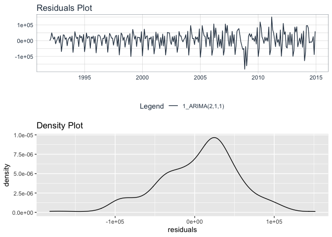
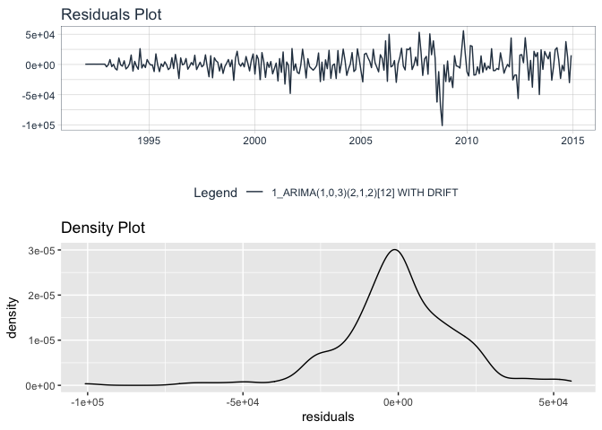
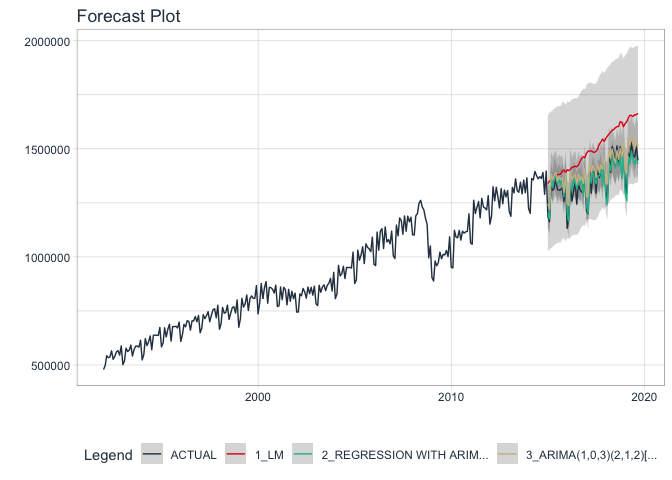

Retail sales prediction
================
Chung-Hao Lee
8/22/2021

<!-- README.md is generated from Retail_sales_prediction.Rmd. Please edit that file --> 

``` r
### Setting up environment
library("tidyverse")
```

    ## ── Attaching packages ─────────────────────────────────────── tidyverse 1.3.1 ──

    ## ✓ ggplot2 3.3.5     ✓ purrr   0.3.4
    ## ✓ tibble  3.1.2     ✓ dplyr   1.0.7
    ## ✓ tidyr   1.1.3     ✓ stringr 1.4.0
    ## ✓ readr   1.4.0     ✓ forcats 0.5.1

    ## ── Conflicts ────────────────────────────────────────── tidyverse_conflicts() ──
    ## x dplyr::filter() masks stats::filter()
    ## x dplyr::lag()    masks stats::lag()

``` r
library("tidymodels")
```

    ## ── Attaching packages ────────────────────────────────────── tidymodels 0.1.2 ──

    ## ✓ broom     0.7.8      ✓ recipes   0.1.15
    ## ✓ dials     0.0.9      ✓ rsample   0.1.1 
    ## ✓ infer     0.5.4      ✓ tune      0.1.6 
    ## ✓ modeldata 0.1.0      ✓ workflows 0.2.4 
    ## ✓ parsnip   0.1.5      ✓ yardstick 0.0.8

    ## ── Conflicts ───────────────────────────────────────── tidymodels_conflicts() ──
    ## x scales::discard() masks purrr::discard()
    ## x dplyr::filter()   masks stats::filter()
    ## x recipes::fixed()  masks stringr::fixed()
    ## x dplyr::lag()      masks stats::lag()
    ## x yardstick::spec() masks readr::spec()
    ## x recipes::step()   masks stats::step()

``` r
library("timetk")
library("modeltime")
library("patchwork")
```

``` r
knitr::opts_chunk$set(
  collapse = TRUE, 
  comment = "#>",
  fig.path = "fig/figures/README-",
  out.width = "100%",
  message=FALSE, 
  warning=FALSE
)
```

``` r
### Loading dataset

####Total Business Sales, Not Seasonally Adjusted
df_sales <- 
  read_csv("/.../TOTBUSSMNSA.csv") %>% 
  select(-c(realtime_start, realtime_end)) %>% 
  rename(sales = value) %>% 
  mutate(trend = row_number(),
         quarter = as.factor(lubridate::quarter(date)),
         month = as.factor(lubridate::month(date)))

df_inv <- 
  read_csv("/.../TOTBUSIMNSA.csv") %>% 
  select(-c(realtime_start, realtime_end))%>% 
  rename(inv = value) %>% 
  mutate(trend = row_number(),
         quarter = as.factor(lubridate::quarter(date)),
         month = as.factor(lubridate::month(date)))

str(df_sales)
#> tibble [333 × 5] (S3: tbl_df/tbl/data.frame)
#>  $ sales  : num [1:333] 478951 496844 542833 533768 537400 ...
#>  $ date   : Date[1:333], format: "1992-01-01" "1992-02-01" ...
#>  $ trend  : int [1:333] 1 2 3 4 5 6 7 8 9 10 ...
#>  $ quarter: Factor w/ 4 levels "1","2","3","4": 1 1 1 2 2 2 3 3 3 4 ...
#>  $ month  : Factor w/ 12 levels "1","2","3","4",..: 1 2 3 4 5 6 7 8 9 10 ...
str(df_inv)
#> tibble [333 × 5] (S3: tbl_df/tbl/data.frame)
#>  $ inv    : num [1:333] 802948 809329 813301 819247 815688 ...
#>  $ date   : Date[1:333], format: "1992-01-01" "1992-02-01" ...
#>  $ trend  : int [1:333] 1 2 3 4 5 6 7 8 9 10 ...
#>  $ quarter: Factor w/ 4 levels "1","2","3","4": 1 1 1 2 2 2 3 3 3 4 ...
#>  $ month  : Factor w/ 12 levels "1","2","3","4",..: 1 2 3 4 5 6 7 8 9 10 ...
```

``` r
### Plot sales and inv
df_sales %>% 
  plot_time_series(date, sales, .smooth=FALSE, .interactive = FALSE,.title = "Sales")
```


``` r
df_inv %>% 
  plot_time_series(date, inv, .smooth=FALSE, .interactive = FALSE, .title = "Inventory")
```

 \*
We can see that both sales and inventory have similar patterns and have
drops after 2008.

``` r
###Seasonal plot for US retail sales from 2000
df_sales %>% 
  filter(date >= '2000-01-01') %>% 
  group_by(lubridate::year(date)) %>% 
  mutate(sales = scale(sales) - scale(sales)[1]) %>% 
  ungroup() %>% 
  plot_time_series(month, sales, 
                   .smooth= FALSE, 
                   .color_var = lubridate::year(date), 
                   .interactive = FALSE, 
                   .color_lab = "Year", 
                   .title='Seasonal plot for US retail sales from 2000',
                   .y_lab='Sales', 
                   .x_lab='Month')
```

 \*
Excpt 2008, every sales have upward trends in a year since 2000.

``` r
# Create a seasonal subseries plot for the subset data starting from 2000

df_sales %>%
  filter(date >= '2000-01-01') %>%
  plot_time_series(
        .date = date,
        .value = sales,
        .facet_vars = month,
        .facet_ncol = 12, 
        .facet_scales = "fixed",
        .interactive = FALSE,
        .legend_show = FALSE,
        .title = "Seasonal subseries plot for US retail sales from 2000",
        .x_lab = "Year",
        .y_lab = "Sales ($ million)")  + 
        theme(axis.text.x=element_text(angle=60, hjust=1)
    )
```

 \*
We can see that in every months, sales increases since 2000.

``` r
# Create a STL decomposition plot for the full data
df_sales %>%
  plot_stl_diagnostics(
    date, sales,
    # Set features to return, desired frequency and trend
    .feature_set = c("observed", "season", "trend", "remainder"), 
    .interactive = FALSE)
```

 \*
We can see in STL plot, sales has clear seasonal pattern and upward
trend.

``` r
### ACF and PACF
df_sales%>%
  plot_acf_diagnostics(date, sales, 
                       .lags = 48,
                       .show_white_noise_bars =TRUE,
                       .interactive = FALSE)
```

 \*
ACF shows that sales are self-related and has seasonal pattern every 12
lags.

``` r
# Build an ARIMA model

arima_auto <- 
  arima_reg() %>% 
  set_engine("auto_arima") %>%
  fit(sales ~ date, data = df_sales)

arima_auto
#> parsnip model object
#> 
#> Fit time:  1.9s 
#> Series: outcome 
#> ARIMA(2,0,3)(2,1,1)[12] with drift 
#> 
#> Coefficients:
#>          ar1     ar2     ma1      ma2     ma3    sar1     sar2     sma1
#>       0.1924  0.6373  0.4777  -0.0639  0.4272  0.4033  -0.3812  -0.7251
#> s.e.  0.0598  0.0580  0.0764   0.0620  0.0550  0.0656   0.0587   0.0437
#>           drift
#>       2767.6500
#> s.e.   331.9943
#> 
#> sigma^2 estimated as 473230856:  log likelihood=-3665.16
#> AIC=7350.31   AICc=7351.02   BIC=7388.03
```

``` r
# Plot the residuals

models_tbl <- modeltime_table(
  arima_auto
)

models_tbl %>%
    modeltime_calibrate(new_data = df_sales) %>%
    modeltime_residuals() %>%
    plot_modeltime_residuals(.interactive = FALSE)
```


``` r
# Unit root test: ADF test

df_sales %>%
  select(sales) %>% 
  ts(start = c(1992, 1), end = c(2019, 9), frequency = 12) %>% 
  tseries::adf.test()
#> 
#>  Augmented Dickey-Fuller Test
#> 
#> data:  .
#> Dickey-Fuller = -3.5173, Lag order = 6, p-value = 0.04129
#> alternative hypothesis: stationary
```

-   From ADF test, p-value &lt; 0.05. We can say it’s stationary.

``` r
# Run ADF test again after first order differencing

df_sales %>%
  mutate(diffsales = diff_vec(sales)) %>% 
  select(diffsales) %>% 
  drop_na() %>% 
  ts(start = c(1992, 1), end = c(2019, 9), frequency = 12) %>% 
  tseries::adf.test()
#> 
#>  Augmented Dickey-Fuller Test
#> 
#> data:  .
#> Dickey-Fuller = -7.625, Lag order = 6, p-value = 0.01
#> alternative hypothesis: stationary
```

-   After first order differencing, p-value is smaller than before. We
    can say first order differencing is closer to stationary.

``` r
# ACF and PACT after 1st order ordinary differencing

df_sales%>%
  plot_acf_diagnostics(date, diff_vec(df_sales$sales, difference = 1), 
                       .lags = 48,
                       .show_white_noise_bars =TRUE,
                       .interactive = FALSE)
```


-   In ACFand PACF plots, even 12, 24, 36, 48 have peaks over threshold,
    it is closer to stationary compared to before first order
    differencing.

``` r
# After 1st order seasonal differencing

df_sales%>%
  plot_acf_diagnostics(date, diff_vec(df_sales$sales, lag = 12, difference = 1), 
                       .lags = 48,
                       .show_white_noise_bars =TRUE,
                       .interactive = FALSE)
```


-   Because from previous ACF, we know that sales has seasonal patterns
    (lag = 12). We apply seasonal differencing and do ACF again. This
    time, no periodical peaks appear. But most lags are out of therhold
    in ACF. So I do 1st order ordinary differencing and 1st order
    seasonal differencing next.

``` r
# After 1st order ordinary differencing and 1st order seasonal differencing

df_sales%>%
  mutate(difford1 = diff_vec(sales, difference = 1), difford1seas1 = diff_vec(difford1, lag = 12, difference = 1)) %>% 
  plot_acf_diagnostics(date, difford1seas1, 
                       .lags = 48,
                       .show_white_noise_bars =TRUE,
                       .interactive = FALSE)
```


``` r
# After 1st order ordinary differencing and 2nd order seasonal differencing

df_sales%>%
  mutate(difford1 = diff_vec(sales, difference = 1), difford1seas1 = diff_vec(difford1, lag = 12, difference = 2)) %>% 
  plot_acf_diagnostics(date, difford1seas1, 
                       .lags = 48,
                       .show_white_noise_bars =TRUE,
                       .interactive = FALSE)
```



-   In 1st order ordinary differencing and 1st order seasonal
    differencing, we see that the effect is not quite good, so I add one
    more on seasonal differencing and do 1st order ordinary differencing
    and 2nd order seasonal differencing. This time, we have a better
    result and more lags are fall inside therhold.

# Prediction

``` r
# Split the data

df_train <- df_sales %>% filter(date < '2010-01-01')
df_test<- df_sales %>% filter(date >= '2010-01-01')
```

``` r
# Auto ARIMA: gird search q, d, p
auto_arima <- 
  arima_reg() %>%
  set_engine(engine = "auto_arima") %>%
  fit(sales ~ date, data = df_train)

auto_arima
#> parsnip model object
#> 
#> Fit time:  1.8s 
#> Series: outcome 
#> ARIMA(4,0,2)(0,1,2)[12] with drift 
#> 
#> Coefficients:
#>          ar1     ar2     ar3      ar4      ma1      ma2     sma1     sma2
#>       0.7929  0.4564  0.2543  -0.6065  -0.1124  -0.1886  -0.3987  -0.2931
#> s.e.  0.1070  0.1694  0.1187   0.0620   0.1339   0.1684   0.0868   0.0931
#>           drift
#>       2868.5875
#> s.e.   301.2213
#> 
#> sigma^2 estimated as 389397010:  log likelihood=-2308.12
#> AIC=4636.24   AICc=4637.38   BIC=4669.42
```

``` r
# Model table and calibration

models_tbl <- modeltime_table(auto_arima)

calibration_tbl <- models_tbl %>%
    modeltime_calibrate(new_data = df_test)

calibration_tbl %>%
  modeltime_accuracy()%>%
  table_modeltime_accuracy(.interactive = FALSE)
```

<style>html {
  font-family: -apple-system, BlinkMacSystemFont, 'Segoe UI', Roboto, Oxygen, Ubuntu, Cantarell, 'Helvetica Neue', 'Fira Sans', 'Droid Sans', Arial, sans-serif;
}

#dqwcmgryiz .gt_table {
  display: table;
  border-collapse: collapse;
  margin-left: auto;
  margin-right: auto;
  color: #333333;
  font-size: 16px;
  font-weight: normal;
  font-style: normal;
  background-color: #FFFFFF;
  width: auto;
  border-top-style: solid;
  border-top-width: 2px;
  border-top-color: #A8A8A8;
  border-right-style: none;
  border-right-width: 2px;
  border-right-color: #D3D3D3;
  border-bottom-style: solid;
  border-bottom-width: 2px;
  border-bottom-color: #A8A8A8;
  border-left-style: none;
  border-left-width: 2px;
  border-left-color: #D3D3D3;
}

#dqwcmgryiz .gt_heading {
  background-color: #FFFFFF;
  text-align: center;
  border-bottom-color: #FFFFFF;
  border-left-style: none;
  border-left-width: 1px;
  border-left-color: #D3D3D3;
  border-right-style: none;
  border-right-width: 1px;
  border-right-color: #D3D3D3;
}

#dqwcmgryiz .gt_title {
  color: #333333;
  font-size: 125%;
  font-weight: initial;
  padding-top: 4px;
  padding-bottom: 4px;
  border-bottom-color: #FFFFFF;
  border-bottom-width: 0;
}

#dqwcmgryiz .gt_subtitle {
  color: #333333;
  font-size: 85%;
  font-weight: initial;
  padding-top: 0;
  padding-bottom: 4px;
  border-top-color: #FFFFFF;
  border-top-width: 0;
}

#dqwcmgryiz .gt_bottom_border {
  border-bottom-style: solid;
  border-bottom-width: 2px;
  border-bottom-color: #D3D3D3;
}

#dqwcmgryiz .gt_col_headings {
  border-top-style: solid;
  border-top-width: 2px;
  border-top-color: #D3D3D3;
  border-bottom-style: solid;
  border-bottom-width: 2px;
  border-bottom-color: #D3D3D3;
  border-left-style: none;
  border-left-width: 1px;
  border-left-color: #D3D3D3;
  border-right-style: none;
  border-right-width: 1px;
  border-right-color: #D3D3D3;
}

#dqwcmgryiz .gt_col_heading {
  color: #333333;
  background-color: #FFFFFF;
  font-size: 100%;
  font-weight: normal;
  text-transform: inherit;
  border-left-style: none;
  border-left-width: 1px;
  border-left-color: #D3D3D3;
  border-right-style: none;
  border-right-width: 1px;
  border-right-color: #D3D3D3;
  vertical-align: bottom;
  padding-top: 5px;
  padding-bottom: 6px;
  padding-left: 5px;
  padding-right: 5px;
  overflow-x: hidden;
}

#dqwcmgryiz .gt_column_spanner_outer {
  color: #333333;
  background-color: #FFFFFF;
  font-size: 100%;
  font-weight: normal;
  text-transform: inherit;
  padding-top: 0;
  padding-bottom: 0;
  padding-left: 4px;
  padding-right: 4px;
}

#dqwcmgryiz .gt_column_spanner_outer:first-child {
  padding-left: 0;
}

#dqwcmgryiz .gt_column_spanner_outer:last-child {
  padding-right: 0;
}

#dqwcmgryiz .gt_column_spanner {
  border-bottom-style: solid;
  border-bottom-width: 2px;
  border-bottom-color: #D3D3D3;
  vertical-align: bottom;
  padding-top: 5px;
  padding-bottom: 6px;
  overflow-x: hidden;
  display: inline-block;
  width: 100%;
}

#dqwcmgryiz .gt_group_heading {
  padding: 8px;
  color: #333333;
  background-color: #FFFFFF;
  font-size: 100%;
  font-weight: initial;
  text-transform: inherit;
  border-top-style: solid;
  border-top-width: 2px;
  border-top-color: #D3D3D3;
  border-bottom-style: solid;
  border-bottom-width: 2px;
  border-bottom-color: #D3D3D3;
  border-left-style: none;
  border-left-width: 1px;
  border-left-color: #D3D3D3;
  border-right-style: none;
  border-right-width: 1px;
  border-right-color: #D3D3D3;
  vertical-align: middle;
}

#dqwcmgryiz .gt_empty_group_heading {
  padding: 0.5px;
  color: #333333;
  background-color: #FFFFFF;
  font-size: 100%;
  font-weight: initial;
  border-top-style: solid;
  border-top-width: 2px;
  border-top-color: #D3D3D3;
  border-bottom-style: solid;
  border-bottom-width: 2px;
  border-bottom-color: #D3D3D3;
  vertical-align: middle;
}

#dqwcmgryiz .gt_from_md > :first-child {
  margin-top: 0;
}

#dqwcmgryiz .gt_from_md > :last-child {
  margin-bottom: 0;
}

#dqwcmgryiz .gt_row {
  padding-top: 8px;
  padding-bottom: 8px;
  padding-left: 5px;
  padding-right: 5px;
  margin: 10px;
  border-top-style: solid;
  border-top-width: 1px;
  border-top-color: #D3D3D3;
  border-left-style: none;
  border-left-width: 1px;
  border-left-color: #D3D3D3;
  border-right-style: none;
  border-right-width: 1px;
  border-right-color: #D3D3D3;
  vertical-align: middle;
  overflow-x: hidden;
}

#dqwcmgryiz .gt_stub {
  color: #333333;
  background-color: #FFFFFF;
  font-size: 100%;
  font-weight: initial;
  text-transform: inherit;
  border-right-style: solid;
  border-right-width: 2px;
  border-right-color: #D3D3D3;
  padding-left: 12px;
}

#dqwcmgryiz .gt_summary_row {
  color: #333333;
  background-color: #FFFFFF;
  text-transform: inherit;
  padding-top: 8px;
  padding-bottom: 8px;
  padding-left: 5px;
  padding-right: 5px;
}

#dqwcmgryiz .gt_first_summary_row {
  padding-top: 8px;
  padding-bottom: 8px;
  padding-left: 5px;
  padding-right: 5px;
  border-top-style: solid;
  border-top-width: 2px;
  border-top-color: #D3D3D3;
}

#dqwcmgryiz .gt_grand_summary_row {
  color: #333333;
  background-color: #FFFFFF;
  text-transform: inherit;
  padding-top: 8px;
  padding-bottom: 8px;
  padding-left: 5px;
  padding-right: 5px;
}

#dqwcmgryiz .gt_first_grand_summary_row {
  padding-top: 8px;
  padding-bottom: 8px;
  padding-left: 5px;
  padding-right: 5px;
  border-top-style: double;
  border-top-width: 6px;
  border-top-color: #D3D3D3;
}

#dqwcmgryiz .gt_striped {
  background-color: rgba(128, 128, 128, 0.05);
}

#dqwcmgryiz .gt_table_body {
  border-top-style: solid;
  border-top-width: 2px;
  border-top-color: #D3D3D3;
  border-bottom-style: solid;
  border-bottom-width: 2px;
  border-bottom-color: #D3D3D3;
}

#dqwcmgryiz .gt_footnotes {
  color: #333333;
  background-color: #FFFFFF;
  border-bottom-style: none;
  border-bottom-width: 2px;
  border-bottom-color: #D3D3D3;
  border-left-style: none;
  border-left-width: 2px;
  border-left-color: #D3D3D3;
  border-right-style: none;
  border-right-width: 2px;
  border-right-color: #D3D3D3;
}

#dqwcmgryiz .gt_footnote {
  margin: 0px;
  font-size: 90%;
  padding: 4px;
}

#dqwcmgryiz .gt_sourcenotes {
  color: #333333;
  background-color: #FFFFFF;
  border-bottom-style: none;
  border-bottom-width: 2px;
  border-bottom-color: #D3D3D3;
  border-left-style: none;
  border-left-width: 2px;
  border-left-color: #D3D3D3;
  border-right-style: none;
  border-right-width: 2px;
  border-right-color: #D3D3D3;
}

#dqwcmgryiz .gt_sourcenote {
  font-size: 90%;
  padding: 4px;
}

#dqwcmgryiz .gt_left {
  text-align: left;
}

#dqwcmgryiz .gt_center {
  text-align: center;
}

#dqwcmgryiz .gt_right {
  text-align: right;
  font-variant-numeric: tabular-nums;
}

#dqwcmgryiz .gt_font_normal {
  font-weight: normal;
}

#dqwcmgryiz .gt_font_bold {
  font-weight: bold;
}

#dqwcmgryiz .gt_font_italic {
  font-style: italic;
}

#dqwcmgryiz .gt_super {
  font-size: 65%;
}

#dqwcmgryiz .gt_footnote_marks {
  font-style: italic;
  font-size: 65%;
}
</style>
<div id="dqwcmgryiz" style="overflow-x:auto;overflow-y:auto;width:auto;height:auto;"><table class="gt_table">
  <thead class="gt_header">
    <tr>
      <th colspan="9" class="gt_heading gt_title gt_font_normal" style>Accuracy Table</th>
    </tr>
    <tr>
      <th colspan="9" class="gt_heading gt_subtitle gt_font_normal gt_bottom_border" style></th>
    </tr>
  </thead>
  <thead class="gt_col_headings">
    <tr>
      <th class="gt_col_heading gt_columns_bottom_border gt_center" rowspan="1" colspan="1">.model_id</th>
      <th class="gt_col_heading gt_columns_bottom_border gt_left" rowspan="1" colspan="1">.model_desc</th>
      <th class="gt_col_heading gt_columns_bottom_border gt_left" rowspan="1" colspan="1">.type</th>
      <th class="gt_col_heading gt_columns_bottom_border gt_right" rowspan="1" colspan="1">mae</th>
      <th class="gt_col_heading gt_columns_bottom_border gt_right" rowspan="1" colspan="1">mape</th>
      <th class="gt_col_heading gt_columns_bottom_border gt_right" rowspan="1" colspan="1">mase</th>
      <th class="gt_col_heading gt_columns_bottom_border gt_right" rowspan="1" colspan="1">smape</th>
      <th class="gt_col_heading gt_columns_bottom_border gt_right" rowspan="1" colspan="1">rmse</th>
      <th class="gt_col_heading gt_columns_bottom_border gt_right" rowspan="1" colspan="1">rsq</th>
    </tr>
  </thead>
  <tbody class="gt_table_body">
    <tr>
      <td class="gt_row gt_center">1</td>
      <td class="gt_row gt_left">ARIMA(4,0,2)(0,1,2)[12] WITH DRIFT</td>
      <td class="gt_row gt_left">Test</td>
      <td class="gt_row gt_right">52914.2</td>
      <td class="gt_row gt_right">4.26</td>
      <td class="gt_row gt_right">0.82</td>
      <td class="gt_row gt_right">4.18</td>
      <td class="gt_row gt_right">64320.02</td>
      <td class="gt_row gt_right">0.73</td>
    </tr>
  </tbody>
  
  
</table></div>

``` r
### Check forcast with actual data
calibration_tbl %>%
    modeltime_forecast(
        new_data    = df_test,
        actual_data = df_sales
    ) %>%
    plot_modeltime_forecast(
      .legend_max_width = 25,
      .interactive      = FALSE
    )
```

 \*
Well, actually we forsee the trend and seasonal patterns are there, but
it just not quite fit. Maybe because 2008 was once in a lifetime crisis
and our split time 2010 was not far away from 2008, so it may have some
deviation.

``` r
# Split the data on 2012

df_train_12 <- df_sales %>% filter(date < '2012-01-01')
df_test_12 <- df_sales %>% filter(date >= '2012-01-01')
```

``` r
# Auto ARIMA: gird search q, d, p
auto_arima_12 <- 
  arima_reg() %>%
  set_engine(engine = "auto_arima") %>%
  fit(sales ~ date, data = df_train_12)

auto_arima_12
#> parsnip model object
#> 
#> Fit time:  5.1s 
#> Series: outcome 
#> ARIMA(2,0,3)(0,1,2)[12] with drift 
#> 
#> Coefficients:
#>          ar1     ar2     ma1      ma2     ma3     sma1     sma2      drift
#>       0.5776  0.2969  0.1192  -0.0371  0.5759  -0.4383  -0.3160  2826.3247
#> s.e.  0.1377  0.1375  0.1255   0.0626  0.0666   0.0718   0.0684   448.7548
#> 
#> sigma^2 estimated as 419675549:  log likelihood=-2589.03
#> AIC=5196.06   AICc=5196.88   BIC=5226.92
```

``` r
# Model table and calibration

models_tbl_12 <- modeltime_table(auto_arima_12)

calibration_tbl_12 <- models_tbl_12 %>%
    modeltime_calibrate(new_data = df_test_12)

calibration_tbl_12 %>%
  modeltime_accuracy()%>%
  table_modeltime_accuracy(.interactive = FALSE)
```

<style>html {
  font-family: -apple-system, BlinkMacSystemFont, 'Segoe UI', Roboto, Oxygen, Ubuntu, Cantarell, 'Helvetica Neue', 'Fira Sans', 'Droid Sans', Arial, sans-serif;
}

#lldtjofyob .gt_table {
  display: table;
  border-collapse: collapse;
  margin-left: auto;
  margin-right: auto;
  color: #333333;
  font-size: 16px;
  font-weight: normal;
  font-style: normal;
  background-color: #FFFFFF;
  width: auto;
  border-top-style: solid;
  border-top-width: 2px;
  border-top-color: #A8A8A8;
  border-right-style: none;
  border-right-width: 2px;
  border-right-color: #D3D3D3;
  border-bottom-style: solid;
  border-bottom-width: 2px;
  border-bottom-color: #A8A8A8;
  border-left-style: none;
  border-left-width: 2px;
  border-left-color: #D3D3D3;
}

#lldtjofyob .gt_heading {
  background-color: #FFFFFF;
  text-align: center;
  border-bottom-color: #FFFFFF;
  border-left-style: none;
  border-left-width: 1px;
  border-left-color: #D3D3D3;
  border-right-style: none;
  border-right-width: 1px;
  border-right-color: #D3D3D3;
}

#lldtjofyob .gt_title {
  color: #333333;
  font-size: 125%;
  font-weight: initial;
  padding-top: 4px;
  padding-bottom: 4px;
  border-bottom-color: #FFFFFF;
  border-bottom-width: 0;
}

#lldtjofyob .gt_subtitle {
  color: #333333;
  font-size: 85%;
  font-weight: initial;
  padding-top: 0;
  padding-bottom: 4px;
  border-top-color: #FFFFFF;
  border-top-width: 0;
}

#lldtjofyob .gt_bottom_border {
  border-bottom-style: solid;
  border-bottom-width: 2px;
  border-bottom-color: #D3D3D3;
}

#lldtjofyob .gt_col_headings {
  border-top-style: solid;
  border-top-width: 2px;
  border-top-color: #D3D3D3;
  border-bottom-style: solid;
  border-bottom-width: 2px;
  border-bottom-color: #D3D3D3;
  border-left-style: none;
  border-left-width: 1px;
  border-left-color: #D3D3D3;
  border-right-style: none;
  border-right-width: 1px;
  border-right-color: #D3D3D3;
}

#lldtjofyob .gt_col_heading {
  color: #333333;
  background-color: #FFFFFF;
  font-size: 100%;
  font-weight: normal;
  text-transform: inherit;
  border-left-style: none;
  border-left-width: 1px;
  border-left-color: #D3D3D3;
  border-right-style: none;
  border-right-width: 1px;
  border-right-color: #D3D3D3;
  vertical-align: bottom;
  padding-top: 5px;
  padding-bottom: 6px;
  padding-left: 5px;
  padding-right: 5px;
  overflow-x: hidden;
}

#lldtjofyob .gt_column_spanner_outer {
  color: #333333;
  background-color: #FFFFFF;
  font-size: 100%;
  font-weight: normal;
  text-transform: inherit;
  padding-top: 0;
  padding-bottom: 0;
  padding-left: 4px;
  padding-right: 4px;
}

#lldtjofyob .gt_column_spanner_outer:first-child {
  padding-left: 0;
}

#lldtjofyob .gt_column_spanner_outer:last-child {
  padding-right: 0;
}

#lldtjofyob .gt_column_spanner {
  border-bottom-style: solid;
  border-bottom-width: 2px;
  border-bottom-color: #D3D3D3;
  vertical-align: bottom;
  padding-top: 5px;
  padding-bottom: 6px;
  overflow-x: hidden;
  display: inline-block;
  width: 100%;
}

#lldtjofyob .gt_group_heading {
  padding: 8px;
  color: #333333;
  background-color: #FFFFFF;
  font-size: 100%;
  font-weight: initial;
  text-transform: inherit;
  border-top-style: solid;
  border-top-width: 2px;
  border-top-color: #D3D3D3;
  border-bottom-style: solid;
  border-bottom-width: 2px;
  border-bottom-color: #D3D3D3;
  border-left-style: none;
  border-left-width: 1px;
  border-left-color: #D3D3D3;
  border-right-style: none;
  border-right-width: 1px;
  border-right-color: #D3D3D3;
  vertical-align: middle;
}

#lldtjofyob .gt_empty_group_heading {
  padding: 0.5px;
  color: #333333;
  background-color: #FFFFFF;
  font-size: 100%;
  font-weight: initial;
  border-top-style: solid;
  border-top-width: 2px;
  border-top-color: #D3D3D3;
  border-bottom-style: solid;
  border-bottom-width: 2px;
  border-bottom-color: #D3D3D3;
  vertical-align: middle;
}

#lldtjofyob .gt_from_md > :first-child {
  margin-top: 0;
}

#lldtjofyob .gt_from_md > :last-child {
  margin-bottom: 0;
}

#lldtjofyob .gt_row {
  padding-top: 8px;
  padding-bottom: 8px;
  padding-left: 5px;
  padding-right: 5px;
  margin: 10px;
  border-top-style: solid;
  border-top-width: 1px;
  border-top-color: #D3D3D3;
  border-left-style: none;
  border-left-width: 1px;
  border-left-color: #D3D3D3;
  border-right-style: none;
  border-right-width: 1px;
  border-right-color: #D3D3D3;
  vertical-align: middle;
  overflow-x: hidden;
}

#lldtjofyob .gt_stub {
  color: #333333;
  background-color: #FFFFFF;
  font-size: 100%;
  font-weight: initial;
  text-transform: inherit;
  border-right-style: solid;
  border-right-width: 2px;
  border-right-color: #D3D3D3;
  padding-left: 12px;
}

#lldtjofyob .gt_summary_row {
  color: #333333;
  background-color: #FFFFFF;
  text-transform: inherit;
  padding-top: 8px;
  padding-bottom: 8px;
  padding-left: 5px;
  padding-right: 5px;
}

#lldtjofyob .gt_first_summary_row {
  padding-top: 8px;
  padding-bottom: 8px;
  padding-left: 5px;
  padding-right: 5px;
  border-top-style: solid;
  border-top-width: 2px;
  border-top-color: #D3D3D3;
}

#lldtjofyob .gt_grand_summary_row {
  color: #333333;
  background-color: #FFFFFF;
  text-transform: inherit;
  padding-top: 8px;
  padding-bottom: 8px;
  padding-left: 5px;
  padding-right: 5px;
}

#lldtjofyob .gt_first_grand_summary_row {
  padding-top: 8px;
  padding-bottom: 8px;
  padding-left: 5px;
  padding-right: 5px;
  border-top-style: double;
  border-top-width: 6px;
  border-top-color: #D3D3D3;
}

#lldtjofyob .gt_striped {
  background-color: rgba(128, 128, 128, 0.05);
}

#lldtjofyob .gt_table_body {
  border-top-style: solid;
  border-top-width: 2px;
  border-top-color: #D3D3D3;
  border-bottom-style: solid;
  border-bottom-width: 2px;
  border-bottom-color: #D3D3D3;
}

#lldtjofyob .gt_footnotes {
  color: #333333;
  background-color: #FFFFFF;
  border-bottom-style: none;
  border-bottom-width: 2px;
  border-bottom-color: #D3D3D3;
  border-left-style: none;
  border-left-width: 2px;
  border-left-color: #D3D3D3;
  border-right-style: none;
  border-right-width: 2px;
  border-right-color: #D3D3D3;
}

#lldtjofyob .gt_footnote {
  margin: 0px;
  font-size: 90%;
  padding: 4px;
}

#lldtjofyob .gt_sourcenotes {
  color: #333333;
  background-color: #FFFFFF;
  border-bottom-style: none;
  border-bottom-width: 2px;
  border-bottom-color: #D3D3D3;
  border-left-style: none;
  border-left-width: 2px;
  border-left-color: #D3D3D3;
  border-right-style: none;
  border-right-width: 2px;
  border-right-color: #D3D3D3;
}

#lldtjofyob .gt_sourcenote {
  font-size: 90%;
  padding: 4px;
}

#lldtjofyob .gt_left {
  text-align: left;
}

#lldtjofyob .gt_center {
  text-align: center;
}

#lldtjofyob .gt_right {
  text-align: right;
  font-variant-numeric: tabular-nums;
}

#lldtjofyob .gt_font_normal {
  font-weight: normal;
}

#lldtjofyob .gt_font_bold {
  font-weight: bold;
}

#lldtjofyob .gt_font_italic {
  font-style: italic;
}

#lldtjofyob .gt_super {
  font-size: 65%;
}

#lldtjofyob .gt_footnote_marks {
  font-style: italic;
  font-size: 65%;
}
</style>
<div id="lldtjofyob" style="overflow-x:auto;overflow-y:auto;width:auto;height:auto;"><table class="gt_table">
  <thead class="gt_header">
    <tr>
      <th colspan="9" class="gt_heading gt_title gt_font_normal" style>Accuracy Table</th>
    </tr>
    <tr>
      <th colspan="9" class="gt_heading gt_subtitle gt_font_normal gt_bottom_border" style></th>
    </tr>
  </thead>
  <thead class="gt_col_headings">
    <tr>
      <th class="gt_col_heading gt_columns_bottom_border gt_center" rowspan="1" colspan="1">.model_id</th>
      <th class="gt_col_heading gt_columns_bottom_border gt_left" rowspan="1" colspan="1">.model_desc</th>
      <th class="gt_col_heading gt_columns_bottom_border gt_left" rowspan="1" colspan="1">.type</th>
      <th class="gt_col_heading gt_columns_bottom_border gt_right" rowspan="1" colspan="1">mae</th>
      <th class="gt_col_heading gt_columns_bottom_border gt_right" rowspan="1" colspan="1">mape</th>
      <th class="gt_col_heading gt_columns_bottom_border gt_right" rowspan="1" colspan="1">mase</th>
      <th class="gt_col_heading gt_columns_bottom_border gt_right" rowspan="1" colspan="1">smape</th>
      <th class="gt_col_heading gt_columns_bottom_border gt_right" rowspan="1" colspan="1">rmse</th>
      <th class="gt_col_heading gt_columns_bottom_border gt_right" rowspan="1" colspan="1">rsq</th>
    </tr>
  </thead>
  <tbody class="gt_table_body">
    <tr>
      <td class="gt_row gt_center">1</td>
      <td class="gt_row gt_left">ARIMA(2,0,3)(0,1,2)[12] WITH DRIFT</td>
      <td class="gt_row gt_left">Test</td>
      <td class="gt_row gt_right">38777.74</td>
      <td class="gt_row gt_right">2.95</td>
      <td class="gt_row gt_right">0.57</td>
      <td class="gt_row gt_right">2.92</td>
      <td class="gt_row gt_right">47345.09</td>
      <td class="gt_row gt_right">0.74</td>
    </tr>
  </tbody>
  
  
</table></div>

-   We have smaller mae, rmse. Good sign of it.

``` r
### Check forcast with actual data
calibration_tbl_12 %>%
    modeltime_forecast(
        new_data    = df_test_12,
        actual_data = df_sales
    ) %>%
    plot_modeltime_forecast(
      .legend_max_width = 25,
      .interactive      = FALSE
    )
```

 \*
Bang!!! The trend and patterns look quite well and we have a better
prediction that fit the actual data.

Next, I’d like to add another variable to see if they can improve
prediction model.

``` r
# importing another dataset
df_econ <- 
  read_csv("/.../us-econ.csv") %>% 
  mutate(date = lubridate::mdy(date),
  trend = row_number()) %>% 
  filter(date >= '1992-01-01', date <= '2019-09-01') 

skimr::skim(df_econ)
```

|                                                  |          |
|:-------------------------------------------------|:---------|
| Name                                             | df\_econ |
| Number of rows                                   | 333      |
| Number of columns                                | 13       |
| \_\_\_\_\_\_\_\_\_\_\_\_\_\_\_\_\_\_\_\_\_\_\_   |          |
| Column type frequency:                           |          |
| Date                                             | 1        |
| numeric                                          | 12       |
| \_\_\_\_\_\_\_\_\_\_\_\_\_\_\_\_\_\_\_\_\_\_\_\_ |          |
| Group variables                                  | None     |

Data summary

**Variable type: Date**

| skim\_variable | n\_missing | complete\_rate | min        | max        | median     | n\_unique |
|:---------------|-----------:|---------------:|:-----------|:-----------|:-----------|----------:|
| date           |          0 |              1 | 1992-01-01 | 2019-09-01 | 2005-11-01 |       333 |

**Variable type: numeric**

| skim\_variable | n\_missing | complete\_rate |      mean |       sd |        p0 |       p25 |       p50 |       p75 |      p100 | hist  |
|:---------------|-----------:|---------------:|----------:|---------:|----------:|----------:|----------:|----------:|----------:|:------|
| income         |          0 |              1 |  11067.87 |  3798.60 |   5264.20 |   7793.50 |  10890.40 |  13996.60 |  18645.10 | ▇▆▆▅▃ |
| saving         |          0 |              1 |      6.32 |     1.60 |      2.20 |      5.30 |      6.60 |      7.30 |     12.00 | ▂▅▇▁▁ |
| unemployment   |          0 |              1 |      5.83 |     1.63 |      3.50 |      4.60 |      5.50 |      6.70 |     10.00 | ▇▇▂▂▂ |
| labor          |          0 |              1 |     65.35 |     1.62 |     62.40 |     63.70 |     66.10 |     66.60 |     67.30 | ▅▂▁▆▇ |
| tenYearTeasury |          0 |              1 |      1.20 |     0.89 |     -0.41 |      0.36 |      1.22 |      1.98 |      2.83 | ▆▇▆▇▆ |
| CPI            |          0 |              1 |    197.31 |    35.13 |    138.10 |    164.00 |    198.30 |    230.28 |    256.76 | ▇▇▅▇▇ |
| inflation      |          0 |              1 |      2.28 |     1.11 |     -2.10 |      1.70 |      2.30 |      3.00 |      5.60 | ▁▁▇▇▁ |
| veichleSales   |          0 |              1 |     15.87 |     2.10 |      9.22 |     14.83 |     16.44 |     17.41 |     22.06 | ▁▂▇▇▁ |
| houseSales     |          0 |              1 |    707.40 |   265.22 |    270.00 |    502.00 |    665.00 |    882.00 |   1389.00 | ▆▇▇▃▂ |
| HPI            |          0 |              1 |    136.53 |    41.20 |     75.66 |     92.45 |    143.12 |    171.87 |    211.99 | ▇▃▆▇▂ |
| population     |          0 |              1 | 295735.00 | 21624.65 | 255331.00 | 277658.00 | 297089.00 | 314905.00 | 328897.00 | ▅▅▆▆▇ |
| trend          |          0 |              1 |    167.00 |    96.27 |      1.00 |     84.00 |    167.00 |    250.00 |    333.00 | ▇▇▇▇▇ |

``` r
# merge all tables
df_merge <- 
  df_sales %>% 
  bind_cols(df_inv)

df_merge_1 <- 
  inner_join(df_merge, df_econ, by = c("trend...3" = "trend")) %>% 
  select(sales, date...2, trend...3, quarter...4, month...5, inv, income, saving, unemployment, CPI, inflation, population, HPI) %>% 
  rename(date = date...2, trend = trend...3, quarter = quarter...4, month = month...5)
```

``` r
linear_model <-
  linear_reg() %>%
  set_engine("lm") %>%
  fit(sales ~ date + CPI + income + saving + HPI + population + inflation + trend + inv, data = df_merge_1)

summary(linear_model$fit)
#> 
#> Call:
#> stats::lm(formula = sales ~ date + CPI + income + saving + HPI + 
#>     population + inflation + trend + inv, data = data)
#> 
#> Residuals:
#>     Min      1Q  Median      3Q     Max 
#> -154367  -28824    1977   27047  124123 
#> 
#> Coefficients:
#>               Estimate Std. Error t value Pr(>|t|)    
#> (Intercept)  3.167e+08  2.868e+07  11.042  < 2e-16 ***
#> date        -3.988e+04  3.584e+03 -11.127  < 2e-16 ***
#> CPI          7.078e+03  1.172e+03   6.039 4.27e-09 ***
#> income      -2.816e+01  1.699e+01  -1.657   0.0984 .  
#> saving       3.013e+03  3.364e+03   0.896   0.3712    
#> HPI          4.255e+02  2.540e+02   1.675   0.0948 .  
#> population   6.757e+00  3.527e+00   1.916   0.0563 .  
#> inflation    1.811e+04  3.120e+03   5.803 1.56e-08 ***
#> trend        1.212e+06  1.092e+05  11.102  < 2e-16 ***
#> inv          5.138e-01  7.013e-02   7.326 1.91e-12 ***
#> ---
#> Signif. codes:  0 '***' 0.001 '**' 0.01 '*' 0.05 '.' 0.1 ' ' 1
#> 
#> Residual standard error: 44470 on 323 degrees of freedom
#> Multiple R-squared:  0.9754, Adjusted R-squared:  0.9747 
#> F-statistic:  1424 on 9 and 323 DF,  p-value: < 2.2e-16
```

``` r
# Build an ARIMA model with another variables

arima_auto_var <- 
  arima_reg() %>% 
  set_engine("auto_arima") %>%
  fit(sales ~ date + CPI + income + saving + HPI + population + inflation + trend + inv, data = df_merge_1)

arima_auto_var_imp <- 
  arima_reg() %>% 
  set_engine("auto_arima") %>%
  fit(sales ~ date + CPI + income + saving + HPI + population , data = df_merge_1)

arima_auto_var_imp_2 <- 
  arima_reg() %>% 
  set_engine("auto_arima") %>%
  fit(sales ~ date + income, data = df_merge_1)

arima_auto
#> parsnip model object
#> 
#> Fit time:  1.9s 
#> Series: outcome 
#> ARIMA(2,0,3)(2,1,1)[12] with drift 
#> 
#> Coefficients:
#>          ar1     ar2     ma1      ma2     ma3    sar1     sar2     sma1
#>       0.1924  0.6373  0.4777  -0.0639  0.4272  0.4033  -0.3812  -0.7251
#> s.e.  0.0598  0.0580  0.0764   0.0620  0.0550  0.0656   0.0587   0.0437
#>           drift
#>       2767.6500
#> s.e.   331.9943
#> 
#> sigma^2 estimated as 473230856:  log likelihood=-3665.16
#> AIC=7350.31   AICc=7351.02   BIC=7388.03
arima_auto_var
#> parsnip model object
#> 
#> Fit time:  411ms 
#> Series: outcome 
#> Regression with ARIMA(0,0,0) errors 
#> 
#> Coefficients:
#>            cpi    income     saving       hpi  population  inflation     trend
#>       9378.223  -29.5260  -4190.980  274.8591     -3.7539  15436.742  -37.6184
#> s.e.  1345.312   17.0678   3584.852  295.7047      0.6747   3578.792  584.2893
#>          inv
#>       0.4008
#> s.e.  0.0809
#> 
#> sigma^2 estimated as 2.755e+09:  log likelihood=-4087.64
#> AIC=8193.28   AICc=8193.84   BIC=8227.55
arima_auto_var_imp
#> parsnip model object
#> 
#> Fit time:  13.9s 
#> Series: outcome 
#> Regression with ARIMA(4,0,2)(2,1,1)[12] errors 
#> 
#> Coefficients:
#>          ar1     ar2     ar3      ar4      ma1      ma2    sar1     sar2
#>       0.9186  0.2382  0.3245  -0.5324  -0.6029  -0.0935  0.4031  -0.3408
#> s.e.  0.1089  0.1419  0.0735   0.0584   0.1328   0.1193  0.0817   0.0635
#>          sma1      drift        cpi   income     saving       hpi  population
#>       -0.6559  -6788.860  10931.593  77.4100  -7502.092  -57.8182     11.6423
#> s.e.   0.0535   1824.815   1002.803  13.5789   1502.696  517.6480      6.8118
#> 
#> sigma^2 estimated as 305844055:  log likelihood=-3588.64
#> AIC=7209.29   AICc=7211.07   BIC=7269.63
arima_auto_var_imp_2
#> parsnip model object
#> 
#> Fit time:  2.8s 
#> Series: outcome 
#> Regression with ARIMA(2,0,3)(2,1,2)[12] errors 
#> 
#> Coefficients:
#>          ar1     ar2     ma1      ma2     ma3    sar1     sar2     sma1   sma2
#>       0.4334  0.4192  0.2857  -0.0107  0.3602  0.8735  -0.7087  -1.3094  0.621
#> s.e.  0.1398  0.1298  0.1375   0.0626  0.0514  0.0659   0.0507   0.0861  0.070
#>           drift   income
#>       2246.8939  11.6691
#> s.e.   623.2696  12.0815
#> 
#> sigma^2 estimated as 414310833:  log likelihood=-3645.5
#> AIC=7315.01   AICc=7316.02   BIC=7360.27
```

-   After adding variables, we got better AIC and BIC.

``` r
# Plot the residuals

models_tbl_var <- modeltime_table(
  arima_auto,
  arima_auto_var,
  arima_auto_var_imp,
  arima_auto_var_imp_2
)

models_tbl_var %>%
    modeltime_calibrate(new_data = df_merge_1) %>%
    modeltime_residuals() %>%
    plot_modeltime_residuals(.interactive = FALSE)
```

 \*
From residue plot, we can see a better outcome of arima with variables.

# Prediction with variables

``` r
# Split the data on 2012

df_train_12_var <- df_merge_1 %>% filter(date < '2012-01-01')
df_test_12_var <- df_merge_1 %>% filter(date >= '2012-01-01')
```

``` r
# Auto ARIMA: gird search q, d, p
auto_arima_12_var <- 
  arima_reg() %>%
  set_engine(engine = "auto_arima") %>%
  fit(sales ~ date + CPI + income + saving + HPI + population + inflation + trend + inv, data = df_train_12_var)

auto_arima_12_var_imp <- 
  arima_reg() %>%
  set_engine(engine = "auto_arima") %>%
  fit(sales ~ date + CPI + income + saving + HPI + population, data = df_train_12_var)

auto_arima_12_var_imp_2 <- 
  arima_reg() %>%
  set_engine(engine = "auto_arima") %>%
  fit(sales ~ date + income, data = df_train_12_var)

auto_arima_12_var
#> parsnip model object
#> 
#> Fit time:  372ms 
#> Series: outcome 
#> Regression with ARIMA(0,0,0) errors 
#> 
#> Coefficients:
#>            cpi   income     saving       hpi  population  inflation      trend
#>       3686.915  53.3704  -8242.148  -49.3660     -1.5889  17380.281  -807.2711
#> s.e.  1639.476  26.2597   3830.151  281.0902      0.6874   3442.307   661.1804
#>          inv
#>       0.2283
#> s.e.  0.1006
#> 
#> sigma^2 estimated as 2.049e+09:  log likelihood=-2909.33
#> AIC=5836.66   AICc=5837.44   BIC=5867.98
auto_arima_12_var_imp
#> parsnip model object
#> 
#> Fit time:  3.5s 
#> Series: outcome 
#> Regression with ARIMA(2,0,3)(2,1,1)[12] errors 
#> 
#> Coefficients:
#>          ar1     ar2     ma1      ma2     ma3    sar1     sar2     sma1
#>       0.4438  0.4846  0.0145  -0.2744  0.4872  0.3842  -0.3414  -0.7059
#> s.e.  0.1030  0.1054  0.1032   0.0778  0.0643  0.0849   0.0742   0.0627
#>             cpi   income     saving       hpi  population
#>       10988.518  80.3603  -6792.740  1256.396    -18.5603
#> s.e.   1016.063  18.4676   1542.031  1011.863      3.4404
#> 
#> sigma^2 estimated as 251485161:  log likelihood=-2527.84
#> AIC=5083.67   AICc=5085.65   BIC=5131.68
auto_arima_12_var_imp_2
#> parsnip model object
#> 
#> Fit time:  1.7s 
#> Series: outcome 
#> Regression with ARIMA(2,0,3)(2,1,1)[12] errors 
#> 
#> Coefficients:
#>          ar1     ar2     ma1      ma2     ma3    sar1     sar2     sma1
#>       0.5852  0.2750  0.1182  -0.0378  0.5173  0.2744  -0.3130  -0.7275
#> s.e.  0.1492  0.1463  0.1349   0.0607  0.0789  0.0805   0.0714   0.0566
#>           drift   income
#>       1685.5305  31.7074
#> s.e.   805.7125  20.3012
#> 
#> sigma^2 estimated as 401392696:  log likelihood=-2583.81
#> AIC=5189.62   AICc=5190.84   BIC=5227.34
```

``` r
# Model table and calibration

models_tbl_12_var <- modeltime_table(
  auto_arima_12, 
  auto_arima_12_var, 
  auto_arima_12_var_imp,
  auto_arima_12_var_imp_2)

calibration_tbl_12_var <- models_tbl_12_var %>%
    modeltime_calibrate(new_data = df_test_12_var)

calibration_tbl_12_var %>%
  modeltime_accuracy()%>%
  table_modeltime_accuracy(.interactive = FALSE)
```

<style>html {
  font-family: -apple-system, BlinkMacSystemFont, 'Segoe UI', Roboto, Oxygen, Ubuntu, Cantarell, 'Helvetica Neue', 'Fira Sans', 'Droid Sans', Arial, sans-serif;
}

#ujlyxncaqa .gt_table {
  display: table;
  border-collapse: collapse;
  margin-left: auto;
  margin-right: auto;
  color: #333333;
  font-size: 16px;
  font-weight: normal;
  font-style: normal;
  background-color: #FFFFFF;
  width: auto;
  border-top-style: solid;
  border-top-width: 2px;
  border-top-color: #A8A8A8;
  border-right-style: none;
  border-right-width: 2px;
  border-right-color: #D3D3D3;
  border-bottom-style: solid;
  border-bottom-width: 2px;
  border-bottom-color: #A8A8A8;
  border-left-style: none;
  border-left-width: 2px;
  border-left-color: #D3D3D3;
}

#ujlyxncaqa .gt_heading {
  background-color: #FFFFFF;
  text-align: center;
  border-bottom-color: #FFFFFF;
  border-left-style: none;
  border-left-width: 1px;
  border-left-color: #D3D3D3;
  border-right-style: none;
  border-right-width: 1px;
  border-right-color: #D3D3D3;
}

#ujlyxncaqa .gt_title {
  color: #333333;
  font-size: 125%;
  font-weight: initial;
  padding-top: 4px;
  padding-bottom: 4px;
  border-bottom-color: #FFFFFF;
  border-bottom-width: 0;
}

#ujlyxncaqa .gt_subtitle {
  color: #333333;
  font-size: 85%;
  font-weight: initial;
  padding-top: 0;
  padding-bottom: 4px;
  border-top-color: #FFFFFF;
  border-top-width: 0;
}

#ujlyxncaqa .gt_bottom_border {
  border-bottom-style: solid;
  border-bottom-width: 2px;
  border-bottom-color: #D3D3D3;
}

#ujlyxncaqa .gt_col_headings {
  border-top-style: solid;
  border-top-width: 2px;
  border-top-color: #D3D3D3;
  border-bottom-style: solid;
  border-bottom-width: 2px;
  border-bottom-color: #D3D3D3;
  border-left-style: none;
  border-left-width: 1px;
  border-left-color: #D3D3D3;
  border-right-style: none;
  border-right-width: 1px;
  border-right-color: #D3D3D3;
}

#ujlyxncaqa .gt_col_heading {
  color: #333333;
  background-color: #FFFFFF;
  font-size: 100%;
  font-weight: normal;
  text-transform: inherit;
  border-left-style: none;
  border-left-width: 1px;
  border-left-color: #D3D3D3;
  border-right-style: none;
  border-right-width: 1px;
  border-right-color: #D3D3D3;
  vertical-align: bottom;
  padding-top: 5px;
  padding-bottom: 6px;
  padding-left: 5px;
  padding-right: 5px;
  overflow-x: hidden;
}

#ujlyxncaqa .gt_column_spanner_outer {
  color: #333333;
  background-color: #FFFFFF;
  font-size: 100%;
  font-weight: normal;
  text-transform: inherit;
  padding-top: 0;
  padding-bottom: 0;
  padding-left: 4px;
  padding-right: 4px;
}

#ujlyxncaqa .gt_column_spanner_outer:first-child {
  padding-left: 0;
}

#ujlyxncaqa .gt_column_spanner_outer:last-child {
  padding-right: 0;
}

#ujlyxncaqa .gt_column_spanner {
  border-bottom-style: solid;
  border-bottom-width: 2px;
  border-bottom-color: #D3D3D3;
  vertical-align: bottom;
  padding-top: 5px;
  padding-bottom: 6px;
  overflow-x: hidden;
  display: inline-block;
  width: 100%;
}

#ujlyxncaqa .gt_group_heading {
  padding: 8px;
  color: #333333;
  background-color: #FFFFFF;
  font-size: 100%;
  font-weight: initial;
  text-transform: inherit;
  border-top-style: solid;
  border-top-width: 2px;
  border-top-color: #D3D3D3;
  border-bottom-style: solid;
  border-bottom-width: 2px;
  border-bottom-color: #D3D3D3;
  border-left-style: none;
  border-left-width: 1px;
  border-left-color: #D3D3D3;
  border-right-style: none;
  border-right-width: 1px;
  border-right-color: #D3D3D3;
  vertical-align: middle;
}

#ujlyxncaqa .gt_empty_group_heading {
  padding: 0.5px;
  color: #333333;
  background-color: #FFFFFF;
  font-size: 100%;
  font-weight: initial;
  border-top-style: solid;
  border-top-width: 2px;
  border-top-color: #D3D3D3;
  border-bottom-style: solid;
  border-bottom-width: 2px;
  border-bottom-color: #D3D3D3;
  vertical-align: middle;
}

#ujlyxncaqa .gt_from_md > :first-child {
  margin-top: 0;
}

#ujlyxncaqa .gt_from_md > :last-child {
  margin-bottom: 0;
}

#ujlyxncaqa .gt_row {
  padding-top: 8px;
  padding-bottom: 8px;
  padding-left: 5px;
  padding-right: 5px;
  margin: 10px;
  border-top-style: solid;
  border-top-width: 1px;
  border-top-color: #D3D3D3;
  border-left-style: none;
  border-left-width: 1px;
  border-left-color: #D3D3D3;
  border-right-style: none;
  border-right-width: 1px;
  border-right-color: #D3D3D3;
  vertical-align: middle;
  overflow-x: hidden;
}

#ujlyxncaqa .gt_stub {
  color: #333333;
  background-color: #FFFFFF;
  font-size: 100%;
  font-weight: initial;
  text-transform: inherit;
  border-right-style: solid;
  border-right-width: 2px;
  border-right-color: #D3D3D3;
  padding-left: 12px;
}

#ujlyxncaqa .gt_summary_row {
  color: #333333;
  background-color: #FFFFFF;
  text-transform: inherit;
  padding-top: 8px;
  padding-bottom: 8px;
  padding-left: 5px;
  padding-right: 5px;
}

#ujlyxncaqa .gt_first_summary_row {
  padding-top: 8px;
  padding-bottom: 8px;
  padding-left: 5px;
  padding-right: 5px;
  border-top-style: solid;
  border-top-width: 2px;
  border-top-color: #D3D3D3;
}

#ujlyxncaqa .gt_grand_summary_row {
  color: #333333;
  background-color: #FFFFFF;
  text-transform: inherit;
  padding-top: 8px;
  padding-bottom: 8px;
  padding-left: 5px;
  padding-right: 5px;
}

#ujlyxncaqa .gt_first_grand_summary_row {
  padding-top: 8px;
  padding-bottom: 8px;
  padding-left: 5px;
  padding-right: 5px;
  border-top-style: double;
  border-top-width: 6px;
  border-top-color: #D3D3D3;
}

#ujlyxncaqa .gt_striped {
  background-color: rgba(128, 128, 128, 0.05);
}

#ujlyxncaqa .gt_table_body {
  border-top-style: solid;
  border-top-width: 2px;
  border-top-color: #D3D3D3;
  border-bottom-style: solid;
  border-bottom-width: 2px;
  border-bottom-color: #D3D3D3;
}

#ujlyxncaqa .gt_footnotes {
  color: #333333;
  background-color: #FFFFFF;
  border-bottom-style: none;
  border-bottom-width: 2px;
  border-bottom-color: #D3D3D3;
  border-left-style: none;
  border-left-width: 2px;
  border-left-color: #D3D3D3;
  border-right-style: none;
  border-right-width: 2px;
  border-right-color: #D3D3D3;
}

#ujlyxncaqa .gt_footnote {
  margin: 0px;
  font-size: 90%;
  padding: 4px;
}

#ujlyxncaqa .gt_sourcenotes {
  color: #333333;
  background-color: #FFFFFF;
  border-bottom-style: none;
  border-bottom-width: 2px;
  border-bottom-color: #D3D3D3;
  border-left-style: none;
  border-left-width: 2px;
  border-left-color: #D3D3D3;
  border-right-style: none;
  border-right-width: 2px;
  border-right-color: #D3D3D3;
}

#ujlyxncaqa .gt_sourcenote {
  font-size: 90%;
  padding: 4px;
}

#ujlyxncaqa .gt_left {
  text-align: left;
}

#ujlyxncaqa .gt_center {
  text-align: center;
}

#ujlyxncaqa .gt_right {
  text-align: right;
  font-variant-numeric: tabular-nums;
}

#ujlyxncaqa .gt_font_normal {
  font-weight: normal;
}

#ujlyxncaqa .gt_font_bold {
  font-weight: bold;
}

#ujlyxncaqa .gt_font_italic {
  font-style: italic;
}

#ujlyxncaqa .gt_super {
  font-size: 65%;
}

#ujlyxncaqa .gt_footnote_marks {
  font-style: italic;
  font-size: 65%;
}
</style>
<div id="ujlyxncaqa" style="overflow-x:auto;overflow-y:auto;width:auto;height:auto;"><table class="gt_table">
  <thead class="gt_header">
    <tr>
      <th colspan="9" class="gt_heading gt_title gt_font_normal" style>Accuracy Table</th>
    </tr>
    <tr>
      <th colspan="9" class="gt_heading gt_subtitle gt_font_normal gt_bottom_border" style></th>
    </tr>
  </thead>
  <thead class="gt_col_headings">
    <tr>
      <th class="gt_col_heading gt_columns_bottom_border gt_center" rowspan="1" colspan="1">.model_id</th>
      <th class="gt_col_heading gt_columns_bottom_border gt_left" rowspan="1" colspan="1">.model_desc</th>
      <th class="gt_col_heading gt_columns_bottom_border gt_left" rowspan="1" colspan="1">.type</th>
      <th class="gt_col_heading gt_columns_bottom_border gt_right" rowspan="1" colspan="1">mae</th>
      <th class="gt_col_heading gt_columns_bottom_border gt_right" rowspan="1" colspan="1">mape</th>
      <th class="gt_col_heading gt_columns_bottom_border gt_right" rowspan="1" colspan="1">mase</th>
      <th class="gt_col_heading gt_columns_bottom_border gt_right" rowspan="1" colspan="1">smape</th>
      <th class="gt_col_heading gt_columns_bottom_border gt_right" rowspan="1" colspan="1">rmse</th>
      <th class="gt_col_heading gt_columns_bottom_border gt_right" rowspan="1" colspan="1">rsq</th>
    </tr>
  </thead>
  <tbody class="gt_table_body">
    <tr>
      <td class="gt_row gt_center">1</td>
      <td class="gt_row gt_left">ARIMA(2,0,3)(0,1,2)[12] WITH DRIFT</td>
      <td class="gt_row gt_left">Test</td>
      <td class="gt_row gt_right">38777.74</td>
      <td class="gt_row gt_right">2.95</td>
      <td class="gt_row gt_right">0.57</td>
      <td class="gt_row gt_right">2.92</td>
      <td class="gt_row gt_right">47345.09</td>
      <td class="gt_row gt_right">0.74</td>
    </tr>
    <tr>
      <td class="gt_row gt_center">2</td>
      <td class="gt_row gt_left">REGRESSION WITH ARIMA(0,0,0) ERRORS</td>
      <td class="gt_row gt_left">Test</td>
      <td class="gt_row gt_right">72235.92</td>
      <td class="gt_row gt_right">5.51</td>
      <td class="gt_row gt_right">1.07</td>
      <td class="gt_row gt_right">5.37</td>
      <td class="gt_row gt_right">89796.32</td>
      <td class="gt_row gt_right">0.44</td>
    </tr>
    <tr>
      <td class="gt_row gt_center">3</td>
      <td class="gt_row gt_left">REGRESSION WITH ARIMA(2,0,3)(2,1,1)[12] ERRORS</td>
      <td class="gt_row gt_left">Test</td>
      <td class="gt_row gt_right">110028.13</td>
      <td class="gt_row gt_right">8.09</td>
      <td class="gt_row gt_right">1.63</td>
      <td class="gt_row gt_right">7.61</td>
      <td class="gt_row gt_right">139619.09</td>
      <td class="gt_row gt_right">0.69</td>
    </tr>
    <tr>
      <td class="gt_row gt_center">4</td>
      <td class="gt_row gt_left">REGRESSION WITH ARIMA(2,0,3)(2,1,1)[12] ERRORS</td>
      <td class="gt_row gt_left">Test</td>
      <td class="gt_row gt_right">53328.63</td>
      <td class="gt_row gt_right">4.04</td>
      <td class="gt_row gt_right">0.79</td>
      <td class="gt_row gt_right">3.97</td>
      <td class="gt_row gt_right">62090.76</td>
      <td class="gt_row gt_right">0.70</td>
    </tr>
  </tbody>
  
  
</table></div>

``` r
### Check forcast with actual data
calibration_tbl_12_var %>%
    modeltime_forecast(
        
        actual_data = df_merge_1,
        h = 60
    ) %>%
    plot_modeltime_forecast(
      .legend_max_width = 25,
      .interactive      = FALSE
    )
```



``` r
models_tbl <- modeltime_table(
  arima_auto)


fcast <- 
  modeltime_forecast(models_tbl, actual_data = df_merge_1, , h = 100)

plot_modeltime_forecast(fcast,
                        .interactive = FALSE)
```


