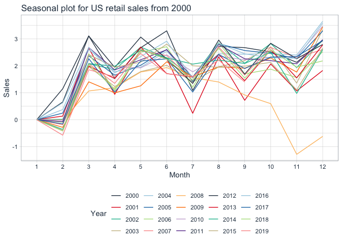
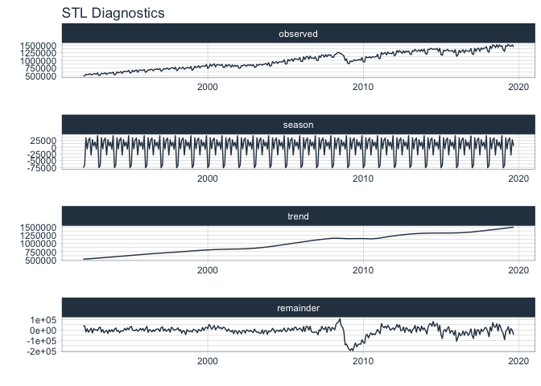
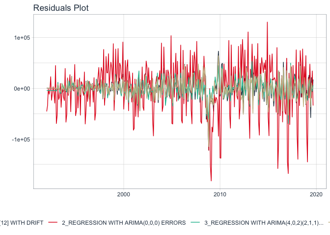

Retail\_sales\_prediction
================
Chung-Hao Lee
8/22/2021

``` r
### Setting up environment
library("tidyverse")
```

    ## ── Attaching packages ─────────────────────────────────────── tidyverse 1.3.1 ──

    ## ✓ ggplot2 3.3.5     ✓ purrr   0.3.4
    ## ✓ tibble  3.1.2     ✓ dplyr   1.0.7
    ## ✓ tidyr   1.1.3     ✓ stringr 1.4.0
    ## ✓ readr   1.4.0     ✓ forcats 0.5.1

    ## ── Conflicts ────────────────────────────────────────── tidyverse_conflicts() ──
    ## x dplyr::filter() masks stats::filter()
    ## x dplyr::lag()    masks stats::lag()

``` r
library("tidymodels")
```

    ## ── Attaching packages ────────────────────────────────────── tidymodels 0.1.2 ──

    ## ✓ broom     0.7.8      ✓ recipes   0.1.15
    ## ✓ dials     0.0.9      ✓ rsample   0.1.1 
    ## ✓ infer     0.5.4      ✓ tune      0.1.6 
    ## ✓ modeldata 0.1.0      ✓ workflows 0.2.4 
    ## ✓ parsnip   0.1.5      ✓ yardstick 0.0.8

    ## ── Conflicts ───────────────────────────────────────── tidymodels_conflicts() ──
    ## x scales::discard() masks purrr::discard()
    ## x dplyr::filter()   masks stats::filter()
    ## x recipes::fixed()  masks stringr::fixed()
    ## x dplyr::lag()      masks stats::lag()
    ## x yardstick::spec() masks readr::spec()
    ## x recipes::step()   masks stats::step()

``` r
library("timetk")
library("modeltime")
library("patchwork")
```

``` r
knitr::opts_chunk$set(
  collapse = TRUE, 
  comment = "#>",
  fig.path = "fig/figures/README-",
  out.width = "100%",
  message=FALSE, 
  warning=FALSE
)
```

``` r
### Loading dataset

####Total Business Sales, Not Seasonally Adjusted
df_sales <- 
  read_csv("/Users/yginger/Desktop/GitHub_repo/Data Analytics/Time Series/Retail sales prediction/Inventory and sales dataset/TOTBUSSMNSA.csv") %>% 
  select(-c(realtime_start, realtime_end)) %>% 
  rename(sales = value) %>% 
  mutate(trend = row_number(),
         quarter = as.factor(lubridate::quarter(date)),
         month = as.factor(lubridate::month(date)))

df_inv <- 
  read_csv("/Users/yginger/Desktop/GitHub_repo/Data Analytics/Time Series/Retail sales prediction/Inventory and sales dataset/TOTBUSIMNSA.csv") %>% 
  select(-c(realtime_start, realtime_end))%>% 
  rename(inv = value) %>% 
  mutate(trend = row_number(),
         quarter = as.factor(lubridate::quarter(date)),
         month = as.factor(lubridate::month(date)))

str(df_sales)
#> tibble [333 × 5] (S3: tbl_df/tbl/data.frame)
#>  $ sales  : num [1:333] 478951 496844 542833 533768 537400 ...
#>  $ date   : Date[1:333], format: "1992-01-01" "1992-02-01" ...
#>  $ trend  : int [1:333] 1 2 3 4 5 6 7 8 9 10 ...
#>  $ quarter: Factor w/ 4 levels "1","2","3","4": 1 1 1 2 2 2 3 3 3 4 ...
#>  $ month  : Factor w/ 12 levels "1","2","3","4",..: 1 2 3 4 5 6 7 8 9 10 ...
str(df_inv)
#> tibble [333 × 5] (S3: tbl_df/tbl/data.frame)
#>  $ inv    : num [1:333] 802948 809329 813301 819247 815688 ...
#>  $ date   : Date[1:333], format: "1992-01-01" "1992-02-01" ...
#>  $ trend  : int [1:333] 1 2 3 4 5 6 7 8 9 10 ...
#>  $ quarter: Factor w/ 4 levels "1","2","3","4": 1 1 1 2 2 2 3 3 3 4 ...
#>  $ month  : Factor w/ 12 levels "1","2","3","4",..: 1 2 3 4 5 6 7 8 9 10 ...
```

``` r
### Plot sales and inv
df_sales %>% 
  plot_time_series(date, sales, .smooth=FALSE, .plotly_slider = T, .title = "Sales")
```

<div id="htmlwidget-1a86ea92a87a6df31433" style="width:100%;height:480px;" class="plotly html-widget"></div>
<script type="application/json" data-for="htmlwidget-1a86ea92a87a6df31433">{"x":{"data":[{"x":["1992-01-01","1992-02-01","1992-03-01","1992-04-01","1992-05-01","1992-06-01","1992-07-01","1992-08-01","1992-09-01","1992-10-01","1992-11-01","1992-12-01","1993-01-01","1993-02-01","1993-03-01","1993-04-01","1993-05-01","1993-06-01","1993-07-01","1993-08-01","1993-09-01","1993-10-01","1993-11-01","1993-12-01","1994-01-01","1994-02-01","1994-03-01","1994-04-01","1994-05-01","1994-06-01","1994-07-01","1994-08-01","1994-09-01","1994-10-01","1994-11-01","1994-12-01","1995-01-01","1995-02-01","1995-03-01","1995-04-01","1995-05-01","1995-06-01","1995-07-01","1995-08-01","1995-09-01","1995-10-01","1995-11-01","1995-12-01","1996-01-01","1996-02-01","1996-03-01","1996-04-01","1996-05-01","1996-06-01","1996-07-01","1996-08-01","1996-09-01","1996-10-01","1996-11-01","1996-12-01","1997-01-01","1997-02-01","1997-03-01","1997-04-01","1997-05-01","1997-06-01","1997-07-01","1997-08-01","1997-09-01","1997-10-01","1997-11-01","1997-12-01","1998-01-01","1998-02-01","1998-03-01","1998-04-01","1998-05-01","1998-06-01","1998-07-01","1998-08-01","1998-09-01","1998-10-01","1998-11-01","1998-12-01","1999-01-01","1999-02-01","1999-03-01","1999-04-01","1999-05-01","1999-06-01","1999-07-01","1999-08-01","1999-09-01","1999-10-01","1999-11-01","1999-12-01","2000-01-01","2000-02-01","2000-03-01","2000-04-01","2000-05-01","2000-06-01","2000-07-01","2000-08-01","2000-09-01","2000-10-01","2000-11-01","2000-12-01","2001-01-01","2001-02-01","2001-03-01","2001-04-01","2001-05-01","2001-06-01","2001-07-01","2001-08-01","2001-09-01","2001-10-01","2001-11-01","2001-12-01","2002-01-01","2002-02-01","2002-03-01","2002-04-01","2002-05-01","2002-06-01","2002-07-01","2002-08-01","2002-09-01","2002-10-01","2002-11-01","2002-12-01","2003-01-01","2003-02-01","2003-03-01","2003-04-01","2003-05-01","2003-06-01","2003-07-01","2003-08-01","2003-09-01","2003-10-01","2003-11-01","2003-12-01","2004-01-01","2004-02-01","2004-03-01","2004-04-01","2004-05-01","2004-06-01","2004-07-01","2004-08-01","2004-09-01","2004-10-01","2004-11-01","2004-12-01","2005-01-01","2005-02-01","2005-03-01","2005-04-01","2005-05-01","2005-06-01","2005-07-01","2005-08-01","2005-09-01","2005-10-01","2005-11-01","2005-12-01","2006-01-01","2006-02-01","2006-03-01","2006-04-01","2006-05-01","2006-06-01","2006-07-01","2006-08-01","2006-09-01","2006-10-01","2006-11-01","2006-12-01","2007-01-01","2007-02-01","2007-03-01","2007-04-01","2007-05-01","2007-06-01","2007-07-01","2007-08-01","2007-09-01","2007-10-01","2007-11-01","2007-12-01","2008-01-01","2008-02-01","2008-03-01","2008-04-01","2008-05-01","2008-06-01","2008-07-01","2008-08-01","2008-09-01","2008-10-01","2008-11-01","2008-12-01","2009-01-01","2009-02-01","2009-03-01","2009-04-01","2009-05-01","2009-06-01","2009-07-01","2009-08-01","2009-09-01","2009-10-01","2009-11-01","2009-12-01","2010-01-01","2010-02-01","2010-03-01","2010-04-01","2010-05-01","2010-06-01","2010-07-01","2010-08-01","2010-09-01","2010-10-01","2010-11-01","2010-12-01","2011-01-01","2011-02-01","2011-03-01","2011-04-01","2011-05-01","2011-06-01","2011-07-01","2011-08-01","2011-09-01","2011-10-01","2011-11-01","2011-12-01","2012-01-01","2012-02-01","2012-03-01","2012-04-01","2012-05-01","2012-06-01","2012-07-01","2012-08-01","2012-09-01","2012-10-01","2012-11-01","2012-12-01","2013-01-01","2013-02-01","2013-03-01","2013-04-01","2013-05-01","2013-06-01","2013-07-01","2013-08-01","2013-09-01","2013-10-01","2013-11-01","2013-12-01","2014-01-01","2014-02-01","2014-03-01","2014-04-01","2014-05-01","2014-06-01","2014-07-01","2014-08-01","2014-09-01","2014-10-01","2014-11-01","2014-12-01","2015-01-01","2015-02-01","2015-03-01","2015-04-01","2015-05-01","2015-06-01","2015-07-01","2015-08-01","2015-09-01","2015-10-01","2015-11-01","2015-12-01","2016-01-01","2016-02-01","2016-03-01","2016-04-01","2016-05-01","2016-06-01","2016-07-01","2016-08-01","2016-09-01","2016-10-01","2016-11-01","2016-12-01","2017-01-01","2017-02-01","2017-03-01","2017-04-01","2017-05-01","2017-06-01","2017-07-01","2017-08-01","2017-09-01","2017-10-01","2017-11-01","2017-12-01","2018-01-01","2018-02-01","2018-03-01","2018-04-01","2018-05-01","2018-06-01","2018-07-01","2018-08-01","2018-09-01","2018-10-01","2018-11-01","2018-12-01","2019-01-01","2019-02-01","2019-03-01","2019-04-01","2019-05-01","2019-06-01","2019-07-01","2019-08-01","2019-09-01"],"y":[478951,496844,542833,533768,537400,565572,526186,539854,560404,566566,545761,588252,501102,519670,577660,562473,568082,592054,541465,571966,587293,587643,582479,614453,523199,548442,622218,589743,606190,634299,570383,637290,638551,637472,636597,673862,583576,602657,671889,629789,665344,688374,610456,678051,677370,678823,671241,698703,608890,640408,687749,676459,705129,701473,661061,704489,703818,724199,700035,729370,648926,670542,733003,714436,728181,746888,699834,728842,755266,760523,718354,776516,665199,691649,766470,739466,743025,776742,710372,738979,765522,769652,740557,801062,674466,713828,808436,767844,782025,823830,752260,807053,819724,808320,808880,867470,736418,788463,877235,805781,857443,885803,785590,859519,857579,850389,832885,869309,770101,774650,861015,802263,859272,847650,778233,849942,794715,840896,806627,832555,744727,745345,829099,820175,854262,837932,809140,860703,829824,859516,823197,864883,782576,774935,868823,836394,860695,870860,843766,868323,878500,900758,841965,928806,806952,829190,960775,912194,921875,956686,900073,951366,950275,951949,948465,1022229,877196,893159,1031375,984751,1008702,1046772,969379,1060651,1044233,1037682,1024483,1091473,965506,959851,1115019,1031250,1118661,1130766,1038883,1138855,1069221,1080005,1060801,1119564,1004913,992297,1147403,1097282,1180260,1168094,1104920,1189734,1118575,1188692,1162536,1183406,1102069,1101336,1190154,1200214,1248440,1261888,1230917,1217705,1177945,1151293,995875,1050830,904169,888602,981431,958933,973259,1022271,991381,1012041,1009141,1029979,1001333,1093088,951062,949431,1123147,1091719,1088264,1123062,1077804,1118983,1109883,1116388,1117840,1199101,1064238,1058756,1262255,1200658,1228496,1255922,1180494,1270590,1231223,1226096,1217572,1283622,1151724,1188357,1324537,1259670,1322352,1277521,1226635,1316191,1245759,1309499,1277636,1307099,1210648,1187803,1321704,1295984,1361135,1306192,1299223,1345790,1291515,1355695,1297390,1365666,1225353,1201463,1362721,1356229,1395490,1376786,1361480,1371342,1362996,1390493,1289691,1397135,1188135,1163047,1337078,1308449,1320025,1361341,1311726,1308315,1310928,1319501,1256477,1352427,1132062,1178195,1328136,1258874,1303627,1345375,1244691,1339544,1311068,1300221,1299036,1394124,1212072,1199428,1395824,1295177,1388818,1395219,1295418,1408702,1366121,1400605,1402076,1450248,1301540,1268131,1465708,1392168,1510073,1481626,1418556,1513695,1425043,1509212,1457737,1476316,1339535,1295651,1481095,1461158,1527171,1469759,1461851,1508278,1446291],"text":["date: 1992-01-01<br />.value:  478951","date: 1992-02-01<br />.value:  496844","date: 1992-03-01<br />.value:  542833","date: 1992-04-01<br />.value:  533768","date: 1992-05-01<br />.value:  537400","date: 1992-06-01<br />.value:  565572","date: 1992-07-01<br />.value:  526186","date: 1992-08-01<br />.value:  539854","date: 1992-09-01<br />.value:  560404","date: 1992-10-01<br />.value:  566566","date: 1992-11-01<br />.value:  545761","date: 1992-12-01<br />.value:  588252","date: 1993-01-01<br />.value:  501102","date: 1993-02-01<br />.value:  519670","date: 1993-03-01<br />.value:  577660","date: 1993-04-01<br />.value:  562473","date: 1993-05-01<br />.value:  568082","date: 1993-06-01<br />.value:  592054","date: 1993-07-01<br />.value:  541465","date: 1993-08-01<br />.value:  571966","date: 1993-09-01<br />.value:  587293","date: 1993-10-01<br />.value:  587643","date: 1993-11-01<br />.value:  582479","date: 1993-12-01<br />.value:  614453","date: 1994-01-01<br />.value:  523199","date: 1994-02-01<br />.value:  548442","date: 1994-03-01<br />.value:  622218","date: 1994-04-01<br />.value:  589743","date: 1994-05-01<br />.value:  606190","date: 1994-06-01<br />.value:  634299","date: 1994-07-01<br />.value:  570383","date: 1994-08-01<br />.value:  637290","date: 1994-09-01<br />.value:  638551","date: 1994-10-01<br />.value:  637472","date: 1994-11-01<br />.value:  636597","date: 1994-12-01<br />.value:  673862","date: 1995-01-01<br />.value:  583576","date: 1995-02-01<br />.value:  602657","date: 1995-03-01<br />.value:  671889","date: 1995-04-01<br />.value:  629789","date: 1995-05-01<br />.value:  665344","date: 1995-06-01<br />.value:  688374","date: 1995-07-01<br />.value:  610456","date: 1995-08-01<br />.value:  678051","date: 1995-09-01<br />.value:  677370","date: 1995-10-01<br />.value:  678823","date: 1995-11-01<br />.value:  671241","date: 1995-12-01<br />.value:  698703","date: 1996-01-01<br />.value:  608890","date: 1996-02-01<br />.value:  640408","date: 1996-03-01<br />.value:  687749","date: 1996-04-01<br />.value:  676459","date: 1996-05-01<br />.value:  705129","date: 1996-06-01<br />.value:  701473","date: 1996-07-01<br />.value:  661061","date: 1996-08-01<br />.value:  704489","date: 1996-09-01<br />.value:  703818","date: 1996-10-01<br />.value:  724199","date: 1996-11-01<br />.value:  700035","date: 1996-12-01<br />.value:  729370","date: 1997-01-01<br />.value:  648926","date: 1997-02-01<br />.value:  670542","date: 1997-03-01<br />.value:  733003","date: 1997-04-01<br />.value:  714436","date: 1997-05-01<br />.value:  728181","date: 1997-06-01<br />.value:  746888","date: 1997-07-01<br />.value:  699834","date: 1997-08-01<br />.value:  728842","date: 1997-09-01<br />.value:  755266","date: 1997-10-01<br />.value:  760523","date: 1997-11-01<br />.value:  718354","date: 1997-12-01<br />.value:  776516","date: 1998-01-01<br />.value:  665199","date: 1998-02-01<br />.value:  691649","date: 1998-03-01<br />.value:  766470","date: 1998-04-01<br />.value:  739466","date: 1998-05-01<br />.value:  743025","date: 1998-06-01<br />.value:  776742","date: 1998-07-01<br />.value:  710372","date: 1998-08-01<br />.value:  738979","date: 1998-09-01<br />.value:  765522","date: 1998-10-01<br />.value:  769652","date: 1998-11-01<br />.value:  740557","date: 1998-12-01<br />.value:  801062","date: 1999-01-01<br />.value:  674466","date: 1999-02-01<br />.value:  713828","date: 1999-03-01<br />.value:  808436","date: 1999-04-01<br />.value:  767844","date: 1999-05-01<br />.value:  782025","date: 1999-06-01<br />.value:  823830","date: 1999-07-01<br />.value:  752260","date: 1999-08-01<br />.value:  807053","date: 1999-09-01<br />.value:  819724","date: 1999-10-01<br />.value:  808320","date: 1999-11-01<br />.value:  808880","date: 1999-12-01<br />.value:  867470","date: 2000-01-01<br />.value:  736418","date: 2000-02-01<br />.value:  788463","date: 2000-03-01<br />.value:  877235","date: 2000-04-01<br />.value:  805781","date: 2000-05-01<br />.value:  857443","date: 2000-06-01<br />.value:  885803","date: 2000-07-01<br />.value:  785590","date: 2000-08-01<br />.value:  859519","date: 2000-09-01<br />.value:  857579","date: 2000-10-01<br />.value:  850389","date: 2000-11-01<br />.value:  832885","date: 2000-12-01<br />.value:  869309","date: 2001-01-01<br />.value:  770101","date: 2001-02-01<br />.value:  774650","date: 2001-03-01<br />.value:  861015","date: 2001-04-01<br />.value:  802263","date: 2001-05-01<br />.value:  859272","date: 2001-06-01<br />.value:  847650","date: 2001-07-01<br />.value:  778233","date: 2001-08-01<br />.value:  849942","date: 2001-09-01<br />.value:  794715","date: 2001-10-01<br />.value:  840896","date: 2001-11-01<br />.value:  806627","date: 2001-12-01<br />.value:  832555","date: 2002-01-01<br />.value:  744727","date: 2002-02-01<br />.value:  745345","date: 2002-03-01<br />.value:  829099","date: 2002-04-01<br />.value:  820175","date: 2002-05-01<br />.value:  854262","date: 2002-06-01<br />.value:  837932","date: 2002-07-01<br />.value:  809140","date: 2002-08-01<br />.value:  860703","date: 2002-09-01<br />.value:  829824","date: 2002-10-01<br />.value:  859516","date: 2002-11-01<br />.value:  823197","date: 2002-12-01<br />.value:  864883","date: 2003-01-01<br />.value:  782576","date: 2003-02-01<br />.value:  774935","date: 2003-03-01<br />.value:  868823","date: 2003-04-01<br />.value:  836394","date: 2003-05-01<br />.value:  860695","date: 2003-06-01<br />.value:  870860","date: 2003-07-01<br />.value:  843766","date: 2003-08-01<br />.value:  868323","date: 2003-09-01<br />.value:  878500","date: 2003-10-01<br />.value:  900758","date: 2003-11-01<br />.value:  841965","date: 2003-12-01<br />.value:  928806","date: 2004-01-01<br />.value:  806952","date: 2004-02-01<br />.value:  829190","date: 2004-03-01<br />.value:  960775","date: 2004-04-01<br />.value:  912194","date: 2004-05-01<br />.value:  921875","date: 2004-06-01<br />.value:  956686","date: 2004-07-01<br />.value:  900073","date: 2004-08-01<br />.value:  951366","date: 2004-09-01<br />.value:  950275","date: 2004-10-01<br />.value:  951949","date: 2004-11-01<br />.value:  948465","date: 2004-12-01<br />.value: 1022229","date: 2005-01-01<br />.value:  877196","date: 2005-02-01<br />.value:  893159","date: 2005-03-01<br />.value: 1031375","date: 2005-04-01<br />.value:  984751","date: 2005-05-01<br />.value: 1008702","date: 2005-06-01<br />.value: 1046772","date: 2005-07-01<br />.value:  969379","date: 2005-08-01<br />.value: 1060651","date: 2005-09-01<br />.value: 1044233","date: 2005-10-01<br />.value: 1037682","date: 2005-11-01<br />.value: 1024483","date: 2005-12-01<br />.value: 1091473","date: 2006-01-01<br />.value:  965506","date: 2006-02-01<br />.value:  959851","date: 2006-03-01<br />.value: 1115019","date: 2006-04-01<br />.value: 1031250","date: 2006-05-01<br />.value: 1118661","date: 2006-06-01<br />.value: 1130766","date: 2006-07-01<br />.value: 1038883","date: 2006-08-01<br />.value: 1138855","date: 2006-09-01<br />.value: 1069221","date: 2006-10-01<br />.value: 1080005","date: 2006-11-01<br />.value: 1060801","date: 2006-12-01<br />.value: 1119564","date: 2007-01-01<br />.value: 1004913","date: 2007-02-01<br />.value:  992297","date: 2007-03-01<br />.value: 1147403","date: 2007-04-01<br />.value: 1097282","date: 2007-05-01<br />.value: 1180260","date: 2007-06-01<br />.value: 1168094","date: 2007-07-01<br />.value: 1104920","date: 2007-08-01<br />.value: 1189734","date: 2007-09-01<br />.value: 1118575","date: 2007-10-01<br />.value: 1188692","date: 2007-11-01<br />.value: 1162536","date: 2007-12-01<br />.value: 1183406","date: 2008-01-01<br />.value: 1102069","date: 2008-02-01<br />.value: 1101336","date: 2008-03-01<br />.value: 1190154","date: 2008-04-01<br />.value: 1200214","date: 2008-05-01<br />.value: 1248440","date: 2008-06-01<br />.value: 1261888","date: 2008-07-01<br />.value: 1230917","date: 2008-08-01<br />.value: 1217705","date: 2008-09-01<br />.value: 1177945","date: 2008-10-01<br />.value: 1151293","date: 2008-11-01<br />.value:  995875","date: 2008-12-01<br />.value: 1050830","date: 2009-01-01<br />.value:  904169","date: 2009-02-01<br />.value:  888602","date: 2009-03-01<br />.value:  981431","date: 2009-04-01<br />.value:  958933","date: 2009-05-01<br />.value:  973259","date: 2009-06-01<br />.value: 1022271","date: 2009-07-01<br />.value:  991381","date: 2009-08-01<br />.value: 1012041","date: 2009-09-01<br />.value: 1009141","date: 2009-10-01<br />.value: 1029979","date: 2009-11-01<br />.value: 1001333","date: 2009-12-01<br />.value: 1093088","date: 2010-01-01<br />.value:  951062","date: 2010-02-01<br />.value:  949431","date: 2010-03-01<br />.value: 1123147","date: 2010-04-01<br />.value: 1091719","date: 2010-05-01<br />.value: 1088264","date: 2010-06-01<br />.value: 1123062","date: 2010-07-01<br />.value: 1077804","date: 2010-08-01<br />.value: 1118983","date: 2010-09-01<br />.value: 1109883","date: 2010-10-01<br />.value: 1116388","date: 2010-11-01<br />.value: 1117840","date: 2010-12-01<br />.value: 1199101","date: 2011-01-01<br />.value: 1064238","date: 2011-02-01<br />.value: 1058756","date: 2011-03-01<br />.value: 1262255","date: 2011-04-01<br />.value: 1200658","date: 2011-05-01<br />.value: 1228496","date: 2011-06-01<br />.value: 1255922","date: 2011-07-01<br />.value: 1180494","date: 2011-08-01<br />.value: 1270590","date: 2011-09-01<br />.value: 1231223","date: 2011-10-01<br />.value: 1226096","date: 2011-11-01<br />.value: 1217572","date: 2011-12-01<br />.value: 1283622","date: 2012-01-01<br />.value: 1151724","date: 2012-02-01<br />.value: 1188357","date: 2012-03-01<br />.value: 1324537","date: 2012-04-01<br />.value: 1259670","date: 2012-05-01<br />.value: 1322352","date: 2012-06-01<br />.value: 1277521","date: 2012-07-01<br />.value: 1226635","date: 2012-08-01<br />.value: 1316191","date: 2012-09-01<br />.value: 1245759","date: 2012-10-01<br />.value: 1309499","date: 2012-11-01<br />.value: 1277636","date: 2012-12-01<br />.value: 1307099","date: 2013-01-01<br />.value: 1210648","date: 2013-02-01<br />.value: 1187803","date: 2013-03-01<br />.value: 1321704","date: 2013-04-01<br />.value: 1295984","date: 2013-05-01<br />.value: 1361135","date: 2013-06-01<br />.value: 1306192","date: 2013-07-01<br />.value: 1299223","date: 2013-08-01<br />.value: 1345790","date: 2013-09-01<br />.value: 1291515","date: 2013-10-01<br />.value: 1355695","date: 2013-11-01<br />.value: 1297390","date: 2013-12-01<br />.value: 1365666","date: 2014-01-01<br />.value: 1225353","date: 2014-02-01<br />.value: 1201463","date: 2014-03-01<br />.value: 1362721","date: 2014-04-01<br />.value: 1356229","date: 2014-05-01<br />.value: 1395490","date: 2014-06-01<br />.value: 1376786","date: 2014-07-01<br />.value: 1361480","date: 2014-08-01<br />.value: 1371342","date: 2014-09-01<br />.value: 1362996","date: 2014-10-01<br />.value: 1390493","date: 2014-11-01<br />.value: 1289691","date: 2014-12-01<br />.value: 1397135","date: 2015-01-01<br />.value: 1188135","date: 2015-02-01<br />.value: 1163047","date: 2015-03-01<br />.value: 1337078","date: 2015-04-01<br />.value: 1308449","date: 2015-05-01<br />.value: 1320025","date: 2015-06-01<br />.value: 1361341","date: 2015-07-01<br />.value: 1311726","date: 2015-08-01<br />.value: 1308315","date: 2015-09-01<br />.value: 1310928","date: 2015-10-01<br />.value: 1319501","date: 2015-11-01<br />.value: 1256477","date: 2015-12-01<br />.value: 1352427","date: 2016-01-01<br />.value: 1132062","date: 2016-02-01<br />.value: 1178195","date: 2016-03-01<br />.value: 1328136","date: 2016-04-01<br />.value: 1258874","date: 2016-05-01<br />.value: 1303627","date: 2016-06-01<br />.value: 1345375","date: 2016-07-01<br />.value: 1244691","date: 2016-08-01<br />.value: 1339544","date: 2016-09-01<br />.value: 1311068","date: 2016-10-01<br />.value: 1300221","date: 2016-11-01<br />.value: 1299036","date: 2016-12-01<br />.value: 1394124","date: 2017-01-01<br />.value: 1212072","date: 2017-02-01<br />.value: 1199428","date: 2017-03-01<br />.value: 1395824","date: 2017-04-01<br />.value: 1295177","date: 2017-05-01<br />.value: 1388818","date: 2017-06-01<br />.value: 1395219","date: 2017-07-01<br />.value: 1295418","date: 2017-08-01<br />.value: 1408702","date: 2017-09-01<br />.value: 1366121","date: 2017-10-01<br />.value: 1400605","date: 2017-11-01<br />.value: 1402076","date: 2017-12-01<br />.value: 1450248","date: 2018-01-01<br />.value: 1301540","date: 2018-02-01<br />.value: 1268131","date: 2018-03-01<br />.value: 1465708","date: 2018-04-01<br />.value: 1392168","date: 2018-05-01<br />.value: 1510073","date: 2018-06-01<br />.value: 1481626","date: 2018-07-01<br />.value: 1418556","date: 2018-08-01<br />.value: 1513695","date: 2018-09-01<br />.value: 1425043","date: 2018-10-01<br />.value: 1509212","date: 2018-11-01<br />.value: 1457737","date: 2018-12-01<br />.value: 1476316","date: 2019-01-01<br />.value: 1339535","date: 2019-02-01<br />.value: 1295651","date: 2019-03-01<br />.value: 1481095","date: 2019-04-01<br />.value: 1461158","date: 2019-05-01<br />.value: 1527171","date: 2019-06-01<br />.value: 1469759","date: 2019-07-01<br />.value: 1461851","date: 2019-08-01<br />.value: 1508278","date: 2019-09-01<br />.value: 1446291"],"type":"scatter","mode":"lines","line":{"width":1.88976377952756,"color":"rgba(44,62,80,1)","dash":"solid"},"hoveron":"points","showlegend":false,"xaxis":"x","yaxis":"y","hoverinfo":"text","frame":null}],"layout":{"margin":{"t":43.7625570776256,"r":7.30593607305936,"b":25.5707762557078,"l":51.8721461187215},"plot_bgcolor":"rgba(255,255,255,1)","paper_bgcolor":"rgba(255,255,255,1)","font":{"color":"rgba(44,62,80,1)","family":"","size":14.6118721461187},"title":{"text":"Sales","font":{"color":"rgba(44,62,80,1)","family":"","size":17.5342465753425},"x":0,"xref":"paper"},"xaxis":{"domain":[0,1],"automargin":true,"type":"date","autorange":true,"range":["1990-08-13","2021-01-18"],"tickmode":"auto","ticktext":["2000","2010","2020"],"tickvals":[10957,14610,18262],"categoryorder":"array","categoryarray":["2000","2010","2020"],"nticks":null,"ticks":"outside","tickcolor":"rgba(204,204,204,1)","ticklen":3.65296803652968,"tickwidth":0.22139200221392,"showticklabels":true,"tickfont":{"color":"rgba(44,62,80,1)","family":"","size":11.689497716895},"tickangle":-0,"showline":false,"linecolor":null,"linewidth":0,"showgrid":true,"gridcolor":"rgba(204,204,204,1)","gridwidth":0.22139200221392,"zeroline":false,"anchor":"y","title":{"text":"","font":{"color":"rgba(44,62,80,1)","family":"","size":14.6118721461187}},"hoverformat":".2f","rangeslider":{"type":"date"}},"yaxis":{"domain":[0,1],"automargin":true,"type":"linear","autorange":true,"range":[426540,1579582],"tickmode":"auto","ticktext":["500000","750000","1000000","1250000","1500000"],"tickvals":[500000,750000,1000000,1250000,1500000],"categoryorder":"array","categoryarray":["500000","750000","1000000","1250000","1500000"],"nticks":null,"ticks":"outside","tickcolor":"rgba(204,204,204,1)","ticklen":3.65296803652968,"tickwidth":0.22139200221392,"showticklabels":true,"tickfont":{"color":"rgba(44,62,80,1)","family":"","size":11.689497716895},"tickangle":-0,"showline":false,"linecolor":null,"linewidth":0,"showgrid":true,"gridcolor":"rgba(204,204,204,1)","gridwidth":0.22139200221392,"zeroline":false,"anchor":"x","title":{"text":"","font":{"color":"rgba(44,62,80,1)","family":"","size":14.6118721461187}},"hoverformat":".2f"},"shapes":[{"type":"rect","fillcolor":"transparent","line":{"color":"rgba(44,62,80,1)","width":0.33208800332088,"linetype":"solid"},"yref":"paper","xref":"paper","x0":0,"x1":1,"y0":0,"y1":1}],"showlegend":false,"legend":{"bgcolor":"rgba(255,255,255,1)","bordercolor":"transparent","borderwidth":1.88976377952756,"font":{"color":"rgba(44,62,80,1)","family":"","size":11.689497716895}},"hovermode":"closest","barmode":"relative"},"config":{"doubleClick":"reset","showSendToCloud":false},"source":"A","attrs":{"93a2ecf7419":{"x":{},"y":{},"type":"scatter"}},"cur_data":"93a2ecf7419","visdat":{"93a2ecf7419":["function (y) ","x"]},"highlight":{"on":"plotly_click","persistent":false,"dynamic":false,"selectize":false,"opacityDim":0.2,"selected":{"opacity":1},"debounce":0},"shinyEvents":["plotly_hover","plotly_click","plotly_selected","plotly_relayout","plotly_brushed","plotly_brushing","plotly_clickannotation","plotly_doubleclick","plotly_deselect","plotly_afterplot","plotly_sunburstclick"],"base_url":"https://plot.ly"},"evals":[],"jsHooks":[]}</script>

df_inv %>% 
  plot_time_series(date, inv, .smooth=FALSE, .plotly_slider = T, .title = "Inventory")
<div id="htmlwidget-5abf360a3ca9acbfbc81" style="width:100%;height:480px;" class="plotly html-widget"></div>
<script type="application/json" data-for="htmlwidget-5abf360a3ca9acbfbc81">{"x":{"data":[{"x":["1992-01-01","1992-02-01","1992-03-01","1992-04-01","1992-05-01","1992-06-01","1992-07-01","1992-08-01","1992-09-01","1992-10-01","1992-11-01","1992-12-01","1993-01-01","1993-02-01","1993-03-01","1993-04-01","1993-05-01","1993-06-01","1993-07-01","1993-08-01","1993-09-01","1993-10-01","1993-11-01","1993-12-01","1994-01-01","1994-02-01","1994-03-01","1994-04-01","1994-05-01","1994-06-01","1994-07-01","1994-08-01","1994-09-01","1994-10-01","1994-11-01","1994-12-01","1995-01-01","1995-02-01","1995-03-01","1995-04-01","1995-05-01","1995-06-01","1995-07-01","1995-08-01","1995-09-01","1995-10-01","1995-11-01","1995-12-01","1996-01-01","1996-02-01","1996-03-01","1996-04-01","1996-05-01","1996-06-01","1996-07-01","1996-08-01","1996-09-01","1996-10-01","1996-11-01","1996-12-01","1997-01-01","1997-02-01","1997-03-01","1997-04-01","1997-05-01","1997-06-01","1997-07-01","1997-08-01","1997-09-01","1997-10-01","1997-11-01","1997-12-01","1998-01-01","1998-02-01","1998-03-01","1998-04-01","1998-05-01","1998-06-01","1998-07-01","1998-08-01","1998-09-01","1998-10-01","1998-11-01","1998-12-01","1999-01-01","1999-02-01","1999-03-01","1999-04-01","1999-05-01","1999-06-01","1999-07-01","1999-08-01","1999-09-01","1999-10-01","1999-11-01","1999-12-01","2000-01-01","2000-02-01","2000-03-01","2000-04-01","2000-05-01","2000-06-01","2000-07-01","2000-08-01","2000-09-01","2000-10-01","2000-11-01","2000-12-01","2001-01-01","2001-02-01","2001-03-01","2001-04-01","2001-05-01","2001-06-01","2001-07-01","2001-08-01","2001-09-01","2001-10-01","2001-11-01","2001-12-01","2002-01-01","2002-02-01","2002-03-01","2002-04-01","2002-05-01","2002-06-01","2002-07-01","2002-08-01","2002-09-01","2002-10-01","2002-11-01","2002-12-01","2003-01-01","2003-02-01","2003-03-01","2003-04-01","2003-05-01","2003-06-01","2003-07-01","2003-08-01","2003-09-01","2003-10-01","2003-11-01","2003-12-01","2004-01-01","2004-02-01","2004-03-01","2004-04-01","2004-05-01","2004-06-01","2004-07-01","2004-08-01","2004-09-01","2004-10-01","2004-11-01","2004-12-01","2005-01-01","2005-02-01","2005-03-01","2005-04-01","2005-05-01","2005-06-01","2005-07-01","2005-08-01","2005-09-01","2005-10-01","2005-11-01","2005-12-01","2006-01-01","2006-02-01","2006-03-01","2006-04-01","2006-05-01","2006-06-01","2006-07-01","2006-08-01","2006-09-01","2006-10-01","2006-11-01","2006-12-01","2007-01-01","2007-02-01","2007-03-01","2007-04-01","2007-05-01","2007-06-01","2007-07-01","2007-08-01","2007-09-01","2007-10-01","2007-11-01","2007-12-01","2008-01-01","2008-02-01","2008-03-01","2008-04-01","2008-05-01","2008-06-01","2008-07-01","2008-08-01","2008-09-01","2008-10-01","2008-11-01","2008-12-01","2009-01-01","2009-02-01","2009-03-01","2009-04-01","2009-05-01","2009-06-01","2009-07-01","2009-08-01","2009-09-01","2009-10-01","2009-11-01","2009-12-01","2010-01-01","2010-02-01","2010-03-01","2010-04-01","2010-05-01","2010-06-01","2010-07-01","2010-08-01","2010-09-01","2010-10-01","2010-11-01","2010-12-01","2011-01-01","2011-02-01","2011-03-01","2011-04-01","2011-05-01","2011-06-01","2011-07-01","2011-08-01","2011-09-01","2011-10-01","2011-11-01","2011-12-01","2012-01-01","2012-02-01","2012-03-01","2012-04-01","2012-05-01","2012-06-01","2012-07-01","2012-08-01","2012-09-01","2012-10-01","2012-11-01","2012-12-01","2013-01-01","2013-02-01","2013-03-01","2013-04-01","2013-05-01","2013-06-01","2013-07-01","2013-08-01","2013-09-01","2013-10-01","2013-11-01","2013-12-01","2014-01-01","2014-02-01","2014-03-01","2014-04-01","2014-05-01","2014-06-01","2014-07-01","2014-08-01","2014-09-01","2014-10-01","2014-11-01","2014-12-01","2015-01-01","2015-02-01","2015-03-01","2015-04-01","2015-05-01","2015-06-01","2015-07-01","2015-08-01","2015-09-01","2015-10-01","2015-11-01","2015-12-01","2016-01-01","2016-02-01","2016-03-01","2016-04-01","2016-05-01","2016-06-01","2016-07-01","2016-08-01","2016-09-01","2016-10-01","2016-11-01","2016-12-01","2017-01-01","2017-02-01","2017-03-01","2017-04-01","2017-05-01","2017-06-01","2017-07-01","2017-08-01","2017-09-01","2017-10-01","2017-11-01","2017-12-01","2018-01-01","2018-02-01","2018-03-01","2018-04-01","2018-05-01","2018-06-01","2018-07-01","2018-08-01","2018-09-01","2018-10-01","2018-11-01","2018-12-01","2019-01-01","2019-02-01","2019-03-01","2019-04-01","2019-05-01","2019-06-01","2019-07-01","2019-08-01","2019-09-01"],"y":[802948,809329,813301,819247,815688,812610,817899,820061,823912,844117,850772,823633,830472,837696,845466,851007,848150,840682,841820,843790,851014,872794,881832,850662,857823,867791,869132,876216,883463,879098,886582,894296,903536,932673,944083,913178,930073,943250,951783,964551,966416,959054,963639,966512,974748,1005190,1013264,971548,985288,992520,989270,997607,993342,981384,987780,989675,996161,1026552,1032049,990236,1001594,1011593,1010703,1020615,1018096,1012936,1016327,1017650,1029939,1061105,1068905,1031141,1042099,1055958,1060445,1067950,1060760,1049957,1053376,1056507,1067240,1097690,1107522,1062675,1071035,1082979,1090302,1098322,1094943,1086975,1091848,1094423,1107696,1141338,1159390,1121998,1134371,1146568,1150610,1162620,1162809,1162473,1162945,1171166,1178706,1216296,1229002,1180188,1191951,1191439,1186330,1189533,1180738,1161695,1152536,1150828,1152421,1165237,1157597,1103923,1111640,1112071,1109602,1111506,1108397,1102590,1106888,1107788,1123981,1155466,1163421,1124357,1133336,1148853,1152247,1155995,1143502,1132545,1127423,1119164,1132069,1167310,1176290,1133494,1142349,1159588,1172616,1182818,1181878,1186159,1194192,1201482,1211812,1248972,1269840,1225450,1245168,1261228,1272998,1281111,1273841,1266265,1259652,1262073,1279664,1316722,1332567,1296279,1314928,1326292,1342439,1354566,1361158,1366616,1371049,1378410,1394671,1427827,1440290,1389464,1404113,1417759,1421965,1432810,1434501,1435032,1437124,1439626,1460055,1495048,1510232,1467827,1492553,1507517,1508591,1518333,1511801,1514874,1526891,1525085,1528735,1544633,1530156,1446773,1438849,1424726,1405981,1390060,1365638,1343054,1330886,1311971,1318049,1351395,1363479,1314076,1324306,1338832,1349111,1356386,1352300,1355950,1370238,1380277,1407939,1452451,1465147,1431400,1454571,1470119,1491627,1505885,1514569,1510707,1520677,1527745,1536786,1581133,1588939,1543793,1565153,1585928,1595381,1604096,1601632,1592035,1607433,1614009,1638521,1678805,1684987,1632719,1663421,1671417,1672158,1678252,1665101,1651662,1661522,1668012,1690049,1737429,1746383,1695269,1720394,1736025,1744371,1755173,1751052,1739764,1751494,1753540,1770872,1811800,1816048,1755796,1772642,1783795,1787778,1797943,1788608,1787339,1792441,1791257,1811995,1849341,1845830,1785807,1801049,1801448,1811645,1817628,1809055,1801158,1800856,1802629,1821908,1854301,1869758,1816705,1838215,1847425,1854937,1852641,1846202,1845272,1849860,1861978,1881395,1914200,1926768,1877420,1909538,1926779,1926997,1932736,1926582,1917092,1929578,1940308,1964515,2011029,2013838,1971142,2011130,2026848,2024339,2036290,2029098,2016994,2023696,2021933,2036042],"text":["date: 1992-01-01<br />.value:  802948","date: 1992-02-01<br />.value:  809329","date: 1992-03-01<br />.value:  813301","date: 1992-04-01<br />.value:  819247","date: 1992-05-01<br />.value:  815688","date: 1992-06-01<br />.value:  812610","date: 1992-07-01<br />.value:  817899","date: 1992-08-01<br />.value:  820061","date: 1992-09-01<br />.value:  823912","date: 1992-10-01<br />.value:  844117","date: 1992-11-01<br />.value:  850772","date: 1992-12-01<br />.value:  823633","date: 1993-01-01<br />.value:  830472","date: 1993-02-01<br />.value:  837696","date: 1993-03-01<br />.value:  845466","date: 1993-04-01<br />.value:  851007","date: 1993-05-01<br />.value:  848150","date: 1993-06-01<br />.value:  840682","date: 1993-07-01<br />.value:  841820","date: 1993-08-01<br />.value:  843790","date: 1993-09-01<br />.value:  851014","date: 1993-10-01<br />.value:  872794","date: 1993-11-01<br />.value:  881832","date: 1993-12-01<br />.value:  850662","date: 1994-01-01<br />.value:  857823","date: 1994-02-01<br />.value:  867791","date: 1994-03-01<br />.value:  869132","date: 1994-04-01<br />.value:  876216","date: 1994-05-01<br />.value:  883463","date: 1994-06-01<br />.value:  879098","date: 1994-07-01<br />.value:  886582","date: 1994-08-01<br />.value:  894296","date: 1994-09-01<br />.value:  903536","date: 1994-10-01<br />.value:  932673","date: 1994-11-01<br />.value:  944083","date: 1994-12-01<br />.value:  913178","date: 1995-01-01<br />.value:  930073","date: 1995-02-01<br />.value:  943250","date: 1995-03-01<br />.value:  951783","date: 1995-04-01<br />.value:  964551","date: 1995-05-01<br />.value:  966416","date: 1995-06-01<br />.value:  959054","date: 1995-07-01<br />.value:  963639","date: 1995-08-01<br />.value:  966512","date: 1995-09-01<br />.value:  974748","date: 1995-10-01<br />.value: 1005190","date: 1995-11-01<br />.value: 1013264","date: 1995-12-01<br />.value:  971548","date: 1996-01-01<br />.value:  985288","date: 1996-02-01<br />.value:  992520","date: 1996-03-01<br />.value:  989270","date: 1996-04-01<br />.value:  997607","date: 1996-05-01<br />.value:  993342","date: 1996-06-01<br />.value:  981384","date: 1996-07-01<br />.value:  987780","date: 1996-08-01<br />.value:  989675","date: 1996-09-01<br />.value:  996161","date: 1996-10-01<br />.value: 1026552","date: 1996-11-01<br />.value: 1032049","date: 1996-12-01<br />.value:  990236","date: 1997-01-01<br />.value: 1001594","date: 1997-02-01<br />.value: 1011593","date: 1997-03-01<br />.value: 1010703","date: 1997-04-01<br />.value: 1020615","date: 1997-05-01<br />.value: 1018096","date: 1997-06-01<br />.value: 1012936","date: 1997-07-01<br />.value: 1016327","date: 1997-08-01<br />.value: 1017650","date: 1997-09-01<br />.value: 1029939","date: 1997-10-01<br />.value: 1061105","date: 1997-11-01<br />.value: 1068905","date: 1997-12-01<br />.value: 1031141","date: 1998-01-01<br />.value: 1042099","date: 1998-02-01<br />.value: 1055958","date: 1998-03-01<br />.value: 1060445","date: 1998-04-01<br />.value: 1067950","date: 1998-05-01<br />.value: 1060760","date: 1998-06-01<br />.value: 1049957","date: 1998-07-01<br />.value: 1053376","date: 1998-08-01<br />.value: 1056507","date: 1998-09-01<br />.value: 1067240","date: 1998-10-01<br />.value: 1097690","date: 1998-11-01<br />.value: 1107522","date: 1998-12-01<br />.value: 1062675","date: 1999-01-01<br />.value: 1071035","date: 1999-02-01<br />.value: 1082979","date: 1999-03-01<br />.value: 1090302","date: 1999-04-01<br />.value: 1098322","date: 1999-05-01<br />.value: 1094943","date: 1999-06-01<br />.value: 1086975","date: 1999-07-01<br />.value: 1091848","date: 1999-08-01<br />.value: 1094423","date: 1999-09-01<br />.value: 1107696","date: 1999-10-01<br />.value: 1141338","date: 1999-11-01<br />.value: 1159390","date: 1999-12-01<br />.value: 1121998","date: 2000-01-01<br />.value: 1134371","date: 2000-02-01<br />.value: 1146568","date: 2000-03-01<br />.value: 1150610","date: 2000-04-01<br />.value: 1162620","date: 2000-05-01<br />.value: 1162809","date: 2000-06-01<br />.value: 1162473","date: 2000-07-01<br />.value: 1162945","date: 2000-08-01<br />.value: 1171166","date: 2000-09-01<br />.value: 1178706","date: 2000-10-01<br />.value: 1216296","date: 2000-11-01<br />.value: 1229002","date: 2000-12-01<br />.value: 1180188","date: 2001-01-01<br />.value: 1191951","date: 2001-02-01<br />.value: 1191439","date: 2001-03-01<br />.value: 1186330","date: 2001-04-01<br />.value: 1189533","date: 2001-05-01<br />.value: 1180738","date: 2001-06-01<br />.value: 1161695","date: 2001-07-01<br />.value: 1152536","date: 2001-08-01<br />.value: 1150828","date: 2001-09-01<br />.value: 1152421","date: 2001-10-01<br />.value: 1165237","date: 2001-11-01<br />.value: 1157597","date: 2001-12-01<br />.value: 1103923","date: 2002-01-01<br />.value: 1111640","date: 2002-02-01<br />.value: 1112071","date: 2002-03-01<br />.value: 1109602","date: 2002-04-01<br />.value: 1111506","date: 2002-05-01<br />.value: 1108397","date: 2002-06-01<br />.value: 1102590","date: 2002-07-01<br />.value: 1106888","date: 2002-08-01<br />.value: 1107788","date: 2002-09-01<br />.value: 1123981","date: 2002-10-01<br />.value: 1155466","date: 2002-11-01<br />.value: 1163421","date: 2002-12-01<br />.value: 1124357","date: 2003-01-01<br />.value: 1133336","date: 2003-02-01<br />.value: 1148853","date: 2003-03-01<br />.value: 1152247","date: 2003-04-01<br />.value: 1155995","date: 2003-05-01<br />.value: 1143502","date: 2003-06-01<br />.value: 1132545","date: 2003-07-01<br />.value: 1127423","date: 2003-08-01<br />.value: 1119164","date: 2003-09-01<br />.value: 1132069","date: 2003-10-01<br />.value: 1167310","date: 2003-11-01<br />.value: 1176290","date: 2003-12-01<br />.value: 1133494","date: 2004-01-01<br />.value: 1142349","date: 2004-02-01<br />.value: 1159588","date: 2004-03-01<br />.value: 1172616","date: 2004-04-01<br />.value: 1182818","date: 2004-05-01<br />.value: 1181878","date: 2004-06-01<br />.value: 1186159","date: 2004-07-01<br />.value: 1194192","date: 2004-08-01<br />.value: 1201482","date: 2004-09-01<br />.value: 1211812","date: 2004-10-01<br />.value: 1248972","date: 2004-11-01<br />.value: 1269840","date: 2004-12-01<br />.value: 1225450","date: 2005-01-01<br />.value: 1245168","date: 2005-02-01<br />.value: 1261228","date: 2005-03-01<br />.value: 1272998","date: 2005-04-01<br />.value: 1281111","date: 2005-05-01<br />.value: 1273841","date: 2005-06-01<br />.value: 1266265","date: 2005-07-01<br />.value: 1259652","date: 2005-08-01<br />.value: 1262073","date: 2005-09-01<br />.value: 1279664","date: 2005-10-01<br />.value: 1316722","date: 2005-11-01<br />.value: 1332567","date: 2005-12-01<br />.value: 1296279","date: 2006-01-01<br />.value: 1314928","date: 2006-02-01<br />.value: 1326292","date: 2006-03-01<br />.value: 1342439","date: 2006-04-01<br />.value: 1354566","date: 2006-05-01<br />.value: 1361158","date: 2006-06-01<br />.value: 1366616","date: 2006-07-01<br />.value: 1371049","date: 2006-08-01<br />.value: 1378410","date: 2006-09-01<br />.value: 1394671","date: 2006-10-01<br />.value: 1427827","date: 2006-11-01<br />.value: 1440290","date: 2006-12-01<br />.value: 1389464","date: 2007-01-01<br />.value: 1404113","date: 2007-02-01<br />.value: 1417759","date: 2007-03-01<br />.value: 1421965","date: 2007-04-01<br />.value: 1432810","date: 2007-05-01<br />.value: 1434501","date: 2007-06-01<br />.value: 1435032","date: 2007-07-01<br />.value: 1437124","date: 2007-08-01<br />.value: 1439626","date: 2007-09-01<br />.value: 1460055","date: 2007-10-01<br />.value: 1495048","date: 2007-11-01<br />.value: 1510232","date: 2007-12-01<br />.value: 1467827","date: 2008-01-01<br />.value: 1492553","date: 2008-02-01<br />.value: 1507517","date: 2008-03-01<br />.value: 1508591","date: 2008-04-01<br />.value: 1518333","date: 2008-05-01<br />.value: 1511801","date: 2008-06-01<br />.value: 1514874","date: 2008-07-01<br />.value: 1526891","date: 2008-08-01<br />.value: 1525085","date: 2008-09-01<br />.value: 1528735","date: 2008-10-01<br />.value: 1544633","date: 2008-11-01<br />.value: 1530156","date: 2008-12-01<br />.value: 1446773","date: 2009-01-01<br />.value: 1438849","date: 2009-02-01<br />.value: 1424726","date: 2009-03-01<br />.value: 1405981","date: 2009-04-01<br />.value: 1390060","date: 2009-05-01<br />.value: 1365638","date: 2009-06-01<br />.value: 1343054","date: 2009-07-01<br />.value: 1330886","date: 2009-08-01<br />.value: 1311971","date: 2009-09-01<br />.value: 1318049","date: 2009-10-01<br />.value: 1351395","date: 2009-11-01<br />.value: 1363479","date: 2009-12-01<br />.value: 1314076","date: 2010-01-01<br />.value: 1324306","date: 2010-02-01<br />.value: 1338832","date: 2010-03-01<br />.value: 1349111","date: 2010-04-01<br />.value: 1356386","date: 2010-05-01<br />.value: 1352300","date: 2010-06-01<br />.value: 1355950","date: 2010-07-01<br />.value: 1370238","date: 2010-08-01<br />.value: 1380277","date: 2010-09-01<br />.value: 1407939","date: 2010-10-01<br />.value: 1452451","date: 2010-11-01<br />.value: 1465147","date: 2010-12-01<br />.value: 1431400","date: 2011-01-01<br />.value: 1454571","date: 2011-02-01<br />.value: 1470119","date: 2011-03-01<br />.value: 1491627","date: 2011-04-01<br />.value: 1505885","date: 2011-05-01<br />.value: 1514569","date: 2011-06-01<br />.value: 1510707","date: 2011-07-01<br />.value: 1520677","date: 2011-08-01<br />.value: 1527745","date: 2011-09-01<br />.value: 1536786","date: 2011-10-01<br />.value: 1581133","date: 2011-11-01<br />.value: 1588939","date: 2011-12-01<br />.value: 1543793","date: 2012-01-01<br />.value: 1565153","date: 2012-02-01<br />.value: 1585928","date: 2012-03-01<br />.value: 1595381","date: 2012-04-01<br />.value: 1604096","date: 2012-05-01<br />.value: 1601632","date: 2012-06-01<br />.value: 1592035","date: 2012-07-01<br />.value: 1607433","date: 2012-08-01<br />.value: 1614009","date: 2012-09-01<br />.value: 1638521","date: 2012-10-01<br />.value: 1678805","date: 2012-11-01<br />.value: 1684987","date: 2012-12-01<br />.value: 1632719","date: 2013-01-01<br />.value: 1663421","date: 2013-02-01<br />.value: 1671417","date: 2013-03-01<br />.value: 1672158","date: 2013-04-01<br />.value: 1678252","date: 2013-05-01<br />.value: 1665101","date: 2013-06-01<br />.value: 1651662","date: 2013-07-01<br />.value: 1661522","date: 2013-08-01<br />.value: 1668012","date: 2013-09-01<br />.value: 1690049","date: 2013-10-01<br />.value: 1737429","date: 2013-11-01<br />.value: 1746383","date: 2013-12-01<br />.value: 1695269","date: 2014-01-01<br />.value: 1720394","date: 2014-02-01<br />.value: 1736025","date: 2014-03-01<br />.value: 1744371","date: 2014-04-01<br />.value: 1755173","date: 2014-05-01<br />.value: 1751052","date: 2014-06-01<br />.value: 1739764","date: 2014-07-01<br />.value: 1751494","date: 2014-08-01<br />.value: 1753540","date: 2014-09-01<br />.value: 1770872","date: 2014-10-01<br />.value: 1811800","date: 2014-11-01<br />.value: 1816048","date: 2014-12-01<br />.value: 1755796","date: 2015-01-01<br />.value: 1772642","date: 2015-02-01<br />.value: 1783795","date: 2015-03-01<br />.value: 1787778","date: 2015-04-01<br />.value: 1797943","date: 2015-05-01<br />.value: 1788608","date: 2015-06-01<br />.value: 1787339","date: 2015-07-01<br />.value: 1792441","date: 2015-08-01<br />.value: 1791257","date: 2015-09-01<br />.value: 1811995","date: 2015-10-01<br />.value: 1849341","date: 2015-11-01<br />.value: 1845830","date: 2015-12-01<br />.value: 1785807","date: 2016-01-01<br />.value: 1801049","date: 2016-02-01<br />.value: 1801448","date: 2016-03-01<br />.value: 1811645","date: 2016-04-01<br />.value: 1817628","date: 2016-05-01<br />.value: 1809055","date: 2016-06-01<br />.value: 1801158","date: 2016-07-01<br />.value: 1800856","date: 2016-08-01<br />.value: 1802629","date: 2016-09-01<br />.value: 1821908","date: 2016-10-01<br />.value: 1854301","date: 2016-11-01<br />.value: 1869758","date: 2016-12-01<br />.value: 1816705","date: 2017-01-01<br />.value: 1838215","date: 2017-02-01<br />.value: 1847425","date: 2017-03-01<br />.value: 1854937","date: 2017-04-01<br />.value: 1852641","date: 2017-05-01<br />.value: 1846202","date: 2017-06-01<br />.value: 1845272","date: 2017-07-01<br />.value: 1849860","date: 2017-08-01<br />.value: 1861978","date: 2017-09-01<br />.value: 1881395","date: 2017-10-01<br />.value: 1914200","date: 2017-11-01<br />.value: 1926768","date: 2017-12-01<br />.value: 1877420","date: 2018-01-01<br />.value: 1909538","date: 2018-02-01<br />.value: 1926779","date: 2018-03-01<br />.value: 1926997","date: 2018-04-01<br />.value: 1932736","date: 2018-05-01<br />.value: 1926582","date: 2018-06-01<br />.value: 1917092","date: 2018-07-01<br />.value: 1929578","date: 2018-08-01<br />.value: 1940308","date: 2018-09-01<br />.value: 1964515","date: 2018-10-01<br />.value: 2011029","date: 2018-11-01<br />.value: 2013838","date: 2018-12-01<br />.value: 1971142","date: 2019-01-01<br />.value: 2011130","date: 2019-02-01<br />.value: 2026848","date: 2019-03-01<br />.value: 2024339","date: 2019-04-01<br />.value: 2036290","date: 2019-05-01<br />.value: 2029098","date: 2019-06-01<br />.value: 2016994","date: 2019-07-01<br />.value: 2023696","date: 2019-08-01<br />.value: 2021933","date: 2019-09-01<br />.value: 2036042"],"type":"scatter","mode":"lines","line":{"width":1.88976377952756,"color":"rgba(44,62,80,1)","dash":"solid"},"hoveron":"points","showlegend":false,"xaxis":"x","yaxis":"y","hoverinfo":"text","frame":null}],"layout":{"margin":{"t":43.7625570776256,"r":7.30593607305936,"b":25.5707762557078,"l":51.8721461187215},"plot_bgcolor":"rgba(255,255,255,1)","paper_bgcolor":"rgba(255,255,255,1)","font":{"color":"rgba(44,62,80,1)","family":"","size":14.6118721461187},"title":{"text":"Inventory","font":{"color":"rgba(44,62,80,1)","family":"","size":17.5342465753425},"x":0,"xref":"paper"},"xaxis":{"domain":[0,1],"automargin":true,"type":"date","autorange":true,"range":["1990-08-13","2021-01-18"],"tickmode":"auto","ticktext":["2000","2010","2020"],"tickvals":[10957,14610,18262],"categoryorder":"array","categoryarray":["2000","2010","2020"],"nticks":null,"ticks":"outside","tickcolor":"rgba(204,204,204,1)","ticklen":3.65296803652968,"tickwidth":0.22139200221392,"showticklabels":true,"tickfont":{"color":"rgba(44,62,80,1)","family":"","size":11.689497716895},"tickangle":-0,"showline":false,"linecolor":null,"linewidth":0,"showgrid":true,"gridcolor":"rgba(204,204,204,1)","gridwidth":0.22139200221392,"zeroline":false,"anchor":"y","title":{"text":"","font":{"color":"rgba(44,62,80,1)","family":"","size":14.6118721461187}},"hoverformat":".2f","rangeslider":{"type":"date"}},"yaxis":{"domain":[0,1],"automargin":true,"type":"linear","autorange":true,"range":[741280.9,2097957.1],"tickmode":"auto","ticktext":["800000","1200000","1600000","2000000"],"tickvals":[800000,1200000,1600000,2000000],"categoryorder":"array","categoryarray":["800000","1200000","1600000","2000000"],"nticks":null,"ticks":"outside","tickcolor":"rgba(204,204,204,1)","ticklen":3.65296803652968,"tickwidth":0.22139200221392,"showticklabels":true,"tickfont":{"color":"rgba(44,62,80,1)","family":"","size":11.689497716895},"tickangle":-0,"showline":false,"linecolor":null,"linewidth":0,"showgrid":true,"gridcolor":"rgba(204,204,204,1)","gridwidth":0.22139200221392,"zeroline":false,"anchor":"x","title":{"text":"","font":{"color":"rgba(44,62,80,1)","family":"","size":14.6118721461187}},"hoverformat":".2f"},"shapes":[{"type":"rect","fillcolor":"transparent","line":{"color":"rgba(44,62,80,1)","width":0.33208800332088,"linetype":"solid"},"yref":"paper","xref":"paper","x0":0,"x1":1,"y0":0,"y1":1}],"showlegend":false,"legend":{"bgcolor":"rgba(255,255,255,1)","bordercolor":"transparent","borderwidth":1.88976377952756,"font":{"color":"rgba(44,62,80,1)","family":"","size":11.689497716895}},"hovermode":"closest","barmode":"relative"},"config":{"doubleClick":"reset","showSendToCloud":false},"source":"A","attrs":{"93a1117f812":{"x":{},"y":{},"type":"scatter"}},"cur_data":"93a1117f812","visdat":{"93a1117f812":["function (y) ","x"]},"highlight":{"on":"plotly_click","persistent":false,"dynamic":false,"selectize":false,"opacityDim":0.2,"selected":{"opacity":1},"debounce":0},"shinyEvents":["plotly_hover","plotly_click","plotly_selected","plotly_relayout","plotly_brushed","plotly_brushing","plotly_clickannotation","plotly_doubleclick","plotly_deselect","plotly_afterplot","plotly_sunburstclick"],"base_url":"https://plot.ly"},"evals":[],"jsHooks":[]}</script>

-   We can see that both sales and inventory have similar patterns and
    have drops after 2008.

``` r
###Seasonal plot for US retail sales from 2000
df_sales %>% 
  filter(date >= '2000-01-01') %>% 
  group_by(lubridate::year(date)) %>% 
  mutate(sales = scale(sales) - scale(sales)[1]) %>% 
  ungroup() %>% 
  plot_time_series(month, sales, 
                   .smooth= FALSE, 
                   .color_var = lubridate::year(date), 
                   .interactive = FALSE, 
                   .color_lab = "Year", 
                   .title='Seasonal plot for US retail sales from 2000',
                   .y_lab='Sales', 
                   .x_lab='Month')
```

 \*
Excpt 2008, every sales have upward trends in a year since 2000.

``` r
# Create a seasonal subseries plot for the subset data starting from 2000

df_sales %>%
  filter(date >= '2000-01-01') %>%
  plot_time_series(
        .date = date,
        .value = sales,
        .facet_vars = month,
        .facet_ncol = 12, 
        .facet_scales = "fixed",
        .interactive = FALSE,
        .legend_show = FALSE,
        .title = "Seasonal subseries plot for US retail sales from 2000",
        .x_lab = "Year",
        .y_lab = "Sales ($ million)")  + 
        theme(axis.text.x=element_text(angle=60, hjust=1)
    )
```

 \*
We can see that in every months, sales increases since 2000.

``` r
# Create a STL decomposition plot for the full data
df_sales %>%
  plot_stl_diagnostics(
    date, sales,
    # Set features to return, desired frequency and trend
    .feature_set = c("observed", "season", "trend", "remainder"), 
    .interactive = FALSE)
```

 \*
We can see in STL plot, sales has clear seasonal pattern and upward
trend.

``` r
### ACF and PACF
df_sales%>%
  plot_acf_diagnostics(date, sales, 
                       .lags = 48,
                       .show_white_noise_bars =TRUE)
```

<div id="htmlwidget-80615ee277f8a612f716" style="width:100%;height:480px;" class="plotly html-widget"></div>
<script type="application/json" data-for="htmlwidget-80615ee277f8a612f716">{"x":{"data":[{"x":[-2.4,50.4],"y":[0,0],"text":"yintercept: 0","type":"scatter","mode":"lines","line":{"width":1.88976377952756,"color":"rgba(44,62,80,1)","dash":"solid"},"hoveron":"points","showlegend":false,"xaxis":"x","yaxis":"y","hoverinfo":"text","frame":null},{"x":[-2.4,50.4],"y":[0,0],"text":"yintercept: 0","type":"scatter","mode":"lines","line":{"width":1.88976377952756,"color":"rgba(44,62,80,1)","dash":"solid"},"hoveron":"points","showlegend":false,"xaxis":"x","yaxis":"y2","hoverinfo":"text","frame":null},{"visible":false,"showlegend":false,"xaxis":"x","yaxis":"y","hoverinfo":"text","mode":"","frame":null},{"visible":false,"showlegend":false,"xaxis":"x","yaxis":"y2","hoverinfo":"text","mode":"","frame":null},{"x":[0,1,2,3,4,5,6,7,8,9,10,11,12,13,14,15,16,17,18,19,20,21,22,23,24,25,26,27,28,29,30,31,32,33,34,35,36,37,38,39,40,41,42,43,44,45,46,47,48],"y":[1,0.961289174129012,0.948753044067539,0.943091379056935,0.921187169301932,0.916244342006519,0.908697020374217,0.89299770608103,0.880480527360717,0.881541177840983,0.865294797149534,0.857728148575818,0.871441608874263,0.833286688778779,0.821158744635756,0.813177853414271,0.791847689314481,0.787685547519071,0.779807798246033,0.764647338550753,0.754369718216987,0.753342172593638,0.738997922562851,0.733258811438955,0.745295700068501,0.712783908383076,0.702128341037747,0.695930568221341,0.678653039286245,0.675873894000794,0.669856838531897,0.65793715992515,0.649661055697742,0.649401508656739,0.639199290945743,0.634263356126874,0.647920103659611,0.620475942085953,0.609220618767798,0.605435784374077,0.590814701176234,0.58856118356479,0.584685235561662,0.575480781903231,0.566222692426845,0.568516143936248,0.560454835125521,0.554099091760233,0.568501741380211],"text":["lag:  0<br />value:  1.000000000<br />name: #2c3e50","lag:  1<br />value:  0.961289174<br />name: #2c3e50","lag:  2<br />value:  0.948753044<br />name: #2c3e50","lag:  3<br />value:  0.943091379<br />name: #2c3e50","lag:  4<br />value:  0.921187169<br />name: #2c3e50","lag:  5<br />value:  0.916244342<br />name: #2c3e50","lag:  6<br />value:  0.908697020<br />name: #2c3e50","lag:  7<br />value:  0.892997706<br />name: #2c3e50","lag:  8<br />value:  0.880480527<br />name: #2c3e50","lag:  9<br />value:  0.881541178<br />name: #2c3e50","lag: 10<br />value:  0.865294797<br />name: #2c3e50","lag: 11<br />value:  0.857728149<br />name: #2c3e50","lag: 12<br />value:  0.871441609<br />name: #2c3e50","lag: 13<br />value:  0.833286689<br />name: #2c3e50","lag: 14<br />value:  0.821158745<br />name: #2c3e50","lag: 15<br />value:  0.813177853<br />name: #2c3e50","lag: 16<br />value:  0.791847689<br />name: #2c3e50","lag: 17<br />value:  0.787685548<br />name: #2c3e50","lag: 18<br />value:  0.779807798<br />name: #2c3e50","lag: 19<br />value:  0.764647339<br />name: #2c3e50","lag: 20<br />value:  0.754369718<br />name: #2c3e50","lag: 21<br />value:  0.753342173<br />name: #2c3e50","lag: 22<br />value:  0.738997923<br />name: #2c3e50","lag: 23<br />value:  0.733258811<br />name: #2c3e50","lag: 24<br />value:  0.745295700<br />name: #2c3e50","lag: 25<br />value:  0.712783908<br />name: #2c3e50","lag: 26<br />value:  0.702128341<br />name: #2c3e50","lag: 27<br />value:  0.695930568<br />name: #2c3e50","lag: 28<br />value:  0.678653039<br />name: #2c3e50","lag: 29<br />value:  0.675873894<br />name: #2c3e50","lag: 30<br />value:  0.669856839<br />name: #2c3e50","lag: 31<br />value:  0.657937160<br />name: #2c3e50","lag: 32<br />value:  0.649661056<br />name: #2c3e50","lag: 33<br />value:  0.649401509<br />name: #2c3e50","lag: 34<br />value:  0.639199291<br />name: #2c3e50","lag: 35<br />value:  0.634263356<br />name: #2c3e50","lag: 36<br />value:  0.647920104<br />name: #2c3e50","lag: 37<br />value:  0.620475942<br />name: #2c3e50","lag: 38<br />value:  0.609220619<br />name: #2c3e50","lag: 39<br />value:  0.605435784<br />name: #2c3e50","lag: 40<br />value:  0.590814701<br />name: #2c3e50","lag: 41<br />value:  0.588561184<br />name: #2c3e50","lag: 42<br />value:  0.584685236<br />name: #2c3e50","lag: 43<br />value:  0.575480782<br />name: #2c3e50","lag: 44<br />value:  0.566222692<br />name: #2c3e50","lag: 45<br />value:  0.568516144<br />name: #2c3e50","lag: 46<br />value:  0.560454835<br />name: #2c3e50","lag: 47<br />value:  0.554099092<br />name: #2c3e50","lag: 48<br />value:  0.568501741<br />name: #2c3e50"],"type":"scatter","mode":"lines+markers","line":{"width":1.88976377952756,"color":"rgba(44,62,80,1)","dash":"solid"},"hoveron":"points","showlegend":false,"xaxis":"x","yaxis":"y","hoverinfo":"text","marker":{"autocolorscale":false,"color":"rgba(44,62,80,1)","opacity":1,"size":3.77952755905512,"symbol":"circle","line":{"width":1.88976377952756,"color":"rgba(44,62,80,1)"}},"frame":null},{"x":[0,1,2,3,4,5,6,7,8,9,10,11,12,13,14,15,16,17,18,19,20,21,22,23,24,25,26,27,28,29,30,31,32,33,34,35,36,37,38,39,40,41,42,43,44,45,46,47,48],"y":[1,0.961289174129012,0.325015180706174,0.221699784163543,-0.120579625790819,0.132174727272304,0.0515097165705769,-0.042487078785603,-0.0758501876405025,0.207612585833937,-0.0976813186034347,0.0291846563443283,0.306110772974157,-0.535142544991857,0.0187891454063638,0.0313840349829863,0.0571154700705353,0.00891734965733538,0.0495533442697168,0.0253795386424871,-0.00664677002388234,-0.0149045583812081,0.0763665072211806,0.0207360546694789,0.0808931035325744,-0.188303724120849,-0.0743209383404398,0.0456381729418862,0.0575963318842104,-0.0447141266922523,0.057018697772109,0.0540708390249993,-0.0463908044977736,-0.00155231674157956,0.0926878470966158,-0.0251136529094019,0.0847405950108836,-0.124606626335032,-0.104250480308049,0.0479370008271316,0.0341352519573742,-0.0308764485588025,0.0461185440135598,0.0661209016572706,-0.104369378941147,0.0632529093992615,0.0442679604898065,-0.0383038295762839,0.0336850826677357],"text":["lag:  0<br />value:  1.000000000<br />name: #2c3e50","lag:  1<br />value:  0.961289174<br />name: #2c3e50","lag:  2<br />value:  0.325015181<br />name: #2c3e50","lag:  3<br />value:  0.221699784<br />name: #2c3e50","lag:  4<br />value: -0.120579626<br />name: #2c3e50","lag:  5<br />value:  0.132174727<br />name: #2c3e50","lag:  6<br />value:  0.051509717<br />name: #2c3e50","lag:  7<br />value: -0.042487079<br />name: #2c3e50","lag:  8<br />value: -0.075850188<br />name: #2c3e50","lag:  9<br />value:  0.207612586<br />name: #2c3e50","lag: 10<br />value: -0.097681319<br />name: #2c3e50","lag: 11<br />value:  0.029184656<br />name: #2c3e50","lag: 12<br />value:  0.306110773<br />name: #2c3e50","lag: 13<br />value: -0.535142545<br />name: #2c3e50","lag: 14<br />value:  0.018789145<br />name: #2c3e50","lag: 15<br />value:  0.031384035<br />name: #2c3e50","lag: 16<br />value:  0.057115470<br />name: #2c3e50","lag: 17<br />value:  0.008917350<br />name: #2c3e50","lag: 18<br />value:  0.049553344<br />name: #2c3e50","lag: 19<br />value:  0.025379539<br />name: #2c3e50","lag: 20<br />value: -0.006646770<br />name: #2c3e50","lag: 21<br />value: -0.014904558<br />name: #2c3e50","lag: 22<br />value:  0.076366507<br />name: #2c3e50","lag: 23<br />value:  0.020736055<br />name: #2c3e50","lag: 24<br />value:  0.080893104<br />name: #2c3e50","lag: 25<br />value: -0.188303724<br />name: #2c3e50","lag: 26<br />value: -0.074320938<br />name: #2c3e50","lag: 27<br />value:  0.045638173<br />name: #2c3e50","lag: 28<br />value:  0.057596332<br />name: #2c3e50","lag: 29<br />value: -0.044714127<br />name: #2c3e50","lag: 30<br />value:  0.057018698<br />name: #2c3e50","lag: 31<br />value:  0.054070839<br />name: #2c3e50","lag: 32<br />value: -0.046390804<br />name: #2c3e50","lag: 33<br />value: -0.001552317<br />name: #2c3e50","lag: 34<br />value:  0.092687847<br />name: #2c3e50","lag: 35<br />value: -0.025113653<br />name: #2c3e50","lag: 36<br />value:  0.084740595<br />name: #2c3e50","lag: 37<br />value: -0.124606626<br />name: #2c3e50","lag: 38<br />value: -0.104250480<br />name: #2c3e50","lag: 39<br />value:  0.047937001<br />name: #2c3e50","lag: 40<br />value:  0.034135252<br />name: #2c3e50","lag: 41<br />value: -0.030876449<br />name: #2c3e50","lag: 42<br />value:  0.046118544<br />name: #2c3e50","lag: 43<br />value:  0.066120902<br />name: #2c3e50","lag: 44<br />value: -0.104369379<br />name: #2c3e50","lag: 45<br />value:  0.063252909<br />name: #2c3e50","lag: 46<br />value:  0.044267960<br />name: #2c3e50","lag: 47<br />value: -0.038303830<br />name: #2c3e50","lag: 48<br />value:  0.033685083<br />name: #2c3e50"],"type":"scatter","mode":"lines+markers","line":{"width":1.88976377952756,"color":"rgba(44,62,80,1)","dash":"solid"},"hoveron":"points","showlegend":false,"xaxis":"x","yaxis":"y2","hoverinfo":"text","marker":{"autocolorscale":false,"color":"rgba(44,62,80,1)","opacity":1,"size":3.77952755905512,"symbol":"circle","line":{"width":1.88976377952756,"color":"rgba(44,62,80,1)"}},"frame":null},{"x":[0,1,2,3,4,5,6,7,8,9,10,11,12,13,14,15,16,17,18,19,20,21,22,23,24,25,26,27,28,29,30,31,32,33,34,35,36,37,38,39,40,41,42,43,44,45,46,47,48],"y":[0.109599324870238,0.109599324870238,0.109599324870238,0.109599324870238,0.109599324870238,0.109599324870238,0.109599324870238,0.109599324870238,0.109599324870238,0.109599324870238,0.109599324870238,0.109599324870238,0.109599324870238,0.109599324870238,0.109599324870238,0.109599324870238,0.109599324870238,0.109599324870238,0.109599324870238,0.109599324870238,0.109599324870238,0.109599324870238,0.109599324870238,0.109599324870238,0.109599324870238,0.109599324870238,0.109599324870238,0.109599324870238,0.109599324870238,0.109599324870238,0.109599324870238,0.109599324870238,0.109599324870238,0.109599324870238,0.109599324870238,0.109599324870238,0.109599324870238,0.109599324870238,0.109599324870238,0.109599324870238,0.109599324870238,0.109599324870238,0.109599324870238,0.109599324870238,0.109599324870238,0.109599324870238,0.109599324870238,0.109599324870238,0.109599324870238],"text":[".white_noise_upper: 0.1095993<br />lag:  0<br />value: 0.1095993<br />name: #A6CEE3",".white_noise_upper: 0.1095993<br />lag:  1<br />value: 0.1095993<br />name: #A6CEE3",".white_noise_upper: 0.1095993<br />lag:  2<br />value: 0.1095993<br />name: #A6CEE3",".white_noise_upper: 0.1095993<br />lag:  3<br />value: 0.1095993<br />name: #A6CEE3",".white_noise_upper: 0.1095993<br />lag:  4<br />value: 0.1095993<br />name: #A6CEE3",".white_noise_upper: 0.1095993<br />lag:  5<br />value: 0.1095993<br />name: #A6CEE3",".white_noise_upper: 0.1095993<br />lag:  6<br />value: 0.1095993<br />name: #A6CEE3",".white_noise_upper: 0.1095993<br />lag:  7<br />value: 0.1095993<br />name: #A6CEE3",".white_noise_upper: 0.1095993<br />lag:  8<br />value: 0.1095993<br />name: #A6CEE3",".white_noise_upper: 0.1095993<br />lag:  9<br />value: 0.1095993<br />name: #A6CEE3",".white_noise_upper: 0.1095993<br />lag: 10<br />value: 0.1095993<br />name: #A6CEE3",".white_noise_upper: 0.1095993<br />lag: 11<br />value: 0.1095993<br />name: #A6CEE3",".white_noise_upper: 0.1095993<br />lag: 12<br />value: 0.1095993<br />name: #A6CEE3",".white_noise_upper: 0.1095993<br />lag: 13<br />value: 0.1095993<br />name: #A6CEE3",".white_noise_upper: 0.1095993<br />lag: 14<br />value: 0.1095993<br />name: #A6CEE3",".white_noise_upper: 0.1095993<br />lag: 15<br />value: 0.1095993<br />name: #A6CEE3",".white_noise_upper: 0.1095993<br />lag: 16<br />value: 0.1095993<br />name: #A6CEE3",".white_noise_upper: 0.1095993<br />lag: 17<br />value: 0.1095993<br />name: #A6CEE3",".white_noise_upper: 0.1095993<br />lag: 18<br />value: 0.1095993<br />name: #A6CEE3",".white_noise_upper: 0.1095993<br />lag: 19<br />value: 0.1095993<br />name: #A6CEE3",".white_noise_upper: 0.1095993<br />lag: 20<br />value: 0.1095993<br />name: #A6CEE3",".white_noise_upper: 0.1095993<br />lag: 21<br />value: 0.1095993<br />name: #A6CEE3",".white_noise_upper: 0.1095993<br />lag: 22<br />value: 0.1095993<br />name: #A6CEE3",".white_noise_upper: 0.1095993<br />lag: 23<br />value: 0.1095993<br />name: #A6CEE3",".white_noise_upper: 0.1095993<br />lag: 24<br />value: 0.1095993<br />name: #A6CEE3",".white_noise_upper: 0.1095993<br />lag: 25<br />value: 0.1095993<br />name: #A6CEE3",".white_noise_upper: 0.1095993<br />lag: 26<br />value: 0.1095993<br />name: #A6CEE3",".white_noise_upper: 0.1095993<br />lag: 27<br />value: 0.1095993<br />name: #A6CEE3",".white_noise_upper: 0.1095993<br />lag: 28<br />value: 0.1095993<br />name: #A6CEE3",".white_noise_upper: 0.1095993<br />lag: 29<br />value: 0.1095993<br />name: #A6CEE3",".white_noise_upper: 0.1095993<br />lag: 30<br />value: 0.1095993<br />name: #A6CEE3",".white_noise_upper: 0.1095993<br />lag: 31<br />value: 0.1095993<br />name: #A6CEE3",".white_noise_upper: 0.1095993<br />lag: 32<br />value: 0.1095993<br />name: #A6CEE3",".white_noise_upper: 0.1095993<br />lag: 33<br />value: 0.1095993<br />name: #A6CEE3",".white_noise_upper: 0.1095993<br />lag: 34<br />value: 0.1095993<br />name: #A6CEE3",".white_noise_upper: 0.1095993<br />lag: 35<br />value: 0.1095993<br />name: #A6CEE3",".white_noise_upper: 0.1095993<br />lag: 36<br />value: 0.1095993<br />name: #A6CEE3",".white_noise_upper: 0.1095993<br />lag: 37<br />value: 0.1095993<br />name: #A6CEE3",".white_noise_upper: 0.1095993<br />lag: 38<br />value: 0.1095993<br />name: #A6CEE3",".white_noise_upper: 0.1095993<br />lag: 39<br />value: 0.1095993<br />name: #A6CEE3",".white_noise_upper: 0.1095993<br />lag: 40<br />value: 0.1095993<br />name: #A6CEE3",".white_noise_upper: 0.1095993<br />lag: 41<br />value: 0.1095993<br />name: #A6CEE3",".white_noise_upper: 0.1095993<br />lag: 42<br />value: 0.1095993<br />name: #A6CEE3",".white_noise_upper: 0.1095993<br />lag: 43<br />value: 0.1095993<br />name: #A6CEE3",".white_noise_upper: 0.1095993<br />lag: 44<br />value: 0.1095993<br />name: #A6CEE3",".white_noise_upper: 0.1095993<br />lag: 45<br />value: 0.1095993<br />name: #A6CEE3",".white_noise_upper: 0.1095993<br />lag: 46<br />value: 0.1095993<br />name: #A6CEE3",".white_noise_upper: 0.1095993<br />lag: 47<br />value: 0.1095993<br />name: #A6CEE3",".white_noise_upper: 0.1095993<br />lag: 48<br />value: 0.1095993<br />name: #A6CEE3"],"type":"scatter","mode":"lines","line":{"width":1.88976377952756,"color":"rgba(166,206,227,1)","dash":"dash"},"hoveron":"points","showlegend":false,"xaxis":"x","yaxis":"y","hoverinfo":"text","frame":null},{"x":[0,1,2,3,4,5,6,7,8,9,10,11,12,13,14,15,16,17,18,19,20,21,22,23,24,25,26,27,28,29,30,31,32,33,34,35,36,37,38,39,40,41,42,43,44,45,46,47,48],"y":[0.109599324870238,0.109599324870238,0.109599324870238,0.109599324870238,0.109599324870238,0.109599324870238,0.109599324870238,0.109599324870238,0.109599324870238,0.109599324870238,0.109599324870238,0.109599324870238,0.109599324870238,0.109599324870238,0.109599324870238,0.109599324870238,0.109599324870238,0.109599324870238,0.109599324870238,0.109599324870238,0.109599324870238,0.109599324870238,0.109599324870238,0.109599324870238,0.109599324870238,0.109599324870238,0.109599324870238,0.109599324870238,0.109599324870238,0.109599324870238,0.109599324870238,0.109599324870238,0.109599324870238,0.109599324870238,0.109599324870238,0.109599324870238,0.109599324870238,0.109599324870238,0.109599324870238,0.109599324870238,0.109599324870238,0.109599324870238,0.109599324870238,0.109599324870238,0.109599324870238,0.109599324870238,0.109599324870238,0.109599324870238,0.109599324870238],"text":[".white_noise_upper: 0.1095993<br />lag:  0<br />value: 0.1095993<br />name: #A6CEE3",".white_noise_upper: 0.1095993<br />lag:  1<br />value: 0.1095993<br />name: #A6CEE3",".white_noise_upper: 0.1095993<br />lag:  2<br />value: 0.1095993<br />name: #A6CEE3",".white_noise_upper: 0.1095993<br />lag:  3<br />value: 0.1095993<br />name: #A6CEE3",".white_noise_upper: 0.1095993<br />lag:  4<br />value: 0.1095993<br />name: #A6CEE3",".white_noise_upper: 0.1095993<br />lag:  5<br />value: 0.1095993<br />name: #A6CEE3",".white_noise_upper: 0.1095993<br />lag:  6<br />value: 0.1095993<br />name: #A6CEE3",".white_noise_upper: 0.1095993<br />lag:  7<br />value: 0.1095993<br />name: #A6CEE3",".white_noise_upper: 0.1095993<br />lag:  8<br />value: 0.1095993<br />name: #A6CEE3",".white_noise_upper: 0.1095993<br />lag:  9<br />value: 0.1095993<br />name: #A6CEE3",".white_noise_upper: 0.1095993<br />lag: 10<br />value: 0.1095993<br />name: #A6CEE3",".white_noise_upper: 0.1095993<br />lag: 11<br />value: 0.1095993<br />name: #A6CEE3",".white_noise_upper: 0.1095993<br />lag: 12<br />value: 0.1095993<br />name: #A6CEE3",".white_noise_upper: 0.1095993<br />lag: 13<br />value: 0.1095993<br />name: #A6CEE3",".white_noise_upper: 0.1095993<br />lag: 14<br />value: 0.1095993<br />name: #A6CEE3",".white_noise_upper: 0.1095993<br />lag: 15<br />value: 0.1095993<br />name: #A6CEE3",".white_noise_upper: 0.1095993<br />lag: 16<br />value: 0.1095993<br />name: #A6CEE3",".white_noise_upper: 0.1095993<br />lag: 17<br />value: 0.1095993<br />name: #A6CEE3",".white_noise_upper: 0.1095993<br />lag: 18<br />value: 0.1095993<br />name: #A6CEE3",".white_noise_upper: 0.1095993<br />lag: 19<br />value: 0.1095993<br />name: #A6CEE3",".white_noise_upper: 0.1095993<br />lag: 20<br />value: 0.1095993<br />name: #A6CEE3",".white_noise_upper: 0.1095993<br />lag: 21<br />value: 0.1095993<br />name: #A6CEE3",".white_noise_upper: 0.1095993<br />lag: 22<br />value: 0.1095993<br />name: #A6CEE3",".white_noise_upper: 0.1095993<br />lag: 23<br />value: 0.1095993<br />name: #A6CEE3",".white_noise_upper: 0.1095993<br />lag: 24<br />value: 0.1095993<br />name: #A6CEE3",".white_noise_upper: 0.1095993<br />lag: 25<br />value: 0.1095993<br />name: #A6CEE3",".white_noise_upper: 0.1095993<br />lag: 26<br />value: 0.1095993<br />name: #A6CEE3",".white_noise_upper: 0.1095993<br />lag: 27<br />value: 0.1095993<br />name: #A6CEE3",".white_noise_upper: 0.1095993<br />lag: 28<br />value: 0.1095993<br />name: #A6CEE3",".white_noise_upper: 0.1095993<br />lag: 29<br />value: 0.1095993<br />name: #A6CEE3",".white_noise_upper: 0.1095993<br />lag: 30<br />value: 0.1095993<br />name: #A6CEE3",".white_noise_upper: 0.1095993<br />lag: 31<br />value: 0.1095993<br />name: #A6CEE3",".white_noise_upper: 0.1095993<br />lag: 32<br />value: 0.1095993<br />name: #A6CEE3",".white_noise_upper: 0.1095993<br />lag: 33<br />value: 0.1095993<br />name: #A6CEE3",".white_noise_upper: 0.1095993<br />lag: 34<br />value: 0.1095993<br />name: #A6CEE3",".white_noise_upper: 0.1095993<br />lag: 35<br />value: 0.1095993<br />name: #A6CEE3",".white_noise_upper: 0.1095993<br />lag: 36<br />value: 0.1095993<br />name: #A6CEE3",".white_noise_upper: 0.1095993<br />lag: 37<br />value: 0.1095993<br />name: #A6CEE3",".white_noise_upper: 0.1095993<br />lag: 38<br />value: 0.1095993<br />name: #A6CEE3",".white_noise_upper: 0.1095993<br />lag: 39<br />value: 0.1095993<br />name: #A6CEE3",".white_noise_upper: 0.1095993<br />lag: 40<br />value: 0.1095993<br />name: #A6CEE3",".white_noise_upper: 0.1095993<br />lag: 41<br />value: 0.1095993<br />name: #A6CEE3",".white_noise_upper: 0.1095993<br />lag: 42<br />value: 0.1095993<br />name: #A6CEE3",".white_noise_upper: 0.1095993<br />lag: 43<br />value: 0.1095993<br />name: #A6CEE3",".white_noise_upper: 0.1095993<br />lag: 44<br />value: 0.1095993<br />name: #A6CEE3",".white_noise_upper: 0.1095993<br />lag: 45<br />value: 0.1095993<br />name: #A6CEE3",".white_noise_upper: 0.1095993<br />lag: 46<br />value: 0.1095993<br />name: #A6CEE3",".white_noise_upper: 0.1095993<br />lag: 47<br />value: 0.1095993<br />name: #A6CEE3",".white_noise_upper: 0.1095993<br />lag: 48<br />value: 0.1095993<br />name: #A6CEE3"],"type":"scatter","mode":"lines","line":{"width":1.88976377952756,"color":"rgba(166,206,227,1)","dash":"dash"},"hoveron":"points","showlegend":false,"xaxis":"x","yaxis":"y2","hoverinfo":"text","frame":null},{"x":[0,1,2,3,4,5,6,7,8,9,10,11,12,13,14,15,16,17,18,19,20,21,22,23,24,25,26,27,28,29,30,31,32,33,34,35,36,37,38,39,40,41,42,43,44,45,46,47,48],"y":[-0.109599324870238,-0.109599324870238,-0.109599324870238,-0.109599324870238,-0.109599324870238,-0.109599324870238,-0.109599324870238,-0.109599324870238,-0.109599324870238,-0.109599324870238,-0.109599324870238,-0.109599324870238,-0.109599324870238,-0.109599324870238,-0.109599324870238,-0.109599324870238,-0.109599324870238,-0.109599324870238,-0.109599324870238,-0.109599324870238,-0.109599324870238,-0.109599324870238,-0.109599324870238,-0.109599324870238,-0.109599324870238,-0.109599324870238,-0.109599324870238,-0.109599324870238,-0.109599324870238,-0.109599324870238,-0.109599324870238,-0.109599324870238,-0.109599324870238,-0.109599324870238,-0.109599324870238,-0.109599324870238,-0.109599324870238,-0.109599324870238,-0.109599324870238,-0.109599324870238,-0.109599324870238,-0.109599324870238,-0.109599324870238,-0.109599324870238,-0.109599324870238,-0.109599324870238,-0.109599324870238,-0.109599324870238,-0.109599324870238],"text":[".white_noise_lower: -0.1095993<br />lag:  0<br />value: -0.1095993<br />name: #A6CEE3",".white_noise_lower: -0.1095993<br />lag:  1<br />value: -0.1095993<br />name: #A6CEE3",".white_noise_lower: -0.1095993<br />lag:  2<br />value: -0.1095993<br />name: #A6CEE3",".white_noise_lower: -0.1095993<br />lag:  3<br />value: -0.1095993<br />name: #A6CEE3",".white_noise_lower: -0.1095993<br />lag:  4<br />value: -0.1095993<br />name: #A6CEE3",".white_noise_lower: -0.1095993<br />lag:  5<br />value: -0.1095993<br />name: #A6CEE3",".white_noise_lower: -0.1095993<br />lag:  6<br />value: -0.1095993<br />name: #A6CEE3",".white_noise_lower: -0.1095993<br />lag:  7<br />value: -0.1095993<br />name: #A6CEE3",".white_noise_lower: -0.1095993<br />lag:  8<br />value: -0.1095993<br />name: #A6CEE3",".white_noise_lower: -0.1095993<br />lag:  9<br />value: -0.1095993<br />name: #A6CEE3",".white_noise_lower: -0.1095993<br />lag: 10<br />value: -0.1095993<br />name: #A6CEE3",".white_noise_lower: -0.1095993<br />lag: 11<br />value: -0.1095993<br />name: #A6CEE3",".white_noise_lower: -0.1095993<br />lag: 12<br />value: -0.1095993<br />name: #A6CEE3",".white_noise_lower: -0.1095993<br />lag: 13<br />value: -0.1095993<br />name: #A6CEE3",".white_noise_lower: -0.1095993<br />lag: 14<br />value: -0.1095993<br />name: #A6CEE3",".white_noise_lower: -0.1095993<br />lag: 15<br />value: -0.1095993<br />name: #A6CEE3",".white_noise_lower: -0.1095993<br />lag: 16<br />value: -0.1095993<br />name: #A6CEE3",".white_noise_lower: -0.1095993<br />lag: 17<br />value: -0.1095993<br />name: #A6CEE3",".white_noise_lower: -0.1095993<br />lag: 18<br />value: -0.1095993<br />name: #A6CEE3",".white_noise_lower: -0.1095993<br />lag: 19<br />value: -0.1095993<br />name: #A6CEE3",".white_noise_lower: -0.1095993<br />lag: 20<br />value: -0.1095993<br />name: #A6CEE3",".white_noise_lower: -0.1095993<br />lag: 21<br />value: -0.1095993<br />name: #A6CEE3",".white_noise_lower: -0.1095993<br />lag: 22<br />value: -0.1095993<br />name: #A6CEE3",".white_noise_lower: -0.1095993<br />lag: 23<br />value: -0.1095993<br />name: #A6CEE3",".white_noise_lower: -0.1095993<br />lag: 24<br />value: -0.1095993<br />name: #A6CEE3",".white_noise_lower: -0.1095993<br />lag: 25<br />value: -0.1095993<br />name: #A6CEE3",".white_noise_lower: -0.1095993<br />lag: 26<br />value: -0.1095993<br />name: #A6CEE3",".white_noise_lower: -0.1095993<br />lag: 27<br />value: -0.1095993<br />name: #A6CEE3",".white_noise_lower: -0.1095993<br />lag: 28<br />value: -0.1095993<br />name: #A6CEE3",".white_noise_lower: -0.1095993<br />lag: 29<br />value: -0.1095993<br />name: #A6CEE3",".white_noise_lower: -0.1095993<br />lag: 30<br />value: -0.1095993<br />name: #A6CEE3",".white_noise_lower: -0.1095993<br />lag: 31<br />value: -0.1095993<br />name: #A6CEE3",".white_noise_lower: -0.1095993<br />lag: 32<br />value: -0.1095993<br />name: #A6CEE3",".white_noise_lower: -0.1095993<br />lag: 33<br />value: -0.1095993<br />name: #A6CEE3",".white_noise_lower: -0.1095993<br />lag: 34<br />value: -0.1095993<br />name: #A6CEE3",".white_noise_lower: -0.1095993<br />lag: 35<br />value: -0.1095993<br />name: #A6CEE3",".white_noise_lower: -0.1095993<br />lag: 36<br />value: -0.1095993<br />name: #A6CEE3",".white_noise_lower: -0.1095993<br />lag: 37<br />value: -0.1095993<br />name: #A6CEE3",".white_noise_lower: -0.1095993<br />lag: 38<br />value: -0.1095993<br />name: #A6CEE3",".white_noise_lower: -0.1095993<br />lag: 39<br />value: -0.1095993<br />name: #A6CEE3",".white_noise_lower: -0.1095993<br />lag: 40<br />value: -0.1095993<br />name: #A6CEE3",".white_noise_lower: -0.1095993<br />lag: 41<br />value: -0.1095993<br />name: #A6CEE3",".white_noise_lower: -0.1095993<br />lag: 42<br />value: -0.1095993<br />name: #A6CEE3",".white_noise_lower: -0.1095993<br />lag: 43<br />value: -0.1095993<br />name: #A6CEE3",".white_noise_lower: -0.1095993<br />lag: 44<br />value: -0.1095993<br />name: #A6CEE3",".white_noise_lower: -0.1095993<br />lag: 45<br />value: -0.1095993<br />name: #A6CEE3",".white_noise_lower: -0.1095993<br />lag: 46<br />value: -0.1095993<br />name: #A6CEE3",".white_noise_lower: -0.1095993<br />lag: 47<br />value: -0.1095993<br />name: #A6CEE3",".white_noise_lower: -0.1095993<br />lag: 48<br />value: -0.1095993<br />name: #A6CEE3"],"type":"scatter","mode":"lines","line":{"width":1.88976377952756,"color":"rgba(166,206,227,1)","dash":"dash"},"hoveron":"points","showlegend":false,"xaxis":"x","yaxis":"y","hoverinfo":"text","frame":null},{"x":[0,1,2,3,4,5,6,7,8,9,10,11,12,13,14,15,16,17,18,19,20,21,22,23,24,25,26,27,28,29,30,31,32,33,34,35,36,37,38,39,40,41,42,43,44,45,46,47,48],"y":[-0.109599324870238,-0.109599324870238,-0.109599324870238,-0.109599324870238,-0.109599324870238,-0.109599324870238,-0.109599324870238,-0.109599324870238,-0.109599324870238,-0.109599324870238,-0.109599324870238,-0.109599324870238,-0.109599324870238,-0.109599324870238,-0.109599324870238,-0.109599324870238,-0.109599324870238,-0.109599324870238,-0.109599324870238,-0.109599324870238,-0.109599324870238,-0.109599324870238,-0.109599324870238,-0.109599324870238,-0.109599324870238,-0.109599324870238,-0.109599324870238,-0.109599324870238,-0.109599324870238,-0.109599324870238,-0.109599324870238,-0.109599324870238,-0.109599324870238,-0.109599324870238,-0.109599324870238,-0.109599324870238,-0.109599324870238,-0.109599324870238,-0.109599324870238,-0.109599324870238,-0.109599324870238,-0.109599324870238,-0.109599324870238,-0.109599324870238,-0.109599324870238,-0.109599324870238,-0.109599324870238,-0.109599324870238,-0.109599324870238],"text":[".white_noise_lower: -0.1095993<br />lag:  0<br />value: -0.1095993<br />name: #A6CEE3",".white_noise_lower: -0.1095993<br />lag:  1<br />value: -0.1095993<br />name: #A6CEE3",".white_noise_lower: -0.1095993<br />lag:  2<br />value: -0.1095993<br />name: #A6CEE3",".white_noise_lower: -0.1095993<br />lag:  3<br />value: -0.1095993<br />name: #A6CEE3",".white_noise_lower: -0.1095993<br />lag:  4<br />value: -0.1095993<br />name: #A6CEE3",".white_noise_lower: -0.1095993<br />lag:  5<br />value: -0.1095993<br />name: #A6CEE3",".white_noise_lower: -0.1095993<br />lag:  6<br />value: -0.1095993<br />name: #A6CEE3",".white_noise_lower: -0.1095993<br />lag:  7<br />value: -0.1095993<br />name: #A6CEE3",".white_noise_lower: -0.1095993<br />lag:  8<br />value: -0.1095993<br />name: #A6CEE3",".white_noise_lower: -0.1095993<br />lag:  9<br />value: -0.1095993<br />name: #A6CEE3",".white_noise_lower: -0.1095993<br />lag: 10<br />value: -0.1095993<br />name: #A6CEE3",".white_noise_lower: -0.1095993<br />lag: 11<br />value: -0.1095993<br />name: #A6CEE3",".white_noise_lower: -0.1095993<br />lag: 12<br />value: -0.1095993<br />name: #A6CEE3",".white_noise_lower: -0.1095993<br />lag: 13<br />value: -0.1095993<br />name: #A6CEE3",".white_noise_lower: -0.1095993<br />lag: 14<br />value: -0.1095993<br />name: #A6CEE3",".white_noise_lower: -0.1095993<br />lag: 15<br />value: -0.1095993<br />name: #A6CEE3",".white_noise_lower: -0.1095993<br />lag: 16<br />value: -0.1095993<br />name: #A6CEE3",".white_noise_lower: -0.1095993<br />lag: 17<br />value: -0.1095993<br />name: #A6CEE3",".white_noise_lower: -0.1095993<br />lag: 18<br />value: -0.1095993<br />name: #A6CEE3",".white_noise_lower: -0.1095993<br />lag: 19<br />value: -0.1095993<br />name: #A6CEE3",".white_noise_lower: -0.1095993<br />lag: 20<br />value: -0.1095993<br />name: #A6CEE3",".white_noise_lower: -0.1095993<br />lag: 21<br />value: -0.1095993<br />name: #A6CEE3",".white_noise_lower: -0.1095993<br />lag: 22<br />value: -0.1095993<br />name: #A6CEE3",".white_noise_lower: -0.1095993<br />lag: 23<br />value: -0.1095993<br />name: #A6CEE3",".white_noise_lower: -0.1095993<br />lag: 24<br />value: -0.1095993<br />name: #A6CEE3",".white_noise_lower: -0.1095993<br />lag: 25<br />value: -0.1095993<br />name: #A6CEE3",".white_noise_lower: -0.1095993<br />lag: 26<br />value: -0.1095993<br />name: #A6CEE3",".white_noise_lower: -0.1095993<br />lag: 27<br />value: -0.1095993<br />name: #A6CEE3",".white_noise_lower: -0.1095993<br />lag: 28<br />value: -0.1095993<br />name: #A6CEE3",".white_noise_lower: -0.1095993<br />lag: 29<br />value: -0.1095993<br />name: #A6CEE3",".white_noise_lower: -0.1095993<br />lag: 30<br />value: -0.1095993<br />name: #A6CEE3",".white_noise_lower: -0.1095993<br />lag: 31<br />value: -0.1095993<br />name: #A6CEE3",".white_noise_lower: -0.1095993<br />lag: 32<br />value: -0.1095993<br />name: #A6CEE3",".white_noise_lower: -0.1095993<br />lag: 33<br />value: -0.1095993<br />name: #A6CEE3",".white_noise_lower: -0.1095993<br />lag: 34<br />value: -0.1095993<br />name: #A6CEE3",".white_noise_lower: -0.1095993<br />lag: 35<br />value: -0.1095993<br />name: #A6CEE3",".white_noise_lower: -0.1095993<br />lag: 36<br />value: -0.1095993<br />name: #A6CEE3",".white_noise_lower: -0.1095993<br />lag: 37<br />value: -0.1095993<br />name: #A6CEE3",".white_noise_lower: -0.1095993<br />lag: 38<br />value: -0.1095993<br />name: #A6CEE3",".white_noise_lower: -0.1095993<br />lag: 39<br />value: -0.1095993<br />name: #A6CEE3",".white_noise_lower: -0.1095993<br />lag: 40<br />value: -0.1095993<br />name: #A6CEE3",".white_noise_lower: -0.1095993<br />lag: 41<br />value: -0.1095993<br />name: #A6CEE3",".white_noise_lower: -0.1095993<br />lag: 42<br />value: -0.1095993<br />name: #A6CEE3",".white_noise_lower: -0.1095993<br />lag: 43<br />value: -0.1095993<br />name: #A6CEE3",".white_noise_lower: -0.1095993<br />lag: 44<br />value: -0.1095993<br />name: #A6CEE3",".white_noise_lower: -0.1095993<br />lag: 45<br />value: -0.1095993<br />name: #A6CEE3",".white_noise_lower: -0.1095993<br />lag: 46<br />value: -0.1095993<br />name: #A6CEE3",".white_noise_lower: -0.1095993<br />lag: 47<br />value: -0.1095993<br />name: #A6CEE3",".white_noise_lower: -0.1095993<br />lag: 48<br />value: -0.1095993<br />name: #A6CEE3"],"type":"scatter","mode":"lines","line":{"width":1.88976377952756,"color":"rgba(166,206,227,1)","dash":"dash"},"hoveron":"points","showlegend":false,"xaxis":"x","yaxis":"y2","hoverinfo":"text","frame":null}],"layout":{"margin":{"t":55.4520547945205,"r":7.30593607305936,"b":40.1826484018265,"l":48.9497716894977},"plot_bgcolor":"rgba(255,255,255,1)","paper_bgcolor":"rgba(255,255,255,1)","font":{"color":"rgba(44,62,80,1)","family":"","size":14.6118721461187},"title":{"text":"Lag Diagnostics","font":{"color":"rgba(44,62,80,1)","family":"","size":17.5342465753425},"x":0,"xref":"paper"},"xaxis":{"domain":[0,1],"automargin":true,"type":"linear","autorange":true,"range":[-2.4,50.4],"tickmode":"auto","ticktext":["0","10","20","30","40","50"],"tickvals":[0,10,20,30,40,50],"categoryorder":"array","categoryarray":["0","10","20","30","40","50"],"nticks":null,"ticks":"outside","tickcolor":"rgba(204,204,204,1)","ticklen":3.65296803652968,"tickwidth":0.22139200221392,"showticklabels":true,"tickfont":{"color":"rgba(44,62,80,1)","family":"","size":11.689497716895},"tickangle":-0,"showline":false,"linecolor":null,"linewidth":0,"showgrid":true,"gridcolor":"rgba(204,204,204,1)","gridwidth":0.22139200221392,"zeroline":false,"anchor":"y2","title":"","hoverformat":".2f"},"annotations":[{"text":"Lag","x":0.5,"y":-0.0471841704718417,"showarrow":false,"ax":0,"ay":0,"font":{"color":"rgba(44,62,80,1)","family":"","size":14.6118721461187},"xref":"paper","yref":"paper","textangle":-0,"xanchor":"center","yanchor":"top","annotationType":"axis"},{"text":"Correlation","x":-0.0510980647966949,"y":0.5,"showarrow":false,"ax":0,"ay":0,"font":{"color":"rgba(44,62,80,1)","family":"","size":14.6118721461187},"xref":"paper","yref":"paper","textangle":-90,"xanchor":"right","yanchor":"center","annotationType":"axis"},{"text":"ACF","x":0.5,"y":1,"showarrow":false,"ax":0,"ay":0,"font":{"color":"rgba(255,255,255,1)","family":"","size":11.689497716895},"xref":"paper","yref":"paper","textangle":-0,"xanchor":"center","yanchor":"bottom"},{"text":"PACF","x":0.5,"y":0.416591761646233,"showarrow":false,"ax":0,"ay":0,"font":{"color":"rgba(255,255,255,1)","family":"","size":11.689497716895},"xref":"paper","yref":"paper","textangle":-0,"xanchor":"center","yanchor":"bottom"}],"yaxis":{"domain":[0.583408238353767,1],"automargin":true,"type":"linear","autorange":true,"range":[-0.611899672241449,1.07675712724959],"tickmode":"auto","ticktext":["-0.5","0.0","0.5","1.0"],"tickvals":[-0.5,0,0.5,1],"categoryorder":"array","categoryarray":["-0.5","0.0","0.5","1.0"],"nticks":null,"ticks":"outside","tickcolor":"rgba(204,204,204,1)","ticklen":3.65296803652968,"tickwidth":0.22139200221392,"showticklabels":true,"tickfont":{"color":"rgba(44,62,80,1)","family":"","size":11.689497716895},"tickangle":-0,"showline":false,"linecolor":null,"linewidth":0,"showgrid":true,"gridcolor":"rgba(204,204,204,1)","gridwidth":0.22139200221392,"zeroline":false,"anchor":"x","title":"","hoverformat":".2f"},"shapes":[{"type":"rect","fillcolor":"transparent","line":{"color":"rgba(44,62,80,1)","width":0.33208800332088,"linetype":"solid"},"yref":"paper","xref":"paper","x0":0,"x1":1,"y0":0.583408238353767,"y1":1},{"type":"rect","fillcolor":"rgba(44,62,80,1)","line":{"color":"rgba(44,62,80,1)","width":0.66417600664176,"linetype":"solid"},"yref":"paper","xref":"paper","x0":0,"x1":1,"y0":0,"y1":24.9730178497302,"yanchor":1,"ysizemode":"pixel"},{"type":"rect","fillcolor":"transparent","line":{"color":"rgba(44,62,80,1)","width":0.33208800332088,"linetype":"solid"},"yref":"paper","xref":"paper","x0":0,"x1":1,"y0":0,"y1":0.416591761646233},{"type":"rect","fillcolor":"rgba(44,62,80,1)","line":{"color":"rgba(44,62,80,1)","width":0.66417600664176,"linetype":"solid"},"yref":"paper","xref":"paper","x0":0,"x1":1,"y0":0,"y1":24.9730178497302,"yanchor":0.416591761646233,"ysizemode":"pixel"}],"yaxis2":{"type":"linear","autorange":true,"range":[-0.611899672241449,1.07675712724959],"tickmode":"auto","ticktext":["-0.5","0.0","0.5","1.0"],"tickvals":[-0.5,0,0.5,1],"categoryorder":"array","categoryarray":["-0.5","0.0","0.5","1.0"],"nticks":null,"ticks":"outside","tickcolor":"rgba(204,204,204,1)","ticklen":3.65296803652968,"tickwidth":0.22139200221392,"showticklabels":true,"tickfont":{"color":"rgba(44,62,80,1)","family":"","size":11.689497716895},"tickangle":-0,"showline":false,"linecolor":null,"linewidth":0,"showgrid":true,"domain":[0,0.416591761646233],"gridcolor":"rgba(204,204,204,1)","gridwidth":0.22139200221392,"zeroline":false,"anchor":"x","title":"","hoverformat":".2f"},"showlegend":false,"legend":{"bgcolor":"rgba(255,255,255,1)","bordercolor":"transparent","borderwidth":1.88976377952756,"font":{"color":"rgba(44,62,80,1)","family":"","size":11.689497716895}},"hovermode":"closest","barmode":"relative"},"config":{"doubleClick":"reset","showSendToCloud":false},"source":"A","attrs":{"93a20b2892a":{"yintercept":{},"type":"scatter"},"93a294b352b":{"y":{}},"93a88faf3b":{"x":{},"y":{},"colour":{}},"93a11394ee1":{"x":{},"y":{},"colour":{}},"93a49699e9c":{"y":{},"x":{},"y.1":{},"colour":{}},"93a352c396b":{"y":{},"x":{},"y.1":{},"colour":{}}},"cur_data":"93a20b2892a","visdat":{"93a20b2892a":["function (y) ","x"],"93a294b352b":["function (y) ","x"],"93a88faf3b":["function (y) ","x"],"93a11394ee1":["function (y) ","x"],"93a49699e9c":["function (y) ","x"],"93a352c396b":["function (y) ","x"]},"highlight":{"on":"plotly_click","persistent":false,"dynamic":false,"selectize":false,"opacityDim":0.2,"selected":{"opacity":1},"debounce":0},"shinyEvents":["plotly_hover","plotly_click","plotly_selected","plotly_relayout","plotly_brushed","plotly_brushing","plotly_clickannotation","plotly_doubleclick","plotly_deselect","plotly_afterplot","plotly_sunburstclick"],"base_url":"https://plot.ly"},"evals":[],"jsHooks":[]}</script>

-   ACF shows that sales are self-related and has seasonal pattern every
    12 lags.

``` r
# Build an ARIMA model

arima_auto <- 
  arima_reg() %>% 
  set_engine("auto_arima") %>%
  fit(sales ~ date, data = df_sales)

arima_auto
#> parsnip model object
#> 
#> Fit time:  1.7s 
#> Series: outcome 
#> ARIMA(2,0,3)(2,1,1)[12] with drift 
#> 
#> Coefficients:
#>          ar1     ar2     ma1      ma2     ma3    sar1     sar2     sma1
#>       0.1924  0.6373  0.4777  -0.0639  0.4272  0.4033  -0.3812  -0.7251
#> s.e.  0.0598  0.0580  0.0764   0.0620  0.0550  0.0656   0.0587   0.0437
#>           drift
#>       2767.6500
#> s.e.   331.9943
#> 
#> sigma^2 estimated as 473230856:  log likelihood=-3665.16
#> AIC=7350.31   AICc=7351.02   BIC=7388.03
```

``` r
# Plot the residuals

models_tbl <- modeltime_table(
  arima_auto
)

models_tbl %>%
    modeltime_calibrate(new_data = df_sales) %>%
    modeltime_residuals() %>%
    plot_modeltime_residuals(.interactive = FALSE)
```


``` r
# Unit root test: ADF test

df_sales %>%
  select(sales) %>% 
  ts(start = c(1992, 1), end = c(2019, 9), frequency = 12) %>% 
  tseries::adf.test()
#> 
#>  Augmented Dickey-Fuller Test
#> 
#> data:  .
#> Dickey-Fuller = -3.5173, Lag order = 6, p-value = 0.04129
#> alternative hypothesis: stationary
```

-   From ADF test, p-value &lt; 0.05. We can say it’s stationary.

``` r
# Run ADF test again after first order differencing

df_sales %>%
  mutate(diffsales = diff_vec(sales)) %>% 
  select(diffsales) %>% 
  drop_na() %>% 
  ts(start = c(1992, 1), end = c(2019, 9), frequency = 12) %>% 
  tseries::adf.test()
#> 
#>  Augmented Dickey-Fuller Test
#> 
#> data:  .
#> Dickey-Fuller = -7.625, Lag order = 6, p-value = 0.01
#> alternative hypothesis: stationary
```

-   After first order differencing, p-value is smaller than before. We
    can say first order differencing is closer to stationary.

``` r
# ACF and PACT after 1st order ordinary differencing

df_sales%>%
  plot_acf_diagnostics(date, diff_vec(df_sales$sales, difference = 1), 
                       .lags = 48,
                       .show_white_noise_bars =TRUE)
```

<div id="htmlwidget-19c191ff69b782c7e0ea" style="width:100%;height:480px;" class="plotly html-widget"></div>
<script type="application/json" data-for="htmlwidget-19c191ff69b782c7e0ea">{"x":{"data":[{"x":[-2.4,50.4],"y":[0,0],"text":"yintercept: 0","type":"scatter","mode":"lines","line":{"width":1.88976377952756,"color":"rgba(44,62,80,1)","dash":"solid"},"hoveron":"points","showlegend":false,"xaxis":"x","yaxis":"y","hoverinfo":"text","frame":null},{"x":[-2.4,50.4],"y":[0,0],"text":"yintercept: 0","type":"scatter","mode":"lines","line":{"width":1.88976377952756,"color":"rgba(44,62,80,1)","dash":"solid"},"hoveron":"points","showlegend":false,"xaxis":"x","yaxis":"y2","hoverinfo":"text","frame":null},{"visible":false,"showlegend":false,"xaxis":"x","yaxis":"y","hoverinfo":"text","mode":"","frame":null},{"visible":false,"showlegend":false,"xaxis":"x","yaxis":"y2","hoverinfo":"text","mode":"","frame":null},{"x":[0,1,2,3,4,5,6,7,8,9,10,11,12,13,14,15,16,17,18,19,20,21,22,23,24,25,26,27,28,29,30,31,32,33,34,35,36,37,38,39,40,41,42,43,44,45,46,47,48],"y":[1,-0.456097237478893,-0.0887763906964637,0.267088857264421,-0.303942054519673,0.0710929086436939,0.11675413693649,0.00392299430655802,-0.236798467136833,0.252265653782134,-0.149825346449599,-0.362019896591853,0.869522571380471,-0.461253845726903,-0.0243020826414703,0.199931304616411,-0.298225422328116,0.103825768934722,0.0825541566340228,-0.0155441588724268,-0.162338928918833,0.179463889378322,-0.134519721637412,-0.290612974408701,0.730037542549633,-0.374863756768015,-0.018678585657279,0.145174077146777,-0.239039783115619,0.0902049125747279,0.0469417943273449,0.0173998550761058,-0.13991028171797,0.112345673854246,-0.0626806661843852,-0.303176386812133,0.658968384784574,-0.276921734296351,-0.0763621641873273,0.137686818557585,-0.186066312377295,0.0469550768841422,0.0419333569285192,0.0664400591722576,-0.182796614508343,0.108972080069113,-0.00447242039596746,-0.361266775151193,0.671155184446832],"text":["lag:  0<br />value:  1.000000000<br />name: #2c3e50","lag:  1<br />value: -0.456097237<br />name: #2c3e50","lag:  2<br />value: -0.088776391<br />name: #2c3e50","lag:  3<br />value:  0.267088857<br />name: #2c3e50","lag:  4<br />value: -0.303942055<br />name: #2c3e50","lag:  5<br />value:  0.071092909<br />name: #2c3e50","lag:  6<br />value:  0.116754137<br />name: #2c3e50","lag:  7<br />value:  0.003922994<br />name: #2c3e50","lag:  8<br />value: -0.236798467<br />name: #2c3e50","lag:  9<br />value:  0.252265654<br />name: #2c3e50","lag: 10<br />value: -0.149825346<br />name: #2c3e50","lag: 11<br />value: -0.362019897<br />name: #2c3e50","lag: 12<br />value:  0.869522571<br />name: #2c3e50","lag: 13<br />value: -0.461253846<br />name: #2c3e50","lag: 14<br />value: -0.024302083<br />name: #2c3e50","lag: 15<br />value:  0.199931305<br />name: #2c3e50","lag: 16<br />value: -0.298225422<br />name: #2c3e50","lag: 17<br />value:  0.103825769<br />name: #2c3e50","lag: 18<br />value:  0.082554157<br />name: #2c3e50","lag: 19<br />value: -0.015544159<br />name: #2c3e50","lag: 20<br />value: -0.162338929<br />name: #2c3e50","lag: 21<br />value:  0.179463889<br />name: #2c3e50","lag: 22<br />value: -0.134519722<br />name: #2c3e50","lag: 23<br />value: -0.290612974<br />name: #2c3e50","lag: 24<br />value:  0.730037543<br />name: #2c3e50","lag: 25<br />value: -0.374863757<br />name: #2c3e50","lag: 26<br />value: -0.018678586<br />name: #2c3e50","lag: 27<br />value:  0.145174077<br />name: #2c3e50","lag: 28<br />value: -0.239039783<br />name: #2c3e50","lag: 29<br />value:  0.090204913<br />name: #2c3e50","lag: 30<br />value:  0.046941794<br />name: #2c3e50","lag: 31<br />value:  0.017399855<br />name: #2c3e50","lag: 32<br />value: -0.139910282<br />name: #2c3e50","lag: 33<br />value:  0.112345674<br />name: #2c3e50","lag: 34<br />value: -0.062680666<br />name: #2c3e50","lag: 35<br />value: -0.303176387<br />name: #2c3e50","lag: 36<br />value:  0.658968385<br />name: #2c3e50","lag: 37<br />value: -0.276921734<br />name: #2c3e50","lag: 38<br />value: -0.076362164<br />name: #2c3e50","lag: 39<br />value:  0.137686819<br />name: #2c3e50","lag: 40<br />value: -0.186066312<br />name: #2c3e50","lag: 41<br />value:  0.046955077<br />name: #2c3e50","lag: 42<br />value:  0.041933357<br />name: #2c3e50","lag: 43<br />value:  0.066440059<br />name: #2c3e50","lag: 44<br />value: -0.182796615<br />name: #2c3e50","lag: 45<br />value:  0.108972080<br />name: #2c3e50","lag: 46<br />value: -0.004472420<br />name: #2c3e50","lag: 47<br />value: -0.361266775<br />name: #2c3e50","lag: 48<br />value:  0.671155184<br />name: #2c3e50"],"type":"scatter","mode":"lines+markers","line":{"width":1.88976377952756,"color":"rgba(44,62,80,1)","dash":"solid"},"hoveron":"points","showlegend":false,"xaxis":"x","yaxis":"y","hoverinfo":"text","marker":{"autocolorscale":false,"color":"rgba(44,62,80,1)","opacity":1,"size":3.77952755905512,"symbol":"circle","line":{"width":1.88976377952756,"color":"rgba(44,62,80,1)"}},"frame":null},{"x":[0,1,2,3,4,5,6,7,8,9,10,11,12,13,14,15,16,17,18,19,20,21,22,23,24,25,26,27,28,29,30,31,32,33,34,35,36,37,38,39,40,41,42,43,44,45,46,47,48],"y":[1,-0.456097237478893,-0.374760522200859,0.0594886338739368,-0.214128310133303,-0.159578568706498,-0.0486345783482747,0.182139573315453,-0.255207841365142,0.0207803465259031,-0.129054774753786,-0.580058968525782,0.674369973702983,0.206677681207064,0.0826805076161552,-0.294049194253745,0.0128346424742119,-0.0797788549426046,-0.134358396105397,-0.074598136845547,0.135757640250328,-0.210179113924612,0.0362397471423099,-0.0253951564506881,-0.0245885547778022,0.144037701616484,-0.0147541419434564,-0.0624520434238624,0.0232645480995663,-0.0347406933529956,-0.156261655803621,0.0150988601389453,-0.0112993332668785,-0.105891313682882,0.0387108826999503,-0.0955765021574633,0.0916648069452645,0.0652378950236234,-0.0253020833187395,-0.102179621798848,-0.00676288379791615,-0.0240482534148975,-0.0928069407605821,0.0541153900511841,-0.0873691264665563,-0.0390223539081145,-0.00971958721123965,-0.029021159317032,0.0800530604750446],"text":["lag:  0<br />value:  1.000000000<br />name: #2c3e50","lag:  1<br />value: -0.456097237<br />name: #2c3e50","lag:  2<br />value: -0.374760522<br />name: #2c3e50","lag:  3<br />value:  0.059488634<br />name: #2c3e50","lag:  4<br />value: -0.214128310<br />name: #2c3e50","lag:  5<br />value: -0.159578569<br />name: #2c3e50","lag:  6<br />value: -0.048634578<br />name: #2c3e50","lag:  7<br />value:  0.182139573<br />name: #2c3e50","lag:  8<br />value: -0.255207841<br />name: #2c3e50","lag:  9<br />value:  0.020780347<br />name: #2c3e50","lag: 10<br />value: -0.129054775<br />name: #2c3e50","lag: 11<br />value: -0.580058969<br />name: #2c3e50","lag: 12<br />value:  0.674369974<br />name: #2c3e50","lag: 13<br />value:  0.206677681<br />name: #2c3e50","lag: 14<br />value:  0.082680508<br />name: #2c3e50","lag: 15<br />value: -0.294049194<br />name: #2c3e50","lag: 16<br />value:  0.012834642<br />name: #2c3e50","lag: 17<br />value: -0.079778855<br />name: #2c3e50","lag: 18<br />value: -0.134358396<br />name: #2c3e50","lag: 19<br />value: -0.074598137<br />name: #2c3e50","lag: 20<br />value:  0.135757640<br />name: #2c3e50","lag: 21<br />value: -0.210179114<br />name: #2c3e50","lag: 22<br />value:  0.036239747<br />name: #2c3e50","lag: 23<br />value: -0.025395156<br />name: #2c3e50","lag: 24<br />value: -0.024588555<br />name: #2c3e50","lag: 25<br />value:  0.144037702<br />name: #2c3e50","lag: 26<br />value: -0.014754142<br />name: #2c3e50","lag: 27<br />value: -0.062452043<br />name: #2c3e50","lag: 28<br />value:  0.023264548<br />name: #2c3e50","lag: 29<br />value: -0.034740693<br />name: #2c3e50","lag: 30<br />value: -0.156261656<br />name: #2c3e50","lag: 31<br />value:  0.015098860<br />name: #2c3e50","lag: 32<br />value: -0.011299333<br />name: #2c3e50","lag: 33<br />value: -0.105891314<br />name: #2c3e50","lag: 34<br />value:  0.038710883<br />name: #2c3e50","lag: 35<br />value: -0.095576502<br />name: #2c3e50","lag: 36<br />value:  0.091664807<br />name: #2c3e50","lag: 37<br />value:  0.065237895<br />name: #2c3e50","lag: 38<br />value: -0.025302083<br />name: #2c3e50","lag: 39<br />value: -0.102179622<br />name: #2c3e50","lag: 40<br />value: -0.006762884<br />name: #2c3e50","lag: 41<br />value: -0.024048253<br />name: #2c3e50","lag: 42<br />value: -0.092806941<br />name: #2c3e50","lag: 43<br />value:  0.054115390<br />name: #2c3e50","lag: 44<br />value: -0.087369126<br />name: #2c3e50","lag: 45<br />value: -0.039022354<br />name: #2c3e50","lag: 46<br />value: -0.009719587<br />name: #2c3e50","lag: 47<br />value: -0.029021159<br />name: #2c3e50","lag: 48<br />value:  0.080053060<br />name: #2c3e50"],"type":"scatter","mode":"lines+markers","line":{"width":1.88976377952756,"color":"rgba(44,62,80,1)","dash":"solid"},"hoveron":"points","showlegend":false,"xaxis":"x","yaxis":"y2","hoverinfo":"text","marker":{"autocolorscale":false,"color":"rgba(44,62,80,1)","opacity":1,"size":3.77952755905512,"symbol":"circle","line":{"width":1.88976377952756,"color":"rgba(44,62,80,1)"}},"frame":null},{"x":[0,1,2,3,4,5,6,7,8,9,10,11,12,13,14,15,16,17,18,19,20,21,22,23,24,25,26,27,28,29,30,31,32,33,34,35,36,37,38,39,40,41,42,43,44,45,46,47,48],"y":[0.109599324870238,0.109599324870238,0.109599324870238,0.109599324870238,0.109599324870238,0.109599324870238,0.109599324870238,0.109599324870238,0.109599324870238,0.109599324870238,0.109599324870238,0.109599324870238,0.109599324870238,0.109599324870238,0.109599324870238,0.109599324870238,0.109599324870238,0.109599324870238,0.109599324870238,0.109599324870238,0.109599324870238,0.109599324870238,0.109599324870238,0.109599324870238,0.109599324870238,0.109599324870238,0.109599324870238,0.109599324870238,0.109599324870238,0.109599324870238,0.109599324870238,0.109599324870238,0.109599324870238,0.109599324870238,0.109599324870238,0.109599324870238,0.109599324870238,0.109599324870238,0.109599324870238,0.109599324870238,0.109599324870238,0.109599324870238,0.109599324870238,0.109599324870238,0.109599324870238,0.109599324870238,0.109599324870238,0.109599324870238,0.109599324870238],"text":[".white_noise_upper: 0.1095993<br />lag:  0<br />value: 0.1095993<br />name: #A6CEE3",".white_noise_upper: 0.1095993<br />lag:  1<br />value: 0.1095993<br />name: #A6CEE3",".white_noise_upper: 0.1095993<br />lag:  2<br />value: 0.1095993<br />name: #A6CEE3",".white_noise_upper: 0.1095993<br />lag:  3<br />value: 0.1095993<br />name: #A6CEE3",".white_noise_upper: 0.1095993<br />lag:  4<br />value: 0.1095993<br />name: #A6CEE3",".white_noise_upper: 0.1095993<br />lag:  5<br />value: 0.1095993<br />name: #A6CEE3",".white_noise_upper: 0.1095993<br />lag:  6<br />value: 0.1095993<br />name: #A6CEE3",".white_noise_upper: 0.1095993<br />lag:  7<br />value: 0.1095993<br />name: #A6CEE3",".white_noise_upper: 0.1095993<br />lag:  8<br />value: 0.1095993<br />name: #A6CEE3",".white_noise_upper: 0.1095993<br />lag:  9<br />value: 0.1095993<br />name: #A6CEE3",".white_noise_upper: 0.1095993<br />lag: 10<br />value: 0.1095993<br />name: #A6CEE3",".white_noise_upper: 0.1095993<br />lag: 11<br />value: 0.1095993<br />name: #A6CEE3",".white_noise_upper: 0.1095993<br />lag: 12<br />value: 0.1095993<br />name: #A6CEE3",".white_noise_upper: 0.1095993<br />lag: 13<br />value: 0.1095993<br />name: #A6CEE3",".white_noise_upper: 0.1095993<br />lag: 14<br />value: 0.1095993<br />name: #A6CEE3",".white_noise_upper: 0.1095993<br />lag: 15<br />value: 0.1095993<br />name: #A6CEE3",".white_noise_upper: 0.1095993<br />lag: 16<br />value: 0.1095993<br />name: #A6CEE3",".white_noise_upper: 0.1095993<br />lag: 17<br />value: 0.1095993<br />name: #A6CEE3",".white_noise_upper: 0.1095993<br />lag: 18<br />value: 0.1095993<br />name: #A6CEE3",".white_noise_upper: 0.1095993<br />lag: 19<br />value: 0.1095993<br />name: #A6CEE3",".white_noise_upper: 0.1095993<br />lag: 20<br />value: 0.1095993<br />name: #A6CEE3",".white_noise_upper: 0.1095993<br />lag: 21<br />value: 0.1095993<br />name: #A6CEE3",".white_noise_upper: 0.1095993<br />lag: 22<br />value: 0.1095993<br />name: #A6CEE3",".white_noise_upper: 0.1095993<br />lag: 23<br />value: 0.1095993<br />name: #A6CEE3",".white_noise_upper: 0.1095993<br />lag: 24<br />value: 0.1095993<br />name: #A6CEE3",".white_noise_upper: 0.1095993<br />lag: 25<br />value: 0.1095993<br />name: #A6CEE3",".white_noise_upper: 0.1095993<br />lag: 26<br />value: 0.1095993<br />name: #A6CEE3",".white_noise_upper: 0.1095993<br />lag: 27<br />value: 0.1095993<br />name: #A6CEE3",".white_noise_upper: 0.1095993<br />lag: 28<br />value: 0.1095993<br />name: #A6CEE3",".white_noise_upper: 0.1095993<br />lag: 29<br />value: 0.1095993<br />name: #A6CEE3",".white_noise_upper: 0.1095993<br />lag: 30<br />value: 0.1095993<br />name: #A6CEE3",".white_noise_upper: 0.1095993<br />lag: 31<br />value: 0.1095993<br />name: #A6CEE3",".white_noise_upper: 0.1095993<br />lag: 32<br />value: 0.1095993<br />name: #A6CEE3",".white_noise_upper: 0.1095993<br />lag: 33<br />value: 0.1095993<br />name: #A6CEE3",".white_noise_upper: 0.1095993<br />lag: 34<br />value: 0.1095993<br />name: #A6CEE3",".white_noise_upper: 0.1095993<br />lag: 35<br />value: 0.1095993<br />name: #A6CEE3",".white_noise_upper: 0.1095993<br />lag: 36<br />value: 0.1095993<br />name: #A6CEE3",".white_noise_upper: 0.1095993<br />lag: 37<br />value: 0.1095993<br />name: #A6CEE3",".white_noise_upper: 0.1095993<br />lag: 38<br />value: 0.1095993<br />name: #A6CEE3",".white_noise_upper: 0.1095993<br />lag: 39<br />value: 0.1095993<br />name: #A6CEE3",".white_noise_upper: 0.1095993<br />lag: 40<br />value: 0.1095993<br />name: #A6CEE3",".white_noise_upper: 0.1095993<br />lag: 41<br />value: 0.1095993<br />name: #A6CEE3",".white_noise_upper: 0.1095993<br />lag: 42<br />value: 0.1095993<br />name: #A6CEE3",".white_noise_upper: 0.1095993<br />lag: 43<br />value: 0.1095993<br />name: #A6CEE3",".white_noise_upper: 0.1095993<br />lag: 44<br />value: 0.1095993<br />name: #A6CEE3",".white_noise_upper: 0.1095993<br />lag: 45<br />value: 0.1095993<br />name: #A6CEE3",".white_noise_upper: 0.1095993<br />lag: 46<br />value: 0.1095993<br />name: #A6CEE3",".white_noise_upper: 0.1095993<br />lag: 47<br />value: 0.1095993<br />name: #A6CEE3",".white_noise_upper: 0.1095993<br />lag: 48<br />value: 0.1095993<br />name: #A6CEE3"],"type":"scatter","mode":"lines","line":{"width":1.88976377952756,"color":"rgba(166,206,227,1)","dash":"dash"},"hoveron":"points","showlegend":false,"xaxis":"x","yaxis":"y","hoverinfo":"text","frame":null},{"x":[0,1,2,3,4,5,6,7,8,9,10,11,12,13,14,15,16,17,18,19,20,21,22,23,24,25,26,27,28,29,30,31,32,33,34,35,36,37,38,39,40,41,42,43,44,45,46,47,48],"y":[0.109599324870238,0.109599324870238,0.109599324870238,0.109599324870238,0.109599324870238,0.109599324870238,0.109599324870238,0.109599324870238,0.109599324870238,0.109599324870238,0.109599324870238,0.109599324870238,0.109599324870238,0.109599324870238,0.109599324870238,0.109599324870238,0.109599324870238,0.109599324870238,0.109599324870238,0.109599324870238,0.109599324870238,0.109599324870238,0.109599324870238,0.109599324870238,0.109599324870238,0.109599324870238,0.109599324870238,0.109599324870238,0.109599324870238,0.109599324870238,0.109599324870238,0.109599324870238,0.109599324870238,0.109599324870238,0.109599324870238,0.109599324870238,0.109599324870238,0.109599324870238,0.109599324870238,0.109599324870238,0.109599324870238,0.109599324870238,0.109599324870238,0.109599324870238,0.109599324870238,0.109599324870238,0.109599324870238,0.109599324870238,0.109599324870238],"text":[".white_noise_upper: 0.1095993<br />lag:  0<br />value: 0.1095993<br />name: #A6CEE3",".white_noise_upper: 0.1095993<br />lag:  1<br />value: 0.1095993<br />name: #A6CEE3",".white_noise_upper: 0.1095993<br />lag:  2<br />value: 0.1095993<br />name: #A6CEE3",".white_noise_upper: 0.1095993<br />lag:  3<br />value: 0.1095993<br />name: #A6CEE3",".white_noise_upper: 0.1095993<br />lag:  4<br />value: 0.1095993<br />name: #A6CEE3",".white_noise_upper: 0.1095993<br />lag:  5<br />value: 0.1095993<br />name: #A6CEE3",".white_noise_upper: 0.1095993<br />lag:  6<br />value: 0.1095993<br />name: #A6CEE3",".white_noise_upper: 0.1095993<br />lag:  7<br />value: 0.1095993<br />name: #A6CEE3",".white_noise_upper: 0.1095993<br />lag:  8<br />value: 0.1095993<br />name: #A6CEE3",".white_noise_upper: 0.1095993<br />lag:  9<br />value: 0.1095993<br />name: #A6CEE3",".white_noise_upper: 0.1095993<br />lag: 10<br />value: 0.1095993<br />name: #A6CEE3",".white_noise_upper: 0.1095993<br />lag: 11<br />value: 0.1095993<br />name: #A6CEE3",".white_noise_upper: 0.1095993<br />lag: 12<br />value: 0.1095993<br />name: #A6CEE3",".white_noise_upper: 0.1095993<br />lag: 13<br />value: 0.1095993<br />name: #A6CEE3",".white_noise_upper: 0.1095993<br />lag: 14<br />value: 0.1095993<br />name: #A6CEE3",".white_noise_upper: 0.1095993<br />lag: 15<br />value: 0.1095993<br />name: #A6CEE3",".white_noise_upper: 0.1095993<br />lag: 16<br />value: 0.1095993<br />name: #A6CEE3",".white_noise_upper: 0.1095993<br />lag: 17<br />value: 0.1095993<br />name: #A6CEE3",".white_noise_upper: 0.1095993<br />lag: 18<br />value: 0.1095993<br />name: #A6CEE3",".white_noise_upper: 0.1095993<br />lag: 19<br />value: 0.1095993<br />name: #A6CEE3",".white_noise_upper: 0.1095993<br />lag: 20<br />value: 0.1095993<br />name: #A6CEE3",".white_noise_upper: 0.1095993<br />lag: 21<br />value: 0.1095993<br />name: #A6CEE3",".white_noise_upper: 0.1095993<br />lag: 22<br />value: 0.1095993<br />name: #A6CEE3",".white_noise_upper: 0.1095993<br />lag: 23<br />value: 0.1095993<br />name: #A6CEE3",".white_noise_upper: 0.1095993<br />lag: 24<br />value: 0.1095993<br />name: #A6CEE3",".white_noise_upper: 0.1095993<br />lag: 25<br />value: 0.1095993<br />name: #A6CEE3",".white_noise_upper: 0.1095993<br />lag: 26<br />value: 0.1095993<br />name: #A6CEE3",".white_noise_upper: 0.1095993<br />lag: 27<br />value: 0.1095993<br />name: #A6CEE3",".white_noise_upper: 0.1095993<br />lag: 28<br />value: 0.1095993<br />name: #A6CEE3",".white_noise_upper: 0.1095993<br />lag: 29<br />value: 0.1095993<br />name: #A6CEE3",".white_noise_upper: 0.1095993<br />lag: 30<br />value: 0.1095993<br />name: #A6CEE3",".white_noise_upper: 0.1095993<br />lag: 31<br />value: 0.1095993<br />name: #A6CEE3",".white_noise_upper: 0.1095993<br />lag: 32<br />value: 0.1095993<br />name: #A6CEE3",".white_noise_upper: 0.1095993<br />lag: 33<br />value: 0.1095993<br />name: #A6CEE3",".white_noise_upper: 0.1095993<br />lag: 34<br />value: 0.1095993<br />name: #A6CEE3",".white_noise_upper: 0.1095993<br />lag: 35<br />value: 0.1095993<br />name: #A6CEE3",".white_noise_upper: 0.1095993<br />lag: 36<br />value: 0.1095993<br />name: #A6CEE3",".white_noise_upper: 0.1095993<br />lag: 37<br />value: 0.1095993<br />name: #A6CEE3",".white_noise_upper: 0.1095993<br />lag: 38<br />value: 0.1095993<br />name: #A6CEE3",".white_noise_upper: 0.1095993<br />lag: 39<br />value: 0.1095993<br />name: #A6CEE3",".white_noise_upper: 0.1095993<br />lag: 40<br />value: 0.1095993<br />name: #A6CEE3",".white_noise_upper: 0.1095993<br />lag: 41<br />value: 0.1095993<br />name: #A6CEE3",".white_noise_upper: 0.1095993<br />lag: 42<br />value: 0.1095993<br />name: #A6CEE3",".white_noise_upper: 0.1095993<br />lag: 43<br />value: 0.1095993<br />name: #A6CEE3",".white_noise_upper: 0.1095993<br />lag: 44<br />value: 0.1095993<br />name: #A6CEE3",".white_noise_upper: 0.1095993<br />lag: 45<br />value: 0.1095993<br />name: #A6CEE3",".white_noise_upper: 0.1095993<br />lag: 46<br />value: 0.1095993<br />name: #A6CEE3",".white_noise_upper: 0.1095993<br />lag: 47<br />value: 0.1095993<br />name: #A6CEE3",".white_noise_upper: 0.1095993<br />lag: 48<br />value: 0.1095993<br />name: #A6CEE3"],"type":"scatter","mode":"lines","line":{"width":1.88976377952756,"color":"rgba(166,206,227,1)","dash":"dash"},"hoveron":"points","showlegend":false,"xaxis":"x","yaxis":"y2","hoverinfo":"text","frame":null},{"x":[0,1,2,3,4,5,6,7,8,9,10,11,12,13,14,15,16,17,18,19,20,21,22,23,24,25,26,27,28,29,30,31,32,33,34,35,36,37,38,39,40,41,42,43,44,45,46,47,48],"y":[-0.109599324870238,-0.109599324870238,-0.109599324870238,-0.109599324870238,-0.109599324870238,-0.109599324870238,-0.109599324870238,-0.109599324870238,-0.109599324870238,-0.109599324870238,-0.109599324870238,-0.109599324870238,-0.109599324870238,-0.109599324870238,-0.109599324870238,-0.109599324870238,-0.109599324870238,-0.109599324870238,-0.109599324870238,-0.109599324870238,-0.109599324870238,-0.109599324870238,-0.109599324870238,-0.109599324870238,-0.109599324870238,-0.109599324870238,-0.109599324870238,-0.109599324870238,-0.109599324870238,-0.109599324870238,-0.109599324870238,-0.109599324870238,-0.109599324870238,-0.109599324870238,-0.109599324870238,-0.109599324870238,-0.109599324870238,-0.109599324870238,-0.109599324870238,-0.109599324870238,-0.109599324870238,-0.109599324870238,-0.109599324870238,-0.109599324870238,-0.109599324870238,-0.109599324870238,-0.109599324870238,-0.109599324870238,-0.109599324870238],"text":[".white_noise_lower: -0.1095993<br />lag:  0<br />value: -0.1095993<br />name: #A6CEE3",".white_noise_lower: -0.1095993<br />lag:  1<br />value: -0.1095993<br />name: #A6CEE3",".white_noise_lower: -0.1095993<br />lag:  2<br />value: -0.1095993<br />name: #A6CEE3",".white_noise_lower: -0.1095993<br />lag:  3<br />value: -0.1095993<br />name: #A6CEE3",".white_noise_lower: -0.1095993<br />lag:  4<br />value: -0.1095993<br />name: #A6CEE3",".white_noise_lower: -0.1095993<br />lag:  5<br />value: -0.1095993<br />name: #A6CEE3",".white_noise_lower: -0.1095993<br />lag:  6<br />value: -0.1095993<br />name: #A6CEE3",".white_noise_lower: -0.1095993<br />lag:  7<br />value: -0.1095993<br />name: #A6CEE3",".white_noise_lower: -0.1095993<br />lag:  8<br />value: -0.1095993<br />name: #A6CEE3",".white_noise_lower: -0.1095993<br />lag:  9<br />value: -0.1095993<br />name: #A6CEE3",".white_noise_lower: -0.1095993<br />lag: 10<br />value: -0.1095993<br />name: #A6CEE3",".white_noise_lower: -0.1095993<br />lag: 11<br />value: -0.1095993<br />name: #A6CEE3",".white_noise_lower: -0.1095993<br />lag: 12<br />value: -0.1095993<br />name: #A6CEE3",".white_noise_lower: -0.1095993<br />lag: 13<br />value: -0.1095993<br />name: #A6CEE3",".white_noise_lower: -0.1095993<br />lag: 14<br />value: -0.1095993<br />name: #A6CEE3",".white_noise_lower: -0.1095993<br />lag: 15<br />value: -0.1095993<br />name: #A6CEE3",".white_noise_lower: -0.1095993<br />lag: 16<br />value: -0.1095993<br />name: #A6CEE3",".white_noise_lower: -0.1095993<br />lag: 17<br />value: -0.1095993<br />name: #A6CEE3",".white_noise_lower: -0.1095993<br />lag: 18<br />value: -0.1095993<br />name: #A6CEE3",".white_noise_lower: -0.1095993<br />lag: 19<br />value: -0.1095993<br />name: #A6CEE3",".white_noise_lower: -0.1095993<br />lag: 20<br />value: -0.1095993<br />name: #A6CEE3",".white_noise_lower: -0.1095993<br />lag: 21<br />value: -0.1095993<br />name: #A6CEE3",".white_noise_lower: -0.1095993<br />lag: 22<br />value: -0.1095993<br />name: #A6CEE3",".white_noise_lower: -0.1095993<br />lag: 23<br />value: -0.1095993<br />name: #A6CEE3",".white_noise_lower: -0.1095993<br />lag: 24<br />value: -0.1095993<br />name: #A6CEE3",".white_noise_lower: -0.1095993<br />lag: 25<br />value: -0.1095993<br />name: #A6CEE3",".white_noise_lower: -0.1095993<br />lag: 26<br />value: -0.1095993<br />name: #A6CEE3",".white_noise_lower: -0.1095993<br />lag: 27<br />value: -0.1095993<br />name: #A6CEE3",".white_noise_lower: -0.1095993<br />lag: 28<br />value: -0.1095993<br />name: #A6CEE3",".white_noise_lower: -0.1095993<br />lag: 29<br />value: -0.1095993<br />name: #A6CEE3",".white_noise_lower: -0.1095993<br />lag: 30<br />value: -0.1095993<br />name: #A6CEE3",".white_noise_lower: -0.1095993<br />lag: 31<br />value: -0.1095993<br />name: #A6CEE3",".white_noise_lower: -0.1095993<br />lag: 32<br />value: -0.1095993<br />name: #A6CEE3",".white_noise_lower: -0.1095993<br />lag: 33<br />value: -0.1095993<br />name: #A6CEE3",".white_noise_lower: -0.1095993<br />lag: 34<br />value: -0.1095993<br />name: #A6CEE3",".white_noise_lower: -0.1095993<br />lag: 35<br />value: -0.1095993<br />name: #A6CEE3",".white_noise_lower: -0.1095993<br />lag: 36<br />value: -0.1095993<br />name: #A6CEE3",".white_noise_lower: -0.1095993<br />lag: 37<br />value: -0.1095993<br />name: #A6CEE3",".white_noise_lower: -0.1095993<br />lag: 38<br />value: -0.1095993<br />name: #A6CEE3",".white_noise_lower: -0.1095993<br />lag: 39<br />value: -0.1095993<br />name: #A6CEE3",".white_noise_lower: -0.1095993<br />lag: 40<br />value: -0.1095993<br />name: #A6CEE3",".white_noise_lower: -0.1095993<br />lag: 41<br />value: -0.1095993<br />name: #A6CEE3",".white_noise_lower: -0.1095993<br />lag: 42<br />value: -0.1095993<br />name: #A6CEE3",".white_noise_lower: -0.1095993<br />lag: 43<br />value: -0.1095993<br />name: #A6CEE3",".white_noise_lower: -0.1095993<br />lag: 44<br />value: -0.1095993<br />name: #A6CEE3",".white_noise_lower: -0.1095993<br />lag: 45<br />value: -0.1095993<br />name: #A6CEE3",".white_noise_lower: -0.1095993<br />lag: 46<br />value: -0.1095993<br />name: #A6CEE3",".white_noise_lower: -0.1095993<br />lag: 47<br />value: -0.1095993<br />name: #A6CEE3",".white_noise_lower: -0.1095993<br />lag: 48<br />value: -0.1095993<br />name: #A6CEE3"],"type":"scatter","mode":"lines","line":{"width":1.88976377952756,"color":"rgba(166,206,227,1)","dash":"dash"},"hoveron":"points","showlegend":false,"xaxis":"x","yaxis":"y","hoverinfo":"text","frame":null},{"x":[0,1,2,3,4,5,6,7,8,9,10,11,12,13,14,15,16,17,18,19,20,21,22,23,24,25,26,27,28,29,30,31,32,33,34,35,36,37,38,39,40,41,42,43,44,45,46,47,48],"y":[-0.109599324870238,-0.109599324870238,-0.109599324870238,-0.109599324870238,-0.109599324870238,-0.109599324870238,-0.109599324870238,-0.109599324870238,-0.109599324870238,-0.109599324870238,-0.109599324870238,-0.109599324870238,-0.109599324870238,-0.109599324870238,-0.109599324870238,-0.109599324870238,-0.109599324870238,-0.109599324870238,-0.109599324870238,-0.109599324870238,-0.109599324870238,-0.109599324870238,-0.109599324870238,-0.109599324870238,-0.109599324870238,-0.109599324870238,-0.109599324870238,-0.109599324870238,-0.109599324870238,-0.109599324870238,-0.109599324870238,-0.109599324870238,-0.109599324870238,-0.109599324870238,-0.109599324870238,-0.109599324870238,-0.109599324870238,-0.109599324870238,-0.109599324870238,-0.109599324870238,-0.109599324870238,-0.109599324870238,-0.109599324870238,-0.109599324870238,-0.109599324870238,-0.109599324870238,-0.109599324870238,-0.109599324870238,-0.109599324870238],"text":[".white_noise_lower: -0.1095993<br />lag:  0<br />value: -0.1095993<br />name: #A6CEE3",".white_noise_lower: -0.1095993<br />lag:  1<br />value: -0.1095993<br />name: #A6CEE3",".white_noise_lower: -0.1095993<br />lag:  2<br />value: -0.1095993<br />name: #A6CEE3",".white_noise_lower: -0.1095993<br />lag:  3<br />value: -0.1095993<br />name: #A6CEE3",".white_noise_lower: -0.1095993<br />lag:  4<br />value: -0.1095993<br />name: #A6CEE3",".white_noise_lower: -0.1095993<br />lag:  5<br />value: -0.1095993<br />name: #A6CEE3",".white_noise_lower: -0.1095993<br />lag:  6<br />value: -0.1095993<br />name: #A6CEE3",".white_noise_lower: -0.1095993<br />lag:  7<br />value: -0.1095993<br />name: #A6CEE3",".white_noise_lower: -0.1095993<br />lag:  8<br />value: -0.1095993<br />name: #A6CEE3",".white_noise_lower: -0.1095993<br />lag:  9<br />value: -0.1095993<br />name: #A6CEE3",".white_noise_lower: -0.1095993<br />lag: 10<br />value: -0.1095993<br />name: #A6CEE3",".white_noise_lower: -0.1095993<br />lag: 11<br />value: -0.1095993<br />name: #A6CEE3",".white_noise_lower: -0.1095993<br />lag: 12<br />value: -0.1095993<br />name: #A6CEE3",".white_noise_lower: -0.1095993<br />lag: 13<br />value: -0.1095993<br />name: #A6CEE3",".white_noise_lower: -0.1095993<br />lag: 14<br />value: -0.1095993<br />name: #A6CEE3",".white_noise_lower: -0.1095993<br />lag: 15<br />value: -0.1095993<br />name: #A6CEE3",".white_noise_lower: -0.1095993<br />lag: 16<br />value: -0.1095993<br />name: #A6CEE3",".white_noise_lower: -0.1095993<br />lag: 17<br />value: -0.1095993<br />name: #A6CEE3",".white_noise_lower: -0.1095993<br />lag: 18<br />value: -0.1095993<br />name: #A6CEE3",".white_noise_lower: -0.1095993<br />lag: 19<br />value: -0.1095993<br />name: #A6CEE3",".white_noise_lower: -0.1095993<br />lag: 20<br />value: -0.1095993<br />name: #A6CEE3",".white_noise_lower: -0.1095993<br />lag: 21<br />value: -0.1095993<br />name: #A6CEE3",".white_noise_lower: -0.1095993<br />lag: 22<br />value: -0.1095993<br />name: #A6CEE3",".white_noise_lower: -0.1095993<br />lag: 23<br />value: -0.1095993<br />name: #A6CEE3",".white_noise_lower: -0.1095993<br />lag: 24<br />value: -0.1095993<br />name: #A6CEE3",".white_noise_lower: -0.1095993<br />lag: 25<br />value: -0.1095993<br />name: #A6CEE3",".white_noise_lower: -0.1095993<br />lag: 26<br />value: -0.1095993<br />name: #A6CEE3",".white_noise_lower: -0.1095993<br />lag: 27<br />value: -0.1095993<br />name: #A6CEE3",".white_noise_lower: -0.1095993<br />lag: 28<br />value: -0.1095993<br />name: #A6CEE3",".white_noise_lower: -0.1095993<br />lag: 29<br />value: -0.1095993<br />name: #A6CEE3",".white_noise_lower: -0.1095993<br />lag: 30<br />value: -0.1095993<br />name: #A6CEE3",".white_noise_lower: -0.1095993<br />lag: 31<br />value: -0.1095993<br />name: #A6CEE3",".white_noise_lower: -0.1095993<br />lag: 32<br />value: -0.1095993<br />name: #A6CEE3",".white_noise_lower: -0.1095993<br />lag: 33<br />value: -0.1095993<br />name: #A6CEE3",".white_noise_lower: -0.1095993<br />lag: 34<br />value: -0.1095993<br />name: #A6CEE3",".white_noise_lower: -0.1095993<br />lag: 35<br />value: -0.1095993<br />name: #A6CEE3",".white_noise_lower: -0.1095993<br />lag: 36<br />value: -0.1095993<br />name: #A6CEE3",".white_noise_lower: -0.1095993<br />lag: 37<br />value: -0.1095993<br />name: #A6CEE3",".white_noise_lower: -0.1095993<br />lag: 38<br />value: -0.1095993<br />name: #A6CEE3",".white_noise_lower: -0.1095993<br />lag: 39<br />value: -0.1095993<br />name: #A6CEE3",".white_noise_lower: -0.1095993<br />lag: 40<br />value: -0.1095993<br />name: #A6CEE3",".white_noise_lower: -0.1095993<br />lag: 41<br />value: -0.1095993<br />name: #A6CEE3",".white_noise_lower: -0.1095993<br />lag: 42<br />value: -0.1095993<br />name: #A6CEE3",".white_noise_lower: -0.1095993<br />lag: 43<br />value: -0.1095993<br />name: #A6CEE3",".white_noise_lower: -0.1095993<br />lag: 44<br />value: -0.1095993<br />name: #A6CEE3",".white_noise_lower: -0.1095993<br />lag: 45<br />value: -0.1095993<br />name: #A6CEE3",".white_noise_lower: -0.1095993<br />lag: 46<br />value: -0.1095993<br />name: #A6CEE3",".white_noise_lower: -0.1095993<br />lag: 47<br />value: -0.1095993<br />name: #A6CEE3",".white_noise_lower: -0.1095993<br />lag: 48<br />value: -0.1095993<br />name: #A6CEE3"],"type":"scatter","mode":"lines","line":{"width":1.88976377952756,"color":"rgba(166,206,227,1)","dash":"dash"},"hoveron":"points","showlegend":false,"xaxis":"x","yaxis":"y2","hoverinfo":"text","frame":null}],"layout":{"margin":{"t":55.4520547945205,"r":7.30593607305936,"b":40.1826484018265,"l":48.9497716894977},"plot_bgcolor":"rgba(255,255,255,1)","paper_bgcolor":"rgba(255,255,255,1)","font":{"color":"rgba(44,62,80,1)","family":"","size":14.6118721461187},"title":{"text":"Lag Diagnostics","font":{"color":"rgba(44,62,80,1)","family":"","size":17.5342465753425},"x":0,"xref":"paper"},"xaxis":{"domain":[0,1],"automargin":true,"type":"linear","autorange":true,"range":[-2.4,50.4],"tickmode":"auto","ticktext":["0","10","20","30","40","50"],"tickvals":[0,10,20,30,40,50],"categoryorder":"array","categoryarray":["0","10","20","30","40","50"],"nticks":null,"ticks":"outside","tickcolor":"rgba(204,204,204,1)","ticklen":3.65296803652968,"tickwidth":0.22139200221392,"showticklabels":true,"tickfont":{"color":"rgba(44,62,80,1)","family":"","size":11.689497716895},"tickangle":-0,"showline":false,"linecolor":null,"linewidth":0,"showgrid":true,"gridcolor":"rgba(204,204,204,1)","gridwidth":0.22139200221392,"zeroline":false,"anchor":"y2","title":"","hoverformat":".2f"},"annotations":[{"text":"Lag","x":0.5,"y":-0.0471841704718417,"showarrow":false,"ax":0,"ay":0,"font":{"color":"rgba(44,62,80,1)","family":"","size":14.6118721461187},"xref":"paper","yref":"paper","textangle":-0,"xanchor":"center","yanchor":"top","annotationType":"axis"},{"text":"Correlation","x":-0.0510980647966949,"y":0.5,"showarrow":false,"ax":0,"ay":0,"font":{"color":"rgba(44,62,80,1)","family":"","size":14.6118721461187},"xref":"paper","yref":"paper","textangle":-90,"xanchor":"right","yanchor":"center","annotationType":"axis"},{"text":"ACF","x":0.5,"y":1,"showarrow":false,"ax":0,"ay":0,"font":{"color":"rgba(255,255,255,1)","family":"","size":11.689497716895},"xref":"paper","yref":"paper","textangle":-0,"xanchor":"center","yanchor":"bottom"},{"text":"PACF","x":0.5,"y":0.416591761646233,"showarrow":false,"ax":0,"ay":0,"font":{"color":"rgba(255,255,255,1)","family":"","size":11.689497716895},"xref":"paper","yref":"paper","textangle":-0,"xanchor":"center","yanchor":"bottom"}],"yaxis":{"domain":[0.583408238353767,1],"automargin":true,"type":"linear","autorange":true,"range":[-0.659061916952071,1.07900294842629],"tickmode":"auto","ticktext":["-0.5","0.0","0.5","1.0"],"tickvals":[-0.5,0,0.5,1],"categoryorder":"array","categoryarray":["-0.5","0.0","0.5","1.0"],"nticks":null,"ticks":"outside","tickcolor":"rgba(204,204,204,1)","ticklen":3.65296803652968,"tickwidth":0.22139200221392,"showticklabels":true,"tickfont":{"color":"rgba(44,62,80,1)","family":"","size":11.689497716895},"tickangle":-0,"showline":false,"linecolor":null,"linewidth":0,"showgrid":true,"gridcolor":"rgba(204,204,204,1)","gridwidth":0.22139200221392,"zeroline":false,"anchor":"x","title":"","hoverformat":".2f"},"shapes":[{"type":"rect","fillcolor":"transparent","line":{"color":"rgba(44,62,80,1)","width":0.33208800332088,"linetype":"solid"},"yref":"paper","xref":"paper","x0":0,"x1":1,"y0":0.583408238353767,"y1":1},{"type":"rect","fillcolor":"rgba(44,62,80,1)","line":{"color":"rgba(44,62,80,1)","width":0.66417600664176,"linetype":"solid"},"yref":"paper","xref":"paper","x0":0,"x1":1,"y0":0,"y1":24.9730178497302,"yanchor":1,"ysizemode":"pixel"},{"type":"rect","fillcolor":"transparent","line":{"color":"rgba(44,62,80,1)","width":0.33208800332088,"linetype":"solid"},"yref":"paper","xref":"paper","x0":0,"x1":1,"y0":0,"y1":0.416591761646233},{"type":"rect","fillcolor":"rgba(44,62,80,1)","line":{"color":"rgba(44,62,80,1)","width":0.66417600664176,"linetype":"solid"},"yref":"paper","xref":"paper","x0":0,"x1":1,"y0":0,"y1":24.9730178497302,"yanchor":0.416591761646233,"ysizemode":"pixel"}],"yaxis2":{"type":"linear","autorange":true,"range":[-0.659061916952071,1.07900294842629],"tickmode":"auto","ticktext":["-0.5","0.0","0.5","1.0"],"tickvals":[-0.5,0,0.5,1],"categoryorder":"array","categoryarray":["-0.5","0.0","0.5","1.0"],"nticks":null,"ticks":"outside","tickcolor":"rgba(204,204,204,1)","ticklen":3.65296803652968,"tickwidth":0.22139200221392,"showticklabels":true,"tickfont":{"color":"rgba(44,62,80,1)","family":"","size":11.689497716895},"tickangle":-0,"showline":false,"linecolor":null,"linewidth":0,"showgrid":true,"domain":[0,0.416591761646233],"gridcolor":"rgba(204,204,204,1)","gridwidth":0.22139200221392,"zeroline":false,"anchor":"x","title":"","hoverformat":".2f"},"showlegend":false,"legend":{"bgcolor":"rgba(255,255,255,1)","bordercolor":"transparent","borderwidth":1.88976377952756,"font":{"color":"rgba(44,62,80,1)","family":"","size":11.689497716895}},"hovermode":"closest","barmode":"relative"},"config":{"doubleClick":"reset","showSendToCloud":false},"source":"A","attrs":{"93a64735e7":{"yintercept":{},"type":"scatter"},"93a2d23d3e9":{"y":{}},"93ab2d7d26":{"x":{},"y":{},"colour":{}},"93a57734f85":{"x":{},"y":{},"colour":{}},"93a5369d19d":{"y":{},"x":{},"y.1":{},"colour":{}},"93a4840c533":{"y":{},"x":{},"y.1":{},"colour":{}}},"cur_data":"93a64735e7","visdat":{"93a64735e7":["function (y) ","x"],"93a2d23d3e9":["function (y) ","x"],"93ab2d7d26":["function (y) ","x"],"93a57734f85":["function (y) ","x"],"93a5369d19d":["function (y) ","x"],"93a4840c533":["function (y) ","x"]},"highlight":{"on":"plotly_click","persistent":false,"dynamic":false,"selectize":false,"opacityDim":0.2,"selected":{"opacity":1},"debounce":0},"shinyEvents":["plotly_hover","plotly_click","plotly_selected","plotly_relayout","plotly_brushed","plotly_brushing","plotly_clickannotation","plotly_doubleclick","plotly_deselect","plotly_afterplot","plotly_sunburstclick"],"base_url":"https://plot.ly"},"evals":[],"jsHooks":[]}</script>

-   In ACFand PACF plots, even 12, 24, 36, 48 have peaks over threshold,
    it is closer to stationary compared to before first order
    differencing.

``` r
# After 1st order seasonal differencing

df_sales%>%
  plot_acf_diagnostics(date, diff_vec(df_sales$sales, lag = 12, difference = 1), 
                       .lags = 48,
                       .show_white_noise_bars =TRUE)
```

<div id="htmlwidget-e744e8aa311bc8705690" style="width:100%;height:480px;" class="plotly html-widget"></div>
<script type="application/json" data-for="htmlwidget-e744e8aa311bc8705690">{"x":{"data":[{"x":[-2.4,50.4],"y":[0,0],"text":"yintercept: 0","type":"scatter","mode":"lines","line":{"width":1.88976377952756,"color":"rgba(44,62,80,1)","dash":"solid"},"hoveron":"points","showlegend":false,"xaxis":"x","yaxis":"y","hoverinfo":"text","frame":null},{"x":[-2.4,50.4],"y":[0,0],"text":"yintercept: 0","type":"scatter","mode":"lines","line":{"width":1.88976377952756,"color":"rgba(44,62,80,1)","dash":"solid"},"hoveron":"points","showlegend":false,"xaxis":"x","yaxis":"y2","hoverinfo":"text","frame":null},{"visible":false,"showlegend":false,"xaxis":"x","yaxis":"y","hoverinfo":"text","mode":"","frame":null},{"visible":false,"showlegend":false,"xaxis":"x","yaxis":"y2","hoverinfo":"text","mode":"","frame":null},{"x":[0,1,2,3,4,5,6,7,8,9,10,11,12,13,14,15,16,17,18,19,20,21,22,23,24,25,26,27,28,29,30,31,32,33,34,35,36,37,38,39,40,41,42,43,44,45,46,47,48],"y":[1,0.876775165685249,0.839370724759636,0.806232569921204,0.659854715149815,0.587948126094508,0.497038851681051,0.348750790888821,0.271264506242439,0.188967390371941,0.0457727410274323,0.00410807820252016,-0.0744511025473616,-0.160861300385995,-0.140809475647264,-0.196991048774884,-0.230495293026249,-0.198345537137478,-0.232334793311407,-0.255434357767796,-0.223671540272499,-0.25073023788913,-0.265221499720936,-0.21650835595493,-0.272011667274482,-0.245417898483851,-0.207059369843257,-0.250063459342889,-0.221607924968537,-0.204150633299039,-0.226216185146342,-0.202962689037982,-0.177582015095297,-0.214584225914291,-0.178935683677286,-0.162521467962631,-0.201347768628675,-0.144091855504256,-0.165677281501784,-0.18450447538273,-0.13256229621652,-0.149052423543431,-0.156721161541234,-0.115779344628041,-0.141175946905377,-0.157613544985638,-0.110365196446181,-0.166681512397098,-0.161822536214163],"text":["lag:  0<br />value:  1.000000000<br />name: #2c3e50","lag:  1<br />value:  0.876775166<br />name: #2c3e50","lag:  2<br />value:  0.839370725<br />name: #2c3e50","lag:  3<br />value:  0.806232570<br />name: #2c3e50","lag:  4<br />value:  0.659854715<br />name: #2c3e50","lag:  5<br />value:  0.587948126<br />name: #2c3e50","lag:  6<br />value:  0.497038852<br />name: #2c3e50","lag:  7<br />value:  0.348750791<br />name: #2c3e50","lag:  8<br />value:  0.271264506<br />name: #2c3e50","lag:  9<br />value:  0.188967390<br />name: #2c3e50","lag: 10<br />value:  0.045772741<br />name: #2c3e50","lag: 11<br />value:  0.004108078<br />name: #2c3e50","lag: 12<br />value: -0.074451103<br />name: #2c3e50","lag: 13<br />value: -0.160861300<br />name: #2c3e50","lag: 14<br />value: -0.140809476<br />name: #2c3e50","lag: 15<br />value: -0.196991049<br />name: #2c3e50","lag: 16<br />value: -0.230495293<br />name: #2c3e50","lag: 17<br />value: -0.198345537<br />name: #2c3e50","lag: 18<br />value: -0.232334793<br />name: #2c3e50","lag: 19<br />value: -0.255434358<br />name: #2c3e50","lag: 20<br />value: -0.223671540<br />name: #2c3e50","lag: 21<br />value: -0.250730238<br />name: #2c3e50","lag: 22<br />value: -0.265221500<br />name: #2c3e50","lag: 23<br />value: -0.216508356<br />name: #2c3e50","lag: 24<br />value: -0.272011667<br />name: #2c3e50","lag: 25<br />value: -0.245417898<br />name: #2c3e50","lag: 26<br />value: -0.207059370<br />name: #2c3e50","lag: 27<br />value: -0.250063459<br />name: #2c3e50","lag: 28<br />value: -0.221607925<br />name: #2c3e50","lag: 29<br />value: -0.204150633<br />name: #2c3e50","lag: 30<br />value: -0.226216185<br />name: #2c3e50","lag: 31<br />value: -0.202962689<br />name: #2c3e50","lag: 32<br />value: -0.177582015<br />name: #2c3e50","lag: 33<br />value: -0.214584226<br />name: #2c3e50","lag: 34<br />value: -0.178935684<br />name: #2c3e50","lag: 35<br />value: -0.162521468<br />name: #2c3e50","lag: 36<br />value: -0.201347769<br />name: #2c3e50","lag: 37<br />value: -0.144091856<br />name: #2c3e50","lag: 38<br />value: -0.165677282<br />name: #2c3e50","lag: 39<br />value: -0.184504475<br />name: #2c3e50","lag: 40<br />value: -0.132562296<br />name: #2c3e50","lag: 41<br />value: -0.149052424<br />name: #2c3e50","lag: 42<br />value: -0.156721162<br />name: #2c3e50","lag: 43<br />value: -0.115779345<br />name: #2c3e50","lag: 44<br />value: -0.141175947<br />name: #2c3e50","lag: 45<br />value: -0.157613545<br />name: #2c3e50","lag: 46<br />value: -0.110365196<br />name: #2c3e50","lag: 47<br />value: -0.166681512<br />name: #2c3e50","lag: 48<br />value: -0.161822536<br />name: #2c3e50"],"type":"scatter","mode":"lines+markers","line":{"width":1.88976377952756,"color":"rgba(44,62,80,1)","dash":"solid"},"hoveron":"points","showlegend":false,"xaxis":"x","yaxis":"y","hoverinfo":"text","marker":{"autocolorscale":false,"color":"rgba(44,62,80,1)","opacity":1,"size":3.77952755905512,"symbol":"circle","line":{"width":1.88976377952756,"color":"rgba(44,62,80,1)"}},"frame":null},{"x":[0,1,2,3,4,5,6,7,8,9,10,11,12,13,14,15,16,17,18,19,20,21,22,23,24,25,26,27,28,29,30,31,32,33,34,35,36,37,38,39,40,41,42,43,44,45,46,47,48],"y":[1,0.876775165685249,0.305432898484748,0.130083423780868,-0.499766618956352,-0.0898718729846628,-0.0410896351712539,-0.1510612440585,-0.00491432903787071,0.125318237613165,-0.222495649895932,0.0941537002632834,-0.0351414308789537,0.0408056811832499,0.214842134438823,-0.0849787893191233,-0.115997008977567,-0.034456455996315,-0.0488329865070833,-0.17251099952579,0.00249178672238211,0.0691664799775133,-0.105343641689979,0.104436562758325,-0.17518509815344,0.151155874973537,0.0844525070747632,-0.0550344557903256,-0.174006598153324,-0.00817948199175987,0.0154645251196695,-0.130517109693198,0.0505135804135619,-0.0632941570574813,-0.0552497178352254,0.0549588088631292,-0.0911588130111393,0.125654451699848,-0.0765311471797196,-0.0836351814885221,-0.00343429509465845,0.0568724481933381,-0.0705827909711561,-0.114885508543036,-0.121877063969116,-0.0528567998575187,0.0215696918850657,-0.0970129510300326,-0.0291214343278275],"text":["lag:  0<br />value:  1.000000000<br />name: #2c3e50","lag:  1<br />value:  0.876775166<br />name: #2c3e50","lag:  2<br />value:  0.305432898<br />name: #2c3e50","lag:  3<br />value:  0.130083424<br />name: #2c3e50","lag:  4<br />value: -0.499766619<br />name: #2c3e50","lag:  5<br />value: -0.089871873<br />name: #2c3e50","lag:  6<br />value: -0.041089635<br />name: #2c3e50","lag:  7<br />value: -0.151061244<br />name: #2c3e50","lag:  8<br />value: -0.004914329<br />name: #2c3e50","lag:  9<br />value:  0.125318238<br />name: #2c3e50","lag: 10<br />value: -0.222495650<br />name: #2c3e50","lag: 11<br />value:  0.094153700<br />name: #2c3e50","lag: 12<br />value: -0.035141431<br />name: #2c3e50","lag: 13<br />value:  0.040805681<br />name: #2c3e50","lag: 14<br />value:  0.214842134<br />name: #2c3e50","lag: 15<br />value: -0.084978789<br />name: #2c3e50","lag: 16<br />value: -0.115997009<br />name: #2c3e50","lag: 17<br />value: -0.034456456<br />name: #2c3e50","lag: 18<br />value: -0.048832987<br />name: #2c3e50","lag: 19<br />value: -0.172511000<br />name: #2c3e50","lag: 20<br />value:  0.002491787<br />name: #2c3e50","lag: 21<br />value:  0.069166480<br />name: #2c3e50","lag: 22<br />value: -0.105343642<br />name: #2c3e50","lag: 23<br />value:  0.104436563<br />name: #2c3e50","lag: 24<br />value: -0.175185098<br />name: #2c3e50","lag: 25<br />value:  0.151155875<br />name: #2c3e50","lag: 26<br />value:  0.084452507<br />name: #2c3e50","lag: 27<br />value: -0.055034456<br />name: #2c3e50","lag: 28<br />value: -0.174006598<br />name: #2c3e50","lag: 29<br />value: -0.008179482<br />name: #2c3e50","lag: 30<br />value:  0.015464525<br />name: #2c3e50","lag: 31<br />value: -0.130517110<br />name: #2c3e50","lag: 32<br />value:  0.050513580<br />name: #2c3e50","lag: 33<br />value: -0.063294157<br />name: #2c3e50","lag: 34<br />value: -0.055249718<br />name: #2c3e50","lag: 35<br />value:  0.054958809<br />name: #2c3e50","lag: 36<br />value: -0.091158813<br />name: #2c3e50","lag: 37<br />value:  0.125654452<br />name: #2c3e50","lag: 38<br />value: -0.076531147<br />name: #2c3e50","lag: 39<br />value: -0.083635181<br />name: #2c3e50","lag: 40<br />value: -0.003434295<br />name: #2c3e50","lag: 41<br />value:  0.056872448<br />name: #2c3e50","lag: 42<br />value: -0.070582791<br />name: #2c3e50","lag: 43<br />value: -0.114885509<br />name: #2c3e50","lag: 44<br />value: -0.121877064<br />name: #2c3e50","lag: 45<br />value: -0.052856800<br />name: #2c3e50","lag: 46<br />value:  0.021569692<br />name: #2c3e50","lag: 47<br />value: -0.097012951<br />name: #2c3e50","lag: 48<br />value: -0.029121434<br />name: #2c3e50"],"type":"scatter","mode":"lines+markers","line":{"width":1.88976377952756,"color":"rgba(44,62,80,1)","dash":"solid"},"hoveron":"points","showlegend":false,"xaxis":"x","yaxis":"y2","hoverinfo":"text","marker":{"autocolorscale":false,"color":"rgba(44,62,80,1)","opacity":1,"size":3.77952755905512,"symbol":"circle","line":{"width":1.88976377952756,"color":"rgba(44,62,80,1)"}},"frame":null},{"x":[0,1,2,3,4,5,6,7,8,9,10,11,12,13,14,15,16,17,18,19,20,21,22,23,24,25,26,27,28,29,30,31,32,33,34,35,36,37,38,39,40,41,42,43,44,45,46,47,48],"y":[0.109599324870238,0.109599324870238,0.109599324870238,0.109599324870238,0.109599324870238,0.109599324870238,0.109599324870238,0.109599324870238,0.109599324870238,0.109599324870238,0.109599324870238,0.109599324870238,0.109599324870238,0.109599324870238,0.109599324870238,0.109599324870238,0.109599324870238,0.109599324870238,0.109599324870238,0.109599324870238,0.109599324870238,0.109599324870238,0.109599324870238,0.109599324870238,0.109599324870238,0.109599324870238,0.109599324870238,0.109599324870238,0.109599324870238,0.109599324870238,0.109599324870238,0.109599324870238,0.109599324870238,0.109599324870238,0.109599324870238,0.109599324870238,0.109599324870238,0.109599324870238,0.109599324870238,0.109599324870238,0.109599324870238,0.109599324870238,0.109599324870238,0.109599324870238,0.109599324870238,0.109599324870238,0.109599324870238,0.109599324870238,0.109599324870238],"text":[".white_noise_upper: 0.1095993<br />lag:  0<br />value: 0.1095993<br />name: #A6CEE3",".white_noise_upper: 0.1095993<br />lag:  1<br />value: 0.1095993<br />name: #A6CEE3",".white_noise_upper: 0.1095993<br />lag:  2<br />value: 0.1095993<br />name: #A6CEE3",".white_noise_upper: 0.1095993<br />lag:  3<br />value: 0.1095993<br />name: #A6CEE3",".white_noise_upper: 0.1095993<br />lag:  4<br />value: 0.1095993<br />name: #A6CEE3",".white_noise_upper: 0.1095993<br />lag:  5<br />value: 0.1095993<br />name: #A6CEE3",".white_noise_upper: 0.1095993<br />lag:  6<br />value: 0.1095993<br />name: #A6CEE3",".white_noise_upper: 0.1095993<br />lag:  7<br />value: 0.1095993<br />name: #A6CEE3",".white_noise_upper: 0.1095993<br />lag:  8<br />value: 0.1095993<br />name: #A6CEE3",".white_noise_upper: 0.1095993<br />lag:  9<br />value: 0.1095993<br />name: #A6CEE3",".white_noise_upper: 0.1095993<br />lag: 10<br />value: 0.1095993<br />name: #A6CEE3",".white_noise_upper: 0.1095993<br />lag: 11<br />value: 0.1095993<br />name: #A6CEE3",".white_noise_upper: 0.1095993<br />lag: 12<br />value: 0.1095993<br />name: #A6CEE3",".white_noise_upper: 0.1095993<br />lag: 13<br />value: 0.1095993<br />name: #A6CEE3",".white_noise_upper: 0.1095993<br />lag: 14<br />value: 0.1095993<br />name: #A6CEE3",".white_noise_upper: 0.1095993<br />lag: 15<br />value: 0.1095993<br />name: #A6CEE3",".white_noise_upper: 0.1095993<br />lag: 16<br />value: 0.1095993<br />name: #A6CEE3",".white_noise_upper: 0.1095993<br />lag: 17<br />value: 0.1095993<br />name: #A6CEE3",".white_noise_upper: 0.1095993<br />lag: 18<br />value: 0.1095993<br />name: #A6CEE3",".white_noise_upper: 0.1095993<br />lag: 19<br />value: 0.1095993<br />name: #A6CEE3",".white_noise_upper: 0.1095993<br />lag: 20<br />value: 0.1095993<br />name: #A6CEE3",".white_noise_upper: 0.1095993<br />lag: 21<br />value: 0.1095993<br />name: #A6CEE3",".white_noise_upper: 0.1095993<br />lag: 22<br />value: 0.1095993<br />name: #A6CEE3",".white_noise_upper: 0.1095993<br />lag: 23<br />value: 0.1095993<br />name: #A6CEE3",".white_noise_upper: 0.1095993<br />lag: 24<br />value: 0.1095993<br />name: #A6CEE3",".white_noise_upper: 0.1095993<br />lag: 25<br />value: 0.1095993<br />name: #A6CEE3",".white_noise_upper: 0.1095993<br />lag: 26<br />value: 0.1095993<br />name: #A6CEE3",".white_noise_upper: 0.1095993<br />lag: 27<br />value: 0.1095993<br />name: #A6CEE3",".white_noise_upper: 0.1095993<br />lag: 28<br />value: 0.1095993<br />name: #A6CEE3",".white_noise_upper: 0.1095993<br />lag: 29<br />value: 0.1095993<br />name: #A6CEE3",".white_noise_upper: 0.1095993<br />lag: 30<br />value: 0.1095993<br />name: #A6CEE3",".white_noise_upper: 0.1095993<br />lag: 31<br />value: 0.1095993<br />name: #A6CEE3",".white_noise_upper: 0.1095993<br />lag: 32<br />value: 0.1095993<br />name: #A6CEE3",".white_noise_upper: 0.1095993<br />lag: 33<br />value: 0.1095993<br />name: #A6CEE3",".white_noise_upper: 0.1095993<br />lag: 34<br />value: 0.1095993<br />name: #A6CEE3",".white_noise_upper: 0.1095993<br />lag: 35<br />value: 0.1095993<br />name: #A6CEE3",".white_noise_upper: 0.1095993<br />lag: 36<br />value: 0.1095993<br />name: #A6CEE3",".white_noise_upper: 0.1095993<br />lag: 37<br />value: 0.1095993<br />name: #A6CEE3",".white_noise_upper: 0.1095993<br />lag: 38<br />value: 0.1095993<br />name: #A6CEE3",".white_noise_upper: 0.1095993<br />lag: 39<br />value: 0.1095993<br />name: #A6CEE3",".white_noise_upper: 0.1095993<br />lag: 40<br />value: 0.1095993<br />name: #A6CEE3",".white_noise_upper: 0.1095993<br />lag: 41<br />value: 0.1095993<br />name: #A6CEE3",".white_noise_upper: 0.1095993<br />lag: 42<br />value: 0.1095993<br />name: #A6CEE3",".white_noise_upper: 0.1095993<br />lag: 43<br />value: 0.1095993<br />name: #A6CEE3",".white_noise_upper: 0.1095993<br />lag: 44<br />value: 0.1095993<br />name: #A6CEE3",".white_noise_upper: 0.1095993<br />lag: 45<br />value: 0.1095993<br />name: #A6CEE3",".white_noise_upper: 0.1095993<br />lag: 46<br />value: 0.1095993<br />name: #A6CEE3",".white_noise_upper: 0.1095993<br />lag: 47<br />value: 0.1095993<br />name: #A6CEE3",".white_noise_upper: 0.1095993<br />lag: 48<br />value: 0.1095993<br />name: #A6CEE3"],"type":"scatter","mode":"lines","line":{"width":1.88976377952756,"color":"rgba(166,206,227,1)","dash":"dash"},"hoveron":"points","showlegend":false,"xaxis":"x","yaxis":"y","hoverinfo":"text","frame":null},{"x":[0,1,2,3,4,5,6,7,8,9,10,11,12,13,14,15,16,17,18,19,20,21,22,23,24,25,26,27,28,29,30,31,32,33,34,35,36,37,38,39,40,41,42,43,44,45,46,47,48],"y":[0.109599324870238,0.109599324870238,0.109599324870238,0.109599324870238,0.109599324870238,0.109599324870238,0.109599324870238,0.109599324870238,0.109599324870238,0.109599324870238,0.109599324870238,0.109599324870238,0.109599324870238,0.109599324870238,0.109599324870238,0.109599324870238,0.109599324870238,0.109599324870238,0.109599324870238,0.109599324870238,0.109599324870238,0.109599324870238,0.109599324870238,0.109599324870238,0.109599324870238,0.109599324870238,0.109599324870238,0.109599324870238,0.109599324870238,0.109599324870238,0.109599324870238,0.109599324870238,0.109599324870238,0.109599324870238,0.109599324870238,0.109599324870238,0.109599324870238,0.109599324870238,0.109599324870238,0.109599324870238,0.109599324870238,0.109599324870238,0.109599324870238,0.109599324870238,0.109599324870238,0.109599324870238,0.109599324870238,0.109599324870238,0.109599324870238],"text":[".white_noise_upper: 0.1095993<br />lag:  0<br />value: 0.1095993<br />name: #A6CEE3",".white_noise_upper: 0.1095993<br />lag:  1<br />value: 0.1095993<br />name: #A6CEE3",".white_noise_upper: 0.1095993<br />lag:  2<br />value: 0.1095993<br />name: #A6CEE3",".white_noise_upper: 0.1095993<br />lag:  3<br />value: 0.1095993<br />name: #A6CEE3",".white_noise_upper: 0.1095993<br />lag:  4<br />value: 0.1095993<br />name: #A6CEE3",".white_noise_upper: 0.1095993<br />lag:  5<br />value: 0.1095993<br />name: #A6CEE3",".white_noise_upper: 0.1095993<br />lag:  6<br />value: 0.1095993<br />name: #A6CEE3",".white_noise_upper: 0.1095993<br />lag:  7<br />value: 0.1095993<br />name: #A6CEE3",".white_noise_upper: 0.1095993<br />lag:  8<br />value: 0.1095993<br />name: #A6CEE3",".white_noise_upper: 0.1095993<br />lag:  9<br />value: 0.1095993<br />name: #A6CEE3",".white_noise_upper: 0.1095993<br />lag: 10<br />value: 0.1095993<br />name: #A6CEE3",".white_noise_upper: 0.1095993<br />lag: 11<br />value: 0.1095993<br />name: #A6CEE3",".white_noise_upper: 0.1095993<br />lag: 12<br />value: 0.1095993<br />name: #A6CEE3",".white_noise_upper: 0.1095993<br />lag: 13<br />value: 0.1095993<br />name: #A6CEE3",".white_noise_upper: 0.1095993<br />lag: 14<br />value: 0.1095993<br />name: #A6CEE3",".white_noise_upper: 0.1095993<br />lag: 15<br />value: 0.1095993<br />name: #A6CEE3",".white_noise_upper: 0.1095993<br />lag: 16<br />value: 0.1095993<br />name: #A6CEE3",".white_noise_upper: 0.1095993<br />lag: 17<br />value: 0.1095993<br />name: #A6CEE3",".white_noise_upper: 0.1095993<br />lag: 18<br />value: 0.1095993<br />name: #A6CEE3",".white_noise_upper: 0.1095993<br />lag: 19<br />value: 0.1095993<br />name: #A6CEE3",".white_noise_upper: 0.1095993<br />lag: 20<br />value: 0.1095993<br />name: #A6CEE3",".white_noise_upper: 0.1095993<br />lag: 21<br />value: 0.1095993<br />name: #A6CEE3",".white_noise_upper: 0.1095993<br />lag: 22<br />value: 0.1095993<br />name: #A6CEE3",".white_noise_upper: 0.1095993<br />lag: 23<br />value: 0.1095993<br />name: #A6CEE3",".white_noise_upper: 0.1095993<br />lag: 24<br />value: 0.1095993<br />name: #A6CEE3",".white_noise_upper: 0.1095993<br />lag: 25<br />value: 0.1095993<br />name: #A6CEE3",".white_noise_upper: 0.1095993<br />lag: 26<br />value: 0.1095993<br />name: #A6CEE3",".white_noise_upper: 0.1095993<br />lag: 27<br />value: 0.1095993<br />name: #A6CEE3",".white_noise_upper: 0.1095993<br />lag: 28<br />value: 0.1095993<br />name: #A6CEE3",".white_noise_upper: 0.1095993<br />lag: 29<br />value: 0.1095993<br />name: #A6CEE3",".white_noise_upper: 0.1095993<br />lag: 30<br />value: 0.1095993<br />name: #A6CEE3",".white_noise_upper: 0.1095993<br />lag: 31<br />value: 0.1095993<br />name: #A6CEE3",".white_noise_upper: 0.1095993<br />lag: 32<br />value: 0.1095993<br />name: #A6CEE3",".white_noise_upper: 0.1095993<br />lag: 33<br />value: 0.1095993<br />name: #A6CEE3",".white_noise_upper: 0.1095993<br />lag: 34<br />value: 0.1095993<br />name: #A6CEE3",".white_noise_upper: 0.1095993<br />lag: 35<br />value: 0.1095993<br />name: #A6CEE3",".white_noise_upper: 0.1095993<br />lag: 36<br />value: 0.1095993<br />name: #A6CEE3",".white_noise_upper: 0.1095993<br />lag: 37<br />value: 0.1095993<br />name: #A6CEE3",".white_noise_upper: 0.1095993<br />lag: 38<br />value: 0.1095993<br />name: #A6CEE3",".white_noise_upper: 0.1095993<br />lag: 39<br />value: 0.1095993<br />name: #A6CEE3",".white_noise_upper: 0.1095993<br />lag: 40<br />value: 0.1095993<br />name: #A6CEE3",".white_noise_upper: 0.1095993<br />lag: 41<br />value: 0.1095993<br />name: #A6CEE3",".white_noise_upper: 0.1095993<br />lag: 42<br />value: 0.1095993<br />name: #A6CEE3",".white_noise_upper: 0.1095993<br />lag: 43<br />value: 0.1095993<br />name: #A6CEE3",".white_noise_upper: 0.1095993<br />lag: 44<br />value: 0.1095993<br />name: #A6CEE3",".white_noise_upper: 0.1095993<br />lag: 45<br />value: 0.1095993<br />name: #A6CEE3",".white_noise_upper: 0.1095993<br />lag: 46<br />value: 0.1095993<br />name: #A6CEE3",".white_noise_upper: 0.1095993<br />lag: 47<br />value: 0.1095993<br />name: #A6CEE3",".white_noise_upper: 0.1095993<br />lag: 48<br />value: 0.1095993<br />name: #A6CEE3"],"type":"scatter","mode":"lines","line":{"width":1.88976377952756,"color":"rgba(166,206,227,1)","dash":"dash"},"hoveron":"points","showlegend":false,"xaxis":"x","yaxis":"y2","hoverinfo":"text","frame":null},{"x":[0,1,2,3,4,5,6,7,8,9,10,11,12,13,14,15,16,17,18,19,20,21,22,23,24,25,26,27,28,29,30,31,32,33,34,35,36,37,38,39,40,41,42,43,44,45,46,47,48],"y":[-0.109599324870238,-0.109599324870238,-0.109599324870238,-0.109599324870238,-0.109599324870238,-0.109599324870238,-0.109599324870238,-0.109599324870238,-0.109599324870238,-0.109599324870238,-0.109599324870238,-0.109599324870238,-0.109599324870238,-0.109599324870238,-0.109599324870238,-0.109599324870238,-0.109599324870238,-0.109599324870238,-0.109599324870238,-0.109599324870238,-0.109599324870238,-0.109599324870238,-0.109599324870238,-0.109599324870238,-0.109599324870238,-0.109599324870238,-0.109599324870238,-0.109599324870238,-0.109599324870238,-0.109599324870238,-0.109599324870238,-0.109599324870238,-0.109599324870238,-0.109599324870238,-0.109599324870238,-0.109599324870238,-0.109599324870238,-0.109599324870238,-0.109599324870238,-0.109599324870238,-0.109599324870238,-0.109599324870238,-0.109599324870238,-0.109599324870238,-0.109599324870238,-0.109599324870238,-0.109599324870238,-0.109599324870238,-0.109599324870238],"text":[".white_noise_lower: -0.1095993<br />lag:  0<br />value: -0.1095993<br />name: #A6CEE3",".white_noise_lower: -0.1095993<br />lag:  1<br />value: -0.1095993<br />name: #A6CEE3",".white_noise_lower: -0.1095993<br />lag:  2<br />value: -0.1095993<br />name: #A6CEE3",".white_noise_lower: -0.1095993<br />lag:  3<br />value: -0.1095993<br />name: #A6CEE3",".white_noise_lower: -0.1095993<br />lag:  4<br />value: -0.1095993<br />name: #A6CEE3",".white_noise_lower: -0.1095993<br />lag:  5<br />value: -0.1095993<br />name: #A6CEE3",".white_noise_lower: -0.1095993<br />lag:  6<br />value: -0.1095993<br />name: #A6CEE3",".white_noise_lower: -0.1095993<br />lag:  7<br />value: -0.1095993<br />name: #A6CEE3",".white_noise_lower: -0.1095993<br />lag:  8<br />value: -0.1095993<br />name: #A6CEE3",".white_noise_lower: -0.1095993<br />lag:  9<br />value: -0.1095993<br />name: #A6CEE3",".white_noise_lower: -0.1095993<br />lag: 10<br />value: -0.1095993<br />name: #A6CEE3",".white_noise_lower: -0.1095993<br />lag: 11<br />value: -0.1095993<br />name: #A6CEE3",".white_noise_lower: -0.1095993<br />lag: 12<br />value: -0.1095993<br />name: #A6CEE3",".white_noise_lower: -0.1095993<br />lag: 13<br />value: -0.1095993<br />name: #A6CEE3",".white_noise_lower: -0.1095993<br />lag: 14<br />value: -0.1095993<br />name: #A6CEE3",".white_noise_lower: -0.1095993<br />lag: 15<br />value: -0.1095993<br />name: #A6CEE3",".white_noise_lower: -0.1095993<br />lag: 16<br />value: -0.1095993<br />name: #A6CEE3",".white_noise_lower: -0.1095993<br />lag: 17<br />value: -0.1095993<br />name: #A6CEE3",".white_noise_lower: -0.1095993<br />lag: 18<br />value: -0.1095993<br />name: #A6CEE3",".white_noise_lower: -0.1095993<br />lag: 19<br />value: -0.1095993<br />name: #A6CEE3",".white_noise_lower: -0.1095993<br />lag: 20<br />value: -0.1095993<br />name: #A6CEE3",".white_noise_lower: -0.1095993<br />lag: 21<br />value: -0.1095993<br />name: #A6CEE3",".white_noise_lower: -0.1095993<br />lag: 22<br />value: -0.1095993<br />name: #A6CEE3",".white_noise_lower: -0.1095993<br />lag: 23<br />value: -0.1095993<br />name: #A6CEE3",".white_noise_lower: -0.1095993<br />lag: 24<br />value: -0.1095993<br />name: #A6CEE3",".white_noise_lower: -0.1095993<br />lag: 25<br />value: -0.1095993<br />name: #A6CEE3",".white_noise_lower: -0.1095993<br />lag: 26<br />value: -0.1095993<br />name: #A6CEE3",".white_noise_lower: -0.1095993<br />lag: 27<br />value: -0.1095993<br />name: #A6CEE3",".white_noise_lower: -0.1095993<br />lag: 28<br />value: -0.1095993<br />name: #A6CEE3",".white_noise_lower: -0.1095993<br />lag: 29<br />value: -0.1095993<br />name: #A6CEE3",".white_noise_lower: -0.1095993<br />lag: 30<br />value: -0.1095993<br />name: #A6CEE3",".white_noise_lower: -0.1095993<br />lag: 31<br />value: -0.1095993<br />name: #A6CEE3",".white_noise_lower: -0.1095993<br />lag: 32<br />value: -0.1095993<br />name: #A6CEE3",".white_noise_lower: -0.1095993<br />lag: 33<br />value: -0.1095993<br />name: #A6CEE3",".white_noise_lower: -0.1095993<br />lag: 34<br />value: -0.1095993<br />name: #A6CEE3",".white_noise_lower: -0.1095993<br />lag: 35<br />value: -0.1095993<br />name: #A6CEE3",".white_noise_lower: -0.1095993<br />lag: 36<br />value: -0.1095993<br />name: #A6CEE3",".white_noise_lower: -0.1095993<br />lag: 37<br />value: -0.1095993<br />name: #A6CEE3",".white_noise_lower: -0.1095993<br />lag: 38<br />value: -0.1095993<br />name: #A6CEE3",".white_noise_lower: -0.1095993<br />lag: 39<br />value: -0.1095993<br />name: #A6CEE3",".white_noise_lower: -0.1095993<br />lag: 40<br />value: -0.1095993<br />name: #A6CEE3",".white_noise_lower: -0.1095993<br />lag: 41<br />value: -0.1095993<br />name: #A6CEE3",".white_noise_lower: -0.1095993<br />lag: 42<br />value: -0.1095993<br />name: #A6CEE3",".white_noise_lower: -0.1095993<br />lag: 43<br />value: -0.1095993<br />name: #A6CEE3",".white_noise_lower: -0.1095993<br />lag: 44<br />value: -0.1095993<br />name: #A6CEE3",".white_noise_lower: -0.1095993<br />lag: 45<br />value: -0.1095993<br />name: #A6CEE3",".white_noise_lower: -0.1095993<br />lag: 46<br />value: -0.1095993<br />name: #A6CEE3",".white_noise_lower: -0.1095993<br />lag: 47<br />value: -0.1095993<br />name: #A6CEE3",".white_noise_lower: -0.1095993<br />lag: 48<br />value: -0.1095993<br />name: #A6CEE3"],"type":"scatter","mode":"lines","line":{"width":1.88976377952756,"color":"rgba(166,206,227,1)","dash":"dash"},"hoveron":"points","showlegend":false,"xaxis":"x","yaxis":"y","hoverinfo":"text","frame":null},{"x":[0,1,2,3,4,5,6,7,8,9,10,11,12,13,14,15,16,17,18,19,20,21,22,23,24,25,26,27,28,29,30,31,32,33,34,35,36,37,38,39,40,41,42,43,44,45,46,47,48],"y":[-0.109599324870238,-0.109599324870238,-0.109599324870238,-0.109599324870238,-0.109599324870238,-0.109599324870238,-0.109599324870238,-0.109599324870238,-0.109599324870238,-0.109599324870238,-0.109599324870238,-0.109599324870238,-0.109599324870238,-0.109599324870238,-0.109599324870238,-0.109599324870238,-0.109599324870238,-0.109599324870238,-0.109599324870238,-0.109599324870238,-0.109599324870238,-0.109599324870238,-0.109599324870238,-0.109599324870238,-0.109599324870238,-0.109599324870238,-0.109599324870238,-0.109599324870238,-0.109599324870238,-0.109599324870238,-0.109599324870238,-0.109599324870238,-0.109599324870238,-0.109599324870238,-0.109599324870238,-0.109599324870238,-0.109599324870238,-0.109599324870238,-0.109599324870238,-0.109599324870238,-0.109599324870238,-0.109599324870238,-0.109599324870238,-0.109599324870238,-0.109599324870238,-0.109599324870238,-0.109599324870238,-0.109599324870238,-0.109599324870238],"text":[".white_noise_lower: -0.1095993<br />lag:  0<br />value: -0.1095993<br />name: #A6CEE3",".white_noise_lower: -0.1095993<br />lag:  1<br />value: -0.1095993<br />name: #A6CEE3",".white_noise_lower: -0.1095993<br />lag:  2<br />value: -0.1095993<br />name: #A6CEE3",".white_noise_lower: -0.1095993<br />lag:  3<br />value: -0.1095993<br />name: #A6CEE3",".white_noise_lower: -0.1095993<br />lag:  4<br />value: -0.1095993<br />name: #A6CEE3",".white_noise_lower: -0.1095993<br />lag:  5<br />value: -0.1095993<br />name: #A6CEE3",".white_noise_lower: -0.1095993<br />lag:  6<br />value: -0.1095993<br />name: #A6CEE3",".white_noise_lower: -0.1095993<br />lag:  7<br />value: -0.1095993<br />name: #A6CEE3",".white_noise_lower: -0.1095993<br />lag:  8<br />value: -0.1095993<br />name: #A6CEE3",".white_noise_lower: -0.1095993<br />lag:  9<br />value: -0.1095993<br />name: #A6CEE3",".white_noise_lower: -0.1095993<br />lag: 10<br />value: -0.1095993<br />name: #A6CEE3",".white_noise_lower: -0.1095993<br />lag: 11<br />value: -0.1095993<br />name: #A6CEE3",".white_noise_lower: -0.1095993<br />lag: 12<br />value: -0.1095993<br />name: #A6CEE3",".white_noise_lower: -0.1095993<br />lag: 13<br />value: -0.1095993<br />name: #A6CEE3",".white_noise_lower: -0.1095993<br />lag: 14<br />value: -0.1095993<br />name: #A6CEE3",".white_noise_lower: -0.1095993<br />lag: 15<br />value: -0.1095993<br />name: #A6CEE3",".white_noise_lower: -0.1095993<br />lag: 16<br />value: -0.1095993<br />name: #A6CEE3",".white_noise_lower: -0.1095993<br />lag: 17<br />value: -0.1095993<br />name: #A6CEE3",".white_noise_lower: -0.1095993<br />lag: 18<br />value: -0.1095993<br />name: #A6CEE3",".white_noise_lower: -0.1095993<br />lag: 19<br />value: -0.1095993<br />name: #A6CEE3",".white_noise_lower: -0.1095993<br />lag: 20<br />value: -0.1095993<br />name: #A6CEE3",".white_noise_lower: -0.1095993<br />lag: 21<br />value: -0.1095993<br />name: #A6CEE3",".white_noise_lower: -0.1095993<br />lag: 22<br />value: -0.1095993<br />name: #A6CEE3",".white_noise_lower: -0.1095993<br />lag: 23<br />value: -0.1095993<br />name: #A6CEE3",".white_noise_lower: -0.1095993<br />lag: 24<br />value: -0.1095993<br />name: #A6CEE3",".white_noise_lower: -0.1095993<br />lag: 25<br />value: -0.1095993<br />name: #A6CEE3",".white_noise_lower: -0.1095993<br />lag: 26<br />value: -0.1095993<br />name: #A6CEE3",".white_noise_lower: -0.1095993<br />lag: 27<br />value: -0.1095993<br />name: #A6CEE3",".white_noise_lower: -0.1095993<br />lag: 28<br />value: -0.1095993<br />name: #A6CEE3",".white_noise_lower: -0.1095993<br />lag: 29<br />value: -0.1095993<br />name: #A6CEE3",".white_noise_lower: -0.1095993<br />lag: 30<br />value: -0.1095993<br />name: #A6CEE3",".white_noise_lower: -0.1095993<br />lag: 31<br />value: -0.1095993<br />name: #A6CEE3",".white_noise_lower: -0.1095993<br />lag: 32<br />value: -0.1095993<br />name: #A6CEE3",".white_noise_lower: -0.1095993<br />lag: 33<br />value: -0.1095993<br />name: #A6CEE3",".white_noise_lower: -0.1095993<br />lag: 34<br />value: -0.1095993<br />name: #A6CEE3",".white_noise_lower: -0.1095993<br />lag: 35<br />value: -0.1095993<br />name: #A6CEE3",".white_noise_lower: -0.1095993<br />lag: 36<br />value: -0.1095993<br />name: #A6CEE3",".white_noise_lower: -0.1095993<br />lag: 37<br />value: -0.1095993<br />name: #A6CEE3",".white_noise_lower: -0.1095993<br />lag: 38<br />value: -0.1095993<br />name: #A6CEE3",".white_noise_lower: -0.1095993<br />lag: 39<br />value: -0.1095993<br />name: #A6CEE3",".white_noise_lower: -0.1095993<br />lag: 40<br />value: -0.1095993<br />name: #A6CEE3",".white_noise_lower: -0.1095993<br />lag: 41<br />value: -0.1095993<br />name: #A6CEE3",".white_noise_lower: -0.1095993<br />lag: 42<br />value: -0.1095993<br />name: #A6CEE3",".white_noise_lower: -0.1095993<br />lag: 43<br />value: -0.1095993<br />name: #A6CEE3",".white_noise_lower: -0.1095993<br />lag: 44<br />value: -0.1095993<br />name: #A6CEE3",".white_noise_lower: -0.1095993<br />lag: 45<br />value: -0.1095993<br />name: #A6CEE3",".white_noise_lower: -0.1095993<br />lag: 46<br />value: -0.1095993<br />name: #A6CEE3",".white_noise_lower: -0.1095993<br />lag: 47<br />value: -0.1095993<br />name: #A6CEE3",".white_noise_lower: -0.1095993<br />lag: 48<br />value: -0.1095993<br />name: #A6CEE3"],"type":"scatter","mode":"lines","line":{"width":1.88976377952756,"color":"rgba(166,206,227,1)","dash":"dash"},"hoveron":"points","showlegend":false,"xaxis":"x","yaxis":"y2","hoverinfo":"text","frame":null}],"layout":{"margin":{"t":55.4520547945205,"r":7.30593607305936,"b":40.1826484018265,"l":48.9497716894977},"plot_bgcolor":"rgba(255,255,255,1)","paper_bgcolor":"rgba(255,255,255,1)","font":{"color":"rgba(44,62,80,1)","family":"","size":14.6118721461187},"title":{"text":"Lag Diagnostics","font":{"color":"rgba(44,62,80,1)","family":"","size":17.5342465753425},"x":0,"xref":"paper"},"xaxis":{"domain":[0,1],"automargin":true,"type":"linear","autorange":true,"range":[-2.4,50.4],"tickmode":"auto","ticktext":["0","10","20","30","40","50"],"tickvals":[0,10,20,30,40,50],"categoryorder":"array","categoryarray":["0","10","20","30","40","50"],"nticks":null,"ticks":"outside","tickcolor":"rgba(204,204,204,1)","ticklen":3.65296803652968,"tickwidth":0.22139200221392,"showticklabels":true,"tickfont":{"color":"rgba(44,62,80,1)","family":"","size":11.689497716895},"tickangle":-0,"showline":false,"linecolor":null,"linewidth":0,"showgrid":true,"gridcolor":"rgba(204,204,204,1)","gridwidth":0.22139200221392,"zeroline":false,"anchor":"y2","title":"","hoverformat":".2f"},"annotations":[{"text":"Lag","x":0.5,"y":-0.0471841704718417,"showarrow":false,"ax":0,"ay":0,"font":{"color":"rgba(44,62,80,1)","family":"","size":14.6118721461187},"xref":"paper","yref":"paper","textangle":-0,"xanchor":"center","yanchor":"top","annotationType":"axis"},{"text":"Correlation","x":-0.0510980647966949,"y":0.5,"showarrow":false,"ax":0,"ay":0,"font":{"color":"rgba(44,62,80,1)","family":"","size":14.6118721461187},"xref":"paper","yref":"paper","textangle":-90,"xanchor":"right","yanchor":"center","annotationType":"axis"},{"text":"ACF","x":0.5,"y":1,"showarrow":false,"ax":0,"ay":0,"font":{"color":"rgba(255,255,255,1)","family":"","size":11.689497716895},"xref":"paper","yref":"paper","textangle":-0,"xanchor":"center","yanchor":"bottom"},{"text":"PACF","x":0.5,"y":0.416591761646233,"showarrow":false,"ax":0,"ay":0,"font":{"color":"rgba(255,255,255,1)","family":"","size":11.689497716895},"xref":"paper","yref":"paper","textangle":-0,"xanchor":"center","yanchor":"bottom"}],"yaxis":{"domain":[0.583408238353767,1],"automargin":true,"type":"linear","autorange":true,"range":[-0.57475494990417,1.07498833094782],"tickmode":"auto","ticktext":["-0.5","0.0","0.5","1.0"],"tickvals":[-0.5,0,0.5,1],"categoryorder":"array","categoryarray":["-0.5","0.0","0.5","1.0"],"nticks":null,"ticks":"outside","tickcolor":"rgba(204,204,204,1)","ticklen":3.65296803652968,"tickwidth":0.22139200221392,"showticklabels":true,"tickfont":{"color":"rgba(44,62,80,1)","family":"","size":11.689497716895},"tickangle":-0,"showline":false,"linecolor":null,"linewidth":0,"showgrid":true,"gridcolor":"rgba(204,204,204,1)","gridwidth":0.22139200221392,"zeroline":false,"anchor":"x","title":"","hoverformat":".2f"},"shapes":[{"type":"rect","fillcolor":"transparent","line":{"color":"rgba(44,62,80,1)","width":0.33208800332088,"linetype":"solid"},"yref":"paper","xref":"paper","x0":0,"x1":1,"y0":0.583408238353767,"y1":1},{"type":"rect","fillcolor":"rgba(44,62,80,1)","line":{"color":"rgba(44,62,80,1)","width":0.66417600664176,"linetype":"solid"},"yref":"paper","xref":"paper","x0":0,"x1":1,"y0":0,"y1":24.9730178497302,"yanchor":1,"ysizemode":"pixel"},{"type":"rect","fillcolor":"transparent","line":{"color":"rgba(44,62,80,1)","width":0.33208800332088,"linetype":"solid"},"yref":"paper","xref":"paper","x0":0,"x1":1,"y0":0,"y1":0.416591761646233},{"type":"rect","fillcolor":"rgba(44,62,80,1)","line":{"color":"rgba(44,62,80,1)","width":0.66417600664176,"linetype":"solid"},"yref":"paper","xref":"paper","x0":0,"x1":1,"y0":0,"y1":24.9730178497302,"yanchor":0.416591761646233,"ysizemode":"pixel"}],"yaxis2":{"type":"linear","autorange":true,"range":[-0.57475494990417,1.07498833094782],"tickmode":"auto","ticktext":["-0.5","0.0","0.5","1.0"],"tickvals":[-0.5,0,0.5,1],"categoryorder":"array","categoryarray":["-0.5","0.0","0.5","1.0"],"nticks":null,"ticks":"outside","tickcolor":"rgba(204,204,204,1)","ticklen":3.65296803652968,"tickwidth":0.22139200221392,"showticklabels":true,"tickfont":{"color":"rgba(44,62,80,1)","family":"","size":11.689497716895},"tickangle":-0,"showline":false,"linecolor":null,"linewidth":0,"showgrid":true,"domain":[0,0.416591761646233],"gridcolor":"rgba(204,204,204,1)","gridwidth":0.22139200221392,"zeroline":false,"anchor":"x","title":"","hoverformat":".2f"},"showlegend":false,"legend":{"bgcolor":"rgba(255,255,255,1)","bordercolor":"transparent","borderwidth":1.88976377952756,"font":{"color":"rgba(44,62,80,1)","family":"","size":11.689497716895}},"hovermode":"closest","barmode":"relative"},"config":{"doubleClick":"reset","showSendToCloud":false},"source":"A","attrs":{"93a4fa5c37b":{"yintercept":{},"type":"scatter"},"93abc4e917":{"y":{}},"93a2ca2eb0a":{"x":{},"y":{},"colour":{}},"93a7bf4f46a":{"x":{},"y":{},"colour":{}},"93aeda9aba":{"y":{},"x":{},"y.1":{},"colour":{}},"93a31e430f4":{"y":{},"x":{},"y.1":{},"colour":{}}},"cur_data":"93a4fa5c37b","visdat":{"93a4fa5c37b":["function (y) ","x"],"93abc4e917":["function (y) ","x"],"93a2ca2eb0a":["function (y) ","x"],"93a7bf4f46a":["function (y) ","x"],"93aeda9aba":["function (y) ","x"],"93a31e430f4":["function (y) ","x"]},"highlight":{"on":"plotly_click","persistent":false,"dynamic":false,"selectize":false,"opacityDim":0.2,"selected":{"opacity":1},"debounce":0},"shinyEvents":["plotly_hover","plotly_click","plotly_selected","plotly_relayout","plotly_brushed","plotly_brushing","plotly_clickannotation","plotly_doubleclick","plotly_deselect","plotly_afterplot","plotly_sunburstclick"],"base_url":"https://plot.ly"},"evals":[],"jsHooks":[]}</script>

-   Because from previous ACF, we know that sales has seasonal patterns
    (lag = 12). We apply seasonal differencing and do ACF again. This
    time, no periodical peaks appear. But most lags are out of therhold
    in ACF. So I do 1st order ordinary differencing and 1st order
    seasonal differencing next.

``` r
# After 1st order ordinary differencing and 1st order seasonal differencing

df_sales%>%
  mutate(difford1 = diff_vec(sales, difference = 1), difford1seas1 = diff_vec(difford1, lag = 12, difference = 1)) %>% 
  plot_acf_diagnostics(date, difford1seas1, 
                       .lags = 48,
                       .show_white_noise_bars =TRUE)
```

<div id="htmlwidget-4089686aeb7680593bfe" style="width:100%;height:480px;" class="plotly html-widget"></div>
<script type="application/json" data-for="htmlwidget-4089686aeb7680593bfe">{"x":{"data":[{"x":[-2.4,50.4],"y":[0,0],"text":"yintercept: 0","type":"scatter","mode":"lines","line":{"width":1.88976377952756,"color":"rgba(44,62,80,1)","dash":"solid"},"hoveron":"points","showlegend":false,"xaxis":"x","yaxis":"y","hoverinfo":"text","frame":null},{"x":[-2.4,50.4],"y":[0,0],"text":"yintercept: 0","type":"scatter","mode":"lines","line":{"width":1.88976377952756,"color":"rgba(44,62,80,1)","dash":"solid"},"hoveron":"points","showlegend":false,"xaxis":"x","yaxis":"y2","hoverinfo":"text","frame":null},{"visible":false,"showlegend":false,"xaxis":"x","yaxis":"y","hoverinfo":"text","mode":"","frame":null},{"visible":false,"showlegend":false,"xaxis":"x","yaxis":"y2","hoverinfo":"text","mode":"","frame":null},{"x":[0,1,2,3,4,5,6,7,8,9,10,11,12,13,14,15,16,17,18,19,20,21,22,23,24,25,26,27,28,29,30,31,32,33,34,35,36,37,38,39,40,41,42,43,44,45,46,47,48],"y":[1,-0.349668938836831,-0.0148184473972335,0.457394827629263,-0.301189152400917,0.0791953695994231,0.230371924766575,-0.286411219581796,0.019775815645989,0.246621339907684,-0.410534458604069,0.151665038645899,0.0296460194223586,-0.430225122923428,0.3110143273178,-0.0943217851250008,-0.26478310383632,0.267781765895279,-0.0458861917498812,-0.221465210689379,0.239238223776872,-0.0524986935981335,-0.254583259229776,0.42339181589412,-0.335316810471968,-0.0474337451189813,0.329521218420647,-0.290660050254439,0.0468984835562984,0.158282552111933,-0.183302463467208,-0.0105607897541147,0.255769593134063,-0.296593391972474,0.0778989382381838,0.221395801950402,-0.389425330048003,0.322018320308142,-0.016176560986803,-0.284103069159653,0.277664866067645,-0.0382615051947222,-0.194276931323032,0.269514870900236,-0.0393748886489324,-0.257460135818969,0.420484067639641,-0.249987647972436,-0.145002757304931],"text":["lag:  0<br />value:  1.000000000<br />name: #2c3e50","lag:  1<br />value: -0.349668939<br />name: #2c3e50","lag:  2<br />value: -0.014818447<br />name: #2c3e50","lag:  3<br />value:  0.457394828<br />name: #2c3e50","lag:  4<br />value: -0.301189152<br />name: #2c3e50","lag:  5<br />value:  0.079195370<br />name: #2c3e50","lag:  6<br />value:  0.230371925<br />name: #2c3e50","lag:  7<br />value: -0.286411220<br />name: #2c3e50","lag:  8<br />value:  0.019775816<br />name: #2c3e50","lag:  9<br />value:  0.246621340<br />name: #2c3e50","lag: 10<br />value: -0.410534459<br />name: #2c3e50","lag: 11<br />value:  0.151665039<br />name: #2c3e50","lag: 12<br />value:  0.029646019<br />name: #2c3e50","lag: 13<br />value: -0.430225123<br />name: #2c3e50","lag: 14<br />value:  0.311014327<br />name: #2c3e50","lag: 15<br />value: -0.094321785<br />name: #2c3e50","lag: 16<br />value: -0.264783104<br />name: #2c3e50","lag: 17<br />value:  0.267781766<br />name: #2c3e50","lag: 18<br />value: -0.045886192<br />name: #2c3e50","lag: 19<br />value: -0.221465211<br />name: #2c3e50","lag: 20<br />value:  0.239238224<br />name: #2c3e50","lag: 21<br />value: -0.052498694<br />name: #2c3e50","lag: 22<br />value: -0.254583259<br />name: #2c3e50","lag: 23<br />value:  0.423391816<br />name: #2c3e50","lag: 24<br />value: -0.335316810<br />name: #2c3e50","lag: 25<br />value: -0.047433745<br />name: #2c3e50","lag: 26<br />value:  0.329521218<br />name: #2c3e50","lag: 27<br />value: -0.290660050<br />name: #2c3e50","lag: 28<br />value:  0.046898484<br />name: #2c3e50","lag: 29<br />value:  0.158282552<br />name: #2c3e50","lag: 30<br />value: -0.183302463<br />name: #2c3e50","lag: 31<br />value: -0.010560790<br />name: #2c3e50","lag: 32<br />value:  0.255769593<br />name: #2c3e50","lag: 33<br />value: -0.296593392<br />name: #2c3e50","lag: 34<br />value:  0.077898938<br />name: #2c3e50","lag: 35<br />value:  0.221395802<br />name: #2c3e50","lag: 36<br />value: -0.389425330<br />name: #2c3e50","lag: 37<br />value:  0.322018320<br />name: #2c3e50","lag: 38<br />value: -0.016176561<br />name: #2c3e50","lag: 39<br />value: -0.284103069<br />name: #2c3e50","lag: 40<br />value:  0.277664866<br />name: #2c3e50","lag: 41<br />value: -0.038261505<br />name: #2c3e50","lag: 42<br />value: -0.194276931<br />name: #2c3e50","lag: 43<br />value:  0.269514871<br />name: #2c3e50","lag: 44<br />value: -0.039374889<br />name: #2c3e50","lag: 45<br />value: -0.257460136<br />name: #2c3e50","lag: 46<br />value:  0.420484068<br />name: #2c3e50","lag: 47<br />value: -0.249987648<br />name: #2c3e50","lag: 48<br />value: -0.145002757<br />name: #2c3e50"],"type":"scatter","mode":"lines+markers","line":{"width":1.88976377952756,"color":"rgba(44,62,80,1)","dash":"solid"},"hoveron":"points","showlegend":false,"xaxis":"x","yaxis":"y","hoverinfo":"text","marker":{"autocolorscale":false,"color":"rgba(44,62,80,1)","opacity":1,"size":3.77952755905512,"symbol":"circle","line":{"width":1.88976377952756,"color":"rgba(44,62,80,1)"}},"frame":null},{"x":[0,1,2,3,4,5,6,7,8,9,10,11,12,13,14,15,16,17,18,19,20,21,22,23,24,25,26,27,28,29,30,31,32,33,34,35,36,37,38,39,40,41,42,43,44,45,46,47,48],"y":[1,-0.349668938836831,-0.15618306210833,0.463367876303754,0.0194988122106322,-0.0352312277892186,0.0653889646132363,-0.0883023786272965,-0.20200108308148,0.148008683793833,-0.170696442455748,-0.0332997923921603,-0.105581401287651,-0.262824020531779,0.0447179364465555,0.0720041953121001,-0.017711926236943,-0.00557006740734848,0.109568754429052,-0.074475213836847,-0.130120677561063,0.0493031115854515,-0.156476366600594,0.120686364090574,-0.203189053814747,-0.134084300515627,0.0161593826518563,0.130975319331356,-0.0416017930871436,-0.0676054476579591,0.0786737992964663,-0.114898123563273,0.0132162256036443,0.00576465713287472,-0.106260305524609,0.0339386460078796,-0.172647233585248,0.0279077334432279,0.034678511297653,-0.0433644131602561,-0.101214586272977,0.0238090869133083,0.0666698944002404,0.0581753530148524,-0.0129873909027669,-0.0912139665966082,0.0257814981095015,-0.041477805327874,-0.231514806521603],"text":["lag:  0<br />value:  1.000000000<br />name: #2c3e50","lag:  1<br />value: -0.349668939<br />name: #2c3e50","lag:  2<br />value: -0.156183062<br />name: #2c3e50","lag:  3<br />value:  0.463367876<br />name: #2c3e50","lag:  4<br />value:  0.019498812<br />name: #2c3e50","lag:  5<br />value: -0.035231228<br />name: #2c3e50","lag:  6<br />value:  0.065388965<br />name: #2c3e50","lag:  7<br />value: -0.088302379<br />name: #2c3e50","lag:  8<br />value: -0.202001083<br />name: #2c3e50","lag:  9<br />value:  0.148008684<br />name: #2c3e50","lag: 10<br />value: -0.170696442<br />name: #2c3e50","lag: 11<br />value: -0.033299792<br />name: #2c3e50","lag: 12<br />value: -0.105581401<br />name: #2c3e50","lag: 13<br />value: -0.262824021<br />name: #2c3e50","lag: 14<br />value:  0.044717936<br />name: #2c3e50","lag: 15<br />value:  0.072004195<br />name: #2c3e50","lag: 16<br />value: -0.017711926<br />name: #2c3e50","lag: 17<br />value: -0.005570067<br />name: #2c3e50","lag: 18<br />value:  0.109568754<br />name: #2c3e50","lag: 19<br />value: -0.074475214<br />name: #2c3e50","lag: 20<br />value: -0.130120678<br />name: #2c3e50","lag: 21<br />value:  0.049303112<br />name: #2c3e50","lag: 22<br />value: -0.156476367<br />name: #2c3e50","lag: 23<br />value:  0.120686364<br />name: #2c3e50","lag: 24<br />value: -0.203189054<br />name: #2c3e50","lag: 25<br />value: -0.134084301<br />name: #2c3e50","lag: 26<br />value:  0.016159383<br />name: #2c3e50","lag: 27<br />value:  0.130975319<br />name: #2c3e50","lag: 28<br />value: -0.041601793<br />name: #2c3e50","lag: 29<br />value: -0.067605448<br />name: #2c3e50","lag: 30<br />value:  0.078673799<br />name: #2c3e50","lag: 31<br />value: -0.114898124<br />name: #2c3e50","lag: 32<br />value:  0.013216226<br />name: #2c3e50","lag: 33<br />value:  0.005764657<br />name: #2c3e50","lag: 34<br />value: -0.106260306<br />name: #2c3e50","lag: 35<br />value:  0.033938646<br />name: #2c3e50","lag: 36<br />value: -0.172647234<br />name: #2c3e50","lag: 37<br />value:  0.027907733<br />name: #2c3e50","lag: 38<br />value:  0.034678511<br />name: #2c3e50","lag: 39<br />value: -0.043364413<br />name: #2c3e50","lag: 40<br />value: -0.101214586<br />name: #2c3e50","lag: 41<br />value:  0.023809087<br />name: #2c3e50","lag: 42<br />value:  0.066669894<br />name: #2c3e50","lag: 43<br />value:  0.058175353<br />name: #2c3e50","lag: 44<br />value: -0.012987391<br />name: #2c3e50","lag: 45<br />value: -0.091213967<br />name: #2c3e50","lag: 46<br />value:  0.025781498<br />name: #2c3e50","lag: 47<br />value: -0.041477805<br />name: #2c3e50","lag: 48<br />value: -0.231514807<br />name: #2c3e50"],"type":"scatter","mode":"lines+markers","line":{"width":1.88976377952756,"color":"rgba(44,62,80,1)","dash":"solid"},"hoveron":"points","showlegend":false,"xaxis":"x","yaxis":"y2","hoverinfo":"text","marker":{"autocolorscale":false,"color":"rgba(44,62,80,1)","opacity":1,"size":3.77952755905512,"symbol":"circle","line":{"width":1.88976377952756,"color":"rgba(44,62,80,1)"}},"frame":null},{"x":[0,1,2,3,4,5,6,7,8,9,10,11,12,13,14,15,16,17,18,19,20,21,22,23,24,25,26,27,28,29,30,31,32,33,34,35,36,37,38,39,40,41,42,43,44,45,46,47,48],"y":[0.109599324870238,0.109599324870238,0.109599324870238,0.109599324870238,0.109599324870238,0.109599324870238,0.109599324870238,0.109599324870238,0.109599324870238,0.109599324870238,0.109599324870238,0.109599324870238,0.109599324870238,0.109599324870238,0.109599324870238,0.109599324870238,0.109599324870238,0.109599324870238,0.109599324870238,0.109599324870238,0.109599324870238,0.109599324870238,0.109599324870238,0.109599324870238,0.109599324870238,0.109599324870238,0.109599324870238,0.109599324870238,0.109599324870238,0.109599324870238,0.109599324870238,0.109599324870238,0.109599324870238,0.109599324870238,0.109599324870238,0.109599324870238,0.109599324870238,0.109599324870238,0.109599324870238,0.109599324870238,0.109599324870238,0.109599324870238,0.109599324870238,0.109599324870238,0.109599324870238,0.109599324870238,0.109599324870238,0.109599324870238,0.109599324870238],"text":[".white_noise_upper: 0.1095993<br />lag:  0<br />value: 0.1095993<br />name: #A6CEE3",".white_noise_upper: 0.1095993<br />lag:  1<br />value: 0.1095993<br />name: #A6CEE3",".white_noise_upper: 0.1095993<br />lag:  2<br />value: 0.1095993<br />name: #A6CEE3",".white_noise_upper: 0.1095993<br />lag:  3<br />value: 0.1095993<br />name: #A6CEE3",".white_noise_upper: 0.1095993<br />lag:  4<br />value: 0.1095993<br />name: #A6CEE3",".white_noise_upper: 0.1095993<br />lag:  5<br />value: 0.1095993<br />name: #A6CEE3",".white_noise_upper: 0.1095993<br />lag:  6<br />value: 0.1095993<br />name: #A6CEE3",".white_noise_upper: 0.1095993<br />lag:  7<br />value: 0.1095993<br />name: #A6CEE3",".white_noise_upper: 0.1095993<br />lag:  8<br />value: 0.1095993<br />name: #A6CEE3",".white_noise_upper: 0.1095993<br />lag:  9<br />value: 0.1095993<br />name: #A6CEE3",".white_noise_upper: 0.1095993<br />lag: 10<br />value: 0.1095993<br />name: #A6CEE3",".white_noise_upper: 0.1095993<br />lag: 11<br />value: 0.1095993<br />name: #A6CEE3",".white_noise_upper: 0.1095993<br />lag: 12<br />value: 0.1095993<br />name: #A6CEE3",".white_noise_upper: 0.1095993<br />lag: 13<br />value: 0.1095993<br />name: #A6CEE3",".white_noise_upper: 0.1095993<br />lag: 14<br />value: 0.1095993<br />name: #A6CEE3",".white_noise_upper: 0.1095993<br />lag: 15<br />value: 0.1095993<br />name: #A6CEE3",".white_noise_upper: 0.1095993<br />lag: 16<br />value: 0.1095993<br />name: #A6CEE3",".white_noise_upper: 0.1095993<br />lag: 17<br />value: 0.1095993<br />name: #A6CEE3",".white_noise_upper: 0.1095993<br />lag: 18<br />value: 0.1095993<br />name: #A6CEE3",".white_noise_upper: 0.1095993<br />lag: 19<br />value: 0.1095993<br />name: #A6CEE3",".white_noise_upper: 0.1095993<br />lag: 20<br />value: 0.1095993<br />name: #A6CEE3",".white_noise_upper: 0.1095993<br />lag: 21<br />value: 0.1095993<br />name: #A6CEE3",".white_noise_upper: 0.1095993<br />lag: 22<br />value: 0.1095993<br />name: #A6CEE3",".white_noise_upper: 0.1095993<br />lag: 23<br />value: 0.1095993<br />name: #A6CEE3",".white_noise_upper: 0.1095993<br />lag: 24<br />value: 0.1095993<br />name: #A6CEE3",".white_noise_upper: 0.1095993<br />lag: 25<br />value: 0.1095993<br />name: #A6CEE3",".white_noise_upper: 0.1095993<br />lag: 26<br />value: 0.1095993<br />name: #A6CEE3",".white_noise_upper: 0.1095993<br />lag: 27<br />value: 0.1095993<br />name: #A6CEE3",".white_noise_upper: 0.1095993<br />lag: 28<br />value: 0.1095993<br />name: #A6CEE3",".white_noise_upper: 0.1095993<br />lag: 29<br />value: 0.1095993<br />name: #A6CEE3",".white_noise_upper: 0.1095993<br />lag: 30<br />value: 0.1095993<br />name: #A6CEE3",".white_noise_upper: 0.1095993<br />lag: 31<br />value: 0.1095993<br />name: #A6CEE3",".white_noise_upper: 0.1095993<br />lag: 32<br />value: 0.1095993<br />name: #A6CEE3",".white_noise_upper: 0.1095993<br />lag: 33<br />value: 0.1095993<br />name: #A6CEE3",".white_noise_upper: 0.1095993<br />lag: 34<br />value: 0.1095993<br />name: #A6CEE3",".white_noise_upper: 0.1095993<br />lag: 35<br />value: 0.1095993<br />name: #A6CEE3",".white_noise_upper: 0.1095993<br />lag: 36<br />value: 0.1095993<br />name: #A6CEE3",".white_noise_upper: 0.1095993<br />lag: 37<br />value: 0.1095993<br />name: #A6CEE3",".white_noise_upper: 0.1095993<br />lag: 38<br />value: 0.1095993<br />name: #A6CEE3",".white_noise_upper: 0.1095993<br />lag: 39<br />value: 0.1095993<br />name: #A6CEE3",".white_noise_upper: 0.1095993<br />lag: 40<br />value: 0.1095993<br />name: #A6CEE3",".white_noise_upper: 0.1095993<br />lag: 41<br />value: 0.1095993<br />name: #A6CEE3",".white_noise_upper: 0.1095993<br />lag: 42<br />value: 0.1095993<br />name: #A6CEE3",".white_noise_upper: 0.1095993<br />lag: 43<br />value: 0.1095993<br />name: #A6CEE3",".white_noise_upper: 0.1095993<br />lag: 44<br />value: 0.1095993<br />name: #A6CEE3",".white_noise_upper: 0.1095993<br />lag: 45<br />value: 0.1095993<br />name: #A6CEE3",".white_noise_upper: 0.1095993<br />lag: 46<br />value: 0.1095993<br />name: #A6CEE3",".white_noise_upper: 0.1095993<br />lag: 47<br />value: 0.1095993<br />name: #A6CEE3",".white_noise_upper: 0.1095993<br />lag: 48<br />value: 0.1095993<br />name: #A6CEE3"],"type":"scatter","mode":"lines","line":{"width":1.88976377952756,"color":"rgba(166,206,227,1)","dash":"dash"},"hoveron":"points","showlegend":false,"xaxis":"x","yaxis":"y","hoverinfo":"text","frame":null},{"x":[0,1,2,3,4,5,6,7,8,9,10,11,12,13,14,15,16,17,18,19,20,21,22,23,24,25,26,27,28,29,30,31,32,33,34,35,36,37,38,39,40,41,42,43,44,45,46,47,48],"y":[0.109599324870238,0.109599324870238,0.109599324870238,0.109599324870238,0.109599324870238,0.109599324870238,0.109599324870238,0.109599324870238,0.109599324870238,0.109599324870238,0.109599324870238,0.109599324870238,0.109599324870238,0.109599324870238,0.109599324870238,0.109599324870238,0.109599324870238,0.109599324870238,0.109599324870238,0.109599324870238,0.109599324870238,0.109599324870238,0.109599324870238,0.109599324870238,0.109599324870238,0.109599324870238,0.109599324870238,0.109599324870238,0.109599324870238,0.109599324870238,0.109599324870238,0.109599324870238,0.109599324870238,0.109599324870238,0.109599324870238,0.109599324870238,0.109599324870238,0.109599324870238,0.109599324870238,0.109599324870238,0.109599324870238,0.109599324870238,0.109599324870238,0.109599324870238,0.109599324870238,0.109599324870238,0.109599324870238,0.109599324870238,0.109599324870238],"text":[".white_noise_upper: 0.1095993<br />lag:  0<br />value: 0.1095993<br />name: #A6CEE3",".white_noise_upper: 0.1095993<br />lag:  1<br />value: 0.1095993<br />name: #A6CEE3",".white_noise_upper: 0.1095993<br />lag:  2<br />value: 0.1095993<br />name: #A6CEE3",".white_noise_upper: 0.1095993<br />lag:  3<br />value: 0.1095993<br />name: #A6CEE3",".white_noise_upper: 0.1095993<br />lag:  4<br />value: 0.1095993<br />name: #A6CEE3",".white_noise_upper: 0.1095993<br />lag:  5<br />value: 0.1095993<br />name: #A6CEE3",".white_noise_upper: 0.1095993<br />lag:  6<br />value: 0.1095993<br />name: #A6CEE3",".white_noise_upper: 0.1095993<br />lag:  7<br />value: 0.1095993<br />name: #A6CEE3",".white_noise_upper: 0.1095993<br />lag:  8<br />value: 0.1095993<br />name: #A6CEE3",".white_noise_upper: 0.1095993<br />lag:  9<br />value: 0.1095993<br />name: #A6CEE3",".white_noise_upper: 0.1095993<br />lag: 10<br />value: 0.1095993<br />name: #A6CEE3",".white_noise_upper: 0.1095993<br />lag: 11<br />value: 0.1095993<br />name: #A6CEE3",".white_noise_upper: 0.1095993<br />lag: 12<br />value: 0.1095993<br />name: #A6CEE3",".white_noise_upper: 0.1095993<br />lag: 13<br />value: 0.1095993<br />name: #A6CEE3",".white_noise_upper: 0.1095993<br />lag: 14<br />value: 0.1095993<br />name: #A6CEE3",".white_noise_upper: 0.1095993<br />lag: 15<br />value: 0.1095993<br />name: #A6CEE3",".white_noise_upper: 0.1095993<br />lag: 16<br />value: 0.1095993<br />name: #A6CEE3",".white_noise_upper: 0.1095993<br />lag: 17<br />value: 0.1095993<br />name: #A6CEE3",".white_noise_upper: 0.1095993<br />lag: 18<br />value: 0.1095993<br />name: #A6CEE3",".white_noise_upper: 0.1095993<br />lag: 19<br />value: 0.1095993<br />name: #A6CEE3",".white_noise_upper: 0.1095993<br />lag: 20<br />value: 0.1095993<br />name: #A6CEE3",".white_noise_upper: 0.1095993<br />lag: 21<br />value: 0.1095993<br />name: #A6CEE3",".white_noise_upper: 0.1095993<br />lag: 22<br />value: 0.1095993<br />name: #A6CEE3",".white_noise_upper: 0.1095993<br />lag: 23<br />value: 0.1095993<br />name: #A6CEE3",".white_noise_upper: 0.1095993<br />lag: 24<br />value: 0.1095993<br />name: #A6CEE3",".white_noise_upper: 0.1095993<br />lag: 25<br />value: 0.1095993<br />name: #A6CEE3",".white_noise_upper: 0.1095993<br />lag: 26<br />value: 0.1095993<br />name: #A6CEE3",".white_noise_upper: 0.1095993<br />lag: 27<br />value: 0.1095993<br />name: #A6CEE3",".white_noise_upper: 0.1095993<br />lag: 28<br />value: 0.1095993<br />name: #A6CEE3",".white_noise_upper: 0.1095993<br />lag: 29<br />value: 0.1095993<br />name: #A6CEE3",".white_noise_upper: 0.1095993<br />lag: 30<br />value: 0.1095993<br />name: #A6CEE3",".white_noise_upper: 0.1095993<br />lag: 31<br />value: 0.1095993<br />name: #A6CEE3",".white_noise_upper: 0.1095993<br />lag: 32<br />value: 0.1095993<br />name: #A6CEE3",".white_noise_upper: 0.1095993<br />lag: 33<br />value: 0.1095993<br />name: #A6CEE3",".white_noise_upper: 0.1095993<br />lag: 34<br />value: 0.1095993<br />name: #A6CEE3",".white_noise_upper: 0.1095993<br />lag: 35<br />value: 0.1095993<br />name: #A6CEE3",".white_noise_upper: 0.1095993<br />lag: 36<br />value: 0.1095993<br />name: #A6CEE3",".white_noise_upper: 0.1095993<br />lag: 37<br />value: 0.1095993<br />name: #A6CEE3",".white_noise_upper: 0.1095993<br />lag: 38<br />value: 0.1095993<br />name: #A6CEE3",".white_noise_upper: 0.1095993<br />lag: 39<br />value: 0.1095993<br />name: #A6CEE3",".white_noise_upper: 0.1095993<br />lag: 40<br />value: 0.1095993<br />name: #A6CEE3",".white_noise_upper: 0.1095993<br />lag: 41<br />value: 0.1095993<br />name: #A6CEE3",".white_noise_upper: 0.1095993<br />lag: 42<br />value: 0.1095993<br />name: #A6CEE3",".white_noise_upper: 0.1095993<br />lag: 43<br />value: 0.1095993<br />name: #A6CEE3",".white_noise_upper: 0.1095993<br />lag: 44<br />value: 0.1095993<br />name: #A6CEE3",".white_noise_upper: 0.1095993<br />lag: 45<br />value: 0.1095993<br />name: #A6CEE3",".white_noise_upper: 0.1095993<br />lag: 46<br />value: 0.1095993<br />name: #A6CEE3",".white_noise_upper: 0.1095993<br />lag: 47<br />value: 0.1095993<br />name: #A6CEE3",".white_noise_upper: 0.1095993<br />lag: 48<br />value: 0.1095993<br />name: #A6CEE3"],"type":"scatter","mode":"lines","line":{"width":1.88976377952756,"color":"rgba(166,206,227,1)","dash":"dash"},"hoveron":"points","showlegend":false,"xaxis":"x","yaxis":"y2","hoverinfo":"text","frame":null},{"x":[0,1,2,3,4,5,6,7,8,9,10,11,12,13,14,15,16,17,18,19,20,21,22,23,24,25,26,27,28,29,30,31,32,33,34,35,36,37,38,39,40,41,42,43,44,45,46,47,48],"y":[-0.109599324870238,-0.109599324870238,-0.109599324870238,-0.109599324870238,-0.109599324870238,-0.109599324870238,-0.109599324870238,-0.109599324870238,-0.109599324870238,-0.109599324870238,-0.109599324870238,-0.109599324870238,-0.109599324870238,-0.109599324870238,-0.109599324870238,-0.109599324870238,-0.109599324870238,-0.109599324870238,-0.109599324870238,-0.109599324870238,-0.109599324870238,-0.109599324870238,-0.109599324870238,-0.109599324870238,-0.109599324870238,-0.109599324870238,-0.109599324870238,-0.109599324870238,-0.109599324870238,-0.109599324870238,-0.109599324870238,-0.109599324870238,-0.109599324870238,-0.109599324870238,-0.109599324870238,-0.109599324870238,-0.109599324870238,-0.109599324870238,-0.109599324870238,-0.109599324870238,-0.109599324870238,-0.109599324870238,-0.109599324870238,-0.109599324870238,-0.109599324870238,-0.109599324870238,-0.109599324870238,-0.109599324870238,-0.109599324870238],"text":[".white_noise_lower: -0.1095993<br />lag:  0<br />value: -0.1095993<br />name: #A6CEE3",".white_noise_lower: -0.1095993<br />lag:  1<br />value: -0.1095993<br />name: #A6CEE3",".white_noise_lower: -0.1095993<br />lag:  2<br />value: -0.1095993<br />name: #A6CEE3",".white_noise_lower: -0.1095993<br />lag:  3<br />value: -0.1095993<br />name: #A6CEE3",".white_noise_lower: -0.1095993<br />lag:  4<br />value: -0.1095993<br />name: #A6CEE3",".white_noise_lower: -0.1095993<br />lag:  5<br />value: -0.1095993<br />name: #A6CEE3",".white_noise_lower: -0.1095993<br />lag:  6<br />value: -0.1095993<br />name: #A6CEE3",".white_noise_lower: -0.1095993<br />lag:  7<br />value: -0.1095993<br />name: #A6CEE3",".white_noise_lower: -0.1095993<br />lag:  8<br />value: -0.1095993<br />name: #A6CEE3",".white_noise_lower: -0.1095993<br />lag:  9<br />value: -0.1095993<br />name: #A6CEE3",".white_noise_lower: -0.1095993<br />lag: 10<br />value: -0.1095993<br />name: #A6CEE3",".white_noise_lower: -0.1095993<br />lag: 11<br />value: -0.1095993<br />name: #A6CEE3",".white_noise_lower: -0.1095993<br />lag: 12<br />value: -0.1095993<br />name: #A6CEE3",".white_noise_lower: -0.1095993<br />lag: 13<br />value: -0.1095993<br />name: #A6CEE3",".white_noise_lower: -0.1095993<br />lag: 14<br />value: -0.1095993<br />name: #A6CEE3",".white_noise_lower: -0.1095993<br />lag: 15<br />value: -0.1095993<br />name: #A6CEE3",".white_noise_lower: -0.1095993<br />lag: 16<br />value: -0.1095993<br />name: #A6CEE3",".white_noise_lower: -0.1095993<br />lag: 17<br />value: -0.1095993<br />name: #A6CEE3",".white_noise_lower: -0.1095993<br />lag: 18<br />value: -0.1095993<br />name: #A6CEE3",".white_noise_lower: -0.1095993<br />lag: 19<br />value: -0.1095993<br />name: #A6CEE3",".white_noise_lower: -0.1095993<br />lag: 20<br />value: -0.1095993<br />name: #A6CEE3",".white_noise_lower: -0.1095993<br />lag: 21<br />value: -0.1095993<br />name: #A6CEE3",".white_noise_lower: -0.1095993<br />lag: 22<br />value: -0.1095993<br />name: #A6CEE3",".white_noise_lower: -0.1095993<br />lag: 23<br />value: -0.1095993<br />name: #A6CEE3",".white_noise_lower: -0.1095993<br />lag: 24<br />value: -0.1095993<br />name: #A6CEE3",".white_noise_lower: -0.1095993<br />lag: 25<br />value: -0.1095993<br />name: #A6CEE3",".white_noise_lower: -0.1095993<br />lag: 26<br />value: -0.1095993<br />name: #A6CEE3",".white_noise_lower: -0.1095993<br />lag: 27<br />value: -0.1095993<br />name: #A6CEE3",".white_noise_lower: -0.1095993<br />lag: 28<br />value: -0.1095993<br />name: #A6CEE3",".white_noise_lower: -0.1095993<br />lag: 29<br />value: -0.1095993<br />name: #A6CEE3",".white_noise_lower: -0.1095993<br />lag: 30<br />value: -0.1095993<br />name: #A6CEE3",".white_noise_lower: -0.1095993<br />lag: 31<br />value: -0.1095993<br />name: #A6CEE3",".white_noise_lower: -0.1095993<br />lag: 32<br />value: -0.1095993<br />name: #A6CEE3",".white_noise_lower: -0.1095993<br />lag: 33<br />value: -0.1095993<br />name: #A6CEE3",".white_noise_lower: -0.1095993<br />lag: 34<br />value: -0.1095993<br />name: #A6CEE3",".white_noise_lower: -0.1095993<br />lag: 35<br />value: -0.1095993<br />name: #A6CEE3",".white_noise_lower: -0.1095993<br />lag: 36<br />value: -0.1095993<br />name: #A6CEE3",".white_noise_lower: -0.1095993<br />lag: 37<br />value: -0.1095993<br />name: #A6CEE3",".white_noise_lower: -0.1095993<br />lag: 38<br />value: -0.1095993<br />name: #A6CEE3",".white_noise_lower: -0.1095993<br />lag: 39<br />value: -0.1095993<br />name: #A6CEE3",".white_noise_lower: -0.1095993<br />lag: 40<br />value: -0.1095993<br />name: #A6CEE3",".white_noise_lower: -0.1095993<br />lag: 41<br />value: -0.1095993<br />name: #A6CEE3",".white_noise_lower: -0.1095993<br />lag: 42<br />value: -0.1095993<br />name: #A6CEE3",".white_noise_lower: -0.1095993<br />lag: 43<br />value: -0.1095993<br />name: #A6CEE3",".white_noise_lower: -0.1095993<br />lag: 44<br />value: -0.1095993<br />name: #A6CEE3",".white_noise_lower: -0.1095993<br />lag: 45<br />value: -0.1095993<br />name: #A6CEE3",".white_noise_lower: -0.1095993<br />lag: 46<br />value: -0.1095993<br />name: #A6CEE3",".white_noise_lower: -0.1095993<br />lag: 47<br />value: -0.1095993<br />name: #A6CEE3",".white_noise_lower: -0.1095993<br />lag: 48<br />value: -0.1095993<br />name: #A6CEE3"],"type":"scatter","mode":"lines","line":{"width":1.88976377952756,"color":"rgba(166,206,227,1)","dash":"dash"},"hoveron":"points","showlegend":false,"xaxis":"x","yaxis":"y","hoverinfo":"text","frame":null},{"x":[0,1,2,3,4,5,6,7,8,9,10,11,12,13,14,15,16,17,18,19,20,21,22,23,24,25,26,27,28,29,30,31,32,33,34,35,36,37,38,39,40,41,42,43,44,45,46,47,48],"y":[-0.109599324870238,-0.109599324870238,-0.109599324870238,-0.109599324870238,-0.109599324870238,-0.109599324870238,-0.109599324870238,-0.109599324870238,-0.109599324870238,-0.109599324870238,-0.109599324870238,-0.109599324870238,-0.109599324870238,-0.109599324870238,-0.109599324870238,-0.109599324870238,-0.109599324870238,-0.109599324870238,-0.109599324870238,-0.109599324870238,-0.109599324870238,-0.109599324870238,-0.109599324870238,-0.109599324870238,-0.109599324870238,-0.109599324870238,-0.109599324870238,-0.109599324870238,-0.109599324870238,-0.109599324870238,-0.109599324870238,-0.109599324870238,-0.109599324870238,-0.109599324870238,-0.109599324870238,-0.109599324870238,-0.109599324870238,-0.109599324870238,-0.109599324870238,-0.109599324870238,-0.109599324870238,-0.109599324870238,-0.109599324870238,-0.109599324870238,-0.109599324870238,-0.109599324870238,-0.109599324870238,-0.109599324870238,-0.109599324870238],"text":[".white_noise_lower: -0.1095993<br />lag:  0<br />value: -0.1095993<br />name: #A6CEE3",".white_noise_lower: -0.1095993<br />lag:  1<br />value: -0.1095993<br />name: #A6CEE3",".white_noise_lower: -0.1095993<br />lag:  2<br />value: -0.1095993<br />name: #A6CEE3",".white_noise_lower: -0.1095993<br />lag:  3<br />value: -0.1095993<br />name: #A6CEE3",".white_noise_lower: -0.1095993<br />lag:  4<br />value: -0.1095993<br />name: #A6CEE3",".white_noise_lower: -0.1095993<br />lag:  5<br />value: -0.1095993<br />name: #A6CEE3",".white_noise_lower: -0.1095993<br />lag:  6<br />value: -0.1095993<br />name: #A6CEE3",".white_noise_lower: -0.1095993<br />lag:  7<br />value: -0.1095993<br />name: #A6CEE3",".white_noise_lower: -0.1095993<br />lag:  8<br />value: -0.1095993<br />name: #A6CEE3",".white_noise_lower: -0.1095993<br />lag:  9<br />value: -0.1095993<br />name: #A6CEE3",".white_noise_lower: -0.1095993<br />lag: 10<br />value: -0.1095993<br />name: #A6CEE3",".white_noise_lower: -0.1095993<br />lag: 11<br />value: -0.1095993<br />name: #A6CEE3",".white_noise_lower: -0.1095993<br />lag: 12<br />value: -0.1095993<br />name: #A6CEE3",".white_noise_lower: -0.1095993<br />lag: 13<br />value: -0.1095993<br />name: #A6CEE3",".white_noise_lower: -0.1095993<br />lag: 14<br />value: -0.1095993<br />name: #A6CEE3",".white_noise_lower: -0.1095993<br />lag: 15<br />value: -0.1095993<br />name: #A6CEE3",".white_noise_lower: -0.1095993<br />lag: 16<br />value: -0.1095993<br />name: #A6CEE3",".white_noise_lower: -0.1095993<br />lag: 17<br />value: -0.1095993<br />name: #A6CEE3",".white_noise_lower: -0.1095993<br />lag: 18<br />value: -0.1095993<br />name: #A6CEE3",".white_noise_lower: -0.1095993<br />lag: 19<br />value: -0.1095993<br />name: #A6CEE3",".white_noise_lower: -0.1095993<br />lag: 20<br />value: -0.1095993<br />name: #A6CEE3",".white_noise_lower: -0.1095993<br />lag: 21<br />value: -0.1095993<br />name: #A6CEE3",".white_noise_lower: -0.1095993<br />lag: 22<br />value: -0.1095993<br />name: #A6CEE3",".white_noise_lower: -0.1095993<br />lag: 23<br />value: -0.1095993<br />name: #A6CEE3",".white_noise_lower: -0.1095993<br />lag: 24<br />value: -0.1095993<br />name: #A6CEE3",".white_noise_lower: -0.1095993<br />lag: 25<br />value: -0.1095993<br />name: #A6CEE3",".white_noise_lower: -0.1095993<br />lag: 26<br />value: -0.1095993<br />name: #A6CEE3",".white_noise_lower: -0.1095993<br />lag: 27<br />value: -0.1095993<br />name: #A6CEE3",".white_noise_lower: -0.1095993<br />lag: 28<br />value: -0.1095993<br />name: #A6CEE3",".white_noise_lower: -0.1095993<br />lag: 29<br />value: -0.1095993<br />name: #A6CEE3",".white_noise_lower: -0.1095993<br />lag: 30<br />value: -0.1095993<br />name: #A6CEE3",".white_noise_lower: -0.1095993<br />lag: 31<br />value: -0.1095993<br />name: #A6CEE3",".white_noise_lower: -0.1095993<br />lag: 32<br />value: -0.1095993<br />name: #A6CEE3",".white_noise_lower: -0.1095993<br />lag: 33<br />value: -0.1095993<br />name: #A6CEE3",".white_noise_lower: -0.1095993<br />lag: 34<br />value: -0.1095993<br />name: #A6CEE3",".white_noise_lower: -0.1095993<br />lag: 35<br />value: -0.1095993<br />name: #A6CEE3",".white_noise_lower: -0.1095993<br />lag: 36<br />value: -0.1095993<br />name: #A6CEE3",".white_noise_lower: -0.1095993<br />lag: 37<br />value: -0.1095993<br />name: #A6CEE3",".white_noise_lower: -0.1095993<br />lag: 38<br />value: -0.1095993<br />name: #A6CEE3",".white_noise_lower: -0.1095993<br />lag: 39<br />value: -0.1095993<br />name: #A6CEE3",".white_noise_lower: -0.1095993<br />lag: 40<br />value: -0.1095993<br />name: #A6CEE3",".white_noise_lower: -0.1095993<br />lag: 41<br />value: -0.1095993<br />name: #A6CEE3",".white_noise_lower: -0.1095993<br />lag: 42<br />value: -0.1095993<br />name: #A6CEE3",".white_noise_lower: -0.1095993<br />lag: 43<br />value: -0.1095993<br />name: #A6CEE3",".white_noise_lower: -0.1095993<br />lag: 44<br />value: -0.1095993<br />name: #A6CEE3",".white_noise_lower: -0.1095993<br />lag: 45<br />value: -0.1095993<br />name: #A6CEE3",".white_noise_lower: -0.1095993<br />lag: 46<br />value: -0.1095993<br />name: #A6CEE3",".white_noise_lower: -0.1095993<br />lag: 47<br />value: -0.1095993<br />name: #A6CEE3",".white_noise_lower: -0.1095993<br />lag: 48<br />value: -0.1095993<br />name: #A6CEE3"],"type":"scatter","mode":"lines","line":{"width":1.88976377952756,"color":"rgba(166,206,227,1)","dash":"dash"},"hoveron":"points","showlegend":false,"xaxis":"x","yaxis":"y2","hoverinfo":"text","frame":null}],"layout":{"margin":{"t":55.4520547945205,"r":7.30593607305936,"b":40.1826484018265,"l":48.9497716894977},"plot_bgcolor":"rgba(255,255,255,1)","paper_bgcolor":"rgba(255,255,255,1)","font":{"color":"rgba(44,62,80,1)","family":"","size":14.6118721461187},"title":{"text":"Lag Diagnostics","font":{"color":"rgba(44,62,80,1)","family":"","size":17.5342465753425},"x":0,"xref":"paper"},"xaxis":{"domain":[0,1],"automargin":true,"type":"linear","autorange":true,"range":[-2.4,50.4],"tickmode":"auto","ticktext":["0","10","20","30","40","50"],"tickvals":[0,10,20,30,40,50],"categoryorder":"array","categoryarray":["0","10","20","30","40","50"],"nticks":null,"ticks":"outside","tickcolor":"rgba(204,204,204,1)","ticklen":3.65296803652968,"tickwidth":0.22139200221392,"showticklabels":true,"tickfont":{"color":"rgba(44,62,80,1)","family":"","size":11.689497716895},"tickangle":-0,"showline":false,"linecolor":null,"linewidth":0,"showgrid":true,"gridcolor":"rgba(204,204,204,1)","gridwidth":0.22139200221392,"zeroline":false,"anchor":"y2","title":"","hoverformat":".2f"},"annotations":[{"text":"Lag","x":0.5,"y":-0.0471841704718417,"showarrow":false,"ax":0,"ay":0,"font":{"color":"rgba(44,62,80,1)","family":"","size":14.6118721461187},"xref":"paper","yref":"paper","textangle":-0,"xanchor":"center","yanchor":"top","annotationType":"axis"},{"text":"Correlation","x":-0.0510980647966949,"y":0.5,"showarrow":false,"ax":0,"ay":0,"font":{"color":"rgba(44,62,80,1)","family":"","size":14.6118721461187},"xref":"paper","yref":"paper","textangle":-90,"xanchor":"right","yanchor":"center","annotationType":"axis"},{"text":"ACF","x":0.5,"y":1,"showarrow":false,"ax":0,"ay":0,"font":{"color":"rgba(255,255,255,1)","family":"","size":11.689497716895},"xref":"paper","yref":"paper","textangle":-0,"xanchor":"center","yanchor":"bottom"},{"text":"PACF","x":0.5,"y":0.416591761646233,"showarrow":false,"ax":0,"ay":0,"font":{"color":"rgba(255,255,255,1)","family":"","size":11.689497716895},"xref":"paper","yref":"paper","textangle":-0,"xanchor":"center","yanchor":"bottom"}],"yaxis":{"domain":[0.583408238353767,1],"automargin":true,"type":"linear","autorange":true,"range":[-0.501736379069599,1.07151125614617],"tickmode":"auto","ticktext":["-0.5","0.0","0.5","1.0"],"tickvals":[-0.5,0,0.5,1],"categoryorder":"array","categoryarray":["-0.5","0.0","0.5","1.0"],"nticks":null,"ticks":"outside","tickcolor":"rgba(204,204,204,1)","ticklen":3.65296803652968,"tickwidth":0.22139200221392,"showticklabels":true,"tickfont":{"color":"rgba(44,62,80,1)","family":"","size":11.689497716895},"tickangle":-0,"showline":false,"linecolor":null,"linewidth":0,"showgrid":true,"gridcolor":"rgba(204,204,204,1)","gridwidth":0.22139200221392,"zeroline":false,"anchor":"x","title":"","hoverformat":".2f"},"shapes":[{"type":"rect","fillcolor":"transparent","line":{"color":"rgba(44,62,80,1)","width":0.33208800332088,"linetype":"solid"},"yref":"paper","xref":"paper","x0":0,"x1":1,"y0":0.583408238353767,"y1":1},{"type":"rect","fillcolor":"rgba(44,62,80,1)","line":{"color":"rgba(44,62,80,1)","width":0.66417600664176,"linetype":"solid"},"yref":"paper","xref":"paper","x0":0,"x1":1,"y0":0,"y1":24.9730178497302,"yanchor":1,"ysizemode":"pixel"},{"type":"rect","fillcolor":"transparent","line":{"color":"rgba(44,62,80,1)","width":0.33208800332088,"linetype":"solid"},"yref":"paper","xref":"paper","x0":0,"x1":1,"y0":0,"y1":0.416591761646233},{"type":"rect","fillcolor":"rgba(44,62,80,1)","line":{"color":"rgba(44,62,80,1)","width":0.66417600664176,"linetype":"solid"},"yref":"paper","xref":"paper","x0":0,"x1":1,"y0":0,"y1":24.9730178497302,"yanchor":0.416591761646233,"ysizemode":"pixel"}],"yaxis2":{"type":"linear","autorange":true,"range":[-0.501736379069599,1.07151125614617],"tickmode":"auto","ticktext":["-0.5","0.0","0.5","1.0"],"tickvals":[-0.5,0,0.5,1],"categoryorder":"array","categoryarray":["-0.5","0.0","0.5","1.0"],"nticks":null,"ticks":"outside","tickcolor":"rgba(204,204,204,1)","ticklen":3.65296803652968,"tickwidth":0.22139200221392,"showticklabels":true,"tickfont":{"color":"rgba(44,62,80,1)","family":"","size":11.689497716895},"tickangle":-0,"showline":false,"linecolor":null,"linewidth":0,"showgrid":true,"domain":[0,0.416591761646233],"gridcolor":"rgba(204,204,204,1)","gridwidth":0.22139200221392,"zeroline":false,"anchor":"x","title":"","hoverformat":".2f"},"showlegend":false,"legend":{"bgcolor":"rgba(255,255,255,1)","bordercolor":"transparent","borderwidth":1.88976377952756,"font":{"color":"rgba(44,62,80,1)","family":"","size":11.689497716895}},"hovermode":"closest","barmode":"relative"},"config":{"doubleClick":"reset","showSendToCloud":false},"source":"A","attrs":{"93a535b661":{"yintercept":{},"type":"scatter"},"93a9589cf3":{"y":{}},"93a18a81a50":{"x":{},"y":{},"colour":{}},"93a445786d5":{"x":{},"y":{},"colour":{}},"93a4e552d00":{"y":{},"x":{},"y.1":{},"colour":{}},"93a39fd832d":{"y":{},"x":{},"y.1":{},"colour":{}}},"cur_data":"93a535b661","visdat":{"93a535b661":["function (y) ","x"],"93a9589cf3":["function (y) ","x"],"93a18a81a50":["function (y) ","x"],"93a445786d5":["function (y) ","x"],"93a4e552d00":["function (y) ","x"],"93a39fd832d":["function (y) ","x"]},"highlight":{"on":"plotly_click","persistent":false,"dynamic":false,"selectize":false,"opacityDim":0.2,"selected":{"opacity":1},"debounce":0},"shinyEvents":["plotly_hover","plotly_click","plotly_selected","plotly_relayout","plotly_brushed","plotly_brushing","plotly_clickannotation","plotly_doubleclick","plotly_deselect","plotly_afterplot","plotly_sunburstclick"],"base_url":"https://plot.ly"},"evals":[],"jsHooks":[]}</script>

``` r
# After 1st order ordinary differencing and 2nd order seasonal differencing

df_sales%>%
  mutate(difford1 = diff_vec(sales, difference = 1), difford1seas1 = diff_vec(difford1, lag = 12, difference = 2)) %>% 
  plot_acf_diagnostics(date, difford1seas1, 
                       .lags = 48,
                       .show_white_noise_bars =TRUE)
```

<div id="htmlwidget-c9823a1c07b737bda232" style="width:100%;height:480px;" class="plotly html-widget"></div>
<script type="application/json" data-for="htmlwidget-c9823a1c07b737bda232">{"x":{"data":[{"x":[-2.4,50.4],"y":[0,0],"text":"yintercept: 0","type":"scatter","mode":"lines","line":{"width":1.88976377952756,"color":"rgba(44,62,80,1)","dash":"solid"},"hoveron":"points","showlegend":false,"xaxis":"x","yaxis":"y","hoverinfo":"text","frame":null},{"x":[-2.4,50.4],"y":[0,0],"text":"yintercept: 0","type":"scatter","mode":"lines","line":{"width":1.88976377952756,"color":"rgba(44,62,80,1)","dash":"solid"},"hoveron":"points","showlegend":false,"xaxis":"x","yaxis":"y2","hoverinfo":"text","frame":null},{"visible":false,"showlegend":false,"xaxis":"x","yaxis":"y","hoverinfo":"text","mode":"","frame":null},{"visible":false,"showlegend":false,"xaxis":"x","yaxis":"y2","hoverinfo":"text","mode":"","frame":null},{"x":[0,1,2,3,4,5,6,7,8,9,10,11,12,13,14,15,16,17,18,19,20,21,22,23,24,25,26,27,28,29,30,31,32,33,34,35,36,37,38,39,40,41,42,43,44,45,46,47,48],"y":[1,-0.201729192752115,0.0342653317687364,0.392795338495358,-0.176736878830534,0.0860528555775645,0.142810119694007,-0.215780515047363,0.0484490760513627,0.0388230280604021,-0.275966120931545,0.0972342026701339,-0.302042221925021,-0.248661908556846,0.155641096775082,-0.173369188543146,-0.151474139413053,0.151490391772296,-0.06333852715038,-0.082077076200599,0.101962548332733,-0.0144494320592875,-0.108841055046655,0.246989025164104,-0.137882113641747,-0.00952920874408831,0.185690771935711,-0.0876382281517589,0.0247206932011591,0.0529359899033406,-0.0560271222608604,-0.033808719549749,0.130102379923463,-0.114659324580379,-0.0108702189337746,0.130455304964279,-0.143167400998538,0.159623161133603,-0.0140601263828953,-0.192236924722027,0.147231532022073,0.0235323155917733,-0.137739734853405,0.172935793722908,0.0171079520796579,-0.184888211976781,0.310505146712242,-0.168907287004569,-0.132862337878432],"text":["lag:  0<br />value:  1.0000000000<br />name: #2c3e50","lag:  1<br />value: -0.2017291928<br />name: #2c3e50","lag:  2<br />value:  0.0342653318<br />name: #2c3e50","lag:  3<br />value:  0.3927953385<br />name: #2c3e50","lag:  4<br />value: -0.1767368788<br />name: #2c3e50","lag:  5<br />value:  0.0860528556<br />name: #2c3e50","lag:  6<br />value:  0.1428101197<br />name: #2c3e50","lag:  7<br />value: -0.2157805150<br />name: #2c3e50","lag:  8<br />value:  0.0484490761<br />name: #2c3e50","lag:  9<br />value:  0.0388230281<br />name: #2c3e50","lag: 10<br />value: -0.2759661209<br />name: #2c3e50","lag: 11<br />value:  0.0972342027<br />name: #2c3e50","lag: 12<br />value: -0.3020422219<br />name: #2c3e50","lag: 13<br />value: -0.2486619086<br />name: #2c3e50","lag: 14<br />value:  0.1556410968<br />name: #2c3e50","lag: 15<br />value: -0.1733691885<br />name: #2c3e50","lag: 16<br />value: -0.1514741394<br />name: #2c3e50","lag: 17<br />value:  0.1514903918<br />name: #2c3e50","lag: 18<br />value: -0.0633385272<br />name: #2c3e50","lag: 19<br />value: -0.0820770762<br />name: #2c3e50","lag: 20<br />value:  0.1019625483<br />name: #2c3e50","lag: 21<br />value: -0.0144494321<br />name: #2c3e50","lag: 22<br />value: -0.1088410550<br />name: #2c3e50","lag: 23<br />value:  0.2469890252<br />name: #2c3e50","lag: 24<br />value: -0.1378821136<br />name: #2c3e50","lag: 25<br />value: -0.0095292087<br />name: #2c3e50","lag: 26<br />value:  0.1856907719<br />name: #2c3e50","lag: 27<br />value: -0.0876382282<br />name: #2c3e50","lag: 28<br />value:  0.0247206932<br />name: #2c3e50","lag: 29<br />value:  0.0529359899<br />name: #2c3e50","lag: 30<br />value: -0.0560271223<br />name: #2c3e50","lag: 31<br />value: -0.0338087195<br />name: #2c3e50","lag: 32<br />value:  0.1301023799<br />name: #2c3e50","lag: 33<br />value: -0.1146593246<br />name: #2c3e50","lag: 34<br />value: -0.0108702189<br />name: #2c3e50","lag: 35<br />value:  0.1304553050<br />name: #2c3e50","lag: 36<br />value: -0.1431674010<br />name: #2c3e50","lag: 37<br />value:  0.1596231611<br />name: #2c3e50","lag: 38<br />value: -0.0140601264<br />name: #2c3e50","lag: 39<br />value: -0.1922369247<br />name: #2c3e50","lag: 40<br />value:  0.1472315320<br />name: #2c3e50","lag: 41<br />value:  0.0235323156<br />name: #2c3e50","lag: 42<br />value: -0.1377397349<br />name: #2c3e50","lag: 43<br />value:  0.1729357937<br />name: #2c3e50","lag: 44<br />value:  0.0171079521<br />name: #2c3e50","lag: 45<br />value: -0.1848882120<br />name: #2c3e50","lag: 46<br />value:  0.3105051467<br />name: #2c3e50","lag: 47<br />value: -0.1689072870<br />name: #2c3e50","lag: 48<br />value: -0.1328623379<br />name: #2c3e50"],"type":"scatter","mode":"lines+markers","line":{"width":1.88976377952756,"color":"rgba(44,62,80,1)","dash":"solid"},"hoveron":"points","showlegend":false,"xaxis":"x","yaxis":"y","hoverinfo":"text","marker":{"autocolorscale":false,"color":"rgba(44,62,80,1)","opacity":1,"size":3.77952755905512,"symbol":"circle","line":{"width":1.88976377952756,"color":"rgba(44,62,80,1)"}},"frame":null},{"x":[0,1,2,3,4,5,6,7,8,9,10,11,12,13,14,15,16,17,18,19,20,21,22,23,24,25,26,27,28,29,30,31,32,33,34,35,36,37,38,39,40,41,42,43,44,45,46,47,48],"y":[1,-0.201729192752115,-0.00670207411541675,0.415321234648912,-0.0213390575553474,0.00337984377676873,0.016492570467944,-0.14124827209017,-0.0861838574832836,0.00440986569419464,-0.168713362269821,-0.00019507206271644,-0.341244761955281,-0.282300578485652,0.0276180264270436,0.178400163033551,-0.00864793054723448,0.0176521753284913,0.0919644661269653,-0.0805904656870973,-0.166292898564216,0.0546206241792786,-0.194567643795128,0.0986006672365099,-0.253381057138752,-0.246665939540489,-0.0023149507810018,0.234457060727959,0.00896188488960167,-0.0744851076593987,0.0925307348613345,-0.142135201342588,-0.123672250305424,0.0719256927932173,-0.187820667410843,0.0946103506957,-0.169573706463429,-0.0457924613075949,-0.0114997914980274,0.0155610664547001,-0.103865007063661,0.0281841092471268,0.111243293118751,0.0331439362092842,-0.0603384174754252,-0.060421783890047,0.00273508015475727,-0.00193855706094566,-0.267686880823666],"text":["lag:  0<br />value:  1.0000000000<br />name: #2c3e50","lag:  1<br />value: -0.2017291928<br />name: #2c3e50","lag:  2<br />value: -0.0067020741<br />name: #2c3e50","lag:  3<br />value:  0.4153212346<br />name: #2c3e50","lag:  4<br />value: -0.0213390576<br />name: #2c3e50","lag:  5<br />value:  0.0033798438<br />name: #2c3e50","lag:  6<br />value:  0.0164925705<br />name: #2c3e50","lag:  7<br />value: -0.1412482721<br />name: #2c3e50","lag:  8<br />value: -0.0861838575<br />name: #2c3e50","lag:  9<br />value:  0.0044098657<br />name: #2c3e50","lag: 10<br />value: -0.1687133623<br />name: #2c3e50","lag: 11<br />value: -0.0001950721<br />name: #2c3e50","lag: 12<br />value: -0.3412447620<br />name: #2c3e50","lag: 13<br />value: -0.2823005785<br />name: #2c3e50","lag: 14<br />value:  0.0276180264<br />name: #2c3e50","lag: 15<br />value:  0.1784001630<br />name: #2c3e50","lag: 16<br />value: -0.0086479305<br />name: #2c3e50","lag: 17<br />value:  0.0176521753<br />name: #2c3e50","lag: 18<br />value:  0.0919644661<br />name: #2c3e50","lag: 19<br />value: -0.0805904657<br />name: #2c3e50","lag: 20<br />value: -0.1662928986<br />name: #2c3e50","lag: 21<br />value:  0.0546206242<br />name: #2c3e50","lag: 22<br />value: -0.1945676438<br />name: #2c3e50","lag: 23<br />value:  0.0986006672<br />name: #2c3e50","lag: 24<br />value: -0.2533810571<br />name: #2c3e50","lag: 25<br />value: -0.2466659395<br />name: #2c3e50","lag: 26<br />value: -0.0023149508<br />name: #2c3e50","lag: 27<br />value:  0.2344570607<br />name: #2c3e50","lag: 28<br />value:  0.0089618849<br />name: #2c3e50","lag: 29<br />value: -0.0744851077<br />name: #2c3e50","lag: 30<br />value:  0.0925307349<br />name: #2c3e50","lag: 31<br />value: -0.1421352013<br />name: #2c3e50","lag: 32<br />value: -0.1236722503<br />name: #2c3e50","lag: 33<br />value:  0.0719256928<br />name: #2c3e50","lag: 34<br />value: -0.1878206674<br />name: #2c3e50","lag: 35<br />value:  0.0946103507<br />name: #2c3e50","lag: 36<br />value: -0.1695737065<br />name: #2c3e50","lag: 37<br />value: -0.0457924613<br />name: #2c3e50","lag: 38<br />value: -0.0114997915<br />name: #2c3e50","lag: 39<br />value:  0.0155610665<br />name: #2c3e50","lag: 40<br />value: -0.1038650071<br />name: #2c3e50","lag: 41<br />value:  0.0281841092<br />name: #2c3e50","lag: 42<br />value:  0.1112432931<br />name: #2c3e50","lag: 43<br />value:  0.0331439362<br />name: #2c3e50","lag: 44<br />value: -0.0603384175<br />name: #2c3e50","lag: 45<br />value: -0.0604217839<br />name: #2c3e50","lag: 46<br />value:  0.0027350802<br />name: #2c3e50","lag: 47<br />value: -0.0019385571<br />name: #2c3e50","lag: 48<br />value: -0.2676868808<br />name: #2c3e50"],"type":"scatter","mode":"lines+markers","line":{"width":1.88976377952756,"color":"rgba(44,62,80,1)","dash":"solid"},"hoveron":"points","showlegend":false,"xaxis":"x","yaxis":"y2","hoverinfo":"text","marker":{"autocolorscale":false,"color":"rgba(44,62,80,1)","opacity":1,"size":3.77952755905512,"symbol":"circle","line":{"width":1.88976377952756,"color":"rgba(44,62,80,1)"}},"frame":null},{"x":[0,1,2,3,4,5,6,7,8,9,10,11,12,13,14,15,16,17,18,19,20,21,22,23,24,25,26,27,28,29,30,31,32,33,34,35,36,37,38,39,40,41,42,43,44,45,46,47,48],"y":[0.109599324870238,0.109599324870238,0.109599324870238,0.109599324870238,0.109599324870238,0.109599324870238,0.109599324870238,0.109599324870238,0.109599324870238,0.109599324870238,0.109599324870238,0.109599324870238,0.109599324870238,0.109599324870238,0.109599324870238,0.109599324870238,0.109599324870238,0.109599324870238,0.109599324870238,0.109599324870238,0.109599324870238,0.109599324870238,0.109599324870238,0.109599324870238,0.109599324870238,0.109599324870238,0.109599324870238,0.109599324870238,0.109599324870238,0.109599324870238,0.109599324870238,0.109599324870238,0.109599324870238,0.109599324870238,0.109599324870238,0.109599324870238,0.109599324870238,0.109599324870238,0.109599324870238,0.109599324870238,0.109599324870238,0.109599324870238,0.109599324870238,0.109599324870238,0.109599324870238,0.109599324870238,0.109599324870238,0.109599324870238,0.109599324870238],"text":[".white_noise_upper: 0.1095993<br />lag:  0<br />value: 0.1095993<br />name: #A6CEE3",".white_noise_upper: 0.1095993<br />lag:  1<br />value: 0.1095993<br />name: #A6CEE3",".white_noise_upper: 0.1095993<br />lag:  2<br />value: 0.1095993<br />name: #A6CEE3",".white_noise_upper: 0.1095993<br />lag:  3<br />value: 0.1095993<br />name: #A6CEE3",".white_noise_upper: 0.1095993<br />lag:  4<br />value: 0.1095993<br />name: #A6CEE3",".white_noise_upper: 0.1095993<br />lag:  5<br />value: 0.1095993<br />name: #A6CEE3",".white_noise_upper: 0.1095993<br />lag:  6<br />value: 0.1095993<br />name: #A6CEE3",".white_noise_upper: 0.1095993<br />lag:  7<br />value: 0.1095993<br />name: #A6CEE3",".white_noise_upper: 0.1095993<br />lag:  8<br />value: 0.1095993<br />name: #A6CEE3",".white_noise_upper: 0.1095993<br />lag:  9<br />value: 0.1095993<br />name: #A6CEE3",".white_noise_upper: 0.1095993<br />lag: 10<br />value: 0.1095993<br />name: #A6CEE3",".white_noise_upper: 0.1095993<br />lag: 11<br />value: 0.1095993<br />name: #A6CEE3",".white_noise_upper: 0.1095993<br />lag: 12<br />value: 0.1095993<br />name: #A6CEE3",".white_noise_upper: 0.1095993<br />lag: 13<br />value: 0.1095993<br />name: #A6CEE3",".white_noise_upper: 0.1095993<br />lag: 14<br />value: 0.1095993<br />name: #A6CEE3",".white_noise_upper: 0.1095993<br />lag: 15<br />value: 0.1095993<br />name: #A6CEE3",".white_noise_upper: 0.1095993<br />lag: 16<br />value: 0.1095993<br />name: #A6CEE3",".white_noise_upper: 0.1095993<br />lag: 17<br />value: 0.1095993<br />name: #A6CEE3",".white_noise_upper: 0.1095993<br />lag: 18<br />value: 0.1095993<br />name: #A6CEE3",".white_noise_upper: 0.1095993<br />lag: 19<br />value: 0.1095993<br />name: #A6CEE3",".white_noise_upper: 0.1095993<br />lag: 20<br />value: 0.1095993<br />name: #A6CEE3",".white_noise_upper: 0.1095993<br />lag: 21<br />value: 0.1095993<br />name: #A6CEE3",".white_noise_upper: 0.1095993<br />lag: 22<br />value: 0.1095993<br />name: #A6CEE3",".white_noise_upper: 0.1095993<br />lag: 23<br />value: 0.1095993<br />name: #A6CEE3",".white_noise_upper: 0.1095993<br />lag: 24<br />value: 0.1095993<br />name: #A6CEE3",".white_noise_upper: 0.1095993<br />lag: 25<br />value: 0.1095993<br />name: #A6CEE3",".white_noise_upper: 0.1095993<br />lag: 26<br />value: 0.1095993<br />name: #A6CEE3",".white_noise_upper: 0.1095993<br />lag: 27<br />value: 0.1095993<br />name: #A6CEE3",".white_noise_upper: 0.1095993<br />lag: 28<br />value: 0.1095993<br />name: #A6CEE3",".white_noise_upper: 0.1095993<br />lag: 29<br />value: 0.1095993<br />name: #A6CEE3",".white_noise_upper: 0.1095993<br />lag: 30<br />value: 0.1095993<br />name: #A6CEE3",".white_noise_upper: 0.1095993<br />lag: 31<br />value: 0.1095993<br />name: #A6CEE3",".white_noise_upper: 0.1095993<br />lag: 32<br />value: 0.1095993<br />name: #A6CEE3",".white_noise_upper: 0.1095993<br />lag: 33<br />value: 0.1095993<br />name: #A6CEE3",".white_noise_upper: 0.1095993<br />lag: 34<br />value: 0.1095993<br />name: #A6CEE3",".white_noise_upper: 0.1095993<br />lag: 35<br />value: 0.1095993<br />name: #A6CEE3",".white_noise_upper: 0.1095993<br />lag: 36<br />value: 0.1095993<br />name: #A6CEE3",".white_noise_upper: 0.1095993<br />lag: 37<br />value: 0.1095993<br />name: #A6CEE3",".white_noise_upper: 0.1095993<br />lag: 38<br />value: 0.1095993<br />name: #A6CEE3",".white_noise_upper: 0.1095993<br />lag: 39<br />value: 0.1095993<br />name: #A6CEE3",".white_noise_upper: 0.1095993<br />lag: 40<br />value: 0.1095993<br />name: #A6CEE3",".white_noise_upper: 0.1095993<br />lag: 41<br />value: 0.1095993<br />name: #A6CEE3",".white_noise_upper: 0.1095993<br />lag: 42<br />value: 0.1095993<br />name: #A6CEE3",".white_noise_upper: 0.1095993<br />lag: 43<br />value: 0.1095993<br />name: #A6CEE3",".white_noise_upper: 0.1095993<br />lag: 44<br />value: 0.1095993<br />name: #A6CEE3",".white_noise_upper: 0.1095993<br />lag: 45<br />value: 0.1095993<br />name: #A6CEE3",".white_noise_upper: 0.1095993<br />lag: 46<br />value: 0.1095993<br />name: #A6CEE3",".white_noise_upper: 0.1095993<br />lag: 47<br />value: 0.1095993<br />name: #A6CEE3",".white_noise_upper: 0.1095993<br />lag: 48<br />value: 0.1095993<br />name: #A6CEE3"],"type":"scatter","mode":"lines","line":{"width":1.88976377952756,"color":"rgba(166,206,227,1)","dash":"dash"},"hoveron":"points","showlegend":false,"xaxis":"x","yaxis":"y","hoverinfo":"text","frame":null},{"x":[0,1,2,3,4,5,6,7,8,9,10,11,12,13,14,15,16,17,18,19,20,21,22,23,24,25,26,27,28,29,30,31,32,33,34,35,36,37,38,39,40,41,42,43,44,45,46,47,48],"y":[0.109599324870238,0.109599324870238,0.109599324870238,0.109599324870238,0.109599324870238,0.109599324870238,0.109599324870238,0.109599324870238,0.109599324870238,0.109599324870238,0.109599324870238,0.109599324870238,0.109599324870238,0.109599324870238,0.109599324870238,0.109599324870238,0.109599324870238,0.109599324870238,0.109599324870238,0.109599324870238,0.109599324870238,0.109599324870238,0.109599324870238,0.109599324870238,0.109599324870238,0.109599324870238,0.109599324870238,0.109599324870238,0.109599324870238,0.109599324870238,0.109599324870238,0.109599324870238,0.109599324870238,0.109599324870238,0.109599324870238,0.109599324870238,0.109599324870238,0.109599324870238,0.109599324870238,0.109599324870238,0.109599324870238,0.109599324870238,0.109599324870238,0.109599324870238,0.109599324870238,0.109599324870238,0.109599324870238,0.109599324870238,0.109599324870238],"text":[".white_noise_upper: 0.1095993<br />lag:  0<br />value: 0.1095993<br />name: #A6CEE3",".white_noise_upper: 0.1095993<br />lag:  1<br />value: 0.1095993<br />name: #A6CEE3",".white_noise_upper: 0.1095993<br />lag:  2<br />value: 0.1095993<br />name: #A6CEE3",".white_noise_upper: 0.1095993<br />lag:  3<br />value: 0.1095993<br />name: #A6CEE3",".white_noise_upper: 0.1095993<br />lag:  4<br />value: 0.1095993<br />name: #A6CEE3",".white_noise_upper: 0.1095993<br />lag:  5<br />value: 0.1095993<br />name: #A6CEE3",".white_noise_upper: 0.1095993<br />lag:  6<br />value: 0.1095993<br />name: #A6CEE3",".white_noise_upper: 0.1095993<br />lag:  7<br />value: 0.1095993<br />name: #A6CEE3",".white_noise_upper: 0.1095993<br />lag:  8<br />value: 0.1095993<br />name: #A6CEE3",".white_noise_upper: 0.1095993<br />lag:  9<br />value: 0.1095993<br />name: #A6CEE3",".white_noise_upper: 0.1095993<br />lag: 10<br />value: 0.1095993<br />name: #A6CEE3",".white_noise_upper: 0.1095993<br />lag: 11<br />value: 0.1095993<br />name: #A6CEE3",".white_noise_upper: 0.1095993<br />lag: 12<br />value: 0.1095993<br />name: #A6CEE3",".white_noise_upper: 0.1095993<br />lag: 13<br />value: 0.1095993<br />name: #A6CEE3",".white_noise_upper: 0.1095993<br />lag: 14<br />value: 0.1095993<br />name: #A6CEE3",".white_noise_upper: 0.1095993<br />lag: 15<br />value: 0.1095993<br />name: #A6CEE3",".white_noise_upper: 0.1095993<br />lag: 16<br />value: 0.1095993<br />name: #A6CEE3",".white_noise_upper: 0.1095993<br />lag: 17<br />value: 0.1095993<br />name: #A6CEE3",".white_noise_upper: 0.1095993<br />lag: 18<br />value: 0.1095993<br />name: #A6CEE3",".white_noise_upper: 0.1095993<br />lag: 19<br />value: 0.1095993<br />name: #A6CEE3",".white_noise_upper: 0.1095993<br />lag: 20<br />value: 0.1095993<br />name: #A6CEE3",".white_noise_upper: 0.1095993<br />lag: 21<br />value: 0.1095993<br />name: #A6CEE3",".white_noise_upper: 0.1095993<br />lag: 22<br />value: 0.1095993<br />name: #A6CEE3",".white_noise_upper: 0.1095993<br />lag: 23<br />value: 0.1095993<br />name: #A6CEE3",".white_noise_upper: 0.1095993<br />lag: 24<br />value: 0.1095993<br />name: #A6CEE3",".white_noise_upper: 0.1095993<br />lag: 25<br />value: 0.1095993<br />name: #A6CEE3",".white_noise_upper: 0.1095993<br />lag: 26<br />value: 0.1095993<br />name: #A6CEE3",".white_noise_upper: 0.1095993<br />lag: 27<br />value: 0.1095993<br />name: #A6CEE3",".white_noise_upper: 0.1095993<br />lag: 28<br />value: 0.1095993<br />name: #A6CEE3",".white_noise_upper: 0.1095993<br />lag: 29<br />value: 0.1095993<br />name: #A6CEE3",".white_noise_upper: 0.1095993<br />lag: 30<br />value: 0.1095993<br />name: #A6CEE3",".white_noise_upper: 0.1095993<br />lag: 31<br />value: 0.1095993<br />name: #A6CEE3",".white_noise_upper: 0.1095993<br />lag: 32<br />value: 0.1095993<br />name: #A6CEE3",".white_noise_upper: 0.1095993<br />lag: 33<br />value: 0.1095993<br />name: #A6CEE3",".white_noise_upper: 0.1095993<br />lag: 34<br />value: 0.1095993<br />name: #A6CEE3",".white_noise_upper: 0.1095993<br />lag: 35<br />value: 0.1095993<br />name: #A6CEE3",".white_noise_upper: 0.1095993<br />lag: 36<br />value: 0.1095993<br />name: #A6CEE3",".white_noise_upper: 0.1095993<br />lag: 37<br />value: 0.1095993<br />name: #A6CEE3",".white_noise_upper: 0.1095993<br />lag: 38<br />value: 0.1095993<br />name: #A6CEE3",".white_noise_upper: 0.1095993<br />lag: 39<br />value: 0.1095993<br />name: #A6CEE3",".white_noise_upper: 0.1095993<br />lag: 40<br />value: 0.1095993<br />name: #A6CEE3",".white_noise_upper: 0.1095993<br />lag: 41<br />value: 0.1095993<br />name: #A6CEE3",".white_noise_upper: 0.1095993<br />lag: 42<br />value: 0.1095993<br />name: #A6CEE3",".white_noise_upper: 0.1095993<br />lag: 43<br />value: 0.1095993<br />name: #A6CEE3",".white_noise_upper: 0.1095993<br />lag: 44<br />value: 0.1095993<br />name: #A6CEE3",".white_noise_upper: 0.1095993<br />lag: 45<br />value: 0.1095993<br />name: #A6CEE3",".white_noise_upper: 0.1095993<br />lag: 46<br />value: 0.1095993<br />name: #A6CEE3",".white_noise_upper: 0.1095993<br />lag: 47<br />value: 0.1095993<br />name: #A6CEE3",".white_noise_upper: 0.1095993<br />lag: 48<br />value: 0.1095993<br />name: #A6CEE3"],"type":"scatter","mode":"lines","line":{"width":1.88976377952756,"color":"rgba(166,206,227,1)","dash":"dash"},"hoveron":"points","showlegend":false,"xaxis":"x","yaxis":"y2","hoverinfo":"text","frame":null},{"x":[0,1,2,3,4,5,6,7,8,9,10,11,12,13,14,15,16,17,18,19,20,21,22,23,24,25,26,27,28,29,30,31,32,33,34,35,36,37,38,39,40,41,42,43,44,45,46,47,48],"y":[-0.109599324870238,-0.109599324870238,-0.109599324870238,-0.109599324870238,-0.109599324870238,-0.109599324870238,-0.109599324870238,-0.109599324870238,-0.109599324870238,-0.109599324870238,-0.109599324870238,-0.109599324870238,-0.109599324870238,-0.109599324870238,-0.109599324870238,-0.109599324870238,-0.109599324870238,-0.109599324870238,-0.109599324870238,-0.109599324870238,-0.109599324870238,-0.109599324870238,-0.109599324870238,-0.109599324870238,-0.109599324870238,-0.109599324870238,-0.109599324870238,-0.109599324870238,-0.109599324870238,-0.109599324870238,-0.109599324870238,-0.109599324870238,-0.109599324870238,-0.109599324870238,-0.109599324870238,-0.109599324870238,-0.109599324870238,-0.109599324870238,-0.109599324870238,-0.109599324870238,-0.109599324870238,-0.109599324870238,-0.109599324870238,-0.109599324870238,-0.109599324870238,-0.109599324870238,-0.109599324870238,-0.109599324870238,-0.109599324870238],"text":[".white_noise_lower: -0.1095993<br />lag:  0<br />value: -0.1095993<br />name: #A6CEE3",".white_noise_lower: -0.1095993<br />lag:  1<br />value: -0.1095993<br />name: #A6CEE3",".white_noise_lower: -0.1095993<br />lag:  2<br />value: -0.1095993<br />name: #A6CEE3",".white_noise_lower: -0.1095993<br />lag:  3<br />value: -0.1095993<br />name: #A6CEE3",".white_noise_lower: -0.1095993<br />lag:  4<br />value: -0.1095993<br />name: #A6CEE3",".white_noise_lower: -0.1095993<br />lag:  5<br />value: -0.1095993<br />name: #A6CEE3",".white_noise_lower: -0.1095993<br />lag:  6<br />value: -0.1095993<br />name: #A6CEE3",".white_noise_lower: -0.1095993<br />lag:  7<br />value: -0.1095993<br />name: #A6CEE3",".white_noise_lower: -0.1095993<br />lag:  8<br />value: -0.1095993<br />name: #A6CEE3",".white_noise_lower: -0.1095993<br />lag:  9<br />value: -0.1095993<br />name: #A6CEE3",".white_noise_lower: -0.1095993<br />lag: 10<br />value: -0.1095993<br />name: #A6CEE3",".white_noise_lower: -0.1095993<br />lag: 11<br />value: -0.1095993<br />name: #A6CEE3",".white_noise_lower: -0.1095993<br />lag: 12<br />value: -0.1095993<br />name: #A6CEE3",".white_noise_lower: -0.1095993<br />lag: 13<br />value: -0.1095993<br />name: #A6CEE3",".white_noise_lower: -0.1095993<br />lag: 14<br />value: -0.1095993<br />name: #A6CEE3",".white_noise_lower: -0.1095993<br />lag: 15<br />value: -0.1095993<br />name: #A6CEE3",".white_noise_lower: -0.1095993<br />lag: 16<br />value: -0.1095993<br />name: #A6CEE3",".white_noise_lower: -0.1095993<br />lag: 17<br />value: -0.1095993<br />name: #A6CEE3",".white_noise_lower: -0.1095993<br />lag: 18<br />value: -0.1095993<br />name: #A6CEE3",".white_noise_lower: -0.1095993<br />lag: 19<br />value: -0.1095993<br />name: #A6CEE3",".white_noise_lower: -0.1095993<br />lag: 20<br />value: -0.1095993<br />name: #A6CEE3",".white_noise_lower: -0.1095993<br />lag: 21<br />value: -0.1095993<br />name: #A6CEE3",".white_noise_lower: -0.1095993<br />lag: 22<br />value: -0.1095993<br />name: #A6CEE3",".white_noise_lower: -0.1095993<br />lag: 23<br />value: -0.1095993<br />name: #A6CEE3",".white_noise_lower: -0.1095993<br />lag: 24<br />value: -0.1095993<br />name: #A6CEE3",".white_noise_lower: -0.1095993<br />lag: 25<br />value: -0.1095993<br />name: #A6CEE3",".white_noise_lower: -0.1095993<br />lag: 26<br />value: -0.1095993<br />name: #A6CEE3",".white_noise_lower: -0.1095993<br />lag: 27<br />value: -0.1095993<br />name: #A6CEE3",".white_noise_lower: -0.1095993<br />lag: 28<br />value: -0.1095993<br />name: #A6CEE3",".white_noise_lower: -0.1095993<br />lag: 29<br />value: -0.1095993<br />name: #A6CEE3",".white_noise_lower: -0.1095993<br />lag: 30<br />value: -0.1095993<br />name: #A6CEE3",".white_noise_lower: -0.1095993<br />lag: 31<br />value: -0.1095993<br />name: #A6CEE3",".white_noise_lower: -0.1095993<br />lag: 32<br />value: -0.1095993<br />name: #A6CEE3",".white_noise_lower: -0.1095993<br />lag: 33<br />value: -0.1095993<br />name: #A6CEE3",".white_noise_lower: -0.1095993<br />lag: 34<br />value: -0.1095993<br />name: #A6CEE3",".white_noise_lower: -0.1095993<br />lag: 35<br />value: -0.1095993<br />name: #A6CEE3",".white_noise_lower: -0.1095993<br />lag: 36<br />value: -0.1095993<br />name: #A6CEE3",".white_noise_lower: -0.1095993<br />lag: 37<br />value: -0.1095993<br />name: #A6CEE3",".white_noise_lower: -0.1095993<br />lag: 38<br />value: -0.1095993<br />name: #A6CEE3",".white_noise_lower: -0.1095993<br />lag: 39<br />value: -0.1095993<br />name: #A6CEE3",".white_noise_lower: -0.1095993<br />lag: 40<br />value: -0.1095993<br />name: #A6CEE3",".white_noise_lower: -0.1095993<br />lag: 41<br />value: -0.1095993<br />name: #A6CEE3",".white_noise_lower: -0.1095993<br />lag: 42<br />value: -0.1095993<br />name: #A6CEE3",".white_noise_lower: -0.1095993<br />lag: 43<br />value: -0.1095993<br />name: #A6CEE3",".white_noise_lower: -0.1095993<br />lag: 44<br />value: -0.1095993<br />name: #A6CEE3",".white_noise_lower: -0.1095993<br />lag: 45<br />value: -0.1095993<br />name: #A6CEE3",".white_noise_lower: -0.1095993<br />lag: 46<br />value: -0.1095993<br />name: #A6CEE3",".white_noise_lower: -0.1095993<br />lag: 47<br />value: -0.1095993<br />name: #A6CEE3",".white_noise_lower: -0.1095993<br />lag: 48<br />value: -0.1095993<br />name: #A6CEE3"],"type":"scatter","mode":"lines","line":{"width":1.88976377952756,"color":"rgba(166,206,227,1)","dash":"dash"},"hoveron":"points","showlegend":false,"xaxis":"x","yaxis":"y","hoverinfo":"text","frame":null},{"x":[0,1,2,3,4,5,6,7,8,9,10,11,12,13,14,15,16,17,18,19,20,21,22,23,24,25,26,27,28,29,30,31,32,33,34,35,36,37,38,39,40,41,42,43,44,45,46,47,48],"y":[-0.109599324870238,-0.109599324870238,-0.109599324870238,-0.109599324870238,-0.109599324870238,-0.109599324870238,-0.109599324870238,-0.109599324870238,-0.109599324870238,-0.109599324870238,-0.109599324870238,-0.109599324870238,-0.109599324870238,-0.109599324870238,-0.109599324870238,-0.109599324870238,-0.109599324870238,-0.109599324870238,-0.109599324870238,-0.109599324870238,-0.109599324870238,-0.109599324870238,-0.109599324870238,-0.109599324870238,-0.109599324870238,-0.109599324870238,-0.109599324870238,-0.109599324870238,-0.109599324870238,-0.109599324870238,-0.109599324870238,-0.109599324870238,-0.109599324870238,-0.109599324870238,-0.109599324870238,-0.109599324870238,-0.109599324870238,-0.109599324870238,-0.109599324870238,-0.109599324870238,-0.109599324870238,-0.109599324870238,-0.109599324870238,-0.109599324870238,-0.109599324870238,-0.109599324870238,-0.109599324870238,-0.109599324870238,-0.109599324870238],"text":[".white_noise_lower: -0.1095993<br />lag:  0<br />value: -0.1095993<br />name: #A6CEE3",".white_noise_lower: -0.1095993<br />lag:  1<br />value: -0.1095993<br />name: #A6CEE3",".white_noise_lower: -0.1095993<br />lag:  2<br />value: -0.1095993<br />name: #A6CEE3",".white_noise_lower: -0.1095993<br />lag:  3<br />value: -0.1095993<br />name: #A6CEE3",".white_noise_lower: -0.1095993<br />lag:  4<br />value: -0.1095993<br />name: #A6CEE3",".white_noise_lower: -0.1095993<br />lag:  5<br />value: -0.1095993<br />name: #A6CEE3",".white_noise_lower: -0.1095993<br />lag:  6<br />value: -0.1095993<br />name: #A6CEE3",".white_noise_lower: -0.1095993<br />lag:  7<br />value: -0.1095993<br />name: #A6CEE3",".white_noise_lower: -0.1095993<br />lag:  8<br />value: -0.1095993<br />name: #A6CEE3",".white_noise_lower: -0.1095993<br />lag:  9<br />value: -0.1095993<br />name: #A6CEE3",".white_noise_lower: -0.1095993<br />lag: 10<br />value: -0.1095993<br />name: #A6CEE3",".white_noise_lower: -0.1095993<br />lag: 11<br />value: -0.1095993<br />name: #A6CEE3",".white_noise_lower: -0.1095993<br />lag: 12<br />value: -0.1095993<br />name: #A6CEE3",".white_noise_lower: -0.1095993<br />lag: 13<br />value: -0.1095993<br />name: #A6CEE3",".white_noise_lower: -0.1095993<br />lag: 14<br />value: -0.1095993<br />name: #A6CEE3",".white_noise_lower: -0.1095993<br />lag: 15<br />value: -0.1095993<br />name: #A6CEE3",".white_noise_lower: -0.1095993<br />lag: 16<br />value: -0.1095993<br />name: #A6CEE3",".white_noise_lower: -0.1095993<br />lag: 17<br />value: -0.1095993<br />name: #A6CEE3",".white_noise_lower: -0.1095993<br />lag: 18<br />value: -0.1095993<br />name: #A6CEE3",".white_noise_lower: -0.1095993<br />lag: 19<br />value: -0.1095993<br />name: #A6CEE3",".white_noise_lower: -0.1095993<br />lag: 20<br />value: -0.1095993<br />name: #A6CEE3",".white_noise_lower: -0.1095993<br />lag: 21<br />value: -0.1095993<br />name: #A6CEE3",".white_noise_lower: -0.1095993<br />lag: 22<br />value: -0.1095993<br />name: #A6CEE3",".white_noise_lower: -0.1095993<br />lag: 23<br />value: -0.1095993<br />name: #A6CEE3",".white_noise_lower: -0.1095993<br />lag: 24<br />value: -0.1095993<br />name: #A6CEE3",".white_noise_lower: -0.1095993<br />lag: 25<br />value: -0.1095993<br />name: #A6CEE3",".white_noise_lower: -0.1095993<br />lag: 26<br />value: -0.1095993<br />name: #A6CEE3",".white_noise_lower: -0.1095993<br />lag: 27<br />value: -0.1095993<br />name: #A6CEE3",".white_noise_lower: -0.1095993<br />lag: 28<br />value: -0.1095993<br />name: #A6CEE3",".white_noise_lower: -0.1095993<br />lag: 29<br />value: -0.1095993<br />name: #A6CEE3",".white_noise_lower: -0.1095993<br />lag: 30<br />value: -0.1095993<br />name: #A6CEE3",".white_noise_lower: -0.1095993<br />lag: 31<br />value: -0.1095993<br />name: #A6CEE3",".white_noise_lower: -0.1095993<br />lag: 32<br />value: -0.1095993<br />name: #A6CEE3",".white_noise_lower: -0.1095993<br />lag: 33<br />value: -0.1095993<br />name: #A6CEE3",".white_noise_lower: -0.1095993<br />lag: 34<br />value: -0.1095993<br />name: #A6CEE3",".white_noise_lower: -0.1095993<br />lag: 35<br />value: -0.1095993<br />name: #A6CEE3",".white_noise_lower: -0.1095993<br />lag: 36<br />value: -0.1095993<br />name: #A6CEE3",".white_noise_lower: -0.1095993<br />lag: 37<br />value: -0.1095993<br />name: #A6CEE3",".white_noise_lower: -0.1095993<br />lag: 38<br />value: -0.1095993<br />name: #A6CEE3",".white_noise_lower: -0.1095993<br />lag: 39<br />value: -0.1095993<br />name: #A6CEE3",".white_noise_lower: -0.1095993<br />lag: 40<br />value: -0.1095993<br />name: #A6CEE3",".white_noise_lower: -0.1095993<br />lag: 41<br />value: -0.1095993<br />name: #A6CEE3",".white_noise_lower: -0.1095993<br />lag: 42<br />value: -0.1095993<br />name: #A6CEE3",".white_noise_lower: -0.1095993<br />lag: 43<br />value: -0.1095993<br />name: #A6CEE3",".white_noise_lower: -0.1095993<br />lag: 44<br />value: -0.1095993<br />name: #A6CEE3",".white_noise_lower: -0.1095993<br />lag: 45<br />value: -0.1095993<br />name: #A6CEE3",".white_noise_lower: -0.1095993<br />lag: 46<br />value: -0.1095993<br />name: #A6CEE3",".white_noise_lower: -0.1095993<br />lag: 47<br />value: -0.1095993<br />name: #A6CEE3",".white_noise_lower: -0.1095993<br />lag: 48<br />value: -0.1095993<br />name: #A6CEE3"],"type":"scatter","mode":"lines","line":{"width":1.88976377952756,"color":"rgba(166,206,227,1)","dash":"dash"},"hoveron":"points","showlegend":false,"xaxis":"x","yaxis":"y2","hoverinfo":"text","frame":null}],"layout":{"margin":{"t":55.4520547945205,"r":7.30593607305936,"b":40.1826484018265,"l":43.1050228310502},"plot_bgcolor":"rgba(255,255,255,1)","paper_bgcolor":"rgba(255,255,255,1)","font":{"color":"rgba(44,62,80,1)","family":"","size":14.6118721461187},"title":{"text":"Lag Diagnostics","font":{"color":"rgba(44,62,80,1)","family":"","size":17.5342465753425},"x":0,"xref":"paper"},"xaxis":{"domain":[0,1],"automargin":true,"type":"linear","autorange":true,"range":[-2.4,50.4],"tickmode":"auto","ticktext":["0","10","20","30","40","50"],"tickvals":[0,10,20,30,40,50],"categoryorder":"array","categoryarray":["0","10","20","30","40","50"],"nticks":null,"ticks":"outside","tickcolor":"rgba(204,204,204,1)","ticklen":3.65296803652968,"tickwidth":0.22139200221392,"showticklabels":true,"tickfont":{"color":"rgba(44,62,80,1)","family":"","size":11.689497716895},"tickangle":-0,"showline":false,"linecolor":null,"linewidth":0,"showgrid":true,"gridcolor":"rgba(204,204,204,1)","gridwidth":0.22139200221392,"zeroline":false,"anchor":"y2","title":"","hoverformat":".2f"},"annotations":[{"text":"Lag","x":0.5,"y":-0.0471841704718417,"showarrow":false,"ax":0,"ay":0,"font":{"color":"rgba(44,62,80,1)","family":"","size":14.6118721461187},"xref":"paper","yref":"paper","textangle":-0,"xanchor":"center","yanchor":"top","annotationType":"axis"},{"text":"Correlation","x":-0.0424005218525767,"y":0.5,"showarrow":false,"ax":0,"ay":0,"font":{"color":"rgba(44,62,80,1)","family":"","size":14.6118721461187},"xref":"paper","yref":"paper","textangle":-90,"xanchor":"right","yanchor":"center","annotationType":"axis"},{"text":"ACF","x":0.5,"y":1,"showarrow":false,"ax":0,"ay":0,"font":{"color":"rgba(255,255,255,1)","family":"","size":11.689497716895},"xref":"paper","yref":"paper","textangle":-0,"xanchor":"center","yanchor":"bottom"},{"text":"PACF","x":0.5,"y":0.416591761646233,"showarrow":false,"ax":0,"ay":0,"font":{"color":"rgba(255,255,255,1)","family":"","size":11.689497716895},"xref":"paper","yref":"paper","textangle":-0,"xanchor":"center","yanchor":"bottom"}],"yaxis":{"domain":[0.583408238353767,1],"automargin":true,"type":"linear","autorange":true,"range":[-0.408307000053045,1.06706223809776],"tickmode":"auto","ticktext":["0.0","0.5","1.0"],"tickvals":[0,0.5,1],"categoryorder":"array","categoryarray":["0.0","0.5","1.0"],"nticks":null,"ticks":"outside","tickcolor":"rgba(204,204,204,1)","ticklen":3.65296803652968,"tickwidth":0.22139200221392,"showticklabels":true,"tickfont":{"color":"rgba(44,62,80,1)","family":"","size":11.689497716895},"tickangle":-0,"showline":false,"linecolor":null,"linewidth":0,"showgrid":true,"gridcolor":"rgba(204,204,204,1)","gridwidth":0.22139200221392,"zeroline":false,"anchor":"x","title":"","hoverformat":".2f"},"shapes":[{"type":"rect","fillcolor":"transparent","line":{"color":"rgba(44,62,80,1)","width":0.33208800332088,"linetype":"solid"},"yref":"paper","xref":"paper","x0":0,"x1":1,"y0":0.583408238353767,"y1":1},{"type":"rect","fillcolor":"rgba(44,62,80,1)","line":{"color":"rgba(44,62,80,1)","width":0.66417600664176,"linetype":"solid"},"yref":"paper","xref":"paper","x0":0,"x1":1,"y0":0,"y1":24.9730178497302,"yanchor":1,"ysizemode":"pixel"},{"type":"rect","fillcolor":"transparent","line":{"color":"rgba(44,62,80,1)","width":0.33208800332088,"linetype":"solid"},"yref":"paper","xref":"paper","x0":0,"x1":1,"y0":0,"y1":0.416591761646233},{"type":"rect","fillcolor":"rgba(44,62,80,1)","line":{"color":"rgba(44,62,80,1)","width":0.66417600664176,"linetype":"solid"},"yref":"paper","xref":"paper","x0":0,"x1":1,"y0":0,"y1":24.9730178497302,"yanchor":0.416591761646233,"ysizemode":"pixel"}],"yaxis2":{"type":"linear","autorange":true,"range":[-0.408307000053045,1.06706223809776],"tickmode":"auto","ticktext":["0.0","0.5","1.0"],"tickvals":[0,0.5,1],"categoryorder":"array","categoryarray":["0.0","0.5","1.0"],"nticks":null,"ticks":"outside","tickcolor":"rgba(204,204,204,1)","ticklen":3.65296803652968,"tickwidth":0.22139200221392,"showticklabels":true,"tickfont":{"color":"rgba(44,62,80,1)","family":"","size":11.689497716895},"tickangle":-0,"showline":false,"linecolor":null,"linewidth":0,"showgrid":true,"domain":[0,0.416591761646233],"gridcolor":"rgba(204,204,204,1)","gridwidth":0.22139200221392,"zeroline":false,"anchor":"x","title":"","hoverformat":".2f"},"showlegend":false,"legend":{"bgcolor":"rgba(255,255,255,1)","bordercolor":"transparent","borderwidth":1.88976377952756,"font":{"color":"rgba(44,62,80,1)","family":"","size":11.689497716895}},"hovermode":"closest","barmode":"relative"},"config":{"doubleClick":"reset","showSendToCloud":false},"source":"A","attrs":{"93a18a189a":{"yintercept":{},"type":"scatter"},"93a11552740":{"y":{}},"93a6d83e3a3":{"x":{},"y":{},"colour":{}},"93a6dd61a80":{"x":{},"y":{},"colour":{}},"93a36601d6":{"y":{},"x":{},"y.1":{},"colour":{}},"93a1e028a58":{"y":{},"x":{},"y.1":{},"colour":{}}},"cur_data":"93a18a189a","visdat":{"93a18a189a":["function (y) ","x"],"93a11552740":["function (y) ","x"],"93a6d83e3a3":["function (y) ","x"],"93a6dd61a80":["function (y) ","x"],"93a36601d6":["function (y) ","x"],"93a1e028a58":["function (y) ","x"]},"highlight":{"on":"plotly_click","persistent":false,"dynamic":false,"selectize":false,"opacityDim":0.2,"selected":{"opacity":1},"debounce":0},"shinyEvents":["plotly_hover","plotly_click","plotly_selected","plotly_relayout","plotly_brushed","plotly_brushing","plotly_clickannotation","plotly_doubleclick","plotly_deselect","plotly_afterplot","plotly_sunburstclick"],"base_url":"https://plot.ly"},"evals":[],"jsHooks":[]}</script>

-   In 1st order ordinary differencing and 1st order seasonal
    differencing, we see that the effect is not quite good, so I add one
    more on seasonal differencing and do 1st order ordinary differencing
    and 2nd order seasonal differencing. This time, we have a better
    result and more lags are fall inside therhold.

# Prediction

``` r
# Split the data

df_train <- df_sales %>% filter(date < '2010-01-01')
df_test<- df_sales %>% filter(date >= '2010-01-01')
```

``` r
# Auto ARIMA: gird search q, d, p
auto_arima <- 
  arima_reg() %>%
  set_engine(engine = "auto_arima") %>%
  fit(sales ~ date, data = df_train)

auto_arima
#> parsnip model object
#> 
#> Fit time:  1.8s 
#> Series: outcome 
#> ARIMA(4,0,2)(0,1,2)[12] with drift 
#> 
#> Coefficients:
#>          ar1     ar2     ar3      ar4      ma1      ma2     sma1     sma2
#>       0.7929  0.4564  0.2543  -0.6065  -0.1124  -0.1886  -0.3987  -0.2931
#> s.e.  0.1070  0.1694  0.1187   0.0620   0.1339   0.1684   0.0868   0.0931
#>           drift
#>       2868.5875
#> s.e.   301.2213
#> 
#> sigma^2 estimated as 389397010:  log likelihood=-2308.12
#> AIC=4636.24   AICc=4637.38   BIC=4669.42
```

``` r
# Model table and calibration

models_tbl <- modeltime_table(auto_arima)

calibration_tbl <- models_tbl %>%
    modeltime_calibrate(new_data = df_test)

calibration_tbl %>%
  modeltime_accuracy()%>%
  table_modeltime_accuracy(.interactive = FALSE)
```

<style>html {
  font-family: -apple-system, BlinkMacSystemFont, 'Segoe UI', Roboto, Oxygen, Ubuntu, Cantarell, 'Helvetica Neue', 'Fira Sans', 'Droid Sans', Arial, sans-serif;
}

#tkaqozothf .gt_table {
  display: table;
  border-collapse: collapse;
  margin-left: auto;
  margin-right: auto;
  color: #333333;
  font-size: 16px;
  font-weight: normal;
  font-style: normal;
  background-color: #FFFFFF;
  width: auto;
  border-top-style: solid;
  border-top-width: 2px;
  border-top-color: #A8A8A8;
  border-right-style: none;
  border-right-width: 2px;
  border-right-color: #D3D3D3;
  border-bottom-style: solid;
  border-bottom-width: 2px;
  border-bottom-color: #A8A8A8;
  border-left-style: none;
  border-left-width: 2px;
  border-left-color: #D3D3D3;
}

#tkaqozothf .gt_heading {
  background-color: #FFFFFF;
  text-align: center;
  border-bottom-color: #FFFFFF;
  border-left-style: none;
  border-left-width: 1px;
  border-left-color: #D3D3D3;
  border-right-style: none;
  border-right-width: 1px;
  border-right-color: #D3D3D3;
}

#tkaqozothf .gt_title {
  color: #333333;
  font-size: 125%;
  font-weight: initial;
  padding-top: 4px;
  padding-bottom: 4px;
  border-bottom-color: #FFFFFF;
  border-bottom-width: 0;
}

#tkaqozothf .gt_subtitle {
  color: #333333;
  font-size: 85%;
  font-weight: initial;
  padding-top: 0;
  padding-bottom: 4px;
  border-top-color: #FFFFFF;
  border-top-width: 0;
}

#tkaqozothf .gt_bottom_border {
  border-bottom-style: solid;
  border-bottom-width: 2px;
  border-bottom-color: #D3D3D3;
}

#tkaqozothf .gt_col_headings {
  border-top-style: solid;
  border-top-width: 2px;
  border-top-color: #D3D3D3;
  border-bottom-style: solid;
  border-bottom-width: 2px;
  border-bottom-color: #D3D3D3;
  border-left-style: none;
  border-left-width: 1px;
  border-left-color: #D3D3D3;
  border-right-style: none;
  border-right-width: 1px;
  border-right-color: #D3D3D3;
}

#tkaqozothf .gt_col_heading {
  color: #333333;
  background-color: #FFFFFF;
  font-size: 100%;
  font-weight: normal;
  text-transform: inherit;
  border-left-style: none;
  border-left-width: 1px;
  border-left-color: #D3D3D3;
  border-right-style: none;
  border-right-width: 1px;
  border-right-color: #D3D3D3;
  vertical-align: bottom;
  padding-top: 5px;
  padding-bottom: 6px;
  padding-left: 5px;
  padding-right: 5px;
  overflow-x: hidden;
}

#tkaqozothf .gt_column_spanner_outer {
  color: #333333;
  background-color: #FFFFFF;
  font-size: 100%;
  font-weight: normal;
  text-transform: inherit;
  padding-top: 0;
  padding-bottom: 0;
  padding-left: 4px;
  padding-right: 4px;
}

#tkaqozothf .gt_column_spanner_outer:first-child {
  padding-left: 0;
}

#tkaqozothf .gt_column_spanner_outer:last-child {
  padding-right: 0;
}

#tkaqozothf .gt_column_spanner {
  border-bottom-style: solid;
  border-bottom-width: 2px;
  border-bottom-color: #D3D3D3;
  vertical-align: bottom;
  padding-top: 5px;
  padding-bottom: 6px;
  overflow-x: hidden;
  display: inline-block;
  width: 100%;
}

#tkaqozothf .gt_group_heading {
  padding: 8px;
  color: #333333;
  background-color: #FFFFFF;
  font-size: 100%;
  font-weight: initial;
  text-transform: inherit;
  border-top-style: solid;
  border-top-width: 2px;
  border-top-color: #D3D3D3;
  border-bottom-style: solid;
  border-bottom-width: 2px;
  border-bottom-color: #D3D3D3;
  border-left-style: none;
  border-left-width: 1px;
  border-left-color: #D3D3D3;
  border-right-style: none;
  border-right-width: 1px;
  border-right-color: #D3D3D3;
  vertical-align: middle;
}

#tkaqozothf .gt_empty_group_heading {
  padding: 0.5px;
  color: #333333;
  background-color: #FFFFFF;
  font-size: 100%;
  font-weight: initial;
  border-top-style: solid;
  border-top-width: 2px;
  border-top-color: #D3D3D3;
  border-bottom-style: solid;
  border-bottom-width: 2px;
  border-bottom-color: #D3D3D3;
  vertical-align: middle;
}

#tkaqozothf .gt_from_md > :first-child {
  margin-top: 0;
}

#tkaqozothf .gt_from_md > :last-child {
  margin-bottom: 0;
}

#tkaqozothf .gt_row {
  padding-top: 8px;
  padding-bottom: 8px;
  padding-left: 5px;
  padding-right: 5px;
  margin: 10px;
  border-top-style: solid;
  border-top-width: 1px;
  border-top-color: #D3D3D3;
  border-left-style: none;
  border-left-width: 1px;
  border-left-color: #D3D3D3;
  border-right-style: none;
  border-right-width: 1px;
  border-right-color: #D3D3D3;
  vertical-align: middle;
  overflow-x: hidden;
}

#tkaqozothf .gt_stub {
  color: #333333;
  background-color: #FFFFFF;
  font-size: 100%;
  font-weight: initial;
  text-transform: inherit;
  border-right-style: solid;
  border-right-width: 2px;
  border-right-color: #D3D3D3;
  padding-left: 12px;
}

#tkaqozothf .gt_summary_row {
  color: #333333;
  background-color: #FFFFFF;
  text-transform: inherit;
  padding-top: 8px;
  padding-bottom: 8px;
  padding-left: 5px;
  padding-right: 5px;
}

#tkaqozothf .gt_first_summary_row {
  padding-top: 8px;
  padding-bottom: 8px;
  padding-left: 5px;
  padding-right: 5px;
  border-top-style: solid;
  border-top-width: 2px;
  border-top-color: #D3D3D3;
}

#tkaqozothf .gt_grand_summary_row {
  color: #333333;
  background-color: #FFFFFF;
  text-transform: inherit;
  padding-top: 8px;
  padding-bottom: 8px;
  padding-left: 5px;
  padding-right: 5px;
}

#tkaqozothf .gt_first_grand_summary_row {
  padding-top: 8px;
  padding-bottom: 8px;
  padding-left: 5px;
  padding-right: 5px;
  border-top-style: double;
  border-top-width: 6px;
  border-top-color: #D3D3D3;
}

#tkaqozothf .gt_striped {
  background-color: rgba(128, 128, 128, 0.05);
}

#tkaqozothf .gt_table_body {
  border-top-style: solid;
  border-top-width: 2px;
  border-top-color: #D3D3D3;
  border-bottom-style: solid;
  border-bottom-width: 2px;
  border-bottom-color: #D3D3D3;
}

#tkaqozothf .gt_footnotes {
  color: #333333;
  background-color: #FFFFFF;
  border-bottom-style: none;
  border-bottom-width: 2px;
  border-bottom-color: #D3D3D3;
  border-left-style: none;
  border-left-width: 2px;
  border-left-color: #D3D3D3;
  border-right-style: none;
  border-right-width: 2px;
  border-right-color: #D3D3D3;
}

#tkaqozothf .gt_footnote {
  margin: 0px;
  font-size: 90%;
  padding: 4px;
}

#tkaqozothf .gt_sourcenotes {
  color: #333333;
  background-color: #FFFFFF;
  border-bottom-style: none;
  border-bottom-width: 2px;
  border-bottom-color: #D3D3D3;
  border-left-style: none;
  border-left-width: 2px;
  border-left-color: #D3D3D3;
  border-right-style: none;
  border-right-width: 2px;
  border-right-color: #D3D3D3;
}

#tkaqozothf .gt_sourcenote {
  font-size: 90%;
  padding: 4px;
}

#tkaqozothf .gt_left {
  text-align: left;
}

#tkaqozothf .gt_center {
  text-align: center;
}

#tkaqozothf .gt_right {
  text-align: right;
  font-variant-numeric: tabular-nums;
}

#tkaqozothf .gt_font_normal {
  font-weight: normal;
}

#tkaqozothf .gt_font_bold {
  font-weight: bold;
}

#tkaqozothf .gt_font_italic {
  font-style: italic;
}

#tkaqozothf .gt_super {
  font-size: 65%;
}

#tkaqozothf .gt_footnote_marks {
  font-style: italic;
  font-size: 65%;
}
</style>
<div id="tkaqozothf" style="overflow-x:auto;overflow-y:auto;width:auto;height:auto;"><table class="gt_table">
  <thead class="gt_header">
    <tr>
      <th colspan="9" class="gt_heading gt_title gt_font_normal" style>Accuracy Table</th>
    </tr>
    <tr>
      <th colspan="9" class="gt_heading gt_subtitle gt_font_normal gt_bottom_border" style></th>
    </tr>
  </thead>
  <thead class="gt_col_headings">
    <tr>
      <th class="gt_col_heading gt_columns_bottom_border gt_center" rowspan="1" colspan="1">.model_id</th>
      <th class="gt_col_heading gt_columns_bottom_border gt_left" rowspan="1" colspan="1">.model_desc</th>
      <th class="gt_col_heading gt_columns_bottom_border gt_left" rowspan="1" colspan="1">.type</th>
      <th class="gt_col_heading gt_columns_bottom_border gt_right" rowspan="1" colspan="1">mae</th>
      <th class="gt_col_heading gt_columns_bottom_border gt_right" rowspan="1" colspan="1">mape</th>
      <th class="gt_col_heading gt_columns_bottom_border gt_right" rowspan="1" colspan="1">mase</th>
      <th class="gt_col_heading gt_columns_bottom_border gt_right" rowspan="1" colspan="1">smape</th>
      <th class="gt_col_heading gt_columns_bottom_border gt_right" rowspan="1" colspan="1">rmse</th>
      <th class="gt_col_heading gt_columns_bottom_border gt_right" rowspan="1" colspan="1">rsq</th>
    </tr>
  </thead>
  <tbody class="gt_table_body">
    <tr>
      <td class="gt_row gt_center">1</td>
      <td class="gt_row gt_left">ARIMA(4,0,2)(0,1,2)[12] WITH DRIFT</td>
      <td class="gt_row gt_left">Test</td>
      <td class="gt_row gt_right">52914.2</td>
      <td class="gt_row gt_right">4.26</td>
      <td class="gt_row gt_right">0.82</td>
      <td class="gt_row gt_right">4.18</td>
      <td class="gt_row gt_right">64320.02</td>
      <td class="gt_row gt_right">0.73</td>
    </tr>
  </tbody>
  
  
</table></div>

``` r
### Check forcast with actual data
calibration_tbl %>%
    modeltime_forecast(
        new_data    = df_test,
        actual_data = df_sales
    ) %>%
    plot_modeltime_forecast(
      .legend_max_width = 25,
      .interactive      = FALSE
    )
```

 \*
Well, actually we forsee the trend and seasonal patterns are there, but
it just not quite fit. Maybe because 2008 was once in a lifetime crisis
and our split time 2010 was not far away from 2008, so it may have some
deviation.

``` r
# Split the data on 2012

df_train_12 <- df_sales %>% filter(date < '2012-01-01')
df_test_12 <- df_sales %>% filter(date >= '2012-01-01')
```

``` r
# Auto ARIMA: gird search q, d, p
auto_arima_12 <- 
  arima_reg() %>%
  set_engine(engine = "auto_arima") %>%
  fit(sales ~ date, data = df_train_12)

auto_arima_12
#> parsnip model object
#> 
#> Fit time:  5.3s 
#> Series: outcome 
#> ARIMA(2,0,3)(0,1,2)[12] with drift 
#> 
#> Coefficients:
#>          ar1     ar2     ma1      ma2     ma3     sma1     sma2      drift
#>       0.5776  0.2969  0.1192  -0.0371  0.5759  -0.4383  -0.3160  2826.3247
#> s.e.  0.1377  0.1375  0.1255   0.0626  0.0666   0.0718   0.0684   448.7548
#> 
#> sigma^2 estimated as 419675549:  log likelihood=-2589.03
#> AIC=5196.06   AICc=5196.88   BIC=5226.92
```

``` r
# Model table and calibration

models_tbl_12 <- modeltime_table(auto_arima_12)

calibration_tbl_12 <- models_tbl_12 %>%
    modeltime_calibrate(new_data = df_test_12)

calibration_tbl_12 %>%
  modeltime_accuracy()%>%
  table_modeltime_accuracy(.interactive = FALSE)
```

<style>html {
  font-family: -apple-system, BlinkMacSystemFont, 'Segoe UI', Roboto, Oxygen, Ubuntu, Cantarell, 'Helvetica Neue', 'Fira Sans', 'Droid Sans', Arial, sans-serif;
}

#vgzqsaotfi .gt_table {
  display: table;
  border-collapse: collapse;
  margin-left: auto;
  margin-right: auto;
  color: #333333;
  font-size: 16px;
  font-weight: normal;
  font-style: normal;
  background-color: #FFFFFF;
  width: auto;
  border-top-style: solid;
  border-top-width: 2px;
  border-top-color: #A8A8A8;
  border-right-style: none;
  border-right-width: 2px;
  border-right-color: #D3D3D3;
  border-bottom-style: solid;
  border-bottom-width: 2px;
  border-bottom-color: #A8A8A8;
  border-left-style: none;
  border-left-width: 2px;
  border-left-color: #D3D3D3;
}

#vgzqsaotfi .gt_heading {
  background-color: #FFFFFF;
  text-align: center;
  border-bottom-color: #FFFFFF;
  border-left-style: none;
  border-left-width: 1px;
  border-left-color: #D3D3D3;
  border-right-style: none;
  border-right-width: 1px;
  border-right-color: #D3D3D3;
}

#vgzqsaotfi .gt_title {
  color: #333333;
  font-size: 125%;
  font-weight: initial;
  padding-top: 4px;
  padding-bottom: 4px;
  border-bottom-color: #FFFFFF;
  border-bottom-width: 0;
}

#vgzqsaotfi .gt_subtitle {
  color: #333333;
  font-size: 85%;
  font-weight: initial;
  padding-top: 0;
  padding-bottom: 4px;
  border-top-color: #FFFFFF;
  border-top-width: 0;
}

#vgzqsaotfi .gt_bottom_border {
  border-bottom-style: solid;
  border-bottom-width: 2px;
  border-bottom-color: #D3D3D3;
}

#vgzqsaotfi .gt_col_headings {
  border-top-style: solid;
  border-top-width: 2px;
  border-top-color: #D3D3D3;
  border-bottom-style: solid;
  border-bottom-width: 2px;
  border-bottom-color: #D3D3D3;
  border-left-style: none;
  border-left-width: 1px;
  border-left-color: #D3D3D3;
  border-right-style: none;
  border-right-width: 1px;
  border-right-color: #D3D3D3;
}

#vgzqsaotfi .gt_col_heading {
  color: #333333;
  background-color: #FFFFFF;
  font-size: 100%;
  font-weight: normal;
  text-transform: inherit;
  border-left-style: none;
  border-left-width: 1px;
  border-left-color: #D3D3D3;
  border-right-style: none;
  border-right-width: 1px;
  border-right-color: #D3D3D3;
  vertical-align: bottom;
  padding-top: 5px;
  padding-bottom: 6px;
  padding-left: 5px;
  padding-right: 5px;
  overflow-x: hidden;
}

#vgzqsaotfi .gt_column_spanner_outer {
  color: #333333;
  background-color: #FFFFFF;
  font-size: 100%;
  font-weight: normal;
  text-transform: inherit;
  padding-top: 0;
  padding-bottom: 0;
  padding-left: 4px;
  padding-right: 4px;
}

#vgzqsaotfi .gt_column_spanner_outer:first-child {
  padding-left: 0;
}

#vgzqsaotfi .gt_column_spanner_outer:last-child {
  padding-right: 0;
}

#vgzqsaotfi .gt_column_spanner {
  border-bottom-style: solid;
  border-bottom-width: 2px;
  border-bottom-color: #D3D3D3;
  vertical-align: bottom;
  padding-top: 5px;
  padding-bottom: 6px;
  overflow-x: hidden;
  display: inline-block;
  width: 100%;
}

#vgzqsaotfi .gt_group_heading {
  padding: 8px;
  color: #333333;
  background-color: #FFFFFF;
  font-size: 100%;
  font-weight: initial;
  text-transform: inherit;
  border-top-style: solid;
  border-top-width: 2px;
  border-top-color: #D3D3D3;
  border-bottom-style: solid;
  border-bottom-width: 2px;
  border-bottom-color: #D3D3D3;
  border-left-style: none;
  border-left-width: 1px;
  border-left-color: #D3D3D3;
  border-right-style: none;
  border-right-width: 1px;
  border-right-color: #D3D3D3;
  vertical-align: middle;
}

#vgzqsaotfi .gt_empty_group_heading {
  padding: 0.5px;
  color: #333333;
  background-color: #FFFFFF;
  font-size: 100%;
  font-weight: initial;
  border-top-style: solid;
  border-top-width: 2px;
  border-top-color: #D3D3D3;
  border-bottom-style: solid;
  border-bottom-width: 2px;
  border-bottom-color: #D3D3D3;
  vertical-align: middle;
}

#vgzqsaotfi .gt_from_md > :first-child {
  margin-top: 0;
}

#vgzqsaotfi .gt_from_md > :last-child {
  margin-bottom: 0;
}

#vgzqsaotfi .gt_row {
  padding-top: 8px;
  padding-bottom: 8px;
  padding-left: 5px;
  padding-right: 5px;
  margin: 10px;
  border-top-style: solid;
  border-top-width: 1px;
  border-top-color: #D3D3D3;
  border-left-style: none;
  border-left-width: 1px;
  border-left-color: #D3D3D3;
  border-right-style: none;
  border-right-width: 1px;
  border-right-color: #D3D3D3;
  vertical-align: middle;
  overflow-x: hidden;
}

#vgzqsaotfi .gt_stub {
  color: #333333;
  background-color: #FFFFFF;
  font-size: 100%;
  font-weight: initial;
  text-transform: inherit;
  border-right-style: solid;
  border-right-width: 2px;
  border-right-color: #D3D3D3;
  padding-left: 12px;
}

#vgzqsaotfi .gt_summary_row {
  color: #333333;
  background-color: #FFFFFF;
  text-transform: inherit;
  padding-top: 8px;
  padding-bottom: 8px;
  padding-left: 5px;
  padding-right: 5px;
}

#vgzqsaotfi .gt_first_summary_row {
  padding-top: 8px;
  padding-bottom: 8px;
  padding-left: 5px;
  padding-right: 5px;
  border-top-style: solid;
  border-top-width: 2px;
  border-top-color: #D3D3D3;
}

#vgzqsaotfi .gt_grand_summary_row {
  color: #333333;
  background-color: #FFFFFF;
  text-transform: inherit;
  padding-top: 8px;
  padding-bottom: 8px;
  padding-left: 5px;
  padding-right: 5px;
}

#vgzqsaotfi .gt_first_grand_summary_row {
  padding-top: 8px;
  padding-bottom: 8px;
  padding-left: 5px;
  padding-right: 5px;
  border-top-style: double;
  border-top-width: 6px;
  border-top-color: #D3D3D3;
}

#vgzqsaotfi .gt_striped {
  background-color: rgba(128, 128, 128, 0.05);
}

#vgzqsaotfi .gt_table_body {
  border-top-style: solid;
  border-top-width: 2px;
  border-top-color: #D3D3D3;
  border-bottom-style: solid;
  border-bottom-width: 2px;
  border-bottom-color: #D3D3D3;
}

#vgzqsaotfi .gt_footnotes {
  color: #333333;
  background-color: #FFFFFF;
  border-bottom-style: none;
  border-bottom-width: 2px;
  border-bottom-color: #D3D3D3;
  border-left-style: none;
  border-left-width: 2px;
  border-left-color: #D3D3D3;
  border-right-style: none;
  border-right-width: 2px;
  border-right-color: #D3D3D3;
}

#vgzqsaotfi .gt_footnote {
  margin: 0px;
  font-size: 90%;
  padding: 4px;
}

#vgzqsaotfi .gt_sourcenotes {
  color: #333333;
  background-color: #FFFFFF;
  border-bottom-style: none;
  border-bottom-width: 2px;
  border-bottom-color: #D3D3D3;
  border-left-style: none;
  border-left-width: 2px;
  border-left-color: #D3D3D3;
  border-right-style: none;
  border-right-width: 2px;
  border-right-color: #D3D3D3;
}

#vgzqsaotfi .gt_sourcenote {
  font-size: 90%;
  padding: 4px;
}

#vgzqsaotfi .gt_left {
  text-align: left;
}

#vgzqsaotfi .gt_center {
  text-align: center;
}

#vgzqsaotfi .gt_right {
  text-align: right;
  font-variant-numeric: tabular-nums;
}

#vgzqsaotfi .gt_font_normal {
  font-weight: normal;
}

#vgzqsaotfi .gt_font_bold {
  font-weight: bold;
}

#vgzqsaotfi .gt_font_italic {
  font-style: italic;
}

#vgzqsaotfi .gt_super {
  font-size: 65%;
}

#vgzqsaotfi .gt_footnote_marks {
  font-style: italic;
  font-size: 65%;
}
</style>
<div id="vgzqsaotfi" style="overflow-x:auto;overflow-y:auto;width:auto;height:auto;"><table class="gt_table">
  <thead class="gt_header">
    <tr>
      <th colspan="9" class="gt_heading gt_title gt_font_normal" style>Accuracy Table</th>
    </tr>
    <tr>
      <th colspan="9" class="gt_heading gt_subtitle gt_font_normal gt_bottom_border" style></th>
    </tr>
  </thead>
  <thead class="gt_col_headings">
    <tr>
      <th class="gt_col_heading gt_columns_bottom_border gt_center" rowspan="1" colspan="1">.model_id</th>
      <th class="gt_col_heading gt_columns_bottom_border gt_left" rowspan="1" colspan="1">.model_desc</th>
      <th class="gt_col_heading gt_columns_bottom_border gt_left" rowspan="1" colspan="1">.type</th>
      <th class="gt_col_heading gt_columns_bottom_border gt_right" rowspan="1" colspan="1">mae</th>
      <th class="gt_col_heading gt_columns_bottom_border gt_right" rowspan="1" colspan="1">mape</th>
      <th class="gt_col_heading gt_columns_bottom_border gt_right" rowspan="1" colspan="1">mase</th>
      <th class="gt_col_heading gt_columns_bottom_border gt_right" rowspan="1" colspan="1">smape</th>
      <th class="gt_col_heading gt_columns_bottom_border gt_right" rowspan="1" colspan="1">rmse</th>
      <th class="gt_col_heading gt_columns_bottom_border gt_right" rowspan="1" colspan="1">rsq</th>
    </tr>
  </thead>
  <tbody class="gt_table_body">
    <tr>
      <td class="gt_row gt_center">1</td>
      <td class="gt_row gt_left">ARIMA(2,0,3)(0,1,2)[12] WITH DRIFT</td>
      <td class="gt_row gt_left">Test</td>
      <td class="gt_row gt_right">38777.74</td>
      <td class="gt_row gt_right">2.95</td>
      <td class="gt_row gt_right">0.57</td>
      <td class="gt_row gt_right">2.92</td>
      <td class="gt_row gt_right">47345.09</td>
      <td class="gt_row gt_right">0.74</td>
    </tr>
  </tbody>
  
  
</table></div>

-   We have smaller mae, rmse. Good sign of it.

``` r
### Check forcast with actual data
calibration_tbl_12 %>%
    modeltime_forecast(
        new_data    = df_test_12,
        actual_data = df_sales
    ) %>%
    plot_modeltime_forecast(
      .legend_max_width = 25,
      .interactive      = FALSE
    )
```

 \*
Bang!!! The trend and patterns look quite well and we have a better
prediction that fit the actual data.

Next, I’d like to add another variable to see if they can improve
prediction model.

``` r
# importing another dataset
df_econ <- 
  read_csv("/Users/yginger/Desktop/GitHub_repo/Data Analytics/Time Series/Retail sales prediction/Inventory and sales dataset/us-econ.csv") %>% 
  mutate(date = lubridate::mdy(date),
  trend = row_number()) %>% 
  filter(date >= '1992-01-01', date <= '2019-09-01') 

skimr::skim(df_econ)
```

|                                                  |          |
|:-------------------------------------------------|:---------|
| Name                                             | df\_econ |
| Number of rows                                   | 333      |
| Number of columns                                | 13       |
| \_\_\_\_\_\_\_\_\_\_\_\_\_\_\_\_\_\_\_\_\_\_\_   |          |
| Column type frequency:                           |          |
| Date                                             | 1        |
| numeric                                          | 12       |
| \_\_\_\_\_\_\_\_\_\_\_\_\_\_\_\_\_\_\_\_\_\_\_\_ |          |
| Group variables                                  | None     |

Data summary

**Variable type: Date**

| skim\_variable | n\_missing | complete\_rate | min        | max        | median     | n\_unique |
|:---------------|-----------:|---------------:|:-----------|:-----------|:-----------|----------:|
| date           |          0 |              1 | 1992-01-01 | 2019-09-01 | 2005-11-01 |       333 |

**Variable type: numeric**

| skim\_variable | n\_missing | complete\_rate |      mean |       sd |        p0 |       p25 |       p50 |       p75 |      p100 | hist  |
|:---------------|-----------:|---------------:|----------:|---------:|----------:|----------:|----------:|----------:|----------:|:------|
| income         |          0 |              1 |  11067.87 |  3798.60 |   5264.20 |   7793.50 |  10890.40 |  13996.60 |  18645.10 | ▇▆▆▅▃ |
| saving         |          0 |              1 |      6.32 |     1.60 |      2.20 |      5.30 |      6.60 |      7.30 |     12.00 | ▂▅▇▁▁ |
| unemployment   |          0 |              1 |      5.83 |     1.63 |      3.50 |      4.60 |      5.50 |      6.70 |     10.00 | ▇▇▂▂▂ |
| labor          |          0 |              1 |     65.35 |     1.62 |     62.40 |     63.70 |     66.10 |     66.60 |     67.30 | ▅▂▁▆▇ |
| tenYearTeasury |          0 |              1 |      1.20 |     0.89 |     -0.41 |      0.36 |      1.22 |      1.98 |      2.83 | ▆▇▆▇▆ |
| CPI            |          0 |              1 |    197.31 |    35.13 |    138.10 |    164.00 |    198.30 |    230.28 |    256.76 | ▇▇▅▇▇ |
| inflation      |          0 |              1 |      2.28 |     1.11 |     -2.10 |      1.70 |      2.30 |      3.00 |      5.60 | ▁▁▇▇▁ |
| veichleSales   |          0 |              1 |     15.87 |     2.10 |      9.22 |     14.83 |     16.44 |     17.41 |     22.06 | ▁▂▇▇▁ |
| houseSales     |          0 |              1 |    707.40 |   265.22 |    270.00 |    502.00 |    665.00 |    882.00 |   1389.00 | ▆▇▇▃▂ |
| HPI            |          0 |              1 |    136.53 |    41.20 |     75.66 |     92.45 |    143.12 |    171.87 |    211.99 | ▇▃▆▇▂ |
| population     |          0 |              1 | 295735.00 | 21624.65 | 255331.00 | 277658.00 | 297089.00 | 314905.00 | 328897.00 | ▅▅▆▆▇ |
| trend          |          0 |              1 |    167.00 |    96.27 |      1.00 |     84.00 |    167.00 |    250.00 |    333.00 | ▇▇▇▇▇ |

``` r
# merge all tables
df_merge <- 
  df_sales %>% 
  bind_cols(df_inv)

df_merge_1 <- 
  inner_join(df_merge, df_econ, by = c("trend...3" = "trend")) %>% 
  select(sales, date...2, trend...3, quarter...4, month...5, inv, income, saving, unemployment, CPI, inflation, population, HPI) %>% 
  rename(date = date...2, trend = trend...3, quarter = quarter...4, month = month...5)
```

``` r
linear_model <-
  linear_reg() %>%
  set_engine("lm") %>%
  fit(sales ~ date + CPI + income + saving + HPI + population + inflation + trend + inv, data = df_merge_1)

summary(linear_model$fit)
#> 
#> Call:
#> stats::lm(formula = sales ~ date + CPI + income + saving + HPI + 
#>     population + inflation + trend + inv, data = data)
#> 
#> Residuals:
#>     Min      1Q  Median      3Q     Max 
#> -154367  -28824    1977   27047  124123 
#> 
#> Coefficients:
#>               Estimate Std. Error t value Pr(>|t|)    
#> (Intercept)  3.167e+08  2.868e+07  11.042  < 2e-16 ***
#> date        -3.988e+04  3.584e+03 -11.127  < 2e-16 ***
#> CPI          7.078e+03  1.172e+03   6.039 4.27e-09 ***
#> income      -2.816e+01  1.699e+01  -1.657   0.0984 .  
#> saving       3.013e+03  3.364e+03   0.896   0.3712    
#> HPI          4.255e+02  2.540e+02   1.675   0.0948 .  
#> population   6.757e+00  3.527e+00   1.916   0.0563 .  
#> inflation    1.811e+04  3.120e+03   5.803 1.56e-08 ***
#> trend        1.212e+06  1.092e+05  11.102  < 2e-16 ***
#> inv          5.138e-01  7.013e-02   7.326 1.91e-12 ***
#> ---
#> Signif. codes:  0 '***' 0.001 '**' 0.01 '*' 0.05 '.' 0.1 ' ' 1
#> 
#> Residual standard error: 44470 on 323 degrees of freedom
#> Multiple R-squared:  0.9754, Adjusted R-squared:  0.9747 
#> F-statistic:  1424 on 9 and 323 DF,  p-value: < 2.2e-16
```

``` r
# Build an ARIMA model with another variables

arima_auto_var <- 
  arima_reg() %>% 
  set_engine("auto_arima") %>%
  fit(sales ~ date + CPI + income + saving + HPI + population + inflation + trend + inv, data = df_merge_1)

arima_auto_var_imp <- 
  arima_reg() %>% 
  set_engine("auto_arima") %>%
  fit(sales ~ date + CPI + income + saving + HPI + population , data = df_merge_1)

arima_auto_var_imp_2 <- 
  arima_reg() %>% 
  set_engine("auto_arima") %>%
  fit(sales ~ date + income, data = df_merge_1)

arima_auto
#> parsnip model object
#> 
#> Fit time:  1.7s 
#> Series: outcome 
#> ARIMA(2,0,3)(2,1,1)[12] with drift 
#> 
#> Coefficients:
#>          ar1     ar2     ma1      ma2     ma3    sar1     sar2     sma1
#>       0.1924  0.6373  0.4777  -0.0639  0.4272  0.4033  -0.3812  -0.7251
#> s.e.  0.0598  0.0580  0.0764   0.0620  0.0550  0.0656   0.0587   0.0437
#>           drift
#>       2767.6500
#> s.e.   331.9943
#> 
#> sigma^2 estimated as 473230856:  log likelihood=-3665.16
#> AIC=7350.31   AICc=7351.02   BIC=7388.03
arima_auto_var
#> parsnip model object
#> 
#> Fit time:  406ms 
#> Series: outcome 
#> Regression with ARIMA(0,0,0) errors 
#> 
#> Coefficients:
#>            cpi    income     saving       hpi  population  inflation     trend
#>       9378.223  -29.5260  -4190.980  274.8591     -3.7539  15436.742  -37.6184
#> s.e.  1345.312   17.0678   3584.852  295.7047      0.6747   3578.792  584.2893
#>          inv
#>       0.4008
#> s.e.  0.0809
#> 
#> sigma^2 estimated as 2.755e+09:  log likelihood=-4087.64
#> AIC=8193.28   AICc=8193.84   BIC=8227.55
arima_auto_var_imp
#> parsnip model object
#> 
#> Fit time:  13.9s 
#> Series: outcome 
#> Regression with ARIMA(4,0,2)(2,1,1)[12] errors 
#> 
#> Coefficients:
#>          ar1     ar2     ar3      ar4      ma1      ma2    sar1     sar2
#>       0.9186  0.2382  0.3245  -0.5324  -0.6029  -0.0935  0.4031  -0.3408
#> s.e.  0.1089  0.1419  0.0735   0.0584   0.1328   0.1193  0.0817   0.0635
#>          sma1      drift        cpi   income     saving       hpi  population
#>       -0.6559  -6788.860  10931.593  77.4100  -7502.092  -57.8182     11.6423
#> s.e.   0.0535   1824.815   1002.803  13.5789   1502.696  517.6480      6.8118
#> 
#> sigma^2 estimated as 305844055:  log likelihood=-3588.64
#> AIC=7209.29   AICc=7211.07   BIC=7269.63
arima_auto_var_imp_2
#> parsnip model object
#> 
#> Fit time:  2.8s 
#> Series: outcome 
#> Regression with ARIMA(2,0,3)(2,1,2)[12] errors 
#> 
#> Coefficients:
#>          ar1     ar2     ma1      ma2     ma3    sar1     sar2     sma1   sma2
#>       0.4334  0.4192  0.2857  -0.0107  0.3602  0.8735  -0.7087  -1.3094  0.621
#> s.e.  0.1398  0.1298  0.1375   0.0626  0.0514  0.0659   0.0507   0.0861  0.070
#>           drift   income
#>       2246.8939  11.6691
#> s.e.   623.2696  12.0815
#> 
#> sigma^2 estimated as 414310833:  log likelihood=-3645.5
#> AIC=7315.01   AICc=7316.02   BIC=7360.27
```

-   After adding variables, we got better AIC and BIC.

``` r
# Plot the residuals

models_tbl_var <- modeltime_table(
  arima_auto,
  arima_auto_var,
  arima_auto_var_imp,
  arima_auto_var_imp_2
)

models_tbl_var %>%
    modeltime_calibrate(new_data = df_merge_1) %>%
    modeltime_residuals() %>%
    plot_modeltime_residuals(.interactive = FALSE)
```

 \*
From residue plot, we can see a better outcome of arima with variables.

# Prediction with variables

``` r
# Split the data on 2012

df_train_12_var <- df_merge_1 %>% filter(date < '2012-01-01')
df_test_12_var <- df_merge_1 %>% filter(date >= '2012-01-01')
```

``` r
# Auto ARIMA: gird search q, d, p
auto_arima_12_var <- 
  arima_reg() %>%
  set_engine(engine = "auto_arima") %>%
  fit(sales ~ date + CPI + income + saving + HPI + population + inflation + trend + inv, data = df_train_12_var)

auto_arima_12_var_imp <- 
  arima_reg() %>%
  set_engine(engine = "auto_arima") %>%
  fit(sales ~ date + CPI + income + saving + HPI + population, data = df_train_12_var)

auto_arima_12_var_imp_2 <- 
  arima_reg() %>%
  set_engine(engine = "auto_arima") %>%
  fit(sales ~ date + income, data = df_train_12_var)

auto_arima_12_var
#> parsnip model object
#> 
#> Fit time:  376ms 
#> Series: outcome 
#> Regression with ARIMA(0,0,0) errors 
#> 
#> Coefficients:
#>            cpi   income     saving       hpi  population  inflation      trend
#>       3686.915  53.3704  -8242.148  -49.3660     -1.5889  17380.281  -807.2711
#> s.e.  1639.476  26.2597   3830.151  281.0902      0.6874   3442.307   661.1804
#>          inv
#>       0.2283
#> s.e.  0.1006
#> 
#> sigma^2 estimated as 2.049e+09:  log likelihood=-2909.33
#> AIC=5836.66   AICc=5837.44   BIC=5867.98
auto_arima_12_var_imp
#> parsnip model object
#> 
#> Fit time:  3.6s 
#> Series: outcome 
#> Regression with ARIMA(2,0,3)(2,1,1)[12] errors 
#> 
#> Coefficients:
#>          ar1     ar2     ma1      ma2     ma3    sar1     sar2     sma1
#>       0.4438  0.4846  0.0145  -0.2744  0.4872  0.3842  -0.3414  -0.7059
#> s.e.  0.1030  0.1054  0.1032   0.0778  0.0643  0.0849   0.0742   0.0627
#>             cpi   income     saving       hpi  population
#>       10988.518  80.3603  -6792.740  1256.396    -18.5603
#> s.e.   1016.063  18.4676   1542.031  1011.863      3.4404
#> 
#> sigma^2 estimated as 251485161:  log likelihood=-2527.84
#> AIC=5083.67   AICc=5085.65   BIC=5131.68
auto_arima_12_var_imp_2
#> parsnip model object
#> 
#> Fit time:  1.7s 
#> Series: outcome 
#> Regression with ARIMA(2,0,3)(2,1,1)[12] errors 
#> 
#> Coefficients:
#>          ar1     ar2     ma1      ma2     ma3    sar1     sar2     sma1
#>       0.5852  0.2750  0.1182  -0.0378  0.5173  0.2744  -0.3130  -0.7275
#> s.e.  0.1492  0.1463  0.1349   0.0607  0.0789  0.0805   0.0714   0.0566
#>           drift   income
#>       1685.5305  31.7074
#> s.e.   805.7125  20.3012
#> 
#> sigma^2 estimated as 401392696:  log likelihood=-2583.81
#> AIC=5189.62   AICc=5190.84   BIC=5227.34
```

``` r
# Model table and calibration

models_tbl_12_var <- modeltime_table(
  auto_arima_12, 
  auto_arima_12_var, 
  auto_arima_12_var_imp,
  auto_arima_12_var_imp_2)

calibration_tbl_12_var <- models_tbl_12_var %>%
    modeltime_calibrate(new_data = df_test_12_var)

calibration_tbl_12_var %>%
  modeltime_accuracy()%>%
  table_modeltime_accuracy(.interactive = FALSE)
```

<style>html {
  font-family: -apple-system, BlinkMacSystemFont, 'Segoe UI', Roboto, Oxygen, Ubuntu, Cantarell, 'Helvetica Neue', 'Fira Sans', 'Droid Sans', Arial, sans-serif;
}

#gdgpvpgfxo .gt_table {
  display: table;
  border-collapse: collapse;
  margin-left: auto;
  margin-right: auto;
  color: #333333;
  font-size: 16px;
  font-weight: normal;
  font-style: normal;
  background-color: #FFFFFF;
  width: auto;
  border-top-style: solid;
  border-top-width: 2px;
  border-top-color: #A8A8A8;
  border-right-style: none;
  border-right-width: 2px;
  border-right-color: #D3D3D3;
  border-bottom-style: solid;
  border-bottom-width: 2px;
  border-bottom-color: #A8A8A8;
  border-left-style: none;
  border-left-width: 2px;
  border-left-color: #D3D3D3;
}

#gdgpvpgfxo .gt_heading {
  background-color: #FFFFFF;
  text-align: center;
  border-bottom-color: #FFFFFF;
  border-left-style: none;
  border-left-width: 1px;
  border-left-color: #D3D3D3;
  border-right-style: none;
  border-right-width: 1px;
  border-right-color: #D3D3D3;
}

#gdgpvpgfxo .gt_title {
  color: #333333;
  font-size: 125%;
  font-weight: initial;
  padding-top: 4px;
  padding-bottom: 4px;
  border-bottom-color: #FFFFFF;
  border-bottom-width: 0;
}

#gdgpvpgfxo .gt_subtitle {
  color: #333333;
  font-size: 85%;
  font-weight: initial;
  padding-top: 0;
  padding-bottom: 4px;
  border-top-color: #FFFFFF;
  border-top-width: 0;
}

#gdgpvpgfxo .gt_bottom_border {
  border-bottom-style: solid;
  border-bottom-width: 2px;
  border-bottom-color: #D3D3D3;
}

#gdgpvpgfxo .gt_col_headings {
  border-top-style: solid;
  border-top-width: 2px;
  border-top-color: #D3D3D3;
  border-bottom-style: solid;
  border-bottom-width: 2px;
  border-bottom-color: #D3D3D3;
  border-left-style: none;
  border-left-width: 1px;
  border-left-color: #D3D3D3;
  border-right-style: none;
  border-right-width: 1px;
  border-right-color: #D3D3D3;
}

#gdgpvpgfxo .gt_col_heading {
  color: #333333;
  background-color: #FFFFFF;
  font-size: 100%;
  font-weight: normal;
  text-transform: inherit;
  border-left-style: none;
  border-left-width: 1px;
  border-left-color: #D3D3D3;
  border-right-style: none;
  border-right-width: 1px;
  border-right-color: #D3D3D3;
  vertical-align: bottom;
  padding-top: 5px;
  padding-bottom: 6px;
  padding-left: 5px;
  padding-right: 5px;
  overflow-x: hidden;
}

#gdgpvpgfxo .gt_column_spanner_outer {
  color: #333333;
  background-color: #FFFFFF;
  font-size: 100%;
  font-weight: normal;
  text-transform: inherit;
  padding-top: 0;
  padding-bottom: 0;
  padding-left: 4px;
  padding-right: 4px;
}

#gdgpvpgfxo .gt_column_spanner_outer:first-child {
  padding-left: 0;
}

#gdgpvpgfxo .gt_column_spanner_outer:last-child {
  padding-right: 0;
}

#gdgpvpgfxo .gt_column_spanner {
  border-bottom-style: solid;
  border-bottom-width: 2px;
  border-bottom-color: #D3D3D3;
  vertical-align: bottom;
  padding-top: 5px;
  padding-bottom: 6px;
  overflow-x: hidden;
  display: inline-block;
  width: 100%;
}

#gdgpvpgfxo .gt_group_heading {
  padding: 8px;
  color: #333333;
  background-color: #FFFFFF;
  font-size: 100%;
  font-weight: initial;
  text-transform: inherit;
  border-top-style: solid;
  border-top-width: 2px;
  border-top-color: #D3D3D3;
  border-bottom-style: solid;
  border-bottom-width: 2px;
  border-bottom-color: #D3D3D3;
  border-left-style: none;
  border-left-width: 1px;
  border-left-color: #D3D3D3;
  border-right-style: none;
  border-right-width: 1px;
  border-right-color: #D3D3D3;
  vertical-align: middle;
}

#gdgpvpgfxo .gt_empty_group_heading {
  padding: 0.5px;
  color: #333333;
  background-color: #FFFFFF;
  font-size: 100%;
  font-weight: initial;
  border-top-style: solid;
  border-top-width: 2px;
  border-top-color: #D3D3D3;
  border-bottom-style: solid;
  border-bottom-width: 2px;
  border-bottom-color: #D3D3D3;
  vertical-align: middle;
}

#gdgpvpgfxo .gt_from_md > :first-child {
  margin-top: 0;
}

#gdgpvpgfxo .gt_from_md > :last-child {
  margin-bottom: 0;
}

#gdgpvpgfxo .gt_row {
  padding-top: 8px;
  padding-bottom: 8px;
  padding-left: 5px;
  padding-right: 5px;
  margin: 10px;
  border-top-style: solid;
  border-top-width: 1px;
  border-top-color: #D3D3D3;
  border-left-style: none;
  border-left-width: 1px;
  border-left-color: #D3D3D3;
  border-right-style: none;
  border-right-width: 1px;
  border-right-color: #D3D3D3;
  vertical-align: middle;
  overflow-x: hidden;
}

#gdgpvpgfxo .gt_stub {
  color: #333333;
  background-color: #FFFFFF;
  font-size: 100%;
  font-weight: initial;
  text-transform: inherit;
  border-right-style: solid;
  border-right-width: 2px;
  border-right-color: #D3D3D3;
  padding-left: 12px;
}

#gdgpvpgfxo .gt_summary_row {
  color: #333333;
  background-color: #FFFFFF;
  text-transform: inherit;
  padding-top: 8px;
  padding-bottom: 8px;
  padding-left: 5px;
  padding-right: 5px;
}

#gdgpvpgfxo .gt_first_summary_row {
  padding-top: 8px;
  padding-bottom: 8px;
  padding-left: 5px;
  padding-right: 5px;
  border-top-style: solid;
  border-top-width: 2px;
  border-top-color: #D3D3D3;
}

#gdgpvpgfxo .gt_grand_summary_row {
  color: #333333;
  background-color: #FFFFFF;
  text-transform: inherit;
  padding-top: 8px;
  padding-bottom: 8px;
  padding-left: 5px;
  padding-right: 5px;
}

#gdgpvpgfxo .gt_first_grand_summary_row {
  padding-top: 8px;
  padding-bottom: 8px;
  padding-left: 5px;
  padding-right: 5px;
  border-top-style: double;
  border-top-width: 6px;
  border-top-color: #D3D3D3;
}

#gdgpvpgfxo .gt_striped {
  background-color: rgba(128, 128, 128, 0.05);
}

#gdgpvpgfxo .gt_table_body {
  border-top-style: solid;
  border-top-width: 2px;
  border-top-color: #D3D3D3;
  border-bottom-style: solid;
  border-bottom-width: 2px;
  border-bottom-color: #D3D3D3;
}

#gdgpvpgfxo .gt_footnotes {
  color: #333333;
  background-color: #FFFFFF;
  border-bottom-style: none;
  border-bottom-width: 2px;
  border-bottom-color: #D3D3D3;
  border-left-style: none;
  border-left-width: 2px;
  border-left-color: #D3D3D3;
  border-right-style: none;
  border-right-width: 2px;
  border-right-color: #D3D3D3;
}

#gdgpvpgfxo .gt_footnote {
  margin: 0px;
  font-size: 90%;
  padding: 4px;
}

#gdgpvpgfxo .gt_sourcenotes {
  color: #333333;
  background-color: #FFFFFF;
  border-bottom-style: none;
  border-bottom-width: 2px;
  border-bottom-color: #D3D3D3;
  border-left-style: none;
  border-left-width: 2px;
  border-left-color: #D3D3D3;
  border-right-style: none;
  border-right-width: 2px;
  border-right-color: #D3D3D3;
}

#gdgpvpgfxo .gt_sourcenote {
  font-size: 90%;
  padding: 4px;
}

#gdgpvpgfxo .gt_left {
  text-align: left;
}

#gdgpvpgfxo .gt_center {
  text-align: center;
}

#gdgpvpgfxo .gt_right {
  text-align: right;
  font-variant-numeric: tabular-nums;
}

#gdgpvpgfxo .gt_font_normal {
  font-weight: normal;
}

#gdgpvpgfxo .gt_font_bold {
  font-weight: bold;
}

#gdgpvpgfxo .gt_font_italic {
  font-style: italic;
}

#gdgpvpgfxo .gt_super {
  font-size: 65%;
}

#gdgpvpgfxo .gt_footnote_marks {
  font-style: italic;
  font-size: 65%;
}
</style>
<div id="gdgpvpgfxo" style="overflow-x:auto;overflow-y:auto;width:auto;height:auto;"><table class="gt_table">
  <thead class="gt_header">
    <tr>
      <th colspan="9" class="gt_heading gt_title gt_font_normal" style>Accuracy Table</th>
    </tr>
    <tr>
      <th colspan="9" class="gt_heading gt_subtitle gt_font_normal gt_bottom_border" style></th>
    </tr>
  </thead>
  <thead class="gt_col_headings">
    <tr>
      <th class="gt_col_heading gt_columns_bottom_border gt_center" rowspan="1" colspan="1">.model_id</th>
      <th class="gt_col_heading gt_columns_bottom_border gt_left" rowspan="1" colspan="1">.model_desc</th>
      <th class="gt_col_heading gt_columns_bottom_border gt_left" rowspan="1" colspan="1">.type</th>
      <th class="gt_col_heading gt_columns_bottom_border gt_right" rowspan="1" colspan="1">mae</th>
      <th class="gt_col_heading gt_columns_bottom_border gt_right" rowspan="1" colspan="1">mape</th>
      <th class="gt_col_heading gt_columns_bottom_border gt_right" rowspan="1" colspan="1">mase</th>
      <th class="gt_col_heading gt_columns_bottom_border gt_right" rowspan="1" colspan="1">smape</th>
      <th class="gt_col_heading gt_columns_bottom_border gt_right" rowspan="1" colspan="1">rmse</th>
      <th class="gt_col_heading gt_columns_bottom_border gt_right" rowspan="1" colspan="1">rsq</th>
    </tr>
  </thead>
  <tbody class="gt_table_body">
    <tr>
      <td class="gt_row gt_center">1</td>
      <td class="gt_row gt_left">ARIMA(2,0,3)(0,1,2)[12] WITH DRIFT</td>
      <td class="gt_row gt_left">Test</td>
      <td class="gt_row gt_right">38777.74</td>
      <td class="gt_row gt_right">2.95</td>
      <td class="gt_row gt_right">0.57</td>
      <td class="gt_row gt_right">2.92</td>
      <td class="gt_row gt_right">47345.09</td>
      <td class="gt_row gt_right">0.74</td>
    </tr>
    <tr>
      <td class="gt_row gt_center">2</td>
      <td class="gt_row gt_left">REGRESSION WITH ARIMA(0,0,0) ERRORS</td>
      <td class="gt_row gt_left">Test</td>
      <td class="gt_row gt_right">72235.92</td>
      <td class="gt_row gt_right">5.51</td>
      <td class="gt_row gt_right">1.07</td>
      <td class="gt_row gt_right">5.37</td>
      <td class="gt_row gt_right">89796.32</td>
      <td class="gt_row gt_right">0.44</td>
    </tr>
    <tr>
      <td class="gt_row gt_center">3</td>
      <td class="gt_row gt_left">REGRESSION WITH ARIMA(2,0,3)(2,1,1)[12] ERRORS</td>
      <td class="gt_row gt_left">Test</td>
      <td class="gt_row gt_right">110028.13</td>
      <td class="gt_row gt_right">8.09</td>
      <td class="gt_row gt_right">1.63</td>
      <td class="gt_row gt_right">7.61</td>
      <td class="gt_row gt_right">139619.09</td>
      <td class="gt_row gt_right">0.69</td>
    </tr>
    <tr>
      <td class="gt_row gt_center">4</td>
      <td class="gt_row gt_left">REGRESSION WITH ARIMA(2,0,3)(2,1,1)[12] ERRORS</td>
      <td class="gt_row gt_left">Test</td>
      <td class="gt_row gt_right">53328.63</td>
      <td class="gt_row gt_right">4.04</td>
      <td class="gt_row gt_right">0.79</td>
      <td class="gt_row gt_right">3.97</td>
      <td class="gt_row gt_right">62090.76</td>
      <td class="gt_row gt_right">0.70</td>
    </tr>
  </tbody>
  
  
</table></div>

``` r
### Check forcast with actual data
calibration_tbl_12_var %>%
    modeltime_forecast(
        
        actual_data = df_merge_1,
        h = 60
    ) %>%
    plot_modeltime_forecast(
      .legend_max_width = 25,
      .interactive      = FALSE
    )
```


``` r
models_tbl <- modeltime_table(
  arima_auto)


fcast <- 
  modeltime_forecast(models_tbl, actual_data = df_merge_1, , h = 100)

plot_modeltime_forecast(fcast)
```

<div id="htmlwidget-55e178572faa055ace0f" style="width:100%;height:480px;" class="plotly html-widget"></div>
<script type="application/json" data-for="htmlwidget-55e178572faa055ace0f">{"x":{"data":[{"x":["1992-01-01","1992-02-01","1992-03-01","1992-04-01","1992-05-01","1992-06-01","1992-07-01","1992-08-01","1992-09-01","1992-10-01","1992-11-01","1992-12-01","1993-01-01","1993-02-01","1993-03-01","1993-04-01","1993-05-01","1993-06-01","1993-07-01","1993-08-01","1993-09-01","1993-10-01","1993-11-01","1993-12-01","1994-01-01","1994-02-01","1994-03-01","1994-04-01","1994-05-01","1994-06-01","1994-07-01","1994-08-01","1994-09-01","1994-10-01","1994-11-01","1994-12-01","1995-01-01","1995-02-01","1995-03-01","1995-04-01","1995-05-01","1995-06-01","1995-07-01","1995-08-01","1995-09-01","1995-10-01","1995-11-01","1995-12-01","1996-01-01","1996-02-01","1996-03-01","1996-04-01","1996-05-01","1996-06-01","1996-07-01","1996-08-01","1996-09-01","1996-10-01","1996-11-01","1996-12-01","1997-01-01","1997-02-01","1997-03-01","1997-04-01","1997-05-01","1997-06-01","1997-07-01","1997-08-01","1997-09-01","1997-10-01","1997-11-01","1997-12-01","1998-01-01","1998-02-01","1998-03-01","1998-04-01","1998-05-01","1998-06-01","1998-07-01","1998-08-01","1998-09-01","1998-10-01","1998-11-01","1998-12-01","1999-01-01","1999-02-01","1999-03-01","1999-04-01","1999-05-01","1999-06-01","1999-07-01","1999-08-01","1999-09-01","1999-10-01","1999-11-01","1999-12-01","2000-01-01","2000-02-01","2000-03-01","2000-04-01","2000-05-01","2000-06-01","2000-07-01","2000-08-01","2000-09-01","2000-10-01","2000-11-01","2000-12-01","2001-01-01","2001-02-01","2001-03-01","2001-04-01","2001-05-01","2001-06-01","2001-07-01","2001-08-01","2001-09-01","2001-10-01","2001-11-01","2001-12-01","2002-01-01","2002-02-01","2002-03-01","2002-04-01","2002-05-01","2002-06-01","2002-07-01","2002-08-01","2002-09-01","2002-10-01","2002-11-01","2002-12-01","2003-01-01","2003-02-01","2003-03-01","2003-04-01","2003-05-01","2003-06-01","2003-07-01","2003-08-01","2003-09-01","2003-10-01","2003-11-01","2003-12-01","2004-01-01","2004-02-01","2004-03-01","2004-04-01","2004-05-01","2004-06-01","2004-07-01","2004-08-01","2004-09-01","2004-10-01","2004-11-01","2004-12-01","2005-01-01","2005-02-01","2005-03-01","2005-04-01","2005-05-01","2005-06-01","2005-07-01","2005-08-01","2005-09-01","2005-10-01","2005-11-01","2005-12-01","2006-01-01","2006-02-01","2006-03-01","2006-04-01","2006-05-01","2006-06-01","2006-07-01","2006-08-01","2006-09-01","2006-10-01","2006-11-01","2006-12-01","2007-01-01","2007-02-01","2007-03-01","2007-04-01","2007-05-01","2007-06-01","2007-07-01","2007-08-01","2007-09-01","2007-10-01","2007-11-01","2007-12-01","2008-01-01","2008-02-01","2008-03-01","2008-04-01","2008-05-01","2008-06-01","2008-07-01","2008-08-01","2008-09-01","2008-10-01","2008-11-01","2008-12-01","2009-01-01","2009-02-01","2009-03-01","2009-04-01","2009-05-01","2009-06-01","2009-07-01","2009-08-01","2009-09-01","2009-10-01","2009-11-01","2009-12-01","2010-01-01","2010-02-01","2010-03-01","2010-04-01","2010-05-01","2010-06-01","2010-07-01","2010-08-01","2010-09-01","2010-10-01","2010-11-01","2010-12-01","2011-01-01","2011-02-01","2011-03-01","2011-04-01","2011-05-01","2011-06-01","2011-07-01","2011-08-01","2011-09-01","2011-10-01","2011-11-01","2011-12-01","2012-01-01","2012-02-01","2012-03-01","2012-04-01","2012-05-01","2012-06-01","2012-07-01","2012-08-01","2012-09-01","2012-10-01","2012-11-01","2012-12-01","2013-01-01","2013-02-01","2013-03-01","2013-04-01","2013-05-01","2013-06-01","2013-07-01","2013-08-01","2013-09-01","2013-10-01","2013-11-01","2013-12-01","2014-01-01","2014-02-01","2014-03-01","2014-04-01","2014-05-01","2014-06-01","2014-07-01","2014-08-01","2014-09-01","2014-10-01","2014-11-01","2014-12-01","2015-01-01","2015-02-01","2015-03-01","2015-04-01","2015-05-01","2015-06-01","2015-07-01","2015-08-01","2015-09-01","2015-10-01","2015-11-01","2015-12-01","2016-01-01","2016-02-01","2016-03-01","2016-04-01","2016-05-01","2016-06-01","2016-07-01","2016-08-01","2016-09-01","2016-10-01","2016-11-01","2016-12-01","2017-01-01","2017-02-01","2017-03-01","2017-04-01","2017-05-01","2017-06-01","2017-07-01","2017-08-01","2017-09-01","2017-10-01","2017-11-01","2017-12-01","2018-01-01","2018-02-01","2018-03-01","2018-04-01","2018-05-01","2018-06-01","2018-07-01","2018-08-01","2018-09-01","2018-10-01","2018-11-01","2018-12-01","2019-01-01","2019-02-01","2019-03-01","2019-04-01","2019-05-01","2019-06-01","2019-07-01","2019-08-01","2019-09-01"],"y":[478951,496844,542833,533768,537400,565572,526186,539854,560404,566566,545761,588252,501102,519670,577660,562473,568082,592054,541465,571966,587293,587643,582479,614453,523199,548442,622218,589743,606190,634299,570383,637290,638551,637472,636597,673862,583576,602657,671889,629789,665344,688374,610456,678051,677370,678823,671241,698703,608890,640408,687749,676459,705129,701473,661061,704489,703818,724199,700035,729370,648926,670542,733003,714436,728181,746888,699834,728842,755266,760523,718354,776516,665199,691649,766470,739466,743025,776742,710372,738979,765522,769652,740557,801062,674466,713828,808436,767844,782025,823830,752260,807053,819724,808320,808880,867470,736418,788463,877235,805781,857443,885803,785590,859519,857579,850389,832885,869309,770101,774650,861015,802263,859272,847650,778233,849942,794715,840896,806627,832555,744727,745345,829099,820175,854262,837932,809140,860703,829824,859516,823197,864883,782576,774935,868823,836394,860695,870860,843766,868323,878500,900758,841965,928806,806952,829190,960775,912194,921875,956686,900073,951366,950275,951949,948465,1022229,877196,893159,1031375,984751,1008702,1046772,969379,1060651,1044233,1037682,1024483,1091473,965506,959851,1115019,1031250,1118661,1130766,1038883,1138855,1069221,1080005,1060801,1119564,1004913,992297,1147403,1097282,1180260,1168094,1104920,1189734,1118575,1188692,1162536,1183406,1102069,1101336,1190154,1200214,1248440,1261888,1230917,1217705,1177945,1151293,995875,1050830,904169,888602,981431,958933,973259,1022271,991381,1012041,1009141,1029979,1001333,1093088,951062,949431,1123147,1091719,1088264,1123062,1077804,1118983,1109883,1116388,1117840,1199101,1064238,1058756,1262255,1200658,1228496,1255922,1180494,1270590,1231223,1226096,1217572,1283622,1151724,1188357,1324537,1259670,1322352,1277521,1226635,1316191,1245759,1309499,1277636,1307099,1210648,1187803,1321704,1295984,1361135,1306192,1299223,1345790,1291515,1355695,1297390,1365666,1225353,1201463,1362721,1356229,1395490,1376786,1361480,1371342,1362996,1390493,1289691,1397135,1188135,1163047,1337078,1308449,1320025,1361341,1311726,1308315,1310928,1319501,1256477,1352427,1132062,1178195,1328136,1258874,1303627,1345375,1244691,1339544,1311068,1300221,1299036,1394124,1212072,1199428,1395824,1295177,1388818,1395219,1295418,1408702,1366121,1400605,1402076,1450248,1301540,1268131,1465708,1392168,1510073,1481626,1418556,1513695,1425043,1509212,1457737,1476316,1339535,1295651,1481095,1461158,1527171,1469759,1461851,1508278,1446291],"text":[".color_mod: ACTUAL<br />.color_mod: ACTUAL<br />.index: 1992-01-01<br />.value:  478951",".color_mod: ACTUAL<br />.color_mod: ACTUAL<br />.index: 1992-02-01<br />.value:  496844",".color_mod: ACTUAL<br />.color_mod: ACTUAL<br />.index: 1992-03-01<br />.value:  542833",".color_mod: ACTUAL<br />.color_mod: ACTUAL<br />.index: 1992-04-01<br />.value:  533768",".color_mod: ACTUAL<br />.color_mod: ACTUAL<br />.index: 1992-05-01<br />.value:  537400",".color_mod: ACTUAL<br />.color_mod: ACTUAL<br />.index: 1992-06-01<br />.value:  565572",".color_mod: ACTUAL<br />.color_mod: ACTUAL<br />.index: 1992-07-01<br />.value:  526186",".color_mod: ACTUAL<br />.color_mod: ACTUAL<br />.index: 1992-08-01<br />.value:  539854",".color_mod: ACTUAL<br />.color_mod: ACTUAL<br />.index: 1992-09-01<br />.value:  560404",".color_mod: ACTUAL<br />.color_mod: ACTUAL<br />.index: 1992-10-01<br />.value:  566566",".color_mod: ACTUAL<br />.color_mod: ACTUAL<br />.index: 1992-11-01<br />.value:  545761",".color_mod: ACTUAL<br />.color_mod: ACTUAL<br />.index: 1992-12-01<br />.value:  588252",".color_mod: ACTUAL<br />.color_mod: ACTUAL<br />.index: 1993-01-01<br />.value:  501102",".color_mod: ACTUAL<br />.color_mod: ACTUAL<br />.index: 1993-02-01<br />.value:  519670",".color_mod: ACTUAL<br />.color_mod: ACTUAL<br />.index: 1993-03-01<br />.value:  577660",".color_mod: ACTUAL<br />.color_mod: ACTUAL<br />.index: 1993-04-01<br />.value:  562473",".color_mod: ACTUAL<br />.color_mod: ACTUAL<br />.index: 1993-05-01<br />.value:  568082",".color_mod: ACTUAL<br />.color_mod: ACTUAL<br />.index: 1993-06-01<br />.value:  592054",".color_mod: ACTUAL<br />.color_mod: ACTUAL<br />.index: 1993-07-01<br />.value:  541465",".color_mod: ACTUAL<br />.color_mod: ACTUAL<br />.index: 1993-08-01<br />.value:  571966",".color_mod: ACTUAL<br />.color_mod: ACTUAL<br />.index: 1993-09-01<br />.value:  587293",".color_mod: ACTUAL<br />.color_mod: ACTUAL<br />.index: 1993-10-01<br />.value:  587643",".color_mod: ACTUAL<br />.color_mod: ACTUAL<br />.index: 1993-11-01<br />.value:  582479",".color_mod: ACTUAL<br />.color_mod: ACTUAL<br />.index: 1993-12-01<br />.value:  614453",".color_mod: ACTUAL<br />.color_mod: ACTUAL<br />.index: 1994-01-01<br />.value:  523199",".color_mod: ACTUAL<br />.color_mod: ACTUAL<br />.index: 1994-02-01<br />.value:  548442",".color_mod: ACTUAL<br />.color_mod: ACTUAL<br />.index: 1994-03-01<br />.value:  622218",".color_mod: ACTUAL<br />.color_mod: ACTUAL<br />.index: 1994-04-01<br />.value:  589743",".color_mod: ACTUAL<br />.color_mod: ACTUAL<br />.index: 1994-05-01<br />.value:  606190",".color_mod: ACTUAL<br />.color_mod: ACTUAL<br />.index: 1994-06-01<br />.value:  634299",".color_mod: ACTUAL<br />.color_mod: ACTUAL<br />.index: 1994-07-01<br />.value:  570383",".color_mod: ACTUAL<br />.color_mod: ACTUAL<br />.index: 1994-08-01<br />.value:  637290",".color_mod: ACTUAL<br />.color_mod: ACTUAL<br />.index: 1994-09-01<br />.value:  638551",".color_mod: ACTUAL<br />.color_mod: ACTUAL<br />.index: 1994-10-01<br />.value:  637472",".color_mod: ACTUAL<br />.color_mod: ACTUAL<br />.index: 1994-11-01<br />.value:  636597",".color_mod: ACTUAL<br />.color_mod: ACTUAL<br />.index: 1994-12-01<br />.value:  673862",".color_mod: ACTUAL<br />.color_mod: ACTUAL<br />.index: 1995-01-01<br />.value:  583576",".color_mod: ACTUAL<br />.color_mod: ACTUAL<br />.index: 1995-02-01<br />.value:  602657",".color_mod: ACTUAL<br />.color_mod: ACTUAL<br />.index: 1995-03-01<br />.value:  671889",".color_mod: ACTUAL<br />.color_mod: ACTUAL<br />.index: 1995-04-01<br />.value:  629789",".color_mod: ACTUAL<br />.color_mod: ACTUAL<br />.index: 1995-05-01<br />.value:  665344",".color_mod: ACTUAL<br />.color_mod: ACTUAL<br />.index: 1995-06-01<br />.value:  688374",".color_mod: ACTUAL<br />.color_mod: ACTUAL<br />.index: 1995-07-01<br />.value:  610456",".color_mod: ACTUAL<br />.color_mod: ACTUAL<br />.index: 1995-08-01<br />.value:  678051",".color_mod: ACTUAL<br />.color_mod: ACTUAL<br />.index: 1995-09-01<br />.value:  677370",".color_mod: ACTUAL<br />.color_mod: ACTUAL<br />.index: 1995-10-01<br />.value:  678823",".color_mod: ACTUAL<br />.color_mod: ACTUAL<br />.index: 1995-11-01<br />.value:  671241",".color_mod: ACTUAL<br />.color_mod: ACTUAL<br />.index: 1995-12-01<br />.value:  698703",".color_mod: ACTUAL<br />.color_mod: ACTUAL<br />.index: 1996-01-01<br />.value:  608890",".color_mod: ACTUAL<br />.color_mod: ACTUAL<br />.index: 1996-02-01<br />.value:  640408",".color_mod: ACTUAL<br />.color_mod: ACTUAL<br />.index: 1996-03-01<br />.value:  687749",".color_mod: ACTUAL<br />.color_mod: ACTUAL<br />.index: 1996-04-01<br />.value:  676459",".color_mod: ACTUAL<br />.color_mod: ACTUAL<br />.index: 1996-05-01<br />.value:  705129",".color_mod: ACTUAL<br />.color_mod: ACTUAL<br />.index: 1996-06-01<br />.value:  701473",".color_mod: ACTUAL<br />.color_mod: ACTUAL<br />.index: 1996-07-01<br />.value:  661061",".color_mod: ACTUAL<br />.color_mod: ACTUAL<br />.index: 1996-08-01<br />.value:  704489",".color_mod: ACTUAL<br />.color_mod: ACTUAL<br />.index: 1996-09-01<br />.value:  703818",".color_mod: ACTUAL<br />.color_mod: ACTUAL<br />.index: 1996-10-01<br />.value:  724199",".color_mod: ACTUAL<br />.color_mod: ACTUAL<br />.index: 1996-11-01<br />.value:  700035",".color_mod: ACTUAL<br />.color_mod: ACTUAL<br />.index: 1996-12-01<br />.value:  729370",".color_mod: ACTUAL<br />.color_mod: ACTUAL<br />.index: 1997-01-01<br />.value:  648926",".color_mod: ACTUAL<br />.color_mod: ACTUAL<br />.index: 1997-02-01<br />.value:  670542",".color_mod: ACTUAL<br />.color_mod: ACTUAL<br />.index: 1997-03-01<br />.value:  733003",".color_mod: ACTUAL<br />.color_mod: ACTUAL<br />.index: 1997-04-01<br />.value:  714436",".color_mod: ACTUAL<br />.color_mod: ACTUAL<br />.index: 1997-05-01<br />.value:  728181",".color_mod: ACTUAL<br />.color_mod: ACTUAL<br />.index: 1997-06-01<br />.value:  746888",".color_mod: ACTUAL<br />.color_mod: ACTUAL<br />.index: 1997-07-01<br />.value:  699834",".color_mod: ACTUAL<br />.color_mod: ACTUAL<br />.index: 1997-08-01<br />.value:  728842",".color_mod: ACTUAL<br />.color_mod: ACTUAL<br />.index: 1997-09-01<br />.value:  755266",".color_mod: ACTUAL<br />.color_mod: ACTUAL<br />.index: 1997-10-01<br />.value:  760523",".color_mod: ACTUAL<br />.color_mod: ACTUAL<br />.index: 1997-11-01<br />.value:  718354",".color_mod: ACTUAL<br />.color_mod: ACTUAL<br />.index: 1997-12-01<br />.value:  776516",".color_mod: ACTUAL<br />.color_mod: ACTUAL<br />.index: 1998-01-01<br />.value:  665199",".color_mod: ACTUAL<br />.color_mod: ACTUAL<br />.index: 1998-02-01<br />.value:  691649",".color_mod: ACTUAL<br />.color_mod: ACTUAL<br />.index: 1998-03-01<br />.value:  766470",".color_mod: ACTUAL<br />.color_mod: ACTUAL<br />.index: 1998-04-01<br />.value:  739466",".color_mod: ACTUAL<br />.color_mod: ACTUAL<br />.index: 1998-05-01<br />.value:  743025",".color_mod: ACTUAL<br />.color_mod: ACTUAL<br />.index: 1998-06-01<br />.value:  776742",".color_mod: ACTUAL<br />.color_mod: ACTUAL<br />.index: 1998-07-01<br />.value:  710372",".color_mod: ACTUAL<br />.color_mod: ACTUAL<br />.index: 1998-08-01<br />.value:  738979",".color_mod: ACTUAL<br />.color_mod: ACTUAL<br />.index: 1998-09-01<br />.value:  765522",".color_mod: ACTUAL<br />.color_mod: ACTUAL<br />.index: 1998-10-01<br />.value:  769652",".color_mod: ACTUAL<br />.color_mod: ACTUAL<br />.index: 1998-11-01<br />.value:  740557",".color_mod: ACTUAL<br />.color_mod: ACTUAL<br />.index: 1998-12-01<br />.value:  801062",".color_mod: ACTUAL<br />.color_mod: ACTUAL<br />.index: 1999-01-01<br />.value:  674466",".color_mod: ACTUAL<br />.color_mod: ACTUAL<br />.index: 1999-02-01<br />.value:  713828",".color_mod: ACTUAL<br />.color_mod: ACTUAL<br />.index: 1999-03-01<br />.value:  808436",".color_mod: ACTUAL<br />.color_mod: ACTUAL<br />.index: 1999-04-01<br />.value:  767844",".color_mod: ACTUAL<br />.color_mod: ACTUAL<br />.index: 1999-05-01<br />.value:  782025",".color_mod: ACTUAL<br />.color_mod: ACTUAL<br />.index: 1999-06-01<br />.value:  823830",".color_mod: ACTUAL<br />.color_mod: ACTUAL<br />.index: 1999-07-01<br />.value:  752260",".color_mod: ACTUAL<br />.color_mod: ACTUAL<br />.index: 1999-08-01<br />.value:  807053",".color_mod: ACTUAL<br />.color_mod: ACTUAL<br />.index: 1999-09-01<br />.value:  819724",".color_mod: ACTUAL<br />.color_mod: ACTUAL<br />.index: 1999-10-01<br />.value:  808320",".color_mod: ACTUAL<br />.color_mod: ACTUAL<br />.index: 1999-11-01<br />.value:  808880",".color_mod: ACTUAL<br />.color_mod: ACTUAL<br />.index: 1999-12-01<br />.value:  867470",".color_mod: ACTUAL<br />.color_mod: ACTUAL<br />.index: 2000-01-01<br />.value:  736418",".color_mod: ACTUAL<br />.color_mod: ACTUAL<br />.index: 2000-02-01<br />.value:  788463",".color_mod: ACTUAL<br />.color_mod: ACTUAL<br />.index: 2000-03-01<br />.value:  877235",".color_mod: ACTUAL<br />.color_mod: ACTUAL<br />.index: 2000-04-01<br />.value:  805781",".color_mod: ACTUAL<br />.color_mod: ACTUAL<br />.index: 2000-05-01<br />.value:  857443",".color_mod: ACTUAL<br />.color_mod: ACTUAL<br />.index: 2000-06-01<br />.value:  885803",".color_mod: ACTUAL<br />.color_mod: ACTUAL<br />.index: 2000-07-01<br />.value:  785590",".color_mod: ACTUAL<br />.color_mod: ACTUAL<br />.index: 2000-08-01<br />.value:  859519",".color_mod: ACTUAL<br />.color_mod: ACTUAL<br />.index: 2000-09-01<br />.value:  857579",".color_mod: ACTUAL<br />.color_mod: ACTUAL<br />.index: 2000-10-01<br />.value:  850389",".color_mod: ACTUAL<br />.color_mod: ACTUAL<br />.index: 2000-11-01<br />.value:  832885",".color_mod: ACTUAL<br />.color_mod: ACTUAL<br />.index: 2000-12-01<br />.value:  869309",".color_mod: ACTUAL<br />.color_mod: ACTUAL<br />.index: 2001-01-01<br />.value:  770101",".color_mod: ACTUAL<br />.color_mod: ACTUAL<br />.index: 2001-02-01<br />.value:  774650",".color_mod: ACTUAL<br />.color_mod: ACTUAL<br />.index: 2001-03-01<br />.value:  861015",".color_mod: ACTUAL<br />.color_mod: ACTUAL<br />.index: 2001-04-01<br />.value:  802263",".color_mod: ACTUAL<br />.color_mod: ACTUAL<br />.index: 2001-05-01<br />.value:  859272",".color_mod: ACTUAL<br />.color_mod: ACTUAL<br />.index: 2001-06-01<br />.value:  847650",".color_mod: ACTUAL<br />.color_mod: ACTUAL<br />.index: 2001-07-01<br />.value:  778233",".color_mod: ACTUAL<br />.color_mod: ACTUAL<br />.index: 2001-08-01<br />.value:  849942",".color_mod: ACTUAL<br />.color_mod: ACTUAL<br />.index: 2001-09-01<br />.value:  794715",".color_mod: ACTUAL<br />.color_mod: ACTUAL<br />.index: 2001-10-01<br />.value:  840896",".color_mod: ACTUAL<br />.color_mod: ACTUAL<br />.index: 2001-11-01<br />.value:  806627",".color_mod: ACTUAL<br />.color_mod: ACTUAL<br />.index: 2001-12-01<br />.value:  832555",".color_mod: ACTUAL<br />.color_mod: ACTUAL<br />.index: 2002-01-01<br />.value:  744727",".color_mod: ACTUAL<br />.color_mod: ACTUAL<br />.index: 2002-02-01<br />.value:  745345",".color_mod: ACTUAL<br />.color_mod: ACTUAL<br />.index: 2002-03-01<br />.value:  829099",".color_mod: ACTUAL<br />.color_mod: ACTUAL<br />.index: 2002-04-01<br />.value:  820175",".color_mod: ACTUAL<br />.color_mod: ACTUAL<br />.index: 2002-05-01<br />.value:  854262",".color_mod: ACTUAL<br />.color_mod: ACTUAL<br />.index: 2002-06-01<br />.value:  837932",".color_mod: ACTUAL<br />.color_mod: ACTUAL<br />.index: 2002-07-01<br />.value:  809140",".color_mod: ACTUAL<br />.color_mod: ACTUAL<br />.index: 2002-08-01<br />.value:  860703",".color_mod: ACTUAL<br />.color_mod: ACTUAL<br />.index: 2002-09-01<br />.value:  829824",".color_mod: ACTUAL<br />.color_mod: ACTUAL<br />.index: 2002-10-01<br />.value:  859516",".color_mod: ACTUAL<br />.color_mod: ACTUAL<br />.index: 2002-11-01<br />.value:  823197",".color_mod: ACTUAL<br />.color_mod: ACTUAL<br />.index: 2002-12-01<br />.value:  864883",".color_mod: ACTUAL<br />.color_mod: ACTUAL<br />.index: 2003-01-01<br />.value:  782576",".color_mod: ACTUAL<br />.color_mod: ACTUAL<br />.index: 2003-02-01<br />.value:  774935",".color_mod: ACTUAL<br />.color_mod: ACTUAL<br />.index: 2003-03-01<br />.value:  868823",".color_mod: ACTUAL<br />.color_mod: ACTUAL<br />.index: 2003-04-01<br />.value:  836394",".color_mod: ACTUAL<br />.color_mod: ACTUAL<br />.index: 2003-05-01<br />.value:  860695",".color_mod: ACTUAL<br />.color_mod: ACTUAL<br />.index: 2003-06-01<br />.value:  870860",".color_mod: ACTUAL<br />.color_mod: ACTUAL<br />.index: 2003-07-01<br />.value:  843766",".color_mod: ACTUAL<br />.color_mod: ACTUAL<br />.index: 2003-08-01<br />.value:  868323",".color_mod: ACTUAL<br />.color_mod: ACTUAL<br />.index: 2003-09-01<br />.value:  878500",".color_mod: ACTUAL<br />.color_mod: ACTUAL<br />.index: 2003-10-01<br />.value:  900758",".color_mod: ACTUAL<br />.color_mod: ACTUAL<br />.index: 2003-11-01<br />.value:  841965",".color_mod: ACTUAL<br />.color_mod: ACTUAL<br />.index: 2003-12-01<br />.value:  928806",".color_mod: ACTUAL<br />.color_mod: ACTUAL<br />.index: 2004-01-01<br />.value:  806952",".color_mod: ACTUAL<br />.color_mod: ACTUAL<br />.index: 2004-02-01<br />.value:  829190",".color_mod: ACTUAL<br />.color_mod: ACTUAL<br />.index: 2004-03-01<br />.value:  960775",".color_mod: ACTUAL<br />.color_mod: ACTUAL<br />.index: 2004-04-01<br />.value:  912194",".color_mod: ACTUAL<br />.color_mod: ACTUAL<br />.index: 2004-05-01<br />.value:  921875",".color_mod: ACTUAL<br />.color_mod: ACTUAL<br />.index: 2004-06-01<br />.value:  956686",".color_mod: ACTUAL<br />.color_mod: ACTUAL<br />.index: 2004-07-01<br />.value:  900073",".color_mod: ACTUAL<br />.color_mod: ACTUAL<br />.index: 2004-08-01<br />.value:  951366",".color_mod: ACTUAL<br />.color_mod: ACTUAL<br />.index: 2004-09-01<br />.value:  950275",".color_mod: ACTUAL<br />.color_mod: ACTUAL<br />.index: 2004-10-01<br />.value:  951949",".color_mod: ACTUAL<br />.color_mod: ACTUAL<br />.index: 2004-11-01<br />.value:  948465",".color_mod: ACTUAL<br />.color_mod: ACTUAL<br />.index: 2004-12-01<br />.value: 1022229",".color_mod: ACTUAL<br />.color_mod: ACTUAL<br />.index: 2005-01-01<br />.value:  877196",".color_mod: ACTUAL<br />.color_mod: ACTUAL<br />.index: 2005-02-01<br />.value:  893159",".color_mod: ACTUAL<br />.color_mod: ACTUAL<br />.index: 2005-03-01<br />.value: 1031375",".color_mod: ACTUAL<br />.color_mod: ACTUAL<br />.index: 2005-04-01<br />.value:  984751",".color_mod: ACTUAL<br />.color_mod: ACTUAL<br />.index: 2005-05-01<br />.value: 1008702",".color_mod: ACTUAL<br />.color_mod: ACTUAL<br />.index: 2005-06-01<br />.value: 1046772",".color_mod: ACTUAL<br />.color_mod: ACTUAL<br />.index: 2005-07-01<br />.value:  969379",".color_mod: ACTUAL<br />.color_mod: ACTUAL<br />.index: 2005-08-01<br />.value: 1060651",".color_mod: ACTUAL<br />.color_mod: ACTUAL<br />.index: 2005-09-01<br />.value: 1044233",".color_mod: ACTUAL<br />.color_mod: ACTUAL<br />.index: 2005-10-01<br />.value: 1037682",".color_mod: ACTUAL<br />.color_mod: ACTUAL<br />.index: 2005-11-01<br />.value: 1024483",".color_mod: ACTUAL<br />.color_mod: ACTUAL<br />.index: 2005-12-01<br />.value: 1091473",".color_mod: ACTUAL<br />.color_mod: ACTUAL<br />.index: 2006-01-01<br />.value:  965506",".color_mod: ACTUAL<br />.color_mod: ACTUAL<br />.index: 2006-02-01<br />.value:  959851",".color_mod: ACTUAL<br />.color_mod: ACTUAL<br />.index: 2006-03-01<br />.value: 1115019",".color_mod: ACTUAL<br />.color_mod: ACTUAL<br />.index: 2006-04-01<br />.value: 1031250",".color_mod: ACTUAL<br />.color_mod: ACTUAL<br />.index: 2006-05-01<br />.value: 1118661",".color_mod: ACTUAL<br />.color_mod: ACTUAL<br />.index: 2006-06-01<br />.value: 1130766",".color_mod: ACTUAL<br />.color_mod: ACTUAL<br />.index: 2006-07-01<br />.value: 1038883",".color_mod: ACTUAL<br />.color_mod: ACTUAL<br />.index: 2006-08-01<br />.value: 1138855",".color_mod: ACTUAL<br />.color_mod: ACTUAL<br />.index: 2006-09-01<br />.value: 1069221",".color_mod: ACTUAL<br />.color_mod: ACTUAL<br />.index: 2006-10-01<br />.value: 1080005",".color_mod: ACTUAL<br />.color_mod: ACTUAL<br />.index: 2006-11-01<br />.value: 1060801",".color_mod: ACTUAL<br />.color_mod: ACTUAL<br />.index: 2006-12-01<br />.value: 1119564",".color_mod: ACTUAL<br />.color_mod: ACTUAL<br />.index: 2007-01-01<br />.value: 1004913",".color_mod: ACTUAL<br />.color_mod: ACTUAL<br />.index: 2007-02-01<br />.value:  992297",".color_mod: ACTUAL<br />.color_mod: ACTUAL<br />.index: 2007-03-01<br />.value: 1147403",".color_mod: ACTUAL<br />.color_mod: ACTUAL<br />.index: 2007-04-01<br />.value: 1097282",".color_mod: ACTUAL<br />.color_mod: ACTUAL<br />.index: 2007-05-01<br />.value: 1180260",".color_mod: ACTUAL<br />.color_mod: ACTUAL<br />.index: 2007-06-01<br />.value: 1168094",".color_mod: ACTUAL<br />.color_mod: ACTUAL<br />.index: 2007-07-01<br />.value: 1104920",".color_mod: ACTUAL<br />.color_mod: ACTUAL<br />.index: 2007-08-01<br />.value: 1189734",".color_mod: ACTUAL<br />.color_mod: ACTUAL<br />.index: 2007-09-01<br />.value: 1118575",".color_mod: ACTUAL<br />.color_mod: ACTUAL<br />.index: 2007-10-01<br />.value: 1188692",".color_mod: ACTUAL<br />.color_mod: ACTUAL<br />.index: 2007-11-01<br />.value: 1162536",".color_mod: ACTUAL<br />.color_mod: ACTUAL<br />.index: 2007-12-01<br />.value: 1183406",".color_mod: ACTUAL<br />.color_mod: ACTUAL<br />.index: 2008-01-01<br />.value: 1102069",".color_mod: ACTUAL<br />.color_mod: ACTUAL<br />.index: 2008-02-01<br />.value: 1101336",".color_mod: ACTUAL<br />.color_mod: ACTUAL<br />.index: 2008-03-01<br />.value: 1190154",".color_mod: ACTUAL<br />.color_mod: ACTUAL<br />.index: 2008-04-01<br />.value: 1200214",".color_mod: ACTUAL<br />.color_mod: ACTUAL<br />.index: 2008-05-01<br />.value: 1248440",".color_mod: ACTUAL<br />.color_mod: ACTUAL<br />.index: 2008-06-01<br />.value: 1261888",".color_mod: ACTUAL<br />.color_mod: ACTUAL<br />.index: 2008-07-01<br />.value: 1230917",".color_mod: ACTUAL<br />.color_mod: ACTUAL<br />.index: 2008-08-01<br />.value: 1217705",".color_mod: ACTUAL<br />.color_mod: ACTUAL<br />.index: 2008-09-01<br />.value: 1177945",".color_mod: ACTUAL<br />.color_mod: ACTUAL<br />.index: 2008-10-01<br />.value: 1151293",".color_mod: ACTUAL<br />.color_mod: ACTUAL<br />.index: 2008-11-01<br />.value:  995875",".color_mod: ACTUAL<br />.color_mod: ACTUAL<br />.index: 2008-12-01<br />.value: 1050830",".color_mod: ACTUAL<br />.color_mod: ACTUAL<br />.index: 2009-01-01<br />.value:  904169",".color_mod: ACTUAL<br />.color_mod: ACTUAL<br />.index: 2009-02-01<br />.value:  888602",".color_mod: ACTUAL<br />.color_mod: ACTUAL<br />.index: 2009-03-01<br />.value:  981431",".color_mod: ACTUAL<br />.color_mod: ACTUAL<br />.index: 2009-04-01<br />.value:  958933",".color_mod: ACTUAL<br />.color_mod: ACTUAL<br />.index: 2009-05-01<br />.value:  973259",".color_mod: ACTUAL<br />.color_mod: ACTUAL<br />.index: 2009-06-01<br />.value: 1022271",".color_mod: ACTUAL<br />.color_mod: ACTUAL<br />.index: 2009-07-01<br />.value:  991381",".color_mod: ACTUAL<br />.color_mod: ACTUAL<br />.index: 2009-08-01<br />.value: 1012041",".color_mod: ACTUAL<br />.color_mod: ACTUAL<br />.index: 2009-09-01<br />.value: 1009141",".color_mod: ACTUAL<br />.color_mod: ACTUAL<br />.index: 2009-10-01<br />.value: 1029979",".color_mod: ACTUAL<br />.color_mod: ACTUAL<br />.index: 2009-11-01<br />.value: 1001333",".color_mod: ACTUAL<br />.color_mod: ACTUAL<br />.index: 2009-12-01<br />.value: 1093088",".color_mod: ACTUAL<br />.color_mod: ACTUAL<br />.index: 2010-01-01<br />.value:  951062",".color_mod: ACTUAL<br />.color_mod: ACTUAL<br />.index: 2010-02-01<br />.value:  949431",".color_mod: ACTUAL<br />.color_mod: ACTUAL<br />.index: 2010-03-01<br />.value: 1123147",".color_mod: ACTUAL<br />.color_mod: ACTUAL<br />.index: 2010-04-01<br />.value: 1091719",".color_mod: ACTUAL<br />.color_mod: ACTUAL<br />.index: 2010-05-01<br />.value: 1088264",".color_mod: ACTUAL<br />.color_mod: ACTUAL<br />.index: 2010-06-01<br />.value: 1123062",".color_mod: ACTUAL<br />.color_mod: ACTUAL<br />.index: 2010-07-01<br />.value: 1077804",".color_mod: ACTUAL<br />.color_mod: ACTUAL<br />.index: 2010-08-01<br />.value: 1118983",".color_mod: ACTUAL<br />.color_mod: ACTUAL<br />.index: 2010-09-01<br />.value: 1109883",".color_mod: ACTUAL<br />.color_mod: ACTUAL<br />.index: 2010-10-01<br />.value: 1116388",".color_mod: ACTUAL<br />.color_mod: ACTUAL<br />.index: 2010-11-01<br />.value: 1117840",".color_mod: ACTUAL<br />.color_mod: ACTUAL<br />.index: 2010-12-01<br />.value: 1199101",".color_mod: ACTUAL<br />.color_mod: ACTUAL<br />.index: 2011-01-01<br />.value: 1064238",".color_mod: ACTUAL<br />.color_mod: ACTUAL<br />.index: 2011-02-01<br />.value: 1058756",".color_mod: ACTUAL<br />.color_mod: ACTUAL<br />.index: 2011-03-01<br />.value: 1262255",".color_mod: ACTUAL<br />.color_mod: ACTUAL<br />.index: 2011-04-01<br />.value: 1200658",".color_mod: ACTUAL<br />.color_mod: ACTUAL<br />.index: 2011-05-01<br />.value: 1228496",".color_mod: ACTUAL<br />.color_mod: ACTUAL<br />.index: 2011-06-01<br />.value: 1255922",".color_mod: ACTUAL<br />.color_mod: ACTUAL<br />.index: 2011-07-01<br />.value: 1180494",".color_mod: ACTUAL<br />.color_mod: ACTUAL<br />.index: 2011-08-01<br />.value: 1270590",".color_mod: ACTUAL<br />.color_mod: ACTUAL<br />.index: 2011-09-01<br />.value: 1231223",".color_mod: ACTUAL<br />.color_mod: ACTUAL<br />.index: 2011-10-01<br />.value: 1226096",".color_mod: ACTUAL<br />.color_mod: ACTUAL<br />.index: 2011-11-01<br />.value: 1217572",".color_mod: ACTUAL<br />.color_mod: ACTUAL<br />.index: 2011-12-01<br />.value: 1283622",".color_mod: ACTUAL<br />.color_mod: ACTUAL<br />.index: 2012-01-01<br />.value: 1151724",".color_mod: ACTUAL<br />.color_mod: ACTUAL<br />.index: 2012-02-01<br />.value: 1188357",".color_mod: ACTUAL<br />.color_mod: ACTUAL<br />.index: 2012-03-01<br />.value: 1324537",".color_mod: ACTUAL<br />.color_mod: ACTUAL<br />.index: 2012-04-01<br />.value: 1259670",".color_mod: ACTUAL<br />.color_mod: ACTUAL<br />.index: 2012-05-01<br />.value: 1322352",".color_mod: ACTUAL<br />.color_mod: ACTUAL<br />.index: 2012-06-01<br />.value: 1277521",".color_mod: ACTUAL<br />.color_mod: ACTUAL<br />.index: 2012-07-01<br />.value: 1226635",".color_mod: ACTUAL<br />.color_mod: ACTUAL<br />.index: 2012-08-01<br />.value: 1316191",".color_mod: ACTUAL<br />.color_mod: ACTUAL<br />.index: 2012-09-01<br />.value: 1245759",".color_mod: ACTUAL<br />.color_mod: ACTUAL<br />.index: 2012-10-01<br />.value: 1309499",".color_mod: ACTUAL<br />.color_mod: ACTUAL<br />.index: 2012-11-01<br />.value: 1277636",".color_mod: ACTUAL<br />.color_mod: ACTUAL<br />.index: 2012-12-01<br />.value: 1307099",".color_mod: ACTUAL<br />.color_mod: ACTUAL<br />.index: 2013-01-01<br />.value: 1210648",".color_mod: ACTUAL<br />.color_mod: ACTUAL<br />.index: 2013-02-01<br />.value: 1187803",".color_mod: ACTUAL<br />.color_mod: ACTUAL<br />.index: 2013-03-01<br />.value: 1321704",".color_mod: ACTUAL<br />.color_mod: ACTUAL<br />.index: 2013-04-01<br />.value: 1295984",".color_mod: ACTUAL<br />.color_mod: ACTUAL<br />.index: 2013-05-01<br />.value: 1361135",".color_mod: ACTUAL<br />.color_mod: ACTUAL<br />.index: 2013-06-01<br />.value: 1306192",".color_mod: ACTUAL<br />.color_mod: ACTUAL<br />.index: 2013-07-01<br />.value: 1299223",".color_mod: ACTUAL<br />.color_mod: ACTUAL<br />.index: 2013-08-01<br />.value: 1345790",".color_mod: ACTUAL<br />.color_mod: ACTUAL<br />.index: 2013-09-01<br />.value: 1291515",".color_mod: ACTUAL<br />.color_mod: ACTUAL<br />.index: 2013-10-01<br />.value: 1355695",".color_mod: ACTUAL<br />.color_mod: ACTUAL<br />.index: 2013-11-01<br />.value: 1297390",".color_mod: ACTUAL<br />.color_mod: ACTUAL<br />.index: 2013-12-01<br />.value: 1365666",".color_mod: ACTUAL<br />.color_mod: ACTUAL<br />.index: 2014-01-01<br />.value: 1225353",".color_mod: ACTUAL<br />.color_mod: ACTUAL<br />.index: 2014-02-01<br />.value: 1201463",".color_mod: ACTUAL<br />.color_mod: ACTUAL<br />.index: 2014-03-01<br />.value: 1362721",".color_mod: ACTUAL<br />.color_mod: ACTUAL<br />.index: 2014-04-01<br />.value: 1356229",".color_mod: ACTUAL<br />.color_mod: ACTUAL<br />.index: 2014-05-01<br />.value: 1395490",".color_mod: ACTUAL<br />.color_mod: ACTUAL<br />.index: 2014-06-01<br />.value: 1376786",".color_mod: ACTUAL<br />.color_mod: ACTUAL<br />.index: 2014-07-01<br />.value: 1361480",".color_mod: ACTUAL<br />.color_mod: ACTUAL<br />.index: 2014-08-01<br />.value: 1371342",".color_mod: ACTUAL<br />.color_mod: ACTUAL<br />.index: 2014-09-01<br />.value: 1362996",".color_mod: ACTUAL<br />.color_mod: ACTUAL<br />.index: 2014-10-01<br />.value: 1390493",".color_mod: ACTUAL<br />.color_mod: ACTUAL<br />.index: 2014-11-01<br />.value: 1289691",".color_mod: ACTUAL<br />.color_mod: ACTUAL<br />.index: 2014-12-01<br />.value: 1397135",".color_mod: ACTUAL<br />.color_mod: ACTUAL<br />.index: 2015-01-01<br />.value: 1188135",".color_mod: ACTUAL<br />.color_mod: ACTUAL<br />.index: 2015-02-01<br />.value: 1163047",".color_mod: ACTUAL<br />.color_mod: ACTUAL<br />.index: 2015-03-01<br />.value: 1337078",".color_mod: ACTUAL<br />.color_mod: ACTUAL<br />.index: 2015-04-01<br />.value: 1308449",".color_mod: ACTUAL<br />.color_mod: ACTUAL<br />.index: 2015-05-01<br />.value: 1320025",".color_mod: ACTUAL<br />.color_mod: ACTUAL<br />.index: 2015-06-01<br />.value: 1361341",".color_mod: ACTUAL<br />.color_mod: ACTUAL<br />.index: 2015-07-01<br />.value: 1311726",".color_mod: ACTUAL<br />.color_mod: ACTUAL<br />.index: 2015-08-01<br />.value: 1308315",".color_mod: ACTUAL<br />.color_mod: ACTUAL<br />.index: 2015-09-01<br />.value: 1310928",".color_mod: ACTUAL<br />.color_mod: ACTUAL<br />.index: 2015-10-01<br />.value: 1319501",".color_mod: ACTUAL<br />.color_mod: ACTUAL<br />.index: 2015-11-01<br />.value: 1256477",".color_mod: ACTUAL<br />.color_mod: ACTUAL<br />.index: 2015-12-01<br />.value: 1352427",".color_mod: ACTUAL<br />.color_mod: ACTUAL<br />.index: 2016-01-01<br />.value: 1132062",".color_mod: ACTUAL<br />.color_mod: ACTUAL<br />.index: 2016-02-01<br />.value: 1178195",".color_mod: ACTUAL<br />.color_mod: ACTUAL<br />.index: 2016-03-01<br />.value: 1328136",".color_mod: ACTUAL<br />.color_mod: ACTUAL<br />.index: 2016-04-01<br />.value: 1258874",".color_mod: ACTUAL<br />.color_mod: ACTUAL<br />.index: 2016-05-01<br />.value: 1303627",".color_mod: ACTUAL<br />.color_mod: ACTUAL<br />.index: 2016-06-01<br />.value: 1345375",".color_mod: ACTUAL<br />.color_mod: ACTUAL<br />.index: 2016-07-01<br />.value: 1244691",".color_mod: ACTUAL<br />.color_mod: ACTUAL<br />.index: 2016-08-01<br />.value: 1339544",".color_mod: ACTUAL<br />.color_mod: ACTUAL<br />.index: 2016-09-01<br />.value: 1311068",".color_mod: ACTUAL<br />.color_mod: ACTUAL<br />.index: 2016-10-01<br />.value: 1300221",".color_mod: ACTUAL<br />.color_mod: ACTUAL<br />.index: 2016-11-01<br />.value: 1299036",".color_mod: ACTUAL<br />.color_mod: ACTUAL<br />.index: 2016-12-01<br />.value: 1394124",".color_mod: ACTUAL<br />.color_mod: ACTUAL<br />.index: 2017-01-01<br />.value: 1212072",".color_mod: ACTUAL<br />.color_mod: ACTUAL<br />.index: 2017-02-01<br />.value: 1199428",".color_mod: ACTUAL<br />.color_mod: ACTUAL<br />.index: 2017-03-01<br />.value: 1395824",".color_mod: ACTUAL<br />.color_mod: ACTUAL<br />.index: 2017-04-01<br />.value: 1295177",".color_mod: ACTUAL<br />.color_mod: ACTUAL<br />.index: 2017-05-01<br />.value: 1388818",".color_mod: ACTUAL<br />.color_mod: ACTUAL<br />.index: 2017-06-01<br />.value: 1395219",".color_mod: ACTUAL<br />.color_mod: ACTUAL<br />.index: 2017-07-01<br />.value: 1295418",".color_mod: ACTUAL<br />.color_mod: ACTUAL<br />.index: 2017-08-01<br />.value: 1408702",".color_mod: ACTUAL<br />.color_mod: ACTUAL<br />.index: 2017-09-01<br />.value: 1366121",".color_mod: ACTUAL<br />.color_mod: ACTUAL<br />.index: 2017-10-01<br />.value: 1400605",".color_mod: ACTUAL<br />.color_mod: ACTUAL<br />.index: 2017-11-01<br />.value: 1402076",".color_mod: ACTUAL<br />.color_mod: ACTUAL<br />.index: 2017-12-01<br />.value: 1450248",".color_mod: ACTUAL<br />.color_mod: ACTUAL<br />.index: 2018-01-01<br />.value: 1301540",".color_mod: ACTUAL<br />.color_mod: ACTUAL<br />.index: 2018-02-01<br />.value: 1268131",".color_mod: ACTUAL<br />.color_mod: ACTUAL<br />.index: 2018-03-01<br />.value: 1465708",".color_mod: ACTUAL<br />.color_mod: ACTUAL<br />.index: 2018-04-01<br />.value: 1392168",".color_mod: ACTUAL<br />.color_mod: ACTUAL<br />.index: 2018-05-01<br />.value: 1510073",".color_mod: ACTUAL<br />.color_mod: ACTUAL<br />.index: 2018-06-01<br />.value: 1481626",".color_mod: ACTUAL<br />.color_mod: ACTUAL<br />.index: 2018-07-01<br />.value: 1418556",".color_mod: ACTUAL<br />.color_mod: ACTUAL<br />.index: 2018-08-01<br />.value: 1513695",".color_mod: ACTUAL<br />.color_mod: ACTUAL<br />.index: 2018-09-01<br />.value: 1425043",".color_mod: ACTUAL<br />.color_mod: ACTUAL<br />.index: 2018-10-01<br />.value: 1509212",".color_mod: ACTUAL<br />.color_mod: ACTUAL<br />.index: 2018-11-01<br />.value: 1457737",".color_mod: ACTUAL<br />.color_mod: ACTUAL<br />.index: 2018-12-01<br />.value: 1476316",".color_mod: ACTUAL<br />.color_mod: ACTUAL<br />.index: 2019-01-01<br />.value: 1339535",".color_mod: ACTUAL<br />.color_mod: ACTUAL<br />.index: 2019-02-01<br />.value: 1295651",".color_mod: ACTUAL<br />.color_mod: ACTUAL<br />.index: 2019-03-01<br />.value: 1481095",".color_mod: ACTUAL<br />.color_mod: ACTUAL<br />.index: 2019-04-01<br />.value: 1461158",".color_mod: ACTUAL<br />.color_mod: ACTUAL<br />.index: 2019-05-01<br />.value: 1527171",".color_mod: ACTUAL<br />.color_mod: ACTUAL<br />.index: 2019-06-01<br />.value: 1469759",".color_mod: ACTUAL<br />.color_mod: ACTUAL<br />.index: 2019-07-01<br />.value: 1461851",".color_mod: ACTUAL<br />.color_mod: ACTUAL<br />.index: 2019-08-01<br />.value: 1508278",".color_mod: ACTUAL<br />.color_mod: ACTUAL<br />.index: 2019-09-01<br />.value: 1446291"],"type":"scatter","mode":"lines","line":{"width":1.88976377952756,"color":"rgba(44,62,80,1)","dash":"solid"},"hoveron":"points","name":"ACTUAL","legendgroup":"ACTUAL","showlegend":true,"xaxis":"x","yaxis":"y","hoverinfo":"text","frame":null},{"x":["2019-10-01","2019-11-01","2019-12-01","2020-01-01","2020-02-01","2020-03-01","2020-04-01","2020-05-01","2020-06-01","2020-07-01","2020-08-01","2020-09-01","2020-10-01","2020-11-01","2020-12-01","2021-01-01","2021-02-01","2021-03-01","2021-04-01","2021-05-01","2021-06-01","2021-07-01","2021-08-01","2021-09-01","2021-10-01","2021-11-01","2021-12-01","2022-01-01","2022-02-01","2022-03-01","2022-04-01","2022-05-01","2022-06-01","2022-07-01","2022-08-01","2022-09-01","2022-10-01","2022-11-01","2022-12-01","2023-01-01","2023-02-01","2023-03-01","2023-04-01","2023-05-01","2023-06-01","2023-07-01","2023-08-01","2023-09-01","2023-10-01","2023-11-01","2023-12-01","2024-01-01","2024-02-01","2024-03-01","2024-04-01","2024-05-01","2024-06-01","2024-07-01","2024-08-01","2024-09-01","2024-10-01","2024-11-01","2024-12-01","2025-01-01","2025-02-01","2025-03-01","2025-04-01","2025-05-01","2025-06-01","2025-07-01","2025-08-01","2025-09-01","2025-10-01","2025-11-01","2025-12-01","2026-01-01","2026-02-01","2026-03-01","2026-04-01","2026-05-01","2026-06-01","2026-07-01","2026-08-01","2026-09-01","2026-10-01","2026-11-01","2026-12-01","2027-01-01","2027-02-01","2027-03-01","2027-04-01","2027-05-01","2027-06-01","2027-07-01","2027-08-01","2027-09-01","2027-10-01","2027-11-01","2027-12-01","2028-01-01"],"y":[1523082.6933707,1444978.79829895,1515814.02643059,1346666.02257522,1336926.47746917,1499441.13517853,1477465.16228484,1516892.27947638,1495960.13551829,1465781.18543315,1512111.17767827,1476867.72601386,1517922.51570065,1461317.85818724,1549757.11968923,1373180.85648936,1373760.8939175,1536702.77431692,1489701.81683511,1540678.3647146,1543573.97341942,1484606.60501441,1548472.18183819,1514436.28538521,1543371.13089698,1505859.73322583,1581202.50400671,1414087.74323165,1405661.06712813,1577561.90331907,1521156.51201547,1586936.91014904,1585483.25068152,1523392.12244817,1594331.46805746,1550581.0245717,1588225.20858534,1550209.62319293,1613543.75272546,1453066.42502133,1437061.33057276,1612403.81785291,1561734.21374721,1629075.42994992,1616778.12890259,1564393.79724701,1631496.15160931,1583362.58173354,1629133.83408742,1583633.32577943,1647112.34280817,1485702.15226401,1470070.5409249,1643383.51912587,1598609.07330702,1660934.99297245,1645920.24240649,1598639.35164232,1661496.45536863,1615296.43696704,1661024.33598271,1612696.2011413,1680809.66575161,1516492.4193856,1503899.06888434,1675080.98550829,1630497.08059826,1690204.83298475,1678226.64764886,1629303.64600882,1691910.68739596,1648160.6600992,1690773.05524567,1644157.11046716,1714084.06712766,1548949.71916417,1537439.06420615,1708534.86993434,1661780.66067277,1722343.93568684,1712625.95955568,1661095.3827129,1725219.52445161,1681720.45833222,1723092.81937409,1678245.03823512,1747136.84605808,1582780.91765478,1570548.79579961,1742422.06606179,1694719.9132885,1756626.07671494,1746662.18331122,1694705.84856486,1759537.09481136,1715205.38842159,1757265.10305772,1712477.77359514,1780260.87772123,1616530.2944898],"text":[".color_mod: 1_ARIMA(2,0,3)(2,1,1)[12] WITH DRIFT<br />.color_mod: 1_ARIMA(2,0,3)(2,1,1)[12] WITH DRIFT<br />.index: 2019-10-01<br />.value: 1523083",".color_mod: 1_ARIMA(2,0,3)(2,1,1)[12] WITH DRIFT<br />.color_mod: 1_ARIMA(2,0,3)(2,1,1)[12] WITH DRIFT<br />.index: 2019-11-01<br />.value: 1444979",".color_mod: 1_ARIMA(2,0,3)(2,1,1)[12] WITH DRIFT<br />.color_mod: 1_ARIMA(2,0,3)(2,1,1)[12] WITH DRIFT<br />.index: 2019-12-01<br />.value: 1515814",".color_mod: 1_ARIMA(2,0,3)(2,1,1)[12] WITH DRIFT<br />.color_mod: 1_ARIMA(2,0,3)(2,1,1)[12] WITH DRIFT<br />.index: 2020-01-01<br />.value: 1346666",".color_mod: 1_ARIMA(2,0,3)(2,1,1)[12] WITH DRIFT<br />.color_mod: 1_ARIMA(2,0,3)(2,1,1)[12] WITH DRIFT<br />.index: 2020-02-01<br />.value: 1336926",".color_mod: 1_ARIMA(2,0,3)(2,1,1)[12] WITH DRIFT<br />.color_mod: 1_ARIMA(2,0,3)(2,1,1)[12] WITH DRIFT<br />.index: 2020-03-01<br />.value: 1499441",".color_mod: 1_ARIMA(2,0,3)(2,1,1)[12] WITH DRIFT<br />.color_mod: 1_ARIMA(2,0,3)(2,1,1)[12] WITH DRIFT<br />.index: 2020-04-01<br />.value: 1477465",".color_mod: 1_ARIMA(2,0,3)(2,1,1)[12] WITH DRIFT<br />.color_mod: 1_ARIMA(2,0,3)(2,1,1)[12] WITH DRIFT<br />.index: 2020-05-01<br />.value: 1516892",".color_mod: 1_ARIMA(2,0,3)(2,1,1)[12] WITH DRIFT<br />.color_mod: 1_ARIMA(2,0,3)(2,1,1)[12] WITH DRIFT<br />.index: 2020-06-01<br />.value: 1495960",".color_mod: 1_ARIMA(2,0,3)(2,1,1)[12] WITH DRIFT<br />.color_mod: 1_ARIMA(2,0,3)(2,1,1)[12] WITH DRIFT<br />.index: 2020-07-01<br />.value: 1465781",".color_mod: 1_ARIMA(2,0,3)(2,1,1)[12] WITH DRIFT<br />.color_mod: 1_ARIMA(2,0,3)(2,1,1)[12] WITH DRIFT<br />.index: 2020-08-01<br />.value: 1512111",".color_mod: 1_ARIMA(2,0,3)(2,1,1)[12] WITH DRIFT<br />.color_mod: 1_ARIMA(2,0,3)(2,1,1)[12] WITH DRIFT<br />.index: 2020-09-01<br />.value: 1476868",".color_mod: 1_ARIMA(2,0,3)(2,1,1)[12] WITH DRIFT<br />.color_mod: 1_ARIMA(2,0,3)(2,1,1)[12] WITH DRIFT<br />.index: 2020-10-01<br />.value: 1517923",".color_mod: 1_ARIMA(2,0,3)(2,1,1)[12] WITH DRIFT<br />.color_mod: 1_ARIMA(2,0,3)(2,1,1)[12] WITH DRIFT<br />.index: 2020-11-01<br />.value: 1461318",".color_mod: 1_ARIMA(2,0,3)(2,1,1)[12] WITH DRIFT<br />.color_mod: 1_ARIMA(2,0,3)(2,1,1)[12] WITH DRIFT<br />.index: 2020-12-01<br />.value: 1549757",".color_mod: 1_ARIMA(2,0,3)(2,1,1)[12] WITH DRIFT<br />.color_mod: 1_ARIMA(2,0,3)(2,1,1)[12] WITH DRIFT<br />.index: 2021-01-01<br />.value: 1373181",".color_mod: 1_ARIMA(2,0,3)(2,1,1)[12] WITH DRIFT<br />.color_mod: 1_ARIMA(2,0,3)(2,1,1)[12] WITH DRIFT<br />.index: 2021-02-01<br />.value: 1373761",".color_mod: 1_ARIMA(2,0,3)(2,1,1)[12] WITH DRIFT<br />.color_mod: 1_ARIMA(2,0,3)(2,1,1)[12] WITH DRIFT<br />.index: 2021-03-01<br />.value: 1536703",".color_mod: 1_ARIMA(2,0,3)(2,1,1)[12] WITH DRIFT<br />.color_mod: 1_ARIMA(2,0,3)(2,1,1)[12] WITH DRIFT<br />.index: 2021-04-01<br />.value: 1489702",".color_mod: 1_ARIMA(2,0,3)(2,1,1)[12] WITH DRIFT<br />.color_mod: 1_ARIMA(2,0,3)(2,1,1)[12] WITH DRIFT<br />.index: 2021-05-01<br />.value: 1540678",".color_mod: 1_ARIMA(2,0,3)(2,1,1)[12] WITH DRIFT<br />.color_mod: 1_ARIMA(2,0,3)(2,1,1)[12] WITH DRIFT<br />.index: 2021-06-01<br />.value: 1543574",".color_mod: 1_ARIMA(2,0,3)(2,1,1)[12] WITH DRIFT<br />.color_mod: 1_ARIMA(2,0,3)(2,1,1)[12] WITH DRIFT<br />.index: 2021-07-01<br />.value: 1484607",".color_mod: 1_ARIMA(2,0,3)(2,1,1)[12] WITH DRIFT<br />.color_mod: 1_ARIMA(2,0,3)(2,1,1)[12] WITH DRIFT<br />.index: 2021-08-01<br />.value: 1548472",".color_mod: 1_ARIMA(2,0,3)(2,1,1)[12] WITH DRIFT<br />.color_mod: 1_ARIMA(2,0,3)(2,1,1)[12] WITH DRIFT<br />.index: 2021-09-01<br />.value: 1514436",".color_mod: 1_ARIMA(2,0,3)(2,1,1)[12] WITH DRIFT<br />.color_mod: 1_ARIMA(2,0,3)(2,1,1)[12] WITH DRIFT<br />.index: 2021-10-01<br />.value: 1543371",".color_mod: 1_ARIMA(2,0,3)(2,1,1)[12] WITH DRIFT<br />.color_mod: 1_ARIMA(2,0,3)(2,1,1)[12] WITH DRIFT<br />.index: 2021-11-01<br />.value: 1505860",".color_mod: 1_ARIMA(2,0,3)(2,1,1)[12] WITH DRIFT<br />.color_mod: 1_ARIMA(2,0,3)(2,1,1)[12] WITH DRIFT<br />.index: 2021-12-01<br />.value: 1581203",".color_mod: 1_ARIMA(2,0,3)(2,1,1)[12] WITH DRIFT<br />.color_mod: 1_ARIMA(2,0,3)(2,1,1)[12] WITH DRIFT<br />.index: 2022-01-01<br />.value: 1414088",".color_mod: 1_ARIMA(2,0,3)(2,1,1)[12] WITH DRIFT<br />.color_mod: 1_ARIMA(2,0,3)(2,1,1)[12] WITH DRIFT<br />.index: 2022-02-01<br />.value: 1405661",".color_mod: 1_ARIMA(2,0,3)(2,1,1)[12] WITH DRIFT<br />.color_mod: 1_ARIMA(2,0,3)(2,1,1)[12] WITH DRIFT<br />.index: 2022-03-01<br />.value: 1577562",".color_mod: 1_ARIMA(2,0,3)(2,1,1)[12] WITH DRIFT<br />.color_mod: 1_ARIMA(2,0,3)(2,1,1)[12] WITH DRIFT<br />.index: 2022-04-01<br />.value: 1521157",".color_mod: 1_ARIMA(2,0,3)(2,1,1)[12] WITH DRIFT<br />.color_mod: 1_ARIMA(2,0,3)(2,1,1)[12] WITH DRIFT<br />.index: 2022-05-01<br />.value: 1586937",".color_mod: 1_ARIMA(2,0,3)(2,1,1)[12] WITH DRIFT<br />.color_mod: 1_ARIMA(2,0,3)(2,1,1)[12] WITH DRIFT<br />.index: 2022-06-01<br />.value: 1585483",".color_mod: 1_ARIMA(2,0,3)(2,1,1)[12] WITH DRIFT<br />.color_mod: 1_ARIMA(2,0,3)(2,1,1)[12] WITH DRIFT<br />.index: 2022-07-01<br />.value: 1523392",".color_mod: 1_ARIMA(2,0,3)(2,1,1)[12] WITH DRIFT<br />.color_mod: 1_ARIMA(2,0,3)(2,1,1)[12] WITH DRIFT<br />.index: 2022-08-01<br />.value: 1594331",".color_mod: 1_ARIMA(2,0,3)(2,1,1)[12] WITH DRIFT<br />.color_mod: 1_ARIMA(2,0,3)(2,1,1)[12] WITH DRIFT<br />.index: 2022-09-01<br />.value: 1550581",".color_mod: 1_ARIMA(2,0,3)(2,1,1)[12] WITH DRIFT<br />.color_mod: 1_ARIMA(2,0,3)(2,1,1)[12] WITH DRIFT<br />.index: 2022-10-01<br />.value: 1588225",".color_mod: 1_ARIMA(2,0,3)(2,1,1)[12] WITH DRIFT<br />.color_mod: 1_ARIMA(2,0,3)(2,1,1)[12] WITH DRIFT<br />.index: 2022-11-01<br />.value: 1550210",".color_mod: 1_ARIMA(2,0,3)(2,1,1)[12] WITH DRIFT<br />.color_mod: 1_ARIMA(2,0,3)(2,1,1)[12] WITH DRIFT<br />.index: 2022-12-01<br />.value: 1613544",".color_mod: 1_ARIMA(2,0,3)(2,1,1)[12] WITH DRIFT<br />.color_mod: 1_ARIMA(2,0,3)(2,1,1)[12] WITH DRIFT<br />.index: 2023-01-01<br />.value: 1453066",".color_mod: 1_ARIMA(2,0,3)(2,1,1)[12] WITH DRIFT<br />.color_mod: 1_ARIMA(2,0,3)(2,1,1)[12] WITH DRIFT<br />.index: 2023-02-01<br />.value: 1437061",".color_mod: 1_ARIMA(2,0,3)(2,1,1)[12] WITH DRIFT<br />.color_mod: 1_ARIMA(2,0,3)(2,1,1)[12] WITH DRIFT<br />.index: 2023-03-01<br />.value: 1612404",".color_mod: 1_ARIMA(2,0,3)(2,1,1)[12] WITH DRIFT<br />.color_mod: 1_ARIMA(2,0,3)(2,1,1)[12] WITH DRIFT<br />.index: 2023-04-01<br />.value: 1561734",".color_mod: 1_ARIMA(2,0,3)(2,1,1)[12] WITH DRIFT<br />.color_mod: 1_ARIMA(2,0,3)(2,1,1)[12] WITH DRIFT<br />.index: 2023-05-01<br />.value: 1629075",".color_mod: 1_ARIMA(2,0,3)(2,1,1)[12] WITH DRIFT<br />.color_mod: 1_ARIMA(2,0,3)(2,1,1)[12] WITH DRIFT<br />.index: 2023-06-01<br />.value: 1616778",".color_mod: 1_ARIMA(2,0,3)(2,1,1)[12] WITH DRIFT<br />.color_mod: 1_ARIMA(2,0,3)(2,1,1)[12] WITH DRIFT<br />.index: 2023-07-01<br />.value: 1564394",".color_mod: 1_ARIMA(2,0,3)(2,1,1)[12] WITH DRIFT<br />.color_mod: 1_ARIMA(2,0,3)(2,1,1)[12] WITH DRIFT<br />.index: 2023-08-01<br />.value: 1631496",".color_mod: 1_ARIMA(2,0,3)(2,1,1)[12] WITH DRIFT<br />.color_mod: 1_ARIMA(2,0,3)(2,1,1)[12] WITH DRIFT<br />.index: 2023-09-01<br />.value: 1583363",".color_mod: 1_ARIMA(2,0,3)(2,1,1)[12] WITH DRIFT<br />.color_mod: 1_ARIMA(2,0,3)(2,1,1)[12] WITH DRIFT<br />.index: 2023-10-01<br />.value: 1629134",".color_mod: 1_ARIMA(2,0,3)(2,1,1)[12] WITH DRIFT<br />.color_mod: 1_ARIMA(2,0,3)(2,1,1)[12] WITH DRIFT<br />.index: 2023-11-01<br />.value: 1583633",".color_mod: 1_ARIMA(2,0,3)(2,1,1)[12] WITH DRIFT<br />.color_mod: 1_ARIMA(2,0,3)(2,1,1)[12] WITH DRIFT<br />.index: 2023-12-01<br />.value: 1647112",".color_mod: 1_ARIMA(2,0,3)(2,1,1)[12] WITH DRIFT<br />.color_mod: 1_ARIMA(2,0,3)(2,1,1)[12] WITH DRIFT<br />.index: 2024-01-01<br />.value: 1485702",".color_mod: 1_ARIMA(2,0,3)(2,1,1)[12] WITH DRIFT<br />.color_mod: 1_ARIMA(2,0,3)(2,1,1)[12] WITH DRIFT<br />.index: 2024-02-01<br />.value: 1470071",".color_mod: 1_ARIMA(2,0,3)(2,1,1)[12] WITH DRIFT<br />.color_mod: 1_ARIMA(2,0,3)(2,1,1)[12] WITH DRIFT<br />.index: 2024-03-01<br />.value: 1643384",".color_mod: 1_ARIMA(2,0,3)(2,1,1)[12] WITH DRIFT<br />.color_mod: 1_ARIMA(2,0,3)(2,1,1)[12] WITH DRIFT<br />.index: 2024-04-01<br />.value: 1598609",".color_mod: 1_ARIMA(2,0,3)(2,1,1)[12] WITH DRIFT<br />.color_mod: 1_ARIMA(2,0,3)(2,1,1)[12] WITH DRIFT<br />.index: 2024-05-01<br />.value: 1660935",".color_mod: 1_ARIMA(2,0,3)(2,1,1)[12] WITH DRIFT<br />.color_mod: 1_ARIMA(2,0,3)(2,1,1)[12] WITH DRIFT<br />.index: 2024-06-01<br />.value: 1645920",".color_mod: 1_ARIMA(2,0,3)(2,1,1)[12] WITH DRIFT<br />.color_mod: 1_ARIMA(2,0,3)(2,1,1)[12] WITH DRIFT<br />.index: 2024-07-01<br />.value: 1598639",".color_mod: 1_ARIMA(2,0,3)(2,1,1)[12] WITH DRIFT<br />.color_mod: 1_ARIMA(2,0,3)(2,1,1)[12] WITH DRIFT<br />.index: 2024-08-01<br />.value: 1661496",".color_mod: 1_ARIMA(2,0,3)(2,1,1)[12] WITH DRIFT<br />.color_mod: 1_ARIMA(2,0,3)(2,1,1)[12] WITH DRIFT<br />.index: 2024-09-01<br />.value: 1615296",".color_mod: 1_ARIMA(2,0,3)(2,1,1)[12] WITH DRIFT<br />.color_mod: 1_ARIMA(2,0,3)(2,1,1)[12] WITH DRIFT<br />.index: 2024-10-01<br />.value: 1661024",".color_mod: 1_ARIMA(2,0,3)(2,1,1)[12] WITH DRIFT<br />.color_mod: 1_ARIMA(2,0,3)(2,1,1)[12] WITH DRIFT<br />.index: 2024-11-01<br />.value: 1612696",".color_mod: 1_ARIMA(2,0,3)(2,1,1)[12] WITH DRIFT<br />.color_mod: 1_ARIMA(2,0,3)(2,1,1)[12] WITH DRIFT<br />.index: 2024-12-01<br />.value: 1680810",".color_mod: 1_ARIMA(2,0,3)(2,1,1)[12] WITH DRIFT<br />.color_mod: 1_ARIMA(2,0,3)(2,1,1)[12] WITH DRIFT<br />.index: 2025-01-01<br />.value: 1516492",".color_mod: 1_ARIMA(2,0,3)(2,1,1)[12] WITH DRIFT<br />.color_mod: 1_ARIMA(2,0,3)(2,1,1)[12] WITH DRIFT<br />.index: 2025-02-01<br />.value: 1503899",".color_mod: 1_ARIMA(2,0,3)(2,1,1)[12] WITH DRIFT<br />.color_mod: 1_ARIMA(2,0,3)(2,1,1)[12] WITH DRIFT<br />.index: 2025-03-01<br />.value: 1675081",".color_mod: 1_ARIMA(2,0,3)(2,1,1)[12] WITH DRIFT<br />.color_mod: 1_ARIMA(2,0,3)(2,1,1)[12] WITH DRIFT<br />.index: 2025-04-01<br />.value: 1630497",".color_mod: 1_ARIMA(2,0,3)(2,1,1)[12] WITH DRIFT<br />.color_mod: 1_ARIMA(2,0,3)(2,1,1)[12] WITH DRIFT<br />.index: 2025-05-01<br />.value: 1690205",".color_mod: 1_ARIMA(2,0,3)(2,1,1)[12] WITH DRIFT<br />.color_mod: 1_ARIMA(2,0,3)(2,1,1)[12] WITH DRIFT<br />.index: 2025-06-01<br />.value: 1678227",".color_mod: 1_ARIMA(2,0,3)(2,1,1)[12] WITH DRIFT<br />.color_mod: 1_ARIMA(2,0,3)(2,1,1)[12] WITH DRIFT<br />.index: 2025-07-01<br />.value: 1629304",".color_mod: 1_ARIMA(2,0,3)(2,1,1)[12] WITH DRIFT<br />.color_mod: 1_ARIMA(2,0,3)(2,1,1)[12] WITH DRIFT<br />.index: 2025-08-01<br />.value: 1691911",".color_mod: 1_ARIMA(2,0,3)(2,1,1)[12] WITH DRIFT<br />.color_mod: 1_ARIMA(2,0,3)(2,1,1)[12] WITH DRIFT<br />.index: 2025-09-01<br />.value: 1648161",".color_mod: 1_ARIMA(2,0,3)(2,1,1)[12] WITH DRIFT<br />.color_mod: 1_ARIMA(2,0,3)(2,1,1)[12] WITH DRIFT<br />.index: 2025-10-01<br />.value: 1690773",".color_mod: 1_ARIMA(2,0,3)(2,1,1)[12] WITH DRIFT<br />.color_mod: 1_ARIMA(2,0,3)(2,1,1)[12] WITH DRIFT<br />.index: 2025-11-01<br />.value: 1644157",".color_mod: 1_ARIMA(2,0,3)(2,1,1)[12] WITH DRIFT<br />.color_mod: 1_ARIMA(2,0,3)(2,1,1)[12] WITH DRIFT<br />.index: 2025-12-01<br />.value: 1714084",".color_mod: 1_ARIMA(2,0,3)(2,1,1)[12] WITH DRIFT<br />.color_mod: 1_ARIMA(2,0,3)(2,1,1)[12] WITH DRIFT<br />.index: 2026-01-01<br />.value: 1548950",".color_mod: 1_ARIMA(2,0,3)(2,1,1)[12] WITH DRIFT<br />.color_mod: 1_ARIMA(2,0,3)(2,1,1)[12] WITH DRIFT<br />.index: 2026-02-01<br />.value: 1537439",".color_mod: 1_ARIMA(2,0,3)(2,1,1)[12] WITH DRIFT<br />.color_mod: 1_ARIMA(2,0,3)(2,1,1)[12] WITH DRIFT<br />.index: 2026-03-01<br />.value: 1708535",".color_mod: 1_ARIMA(2,0,3)(2,1,1)[12] WITH DRIFT<br />.color_mod: 1_ARIMA(2,0,3)(2,1,1)[12] WITH DRIFT<br />.index: 2026-04-01<br />.value: 1661781",".color_mod: 1_ARIMA(2,0,3)(2,1,1)[12] WITH DRIFT<br />.color_mod: 1_ARIMA(2,0,3)(2,1,1)[12] WITH DRIFT<br />.index: 2026-05-01<br />.value: 1722344",".color_mod: 1_ARIMA(2,0,3)(2,1,1)[12] WITH DRIFT<br />.color_mod: 1_ARIMA(2,0,3)(2,1,1)[12] WITH DRIFT<br />.index: 2026-06-01<br />.value: 1712626",".color_mod: 1_ARIMA(2,0,3)(2,1,1)[12] WITH DRIFT<br />.color_mod: 1_ARIMA(2,0,3)(2,1,1)[12] WITH DRIFT<br />.index: 2026-07-01<br />.value: 1661095",".color_mod: 1_ARIMA(2,0,3)(2,1,1)[12] WITH DRIFT<br />.color_mod: 1_ARIMA(2,0,3)(2,1,1)[12] WITH DRIFT<br />.index: 2026-08-01<br />.value: 1725220",".color_mod: 1_ARIMA(2,0,3)(2,1,1)[12] WITH DRIFT<br />.color_mod: 1_ARIMA(2,0,3)(2,1,1)[12] WITH DRIFT<br />.index: 2026-09-01<br />.value: 1681720",".color_mod: 1_ARIMA(2,0,3)(2,1,1)[12] WITH DRIFT<br />.color_mod: 1_ARIMA(2,0,3)(2,1,1)[12] WITH DRIFT<br />.index: 2026-10-01<br />.value: 1723093",".color_mod: 1_ARIMA(2,0,3)(2,1,1)[12] WITH DRIFT<br />.color_mod: 1_ARIMA(2,0,3)(2,1,1)[12] WITH DRIFT<br />.index: 2026-11-01<br />.value: 1678245",".color_mod: 1_ARIMA(2,0,3)(2,1,1)[12] WITH DRIFT<br />.color_mod: 1_ARIMA(2,0,3)(2,1,1)[12] WITH DRIFT<br />.index: 2026-12-01<br />.value: 1747137",".color_mod: 1_ARIMA(2,0,3)(2,1,1)[12] WITH DRIFT<br />.color_mod: 1_ARIMA(2,0,3)(2,1,1)[12] WITH DRIFT<br />.index: 2027-01-01<br />.value: 1582781",".color_mod: 1_ARIMA(2,0,3)(2,1,1)[12] WITH DRIFT<br />.color_mod: 1_ARIMA(2,0,3)(2,1,1)[12] WITH DRIFT<br />.index: 2027-02-01<br />.value: 1570549",".color_mod: 1_ARIMA(2,0,3)(2,1,1)[12] WITH DRIFT<br />.color_mod: 1_ARIMA(2,0,3)(2,1,1)[12] WITH DRIFT<br />.index: 2027-03-01<br />.value: 1742422",".color_mod: 1_ARIMA(2,0,3)(2,1,1)[12] WITH DRIFT<br />.color_mod: 1_ARIMA(2,0,3)(2,1,1)[12] WITH DRIFT<br />.index: 2027-04-01<br />.value: 1694720",".color_mod: 1_ARIMA(2,0,3)(2,1,1)[12] WITH DRIFT<br />.color_mod: 1_ARIMA(2,0,3)(2,1,1)[12] WITH DRIFT<br />.index: 2027-05-01<br />.value: 1756626",".color_mod: 1_ARIMA(2,0,3)(2,1,1)[12] WITH DRIFT<br />.color_mod: 1_ARIMA(2,0,3)(2,1,1)[12] WITH DRIFT<br />.index: 2027-06-01<br />.value: 1746662",".color_mod: 1_ARIMA(2,0,3)(2,1,1)[12] WITH DRIFT<br />.color_mod: 1_ARIMA(2,0,3)(2,1,1)[12] WITH DRIFT<br />.index: 2027-07-01<br />.value: 1694706",".color_mod: 1_ARIMA(2,0,3)(2,1,1)[12] WITH DRIFT<br />.color_mod: 1_ARIMA(2,0,3)(2,1,1)[12] WITH DRIFT<br />.index: 2027-08-01<br />.value: 1759537",".color_mod: 1_ARIMA(2,0,3)(2,1,1)[12] WITH DRIFT<br />.color_mod: 1_ARIMA(2,0,3)(2,1,1)[12] WITH DRIFT<br />.index: 2027-09-01<br />.value: 1715205",".color_mod: 1_ARIMA(2,0,3)(2,1,1)[12] WITH DRIFT<br />.color_mod: 1_ARIMA(2,0,3)(2,1,1)[12] WITH DRIFT<br />.index: 2027-10-01<br />.value: 1757265",".color_mod: 1_ARIMA(2,0,3)(2,1,1)[12] WITH DRIFT<br />.color_mod: 1_ARIMA(2,0,3)(2,1,1)[12] WITH DRIFT<br />.index: 2027-11-01<br />.value: 1712478",".color_mod: 1_ARIMA(2,0,3)(2,1,1)[12] WITH DRIFT<br />.color_mod: 1_ARIMA(2,0,3)(2,1,1)[12] WITH DRIFT<br />.index: 2027-12-01<br />.value: 1780261",".color_mod: 1_ARIMA(2,0,3)(2,1,1)[12] WITH DRIFT<br />.color_mod: 1_ARIMA(2,0,3)(2,1,1)[12] WITH DRIFT<br />.index: 2028-01-01<br />.value: 1616530"],"type":"scatter","mode":"lines","line":{"width":1.88976377952756,"color":"rgba(227,26,28,1)","dash":"solid"},"hoveron":"points","name":"1_ARIMA(2,0,3)(2,1,1)[12] WITH DRIFT","legendgroup":"1_ARIMA(2,0,3)(2,1,1)[12] WITH DRIFT","showlegend":true,"xaxis":"x","yaxis":"y","hoverinfo":"text","frame":null}],"layout":{"margin":{"t":43.7625570776256,"r":7.30593607305936,"b":25.5707762557078,"l":51.8721461187215},"plot_bgcolor":"rgba(255,255,255,1)","paper_bgcolor":"rgba(255,255,255,1)","font":{"color":"rgba(44,62,80,1)","family":"","size":14.6118721461187},"title":{"text":"Forecast Plot","font":{"color":"rgba(44,62,80,1)","family":"","size":17.5342465753425},"x":0,"xref":"paper"},"xaxis":{"domain":[0,1],"automargin":true,"type":"date","autorange":true,"range":["1990-03-14","2029-10-19"],"tickmode":"auto","ticktext":["2000","2010","2020"],"tickvals":[10957,14610,18262],"categoryorder":"array","categoryarray":["2000","2010","2020"],"nticks":null,"ticks":"outside","tickcolor":"rgba(204,204,204,1)","ticklen":3.65296803652968,"tickwidth":0.22139200221392,"showticklabels":true,"tickfont":{"color":"rgba(44,62,80,1)","family":"","size":11.689497716895},"tickangle":-0,"showline":false,"linecolor":null,"linewidth":0,"showgrid":true,"gridcolor":"rgba(204,204,204,1)","gridwidth":0.22139200221392,"zeroline":false,"anchor":"y","title":{"text":"","font":{"color":"rgba(44,62,80,1)","family":"","size":14.6118721461187}},"hoverformat":".2f"},"yaxis":{"domain":[0,1],"automargin":true,"type":"linear","autorange":true,"range":[413885.506113939,1845326.37160729],"tickmode":"auto","ticktext":["800000","1200000","1600000"],"tickvals":[800000,1200000,1600000],"categoryorder":"array","categoryarray":["800000","1200000","1600000"],"nticks":null,"ticks":"outside","tickcolor":"rgba(204,204,204,1)","ticklen":3.65296803652968,"tickwidth":0.22139200221392,"showticklabels":true,"tickfont":{"color":"rgba(44,62,80,1)","family":"","size":11.689497716895},"tickangle":-0,"showline":false,"linecolor":null,"linewidth":0,"showgrid":true,"gridcolor":"rgba(204,204,204,1)","gridwidth":0.22139200221392,"zeroline":false,"anchor":"x","title":{"text":"","font":{"color":"rgba(44,62,80,1)","family":"","size":14.6118721461187}},"hoverformat":".2f"},"shapes":[{"type":"rect","fillcolor":"transparent","line":{"color":"rgba(44,62,80,1)","width":0.33208800332088,"linetype":"solid"},"yref":"paper","xref":"paper","x0":0,"x1":1,"y0":0,"y1":1}],"showlegend":true,"legend":{"bgcolor":"rgba(255,255,255,1)","bordercolor":"transparent","borderwidth":1.88976377952756,"font":{"color":"rgba(44,62,80,1)","family":"","size":11.689497716895},"y":0.913385826771654},"annotations":[{"text":"Legend","x":1.02,"y":1,"showarrow":false,"ax":0,"ay":0,"font":{"color":"rgba(44,62,80,1)","family":"","size":14.6118721461187},"xref":"paper","yref":"paper","textangle":-0,"xanchor":"left","yanchor":"bottom","legendTitle":true}],"hovermode":"closest","barmode":"relative"},"config":{"doubleClick":"reset","showSendToCloud":false},"source":"A","attrs":{"93a111a0188":{"colour":{},"x":{},"y":{},"type":"scatter"}},"cur_data":"93a111a0188","visdat":{"93a111a0188":["function (y) ","x"]},"highlight":{"on":"plotly_click","persistent":false,"dynamic":false,"selectize":false,"opacityDim":0.2,"selected":{"opacity":1},"debounce":0},"shinyEvents":["plotly_hover","plotly_click","plotly_selected","plotly_relayout","plotly_brushed","plotly_brushing","plotly_clickannotation","plotly_doubleclick","plotly_deselect","plotly_afterplot","plotly_sunburstclick"],"base_url":"https://plot.ly"},"evals":[],"jsHooks":[]}</script>
